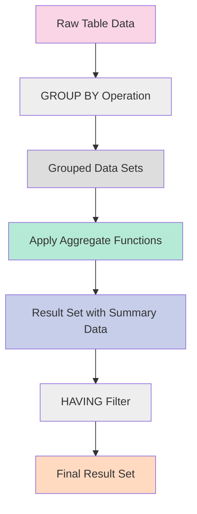

# SQL Aggregate Functions

## Introduction

Aggregate functions are essential tools in SQL that perform calculations on sets of values, returning a single value as a result. They allow you to summarize and analyze data from your database tables efficiently. Whether you need to find the average salary of employees, count the number of orders from a specific region, or determine the highest product price, aggregate functions make these calculations straightforward.

In this tutorial, we'll explore the most commonly used SQL aggregate functions, understand their syntax, and see how they can be applied to real-world scenarios.

## Basic Aggregate Functions

SQL provides several built-in aggregate functions that you can use in your queries. Let's look at the five most commonly used ones:

### COUNT()

The `COUNT()` function returns the number of rows that match a specified criterion.

#### Syntax

```sql
COUNT(expression)
```

#### Examples

**Example 1:** Count all rows in a table

```sql
SELECT COUNT(*) AS total_customers
FROM customers;
```

**Output:**
```
total_customers
--------------
100
```

**Example 2:** Count non-NULL values in a specific column

```sql
SELECT COUNT(email) AS customers_with_email
FROM customers;
```

**Output:**
```
customers_with_email
-------------------
95
```

### SUM()

The `SUM()` function calculates the total sum of a numeric column.

#### Syntax

```sql
SUM(expression)
```

#### Examples

**Example 1:** Calculate the total amount of all orders

```sql
SELECT SUM(amount) AS total_sales
FROM orders;
```

**Output:**
```
total_sales
-----------
15250.75
```

**Example 2:** Calculate the total quantity of products in stock

```sql
SELECT SUM(units_in_stock) AS total_inventory
FROM products;
```

**Output:**
```
total_inventory
--------------
5730
```

### AVG()

The `AVG()` function calculates the average value of a numeric column.

#### Syntax

```sql
AVG(expression)
```

#### Examples

**Example 1:** Find the average price of all products

```sql
SELECT AVG(price) AS average_price
FROM products;
```

**Output:**
```
average_price
------------
28.87
```

**Example 2:** Calculate the average order amount

```sql
SELECT AVG(amount) AS average_order_value
FROM orders;
```

**Output:**
```
average_order_value
------------------
152.51
```

### MIN()

The `MIN()` function returns the smallest value in a selected column.

#### Syntax

```sql
MIN(expression)
```

#### Examples

**Example 1:** Find the lowest product price

```sql
SELECT MIN(price) AS lowest_price
FROM products;
```

**Output:**
```
lowest_price
-----------
2.50
```

**Example 2:** Find the earliest order date

```sql
SELECT MIN(order_date) AS first_order
FROM orders;
```

**Output:**
```
first_order
----------
2023-01-05
```

### MAX()

The `MAX()` function returns the largest value in a selected column.

#### Syntax

```sql
MAX(expression)
```

#### Examples

**Example 1:** Find the highest product price

```sql
SELECT MAX(price) AS highest_price
FROM products;
```

**Output:**
```
highest_price
------------
120.00
```

**Example 2:** Find the most recent order date

```sql
SELECT MAX(order_date) AS latest_order
FROM orders;
```

**Output:**
```
latest_order
-----------
2023-11-28
```

## Using Aggregate Functions with GROUP BY

Aggregate functions become even more powerful when combined with the `GROUP BY` clause, which allows you to group rows that have the same values in specified columns.

### Basic GROUP BY Syntax

```sql
SELECT column1, aggregate_function(column2)
FROM table_name
GROUP BY column1;
```

### Examples

**Example 1:** Calculate the total sales by category

```sql
SELECT category, SUM(amount) AS total_sales
FROM products
JOIN orders ON products.product_id = orders.product_id
GROUP BY category;
```

**Output:**
```
category    | total_sales
------------|------------
Electronics | 4250.50
Clothing    | 3520.75
Books       | 1890.25
Home        | 5589.25
```

**Example 2:** Find the average order amount by customer

```sql
SELECT customer_id, AVG(amount) AS average_order
FROM orders
GROUP BY customer_id
ORDER BY average_order DESC
LIMIT 5;
```

**Output:**
```
customer_id | average_order
------------|-------------
103         | 352.75
118         | 301.50
105         | 287.25
111         | 265.50
107         | 225.75
```

## Using HAVING with Aggregate Functions

The `HAVING` clause works like a `WHERE` clause but is applied to groups created by the `GROUP BY` clause. It filters the results of aggregate functions.

### Syntax

```sql
SELECT column1, aggregate_function(column2)
FROM table_name
GROUP BY column1
HAVING condition;
```

### Examples

**Example 1:** Find categories with total sales over $3000

```sql
SELECT category, SUM(amount) AS total_sales
FROM products
JOIN orders ON products.product_id = orders.product_id
GROUP BY category
HAVING SUM(amount) > 3000;
```

**Output:**
```
category    | total_sales
------------|------------
Electronics | 4250.50
Clothing    | 3520.75
Home        | 5589.25
```

**Example 2:** Find customers who placed more than 5 orders

```sql
SELECT customer_id, COUNT(*) AS order_count
FROM orders
GROUP BY customer_id
HAVING COUNT(*) > 5
ORDER BY order_count DESC;
```

**Output:**
```
customer_id | order_count
------------|------------
105         | 12
118         | 9
107         | 8
111         | 7
103         | 6
```

## Additional Aggregate Functions

Beyond the basic functions, SQL offers several other aggregate functions for more specific calculations:

### STDDEV() or STDDEV_POP()

Calculates the standard deviation of a set of values.

```sql
SELECT STDDEV(price) AS price_std_dev
FROM products;
```

### VAR() or VARIANCE()

Calculates the variance of a set of values.

```sql
SELECT VARIANCE(price) AS price_variance
FROM products;
```

### GROUP_CONCAT() (MySQL) or STRING_AGG() (PostgreSQL)

Concatenates values from multiple rows into a single string.

**MySQL example:**
```sql
SELECT category, GROUP_CONCAT(product_name) AS products
FROM products
GROUP BY category;
```

**PostgreSQL example:**
```sql
SELECT category, STRING_AGG(product_name, ', ') AS products
FROM products
GROUP BY category;
```

## Real-World Applications

Let's explore some practical scenarios where aggregate functions can be particularly useful:

### Sales Analysis Dashboard

```sql
-- Monthly sales summary
SELECT 
    EXTRACT(YEAR FROM order_date) AS year,
    EXTRACT(MONTH FROM order_date) AS month,
    COUNT(*) AS total_orders,
    SUM(amount) AS total_sales,
    AVG(amount) AS average_order_value,
    COUNT(DISTINCT customer_id) AS unique_customers
FROM orders
GROUP BY EXTRACT(YEAR FROM order_date), EXTRACT(MONTH FROM order_date)
ORDER BY year, month;
```

### Product Performance Analysis

```sql
-- Product performance by category
SELECT 
    c.category_name,
    COUNT(p.product_id) AS total_products,
    ROUND(AVG(p.price), 2) AS average_price,
    MIN(p.price) AS min_price,
    MAX(p.price) AS max_price,
    SUM(o.quantity) AS units_sold,
    ROUND(SUM(o.quantity * p.price), 2) AS revenue
FROM 
    products p
JOIN 
    categories c ON p.category_id = c.category_id
LEFT JOIN 
    order_details o ON p.product_id = o.product_id
GROUP BY 
    c.category_name
ORDER BY 
    revenue DESC;
```

### Customer Segmentation

```sql
-- Customer segmentation by purchase behavior
SELECT 
    CASE 
        WHEN COUNT(*) > 10 THEN 'Frequent Buyer'
        WHEN COUNT(*) > 5 THEN 'Regular Customer'
        WHEN COUNT(*) > 1 THEN 'Occasional Buyer'
        ELSE 'One-time Customer'
    END AS customer_segment,
    COUNT(DISTINCT customer_id) AS customer_count,
    ROUND(AVG(amount), 2) AS average_purchase,
    ROUND(SUM(amount), 2) AS total_revenue
FROM 
    orders
GROUP BY 
    customer_segment
ORDER BY 
    total_revenue DESC;
```

## Visualizing Data Flow with Aggregate Functions

Here's a diagram showing how data flows when using aggregate functions with GROUP BY:



## Common Mistakes and Best Practices

### Mistakes to Avoid

1. **Mixing aggregate and non-aggregate columns**: When using aggregate functions, every column in the SELECT statement must either be aggregated or included in the GROUP BY clause.

   **Incorrect:**
   ```sql
   SELECT product_name, category, AVG(price)
   FROM products
   GROUP BY category;
   ```

   **Correct:**
   ```sql
   SELECT product_name, category, AVG(price)
   FROM products
   GROUP BY category, product_name;
   ```

2. **Using WHERE instead of HAVING for aggregate conditions**: The WHERE clause cannot contain aggregate functions.

   **Incorrect:**
   ```sql
   SELECT category, COUNT(*) AS product_count
   FROM products
   WHERE COUNT(*) > 5
   GROUP BY category;
   ```

   **Correct:**
   ```sql
   SELECT category, COUNT(*) AS product_count
   FROM products
   GROUP BY category
   HAVING COUNT(*) > 5;
   ```

### Best Practices

1. **Use column aliases for readability**
   ```sql
   SELECT 
       category,
       COUNT(*) AS product_count,
       AVG(price) AS average_price
   FROM products
   GROUP BY category;
   ```

2. **Optimize performance with appropriate indexes**
   - Create indexes on columns used in GROUP BY clauses
   - Create indexes on columns used in JOIN conditions

3. **Use NULLIF to avoid division by zero errors**
   ```sql
   SELECT category, SUM(sales) / NULLIF(COUNT(*), 0) AS average_sales
   FROM products
   GROUP BY category;
   ```

4. **Consider approximate aggregate functions for large datasets**
   - Some databases offer functions like APPROX_COUNT_DISTINCT() which are faster on very large datasets

## Summary

SQL aggregate functions are powerful tools that allow you to summarize and analyze data effectively. In this tutorial, we've covered:

- Basic aggregate functions (COUNT, SUM, AVG, MIN, MAX)
- Using aggregate functions with GROUP BY
- Filtering grouped results with HAVING
- Advanced aggregate functions for statistical analysis
- Real-world applications and examples
- Common mistakes and best practices

Mastering aggregate functions is essential for data analysis, reporting, and building data-driven applications. By combining these functions with other SQL features like joins, subqueries, and window functions, you can perform complex data analysis directly in your database.

## Exercises

Test your understanding with these exercises:

1. Write a query to find the total number of orders placed each month in 2023.
2. Find the average order amount by customer, but only include customers who have placed at least 3 orders.
3. Identify the product category with the highest average product price.
4. Calculate the running total of sales for each month in 2023.
5. Find customers who have spent more than the average amount spent by all customers.

## Additional Resources

- [PostgreSQL Aggregate Functions Documentation](https://www.postgresql.org/docs/current/functions-aggregate.html)
- [MySQL Aggregate Functions Reference](https://dev.mysql.com/doc/refman/8.0/en/aggregate-functions.html)
- [SQL Server Aggregate Functions](https://learn.microsoft.com/en-us/sql/t-sql/functions/aggregate-functions-transact-sql)
- [SQLite Aggregate Functions](https://www.sqlite.org/lang_aggfunc.html)