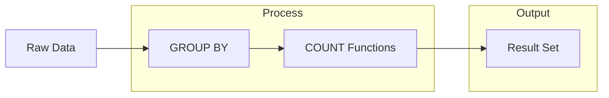

# SQL COUNT Function

## Introduction

The COUNT function is one of the most commonly used aggregate functions in SQL. It allows you to count the number of rows in a table or the number of rows that match a specific condition. This fundamental function is essential for data analysis, reporting, and understanding the size and composition of your datasets.

In this tutorial, we'll explore how the COUNT function works, its different variations, and how to use it effectively in your SQL queries.

## Basic Syntax

The COUNT function has several forms:

```sql
-- Count all rows in a table
COUNT(*)

-- Count non-NULL values in a specific column
COUNT(column_name)

-- Count distinct values in a column
COUNT(DISTINCT column_name)
```

## Using COUNT to Count All Rows

The simplest use of COUNT is to count all rows in a table. Let's start with a basic example using a fictional `employees` table:

```sql
SELECT COUNT(*) AS total_employees
FROM employees;
```

**Output:**
```
total_employees
---------------
         500
```

This query returns the total number of rows (employees) in the employees table, regardless of NULL values in any columns.

## Counting Non-NULL Values in a Column

When you specify a column name inside the COUNT function, it counts only the non-NULL values in that column:

```sql
SELECT 
    COUNT(*) AS total_rows,
    COUNT(email) AS email_count
FROM employees;
```

**Output:**
```
total_rows  email_count
----------  -----------
    500         480
```

In this example, we can see that while there are 500 total employees, only 480 have email addresses stored in the database (the rest are NULL).

## Counting with DISTINCT

You can use COUNT with DISTINCT to count unique values in a column:

```sql
SELECT 
    COUNT(department_id) AS all_departments,
    COUNT(DISTINCT department_id) AS unique_departments
FROM employees;
```

**Output:**
```
all_departments  unique_departments
---------------  ------------------
      500                 8
```

This shows that while there are 500 department_id values in the table (one for each employee), there are only 8 unique departments.

## Using COUNT with WHERE Clause

You can combine COUNT with WHERE to count rows that match specific conditions:

```sql
SELECT COUNT(*) AS senior_employees
FROM employees
WHERE job_level = 'Senior';
```

**Output:**
```
senior_employees
----------------
       125
```

This query counts only employees with a 'Senior' job level.

## COUNT with GROUP BY

The true power of COUNT emerges when combined with the GROUP BY clause. This allows you to count records based on categories:

```sql
SELECT 
    department_name,
    COUNT(*) AS employee_count
FROM employees
JOIN departments ON employees.department_id = departments.id
GROUP BY department_name
ORDER BY employee_count DESC;
```

**Output:**
```
department_name    employee_count
----------------   --------------
Engineering               145
Sales                     120
Marketing                  85
Customer Support           65
Finance                    40
Human Resources            20
Research                   15
Legal                      10
```

This query counts employees in each department and sorts the results by the department size.

## Filtering Groups with HAVING

You can use the HAVING clause to filter groups based on their counts:

```sql
SELECT 
    department_name,
    COUNT(*) AS employee_count
FROM employees
JOIN departments ON employees.department_id = departments.id
GROUP BY department_name
HAVING COUNT(*) > 50
ORDER BY employee_count DESC;
```

**Output:**
```
department_name    employee_count
----------------   --------------
Engineering               145
Sales                     120
Marketing                  85
Customer Support           65
```

This query only shows departments with more than 50 employees.

## Practical Example: Employee Statistics

Let's build a more comprehensive example that combines several aspects of the COUNT function:

```sql
SELECT 
    d.department_name,
    COUNT(*) AS total_employees,
    COUNT(DISTINCT e.job_title) AS unique_positions,
    COUNT(CASE WHEN e.years_of_service > 5 THEN 1 END) AS experienced_staff,
    COUNT(CASE WHEN e.salary > 100000 THEN 1 END) AS high_earners
FROM 
    employees e
JOIN 
    departments d ON e.department_id = d.id
GROUP BY 
    d.department_name
ORDER BY 
    total_employees DESC;
```

**Output:**
```
department_name  total_employees  unique_positions  experienced_staff  high_earners
--------------   --------------   ---------------   ----------------   ------------
Engineering             145              12                78               67
Sales                   120               8                45               53
Marketing                85               9                30               28
Customer Support         65               5                22                8
Finance                  40               7                28               18
Human Resources          20               4                12                5
Research                 15               3                10                8
Legal                    10               3                 7                6
```

This query provides a comprehensive overview of each department, showing:
- Total number of employees
- Number of unique job positions
- Number of employees with more than 5 years of service
- Number of employees earning over $100,000

## Visualizing COUNT Results

When analyzing COUNT results, it can be helpful to visualize the data structure:



## Common Mistakes

### Mistake 1: Not Accounting for NULL Values

Remember that `COUNT(column_name)` only counts non-NULL values, while `COUNT(*)` counts all rows. This can lead to unexpected results:

```sql
-- Table: survey_responses with some NULL answers
SELECT 
    COUNT(*) AS total_surveys,
    COUNT(response) AS total_responses
FROM survey_responses;
```

**Output:**
```
total_surveys  total_responses
-------------  ---------------
    1000             850
```

This shows that 150 survey responses have NULL values.

### Mistake 2: Misusing COUNT(DISTINCT)

COUNT(DISTINCT) can be computationally expensive on large datasets. Use it only when necessary:

```sql
-- Inefficient if you don't need distinct values
SELECT COUNT(DISTINCT customer_id) FROM orders;

-- More efficient if you just need to know if duplicates exist
SELECT 
    COUNT(*) AS total_rows,
    COUNT(DISTINCT customer_id) AS unique_customers,
    CASE WHEN COUNT(*) = COUNT(DISTINCT customer_id) 
         THEN 'No duplicates' 
         ELSE 'Contains duplicates' 
    END AS duplicate_check
FROM orders;
```

## Summary

The COUNT function is a versatile SQL tool that allows you to:

1. Count all rows in a table using `COUNT(*)`
2. Count non-NULL values in a specific column using `COUNT(column_name)`
3. Count unique values using `COUNT(DISTINCT column_name)`
4. Filter counts with WHERE clauses
5. Group counts by categories using GROUP BY
6. Filter groups based on counts using HAVING

Mastering the COUNT function is essential for data analysis and reporting in SQL. It serves as a foundation for more complex aggregations and helps you gain valuable insights from your data.

## Exercises

1. Write a query to count the number of customers from each country in a `customers` table.
2. Create a query to find how many products in a `products` table have prices above, below, and equal to the average price.
3. Write a query that shows the number of orders placed per month in 2023 using a `orders` table with an `order_date` column.
4. Create a report showing the count of active and inactive users by signup month using a `users` table.

## Additional Resources

- [SQL Aggregate Functions](https://www.w3schools.com/sql/sql_count_avg_sum.asp)
- [SQL GROUP BY Clause](https://www.w3schools.com/sql/sql_groupby.asp)
- [SQL HAVING Clause](https://www.w3schools.com/sql/sql_having.asp)
- [SQL COUNT Function - Official Documentation](https://dev.mysql.com/doc/refman/8.0/en/counting-rows.html)