# SQL AVG Function

## Introduction

The `AVG()` function is one of SQL's most useful aggregate functions, allowing you to quickly calculate the average (mean) value of a numeric column in your database. Whether you're analyzing sales data, student grades, or product metrics, the `AVG()` function provides a simple way to understand the central tendency of your numerical data.

In this tutorial, you'll learn:
- What the SQL AVG function does and when to use it
- The basic syntax and usage
- How to combine AVG with other SQL features
- Practical real-world examples

## What is the AVG Function?

The `AVG()` function calculates the arithmetic mean of a set of values. It adds up all the values in a specified column and divides the sum by the number of non-NULL values in that column.

:::note
The `AVG()` function automatically ignores NULL values in its calculations. This means it only considers rows with actual values when computing the average.
:::

## Basic Syntax

The basic syntax of the AVG function is:

```sql
SELECT AVG(column_name) FROM table_name;
```

Where:
- `column_name` is the name of the numeric column you want to calculate the average for
- `table_name` is the name of your database table

## Simple Examples

Let's start with a basic example. Imagine we have a table called `products` with the following data:

| product_id | product_name | price   |
|------------|--------------|---------|
| 1          | Laptop       | 899.99  |
| 2          | Mouse        | 24.99   |
| 3          | Keyboard     | 49.99   |
| 4          | Monitor      | 149.99  |
| 5          | Headphones   | 79.99   |

To find the average price of all products:

```sql
SELECT AVG(price) FROM products;
```

Result:

```
AVG(price)
----------
240.99
```

You can also assign a custom name to the result column using an alias:

```sql
SELECT AVG(price) AS average_price FROM products;
```

Result:

```
average_price
-------------
240.99
```

## Using AVG with WHERE Clause

You can combine the `AVG()` function with a `WHERE` clause to calculate the average for a subset of rows that meet a specific condition:

```sql
SELECT AVG(price) AS average_price 
FROM products 
WHERE price > 50;
```

This query calculates the average price of products that cost more than $50.

Result:

```
average_price
-------------
376.66
```

## AVG with GROUP BY

One of the most powerful ways to use the `AVG()` function is in combination with the `GROUP BY` clause. This allows you to calculate averages for different groups within your data.

Let's expand our example with a `categories` table and add a `category_id` column to our `products` table:

Products table:

| product_id | product_name | price   | category_id |
|------------|--------------|---------|-------------|
| 1          | Laptop       | 899.99  | 1           |
| 2          | Mouse        | 24.99   | 2           |
| 3          | Keyboard     | 49.99   | 2           |
| 4          | Monitor      | 149.99  | 3           |
| 5          | Headphones   | 79.99   | 4           |
| 6          | Tablet       | 299.99  | 1           |
| 7          | Speakers     | 89.99   | 4           |

Categories table:

| category_id | category_name |
|-------------|---------------|
| 1           | Computers     |
| 2           | Accessories   |
| 3           | Displays      |
| 4           | Audio         |

To find the average price of products in each category:

```sql
SELECT c.category_name, AVG(p.price) AS average_price
FROM products p
JOIN categories c ON p.category_id = c.category_id
GROUP BY c.category_name
ORDER BY average_price DESC;
```

Result:

```
category_name | average_price
--------------|--------------
Computers     | 599.99
Displays      | 149.99
Audio         | 84.99
Accessories   | 37.49
```

This query tells us the average price for each product category, sorted from highest to lowest average price.

## AVG with HAVING Clause

The `HAVING` clause allows you to filter groups based on aggregate values. Let's find categories where the average product price is greater than $100:

```sql
SELECT c.category_name, AVG(p.price) AS average_price
FROM products p
JOIN categories c ON p.category_id = c.category_id
GROUP BY c.category_name
HAVING AVG(p.price) > 100
ORDER BY average_price DESC;
```

Result:

```
category_name | average_price
--------------|--------------
Computers     | 599.99
Displays      | 149.99
```

## AVG with Rounding

Since average calculations often result in decimal numbers with many digits, you might want to round the results. You can use the `ROUND()` function along with `AVG()`:

```sql
SELECT c.category_name, ROUND(AVG(p.price), 2) AS average_price
FROM products p
JOIN categories c ON p.category_id = c.category_id
GROUP BY c.category_name;
```

In this example, the `ROUND()` function rounds the average price to 2 decimal places.

## Comparing Individual Values to the Average

A common use case is comparing individual values to the overall average. For example, let's find all products that are priced higher than the average price of all products:

```sql
SELECT product_name, price
FROM products
WHERE price > (SELECT AVG(price) FROM products)
ORDER BY price;
```

Result:

```
product_name | price
-------------|-------
Monitor      | 149.99
Tablet       | 299.99
Laptop       | 899.99
```

## AVG with Window Functions

In more advanced SQL implementations (like PostgreSQL, SQL Server, Oracle), you can use the `AVG()` function as a window function to calculate a running average or compare each row to its group's average:

```sql
SELECT 
    product_name,
    category_id,
    price,
    AVG(price) OVER (PARTITION BY category_id) AS category_avg_price,
    price - AVG(price) OVER (PARTITION BY category_id) AS diff_from_avg
FROM 
    products
ORDER BY 
    category_id, product_name;
```

This query calculates:
- Each product's price
- The average price for its category
- How much each product's price differs from its category's average

Result:

```
product_name | category_id | price   | category_avg_price | diff_from_avg
-------------|-------------|---------|--------------------|--------------
Laptop       | 1           | 899.99  | 599.99             | 300.00
Tablet       | 1           | 299.99  | 599.99             | -300.00
Keyboard     | 2           | 49.99   | 37.49              | 12.50
Mouse        | 2           | 24.99   | 37.49              | -12.50
Monitor      | 3           | 149.99  | 149.99             | 0.00
Headphones   | 4           | 79.99   | 84.99              | -5.00
Speakers     | 4           | 89.99   | 84.99              | 5.00
```

## Common Pitfalls and Best Practices

### Handling NULL Values

As mentioned earlier, the `AVG()` function automatically ignores NULL values. This could lead to potentially misleading results if you're not aware of it.

Consider this updated products table with some NULL prices:

| product_id | product_name | price   |
|------------|--------------|---------|
| 1          | Laptop       | 899.99  |
| 2          | Mouse        | 24.99   |
| 3          | Keyboard     | 49.99   |
| 4          | Monitor      | 149.99  |
| 5          | Headphones   | NULL    |
| 6          | Tablet       | 299.99  |
| 7          | Speakers     | NULL    |

```sql
SELECT AVG(price) FROM products;
```

Result:

```
AVG(price)
----------
284.99
```

The average only considers the 5 products with non-NULL prices.

To handle NULL values differently, you could use the `COALESCE()` function to substitute NULL values with a default value:

```sql
SELECT AVG(COALESCE(price, 0)) FROM products;
```

This would treat NULL prices as 0, resulting in a lower average.

### Data Type Considerations

The `AVG()` function only works with numeric data types. Attempting to use it with non-numeric columns will result in an error or unexpected behavior, depending on your database system.

### Performance Considerations

When working with very large datasets, calculating averages can be resource-intensive. Consider:

- Using indexes on columns frequently used in AVG calculations
- Limiting the calculation to relevant rows using WHERE clauses
- Using materialized views or pre-calculated values for frequently accessed averages

## Real-World Applications

### Example 1: Sales Analysis

Imagine you have a sales database with customer orders. You can use the AVG function to analyze sales patterns:

```sql
-- Average order value by month
SELECT 
    EXTRACT(YEAR FROM order_date) AS year,
    EXTRACT(MONTH FROM order_date) AS month,
    ROUND(AVG(order_total), 2) AS avg_order_value
FROM 
    orders
GROUP BY 
    EXTRACT(YEAR FROM order_date),
    EXTRACT(MONTH FROM order_date)
ORDER BY 
    year, month;
```

### Example 2: Student Grade Analysis

In an educational context, you might use the AVG function to analyze student performance:

```sql
-- Average score by course
SELECT 
    c.course_name,
    ROUND(AVG(g.score), 1) AS average_score
FROM 
    grades g
JOIN 
    courses c ON g.course_id = c.course_id
GROUP BY 
    c.course_name
ORDER BY 
    average_score DESC;
```

### Example 3: Employee Salary Analysis

Human resources might use AVG to analyze salary information:

```sql
-- Average salary by department and job title
SELECT 
    d.department_name,
    e.job_title,
    ROUND(AVG(e.salary), 2) AS avg_salary
FROM 
    employees e
JOIN 
    departments d ON e.department_id = d.department_id
GROUP BY 
    d.department_name, e.job_title
ORDER BY 
    d.department_name, avg_salary DESC;
```

## Visualizing the AVG Function

The following diagram illustrates how the AVG function processes data:

```mermaid
graph LR
    A[Input Data: 10, 20, 30, NULL, 40] --> B[Filter: Remove NULLs]
    B --> C[Calculate Sum: 100]
    B --> D[Count Non-NULL Values: 4]
    C --> E[Divide: 100 ÷ 4]
    D --> E
    E --> F[Result: 25]
```



## Summary

The SQL `AVG()` function is a fundamental tool for data analysis that calculates the mean value of a numeric column. Key points to remember:

- It calculates the arithmetic mean by dividing the sum of values by the count of non-NULL values
- NULL values are automatically ignored in the calculation
- It works well with GROUP BY to find averages across different categories or groups
- You can combine it with WHERE and HAVING clauses to filter data before and after aggregation
- It's commonly used in business reporting, data analysis, and performance monitoring

## Exercises

Practice your knowledge of the AVG function with these exercises:

1. Write a query to find the average product price for each category, but only include categories with more than 2 products.

2. Create a query that shows how each product's price compares to the average price of its category (as a percentage).

3. Write a query that finds departments where the average employee salary is higher than the company-wide average salary.

4. Create a report showing the average monthly sales for each year, along with the percentage difference from the previous month.


Try the exercises above to strengthen your understanding of the AVG function, and don't hesitate to explore the additional resources for more in-depth learning about SQL aggregation techniques.