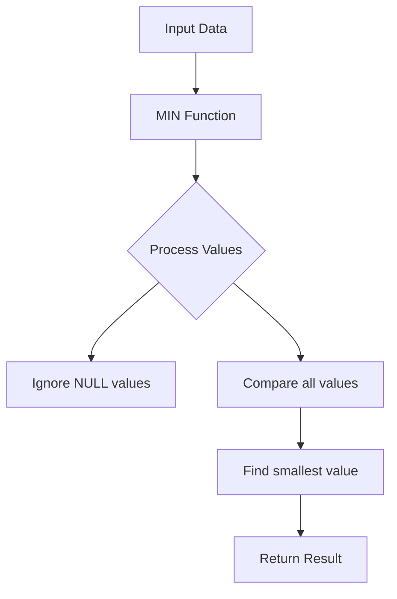

# SQL MIN Function

## Introduction

The SQL MIN function is one of the fundamental aggregate functions that allows you to find the smallest value in a column. It's an essential tool when you need to analyze data and identify minimum values across your datasets.

In this tutorial, you'll learn:
- What the MIN function does and how it works
- The syntax for using MIN
- How to combine MIN with other SQL features
- Real-world applications of the MIN function

## What is the MIN Function?

The MIN function is an **aggregate function** in SQL that returns the smallest value from a selected column. It analyzes all non-NULL values in the specified column and determines which one is the minimum.

## Basic Syntax

The basic syntax for the MIN function is:

```sql
SELECT MIN(column_name) FROM table_name;
```

Where:
- `column_name` is the name of the column you want to find the minimum value for
- `table_name` is the name of the table containing the data

## Simple Examples

### Example 1: Finding the Lowest Price

Let's say we have a table called `products` with product information:

```sql
SELECT MIN(price) AS lowest_price FROM products;
```

**Input (products table):**
| product_id | product_name | price |
|------------|--------------|-------|
| 1          | Laptop       | 899   |
| 2          | Smartphone   | 499   |
| 3          | Headphones   | 79    |
| 4          | Tablet       | 349   |

**Output:**
| lowest_price |
|--------------|
| 79           |

This query returns 79, which is the lowest price in the products table.

### Example 2: Finding the Earliest Date

Let's find the earliest order date from an `orders` table:

```sql
SELECT MIN(order_date) AS earliest_order FROM orders;
```

**Input (orders table):**
| order_id | customer_id | order_date  | total_amount |
|----------|-------------|-------------|--------------|
| 1001     | 5           | 2023-03-15  | 150.00       |
| 1002     | 8           | 2023-02-28  | 75.50        |
| 1003     | 12          | 2023-04-02  | 210.25       |
| 1004     | 5           | 2023-03-20  | 45.00        |

**Output:**
| earliest_order |
|----------------|
| 2023-02-28     |

The query returns February 28, 2023, as the earliest order date.

## Using MIN with WHERE Clause

You can combine the MIN function with the WHERE clause to find the minimum value based on certain conditions.

```sql
SELECT MIN(price) AS lowest_electronic_price 
FROM products 
WHERE category = 'Electronics';
```

This will find the lowest price only for products in the Electronics category.

## Using MIN with GROUP BY

The MIN function becomes more powerful when combined with the GROUP BY clause. This allows you to find the minimum value for each group of data.

### Example: Finding the Lowest Price per Category

```sql
SELECT category, MIN(price) AS lowest_price 
FROM products 
GROUP BY category;
```

**Input (products table with category):**
| product_id | product_name | price | category    |
|------------|--------------|-------|-------------|
| 1          | Laptop       | 899   | Electronics |
| 2          | Smartphone   | 499   | Electronics |
| 3          | Desk Lamp    | 35    | Home        |
| 4          | Coffee Mug   | 12    | Home        |
| 5          | T-Shirt      | 25    | Clothing    |
| 6          | Jeans        | 45    | Clothing    |

**Output:**
| category    | lowest_price |
|-------------|--------------|
| Electronics | 499          |
| Home        | 12           |
| Clothing    | 25           |

This query returns the minimum price for each product category.

## Using MIN with HAVING Clause

You can use the HAVING clause with MIN to filter group results:

```sql
SELECT category, MIN(price) AS lowest_price 
FROM products 
GROUP BY category
HAVING MIN(price) < 30;
```

**Output:**
| category    | lowest_price |
|-------------|--------------|
| Home        | 12           |
| Clothing    | 25           |

This query only shows categories where the minimum price is less than 30.

## MIN with Subqueries

You can use the MIN function in subqueries to compare values or filter data:

```sql
SELECT product_name, price 
FROM products 
WHERE price = (SELECT MIN(price) FROM products);
```

This query finds all products that have the lowest price in the entire table.

**Output:**
| product_name | price |
|--------------|-------|
| Coffee Mug   | 12    |

## Real-World Applications

### 1. Finding the Youngest or Oldest Person

```sql
-- Finding the oldest employee
SELECT MIN(birth_date) AS oldest_employee_birthdate 
FROM employees;

-- Finding the youngest employee
SELECT MAX(birth_date) AS youngest_employee_birthdate 
FROM employees;
```

### 2. Identifying Lowest Performing Sales Regions

```sql
SELECT region, MIN(sales_amount) AS lowest_sale 
FROM sales 
GROUP BY region;
```

### 3. Finding the First Customer to Sign Up

```sql
SELECT MIN(signup_date) AS first_signup 
FROM customers;
```

### 4. Identifying Minimum Inventory Levels

```sql
SELECT product_id, product_name, stock_quantity 
FROM inventory 
WHERE stock_quantity = (SELECT MIN(stock_quantity) FROM inventory);
```

## Important Notes About MIN

1. **NULL Values**: The MIN function ignores NULL values. If all values in a column are NULL, the result will be NULL.

2. **Data Types**: MIN works with various data types including:
   - Numeric values (finding the smallest number)
   - Text (finding the first value alphabetically)
   - Dates (finding the earliest date)

3. **Performance**: For large datasets, ensure your columns are properly indexed for better performance when using the MIN function.

## Visualizing MIN Function

Here's a simple diagram showing how the MIN function works:



## Common Errors and Troubleshooting

1. **Empty Result Set**: If your query returns NULL, check if your table is empty or if all values in the column are NULL.

2. **Wrong Data Type**: Ensure you're using MIN on a column with the appropriate data type for your comparison.

3. **Performance Issues**: If your MIN query is slow, consider adding an index to the column you're analyzing.

## Practice Exercises

1. Create a table named `students` with columns for student_id, name, age, and score. Insert some sample data and write a query to find the youngest student.

2. Write a query to find the lowest temperature recorded for each city in a `weather` table.

3. Create a query that shows products with a price equal to the minimum price in their respective categories.

## Summary

The SQL MIN function is a powerful tool for finding the smallest value in a dataset. It can be used on its own or combined with other SQL features like WHERE, GROUP BY, and HAVING to extract valuable insights from your data.

When using the MIN function:
- Remember it ignores NULL values
- It works with numeric, text, and date data types
- It can be combined with GROUP BY to find minimums within categories
- It's often used in subqueries for comparison operations

## Additional Resources

- [SQL Aggregate Functions](https://example.com/sql-aggregate-functions)
- [SQL GROUP BY Tutorial](https://example.com/sql-group-by)
- [SQL MAX Function](https://example.com/sql-max-function) - The counterpart to MIN
- [SQL AVG Function](https://example.com/sql-avg-function) - Another useful aggregate function