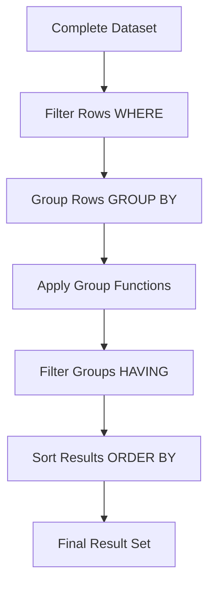

# SQL Group Functions

## Introduction

SQL Group Functions (also known as aggregate functions) are powerful tools that operate on sets of rows to calculate and return a single value. Unlike single-row functions that work on individual rows, group functions process multiple rows at once, making them essential for data analysis and reporting.

These functions allow you to answer questions like:
- What is the total sales amount per region?
- What is the average salary by department?
- How many customers are in each country?

Group functions are fundamental to data analysis in SQL and form the backbone of business intelligence reporting.

## Understanding Group Functions

Group functions compute a single result from a set of input values. They're typically used with the `GROUP BY` clause to divide the table into groups of rows, applying the function to each group separately.

### Common SQL Group Functions

Here are the most commonly used group functions:

| Function | Description | Example |
|----------|-------------|---------|
| COUNT() | Counts the number of rows or non-NULL values | COUNT(employee_id) |
| SUM() | Calculates the total of numeric values | SUM(salary) |
| AVG() | Calculates the average of numeric values | AVG(salary) |
| MIN() | Finds the minimum value | MIN(hire_date) |
| MAX() | Finds the maximum value | MAX(price) |

## Basic Syntax

```sql
SELECT column(s), GROUP_FUNCTION(column)
FROM table
[WHERE condition]
[GROUP BY column(s)]
[HAVING group_condition]
[ORDER BY column(s)];
```

## Group Functions in Action

Let's explore each function with examples using a fictional `employees` table:

### COUNT() Function

The `COUNT()` function returns the number of rows in a specified table or the number of non-NULL values in a column.

```sql
-- Count all employees
SELECT COUNT(*) AS total_employees
FROM employees;
```

**Output:**
```
total_employees
---------------
         1000
```

```sql
-- Count employees by department
SELECT department_id, COUNT(*) AS employee_count
FROM employees
GROUP BY department_id
ORDER BY employee_count DESC;
```

**Output:**
```
department_id   employee_count
-------------   --------------
           50              45
           80              34
           30              25
           20              20
          ...             ...
```

### SUM() Function

The `SUM()` function calculates the total of all values in a numeric column.

```sql
-- Calculate total salary budget
SELECT SUM(salary) AS total_salary
FROM employees;
```

**Output:**
```
total_salary
------------
    6871850
```

```sql
-- Calculate total salary by department
SELECT department_id, SUM(salary) AS department_salary
FROM employees
GROUP BY department_id
ORDER BY department_salary DESC;
```

**Output:**
```
department_id   department_salary
-------------   -----------------
           80            590550
           50            385750
           30            249500
          ...              ...
```

### AVG() Function

The `AVG()` function calculates the average value of a numeric column.

```sql
-- Calculate average salary
SELECT AVG(salary) AS average_salary
FROM employees;
```

**Output:**
```
average_salary
--------------
        6871.85
```

```sql
-- Calculate average salary by job title
SELECT job_id, ROUND(AVG(salary), 2) AS avg_job_salary
FROM employees
GROUP BY job_id
ORDER BY avg_job_salary DESC;
```

**Output:**
```
job_id          avg_job_salary
--------------  --------------
AD_PRES               24000.00
AD_VP                 17000.00
IT_PROG                5760.00
MK_MAN                13000.00
...                       ...
```

### MIN() and MAX() Functions

The `MIN()` and `MAX()` functions return the smallest and largest values in a column, respectively.

```sql
-- Find salary range
SELECT 
    MIN(salary) AS lowest_salary,
    MAX(salary) AS highest_salary
FROM employees;
```

**Output:**
```
lowest_salary   highest_salary
-------------   --------------
        2100            24000
```

```sql
-- Find date range of employment by department
SELECT department_id,
    MIN(hire_date) AS earliest_hire,
    MAX(hire_date) AS latest_hire
FROM employees
GROUP BY department_id
ORDER BY department_id;
```

**Output:**
```
department_id   earliest_hire   latest_hire
-------------   -------------   -----------
           10    1987-09-17     1994-01-03
           20    1994-07-01     2005-06-21
           30    1994-12-01     2005-08-15
          ...          ...            ...
```

## Using Group Functions with GROUP BY

The `GROUP BY` clause organizes rows into groups, and the group function is then applied to each group rather than the entire table.

```sql
-- Count employees and average salary by department and job
SELECT 
    department_id,
    job_id,
    COUNT(*) AS employee_count,
    ROUND(AVG(salary), 2) AS avg_salary
FROM employees
GROUP BY department_id, job_id
ORDER BY department_id, job_id;
```

**Output:**
```
department_id   job_id          employee_count   avg_salary
-------------   -------------   --------------   ----------
           10   AD_ASST                     1       4400.00
           20   MK_MAN                      1      13000.00
           20   MK_REP                      1       6000.00
           30   PU_CLERK                    5       2780.00
           30   PU_MAN                      1      11000.00
          ...   ...                       ...          ...
```

## The HAVING Clause

While the `WHERE` clause filters rows before grouping, the `HAVING` clause filters groups after they are formed.

```sql
-- Find departments with average salary over 8000
SELECT 
    department_id,
    ROUND(AVG(salary), 2) AS avg_salary
FROM employees
GROUP BY department_id
HAVING AVG(salary) > 8000
ORDER BY avg_salary DESC;
```

**Output:**
```
department_id   avg_salary
-------------   ----------
           90      19333.33
           80      10033.33
          100       8600.00
           20       9500.00
          ...          ...
```

## Combining Multiple Group Functions

You can use multiple group functions in a single query.

```sql
-- Department salary statistics
SELECT 
    department_id,
    COUNT(*) AS employee_count,
    MIN(salary) AS min_salary,
    ROUND(AVG(salary), 2) AS avg_salary,
    MAX(salary) AS max_salary,
    SUM(salary) AS total_salary
FROM employees
GROUP BY department_id
ORDER BY department_id;
```

**Output:**
```
department_id   employee_count   min_salary   avg_salary   max_salary   total_salary
-------------   --------------   ----------   ----------   ----------   ------------
           10                1        4400       4400.00        4400          4400
           20                2        6000       9500.00       13000         19000
           30                6        2500       4150.00       11000         24900
          ...              ...         ...          ...         ...           ...
```

## NULL Handling in Group Functions

Most group functions ignore NULL values in their calculations, but there are specific behaviors to be aware of:

```sql
-- COUNT(*) counts all rows
-- COUNT(column) counts non-NULL values
SELECT 
    COUNT(*) AS total_rows,
    COUNT(commission_pct) AS employees_with_commission
FROM employees;
```

**Output:**
```
total_rows   employees_with_commission
----------   --------------------------
      1000                          35
```

## Real-World Applications

### Sales Analysis

```sql
-- Monthly sales summary
SELECT 
    TO_CHAR(order_date, 'YYYY-MM') AS month,
    COUNT(*) AS order_count,
    SUM(order_total) AS total_revenue,
    ROUND(AVG(order_total), 2) AS avg_order_value,
    MAX(order_total) AS largest_order
FROM orders
GROUP BY TO_CHAR(order_date, 'YYYY-MM')
ORDER BY month;
```

### Customer Segmentation

```sql
-- Customer purchase frequency
SELECT 
    customer_segment,
    COUNT(DISTINCT customer_id) AS customer_count,
    ROUND(AVG(purchase_amount), 2) AS avg_purchase,
    SUM(purchase_amount) AS total_spending
FROM purchases
GROUP BY customer_segment
ORDER BY total_spending DESC;
```

### Inventory Management

```sql
-- Inventory levels by category
SELECT 
    category,
    COUNT(*) AS product_count,
    SUM(units_in_stock) AS total_stock,
    MIN(units_in_stock) AS min_stock,
    MAX(units_in_stock) AS max_stock
FROM products
GROUP BY category
HAVING SUM(units_in_stock) < 100
ORDER BY total_stock;
```

## Best Practices

1. **Always use aliases**: Give meaningful names to your calculated columns
2. **Use ROUND() with AVG()**: Average calculations often produce many decimal places
3. **Filter before grouping**: Use WHERE to filter input rows before applying GROUP BY for better performance
4. **Order results**: Include ORDER BY to make results more readable
5. **Remember NULL behavior**: Group functions generally ignore NULL values
6. **Use HAVING correctly**: HAVING filters groups, WHERE filters rows

## Advanced Group Function Concepts

### DISTINCT with Group Functions

You can use DISTINCT inside group functions to count or calculate based on unique values only:

```sql
-- Count distinct job titles in each department
SELECT 
    department_id,
    COUNT(DISTINCT job_id) AS unique_job_count
FROM employees
GROUP BY department_id
ORDER BY unique_job_count DESC;
```

### Group Functions and Joins

Group functions work seamlessly with table joins:

```sql
-- Average salary by department name
SELECT 
    d.department_name,
    COUNT(e.employee_id) AS employee_count,
    ROUND(AVG(e.salary), 2) AS avg_salary
FROM employees e
JOIN departments d ON e.department_id = d.department_id
GROUP BY d.department_name
ORDER BY avg_salary DESC;
```

## Common Errors and How to Avoid Them

1. **Mixing group functions with non-grouped columns**:
   ```sql
   -- INCORRECT
   SELECT department_id, employee_name, AVG(salary)
   FROM employees
   GROUP BY department_id;
   ```
   
   Every column in the SELECT list must either be in the GROUP BY clause or be used with a group function.

2. **Using WHERE instead of HAVING for group conditions**:
   ```sql
   -- INCORRECT
   SELECT department_id, AVG(salary)
   FROM employees
   WHERE AVG(salary) > 8000
   GROUP BY department_id;
   
   -- CORRECT
   SELECT department_id, AVG(salary)
   FROM employees
   GROUP BY department_id
   HAVING AVG(salary) > 8000;
   ```

## Visualizing the Group Function Process



## Summary

SQL Group Functions are powerful tools for data analysis, allowing you to:
- Aggregate data across multiple rows
- Perform calculations on groups of records
- Generate summary statistics and reports
- Analyze patterns and trends in your data

By mastering group functions, you can transform raw data into meaningful insights that drive better business decisions.

## Practice Exercises

1. Write a query to find the number of employees hired each year.
2. Calculate the average salary for employees in departments with more than 10 employees.
3. Find the department with the highest total salary expense.
4. List job titles where the maximum salary is at least twice the minimum salary.
5. Calculate the median salary for each department (hint: this requires advanced techniques in most SQL dialects).

## Additional Resources

- [SQL Aggregate Functions on W3Schools](https://www.w3schools.com/sql/sql_count_avg_sum.asp)
- [PostgreSQL Aggregate Functions Documentation](https://www.postgresql.org/docs/current/functions-aggregate.html)
- [MySQL Aggregate Functions Reference](https://dev.mysql.com/doc/refman/8.0/en/aggregate-functions.html)
- [Oracle SQL Aggregate Functions](https://docs.oracle.com/en/database/oracle/oracle-database/19/sqlrf/Aggregate-Functions.html)