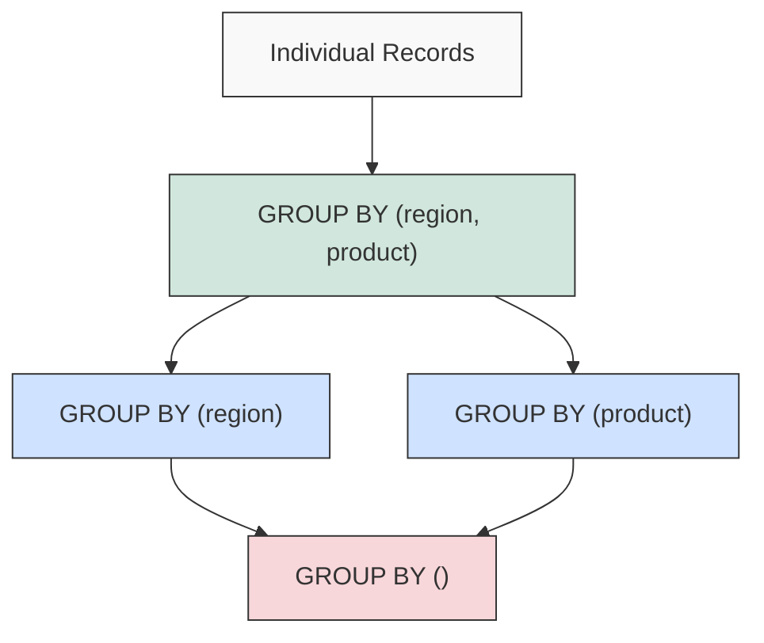

# SQL Grouping Sets

## Introduction

When analyzing data, you often need to group and aggregate information at different levels of granularity. For example, you might want to see sales totals by region, by product, by both region and product combined, and the overall total—all in a single query result.

SQL's `GROUPING SETS` feature is designed specifically for this purpose. It allows you to specify multiple grouping combinations in a single query, saving you from writing and combining multiple `GROUP BY` queries with `UNION ALL`.

In this tutorial, you'll learn how to use `GROUPING SETS` to efficiently perform multi-level aggregations in your SQL queries.

## Prerequisites

To follow along with this tutorial, you should:
- Have basic knowledge of SQL
- Understand `GROUP BY` and aggregate functions like `SUM()`, `COUNT()`, `AVG()`
- Have access to a database system that supports `GROUPING SETS` (like PostgreSQL, SQL Server, Oracle, or DB2)

## Understanding GROUPING SETS

### The Problem: Multiple Levels of Aggregation

Imagine you have a sales table with data about products sold in different regions:

```sql
CREATE TABLE sales (
    id INT PRIMARY KEY,
    region VARCHAR(50),
    product VARCHAR(50),
    quantity INT,
    amount DECIMAL(10, 2)
);

INSERT INTO sales VALUES
(1, 'East', 'Laptop', 10, 12000.00),
(2, 'East', 'Phone', 20, 10000.00),
(3, 'West', 'Laptop', 5, 6000.00),
(4, 'West', 'Phone', 10, 5000.00),
(5, 'North', 'Tablet', 8, 4000.00),
(6, 'South', 'Tablet', 12, 6000.00),
(7, 'East', 'Tablet', 15, 7500.00);
```

You want to analyze total sales in the following ways:
1. By region
2. By product
3. By region and product together
4. Overall total

Without `GROUPING SETS`, you would need to write four separate queries and combine them with `UNION ALL`:

```sql
-- Group by region
SELECT region, NULL AS product, SUM(amount) AS total_sales
FROM sales
GROUP BY region

UNION ALL

-- Group by product
SELECT NULL AS region, product, SUM(amount) AS total_sales
FROM sales
GROUP BY product

UNION ALL

-- Group by region and product
SELECT region, product, SUM(amount) AS total_sales
FROM sales
GROUP BY region, product

UNION ALL

-- Overall total
SELECT NULL AS region, NULL AS product, SUM(amount) AS total_sales
FROM sales;
```

This approach works but is verbose and inefficient.

### The Solution: GROUPING SETS

`GROUPING SETS` allows you to specify multiple grouping sets in a single query. Each grouping set is a set of columns by which to group.

Here's how to rewrite the previous query using `GROUPING SETS`:

```sql
SELECT region, product, SUM(amount) AS total_sales
FROM sales
GROUP BY GROUPING SETS (
    (region),             -- Group by region
    (product),            -- Group by product
    (region, product),    -- Group by region and product
    ()                    -- Overall total (empty grouping set)
);
```

This query produces the same result as the `UNION ALL` approach but with better performance and cleaner code.

### Example Output

The above query would produce results similar to this:

```
region | product | total_sales
-------+---------+------------
East   | NULL    | 29500.00
West   | NULL    | 11000.00
North  | NULL    | 4000.00
South  | NULL    | 6000.00
NULL   | Laptop  | 18000.00
NULL   | Phone   | 15000.00
NULL   | Tablet  | 17500.00
East   | Laptop  | 12000.00
East   | Phone   | 10000.00
East   | Tablet  | 7500.00
West   | Laptop  | 6000.00
West   | Phone   | 5000.00
North  | Tablet  | 4000.00
South  | Tablet  | 6000.00
NULL   | NULL    | 50500.00
```

## Working with GROUPING SETS

### Basic Syntax

The basic syntax for `GROUPING SETS` is:

```sql
SELECT column1, column2, ..., aggregate_function(column)
FROM table
GROUP BY GROUPING SETS (
    (column1, column2, ...),
    (column1),
    (column2),
    ...
    ()
);
```

Each set of parentheses inside `GROUPING SETS` represents one grouping combination.

### Handling NULL Values

In the result set, `NULL` values appear in columns that are not part of a specific grouping set. However, this can cause confusion if your data also contains actual `NULL` values.

To distinguish between:
- `NULL` from the data
- `NULL` representing "all values" in a grouping set

SQL provides the `GROUPING()` function:

```sql
SELECT 
    region, 
    product, 
    SUM(amount) AS total_sales,
    GROUPING(region) AS is_region_aggregated,
    GROUPING(product) AS is_product_aggregated
FROM sales
GROUP BY GROUPING SETS (
    (region),
    (product),
    (region, product),
    ()
);
```

The `GROUPING()` function returns:
- `1` if the column's value is `NULL` because it's not part of the grouping set
- `0` if the column's value is from the data (which might still be `NULL`)

### Creating Readable Labels

For better readability, you can create custom labels:

```sql
SELECT 
    CASE 
        WHEN GROUPING(region) = 1 THEN 'All Regions'
        ELSE COALESCE(region, 'Unknown')
    END AS region_label,
    CASE 
        WHEN GROUPING(product) = 1 THEN 'All Products'
        ELSE COALESCE(product, 'Unknown')
    END AS product_label,
    SUM(amount) AS total_sales
FROM sales
GROUP BY GROUPING SETS (
    (region),
    (product),
    (region, product),
    ()
);
```

## Real-World Examples

### Example 1: Sales Analysis Dashboard

Imagine you're creating a sales dashboard for a retail company:

```sql
SELECT 
    CASE WHEN GROUPING(category) = 1 THEN 'All Categories' ELSE category END AS category,
    CASE WHEN GROUPING(region) = 1 THEN 'All Regions' ELSE region END AS region,
    CASE WHEN GROUPING(year) = 1 THEN 'All Years' ELSE CAST(year AS VARCHAR) END AS year,
    SUM(sales_amount) AS total_sales,
    COUNT(DISTINCT customer_id) AS customer_count
FROM sales_data
GROUP BY GROUPING SETS (
    (category, region, year),  -- Detailed level
    (category, region),        -- Category & region combinations
    (category, year),          -- Category trends over time
    (region, year),            -- Regional trends over time
    (category),                -- Category totals
    (region),                  -- Regional totals
    (year),                    -- Yearly totals
    ()                         -- Grand total
)
ORDER BY 
    GROUPING(category), category,
    GROUPING(region), region,
    GROUPING(year), year;
```

This query provides a complete sales breakdown for a dashboard with different levels of detail.

### Example 2: Website Analytics

For a website analytics scenario:

```sql
SELECT
    CASE WHEN GROUPING(page_category) = 1 THEN 'All Categories' ELSE page_category END AS category,
    CASE WHEN GROUPING(user_country) = 1 THEN 'All Countries' ELSE user_country END AS country,
    CASE WHEN GROUPING(device_type) = 1 THEN 'All Devices' ELSE device_type END AS device,
    COUNT(*) AS page_views,
    COUNT(DISTINCT user_id) AS unique_visitors,
    AVG(time_on_page) AS avg_time_seconds
FROM page_visits
WHERE visit_date BETWEEN '2023-01-01' AND '2023-01-31'
GROUP BY GROUPING SETS (
    (page_category, user_country, device_type),
    (page_category, user_country),
    (page_category, device_type),
    (user_country, device_type),
    (page_category),
    (user_country),
    (device_type),
    ()
);
```

This query would help analyze website traffic patterns across different dimensions.

## Relationship with CUBE and ROLLUP

SQL also provides two shortcuts for common `GROUPING SETS` patterns:

### CUBE

`CUBE` generates all possible grouping combinations of the specified columns:

```sql
SELECT region, product, SUM(amount) AS total_sales
FROM sales
GROUP BY CUBE(region, product);
```

This is equivalent to:

```sql
SELECT region, product, SUM(amount) AS total_sales
FROM sales
GROUP BY GROUPING SETS (
    (region, product),
    (region),
    (product),
    ()
);
```

### ROLLUP

`ROLLUP` generates a hierarchical set of groupings, assuming a hierarchy in the column order:

```sql
SELECT region, product, SUM(amount) AS total_sales
FROM sales
GROUP BY ROLLUP(region, product);
```

This is equivalent to:

```sql
SELECT region, product, SUM(amount) AS total_sales
FROM sales
GROUP BY GROUPING SETS (
    (region, product),
    (region),
    ()
);
```

`ROLLUP` is useful for hierarchical data, such as year → quarter → month or country → state → city.

## Visualizing GROUPING SETS

Here's a diagram illustrating how different GROUPING SETS relate:



## Performance Considerations

While `GROUPING SETS` is more efficient than multiple `UNION ALL` queries, there are performance considerations:

1. **Memory Usage**: Complex grouping sets require significant memory for aggregation.
2. **Indexes**: Create appropriate indexes on grouping columns for better performance.
3. **Selectivity**: Limit the input data using WHERE clauses before applying grouping sets.
4. **Aggregation Functions**: Some aggregate functions are more expensive than others.

## Common Errors and Troubleshooting

### Error: Column Not in GROUP BY Clause

If you see an error like "Column 'X' is invalid in the select list because it is not contained in either an aggregate function or the GROUP BY clause", ensure all non-aggregated columns in your SELECT list are included in your GROUPING SETS.

### Error: Too Many Grouping Sets

Some database systems limit the number of grouping sets. If you're working with many columns, consider breaking your analysis into multiple queries.

### NULL Values in Results

Remember that NULL in results could either be from your data or from the grouping operation. Use the GROUPING() function to distinguish between them.

## Summary

`GROUPING SETS` is a powerful SQL feature that allows you to perform multiple levels of aggregation in a single query. Key points to remember:

- Use `GROUPING SETS` to combine what would otherwise require multiple `GROUP BY` queries with `UNION ALL`
- Each parenthesized group in `GROUPING SETS` represents one grouping combination
- An empty set `()` gives the grand total
- Use `GROUPING()` function to distinguish between real NULLs and aggregation NULLs
- `CUBE` and `ROLLUP` are shortcuts for common `GROUPING SETS` patterns

By mastering `GROUPING SETS`, you can write more efficient and concise analytical queries, especially for reporting and dashboard applications.

## Exercise: Practice with GROUPING SETS

Try these exercises to practice your understanding:

1. Create a table with data about students, courses, and grades
2. Write a query using `GROUPING SETS` to show:
   - Average grade by student
   - Average grade by course
   - Average grade by student and course
   - Overall average grade
3. Enhance your query to show meaningful labels instead of NULLs
4. Compare the performance between your `GROUPING SETS` query and equivalent queries using `UNION ALL`

## Additional Resources

- [PostgreSQL Documentation on GROUPING SETS](https://www.postgresql.org/docs/current/queries-table-expressions.html#QUERIES-GROUPING-SETS)
- [SQL Server Documentation on GROUPING SETS](https://docs.microsoft.com/en-us/sql/t-sql/queries/select-group-by-transact-sql?view=sql-server-ver15#group-by-grouping-sets-)
- Book: "SQL for Data Analysis" by Cathy Tanimura (O'Reilly Media)
- [SQL Fiddle](http://sqlfiddle.com/) - For practicing your queries online