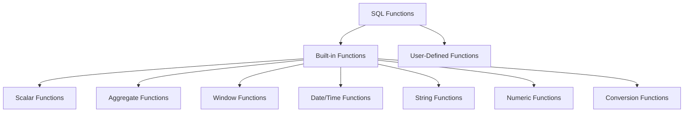

# SQL Functions Overview

## Introduction

SQL (Structured Query Language) functions are predefined operations that perform calculations, manipulate data, or transform values within your database queries. Functions make SQL more powerful and flexible, allowing you to process data efficiently without having to write complex custom code.

Think of SQL functions as built-in tools that help you solve common data manipulation problems. Just as a calculator has buttons for square root or percentage calculations, SQL provides functions for common operations like finding averages, formatting dates, or combining text.

## Types of SQL Functions

SQL functions generally fall into two main categories:

1. **Built-in Functions**: Pre-defined functions provided by the database system
2. **User-Defined Functions (UDFs)**: Custom functions created by users

Built-in functions are further categorized based on their purpose:



Let's explore each of these categories in detail.

## Built-in Functions

### Scalar Functions

Scalar functions operate on a single value and return a single value. They're used to perform calculations or transformations on individual data points.

#### Examples:

```sql
-- Converting text to uppercase
SELECT UPPER('hello world') AS uppercase_text;
```

**Output:**
```
uppercase_text
-------------
HELLO WORLD
```

```sql
-- Calculating the absolute value
SELECT ABS(-42) AS absolute_value;
```

**Output:**
```
absolute_value
-------------
42
```

```sql
-- Rounding a number
SELECT ROUND(3.14159, 2) AS rounded_pi;
```

**Output:**
```
rounded_pi
---------
3.14
```

### Aggregate Functions

Aggregate functions perform calculations across a set of rows and return a single value. They're commonly used with the `GROUP BY` clause to generate summary statistics.

#### Examples:

```sql
-- Finding the average price of products
SELECT AVG(price) AS average_price
FROM products;
```

**Output:**
```
average_price
-------------
24.99
```

```sql
-- Counting the number of customers
SELECT COUNT(*) AS total_customers
FROM customers;
```

**Output:**
```
total_customers
--------------
150
```

```sql
-- Finding the highest and lowest order amounts
SELECT 
    MAX(amount) AS highest_order,
    MIN(amount) AS lowest_order
FROM orders;
```

**Output:**
```
highest_order  lowest_order
-------------  ------------
999.99         5.99
```

### Window Functions

Window functions perform calculations across a set of rows related to the current row. Unlike aggregate functions, they don't reduce the number of rows returned.

#### Example:

```sql
-- Ranking employees by salary within each department
SELECT 
    employee_name,
    department,
    salary,
    RANK() OVER (PARTITION BY department ORDER BY salary DESC) AS salary_rank
FROM employees;
```

**Output:**
```
employee_name  department  salary  salary_rank
-------------  ----------  ------  -----------
Lisa Smith     Sales       85000   1
John Doe       Sales       78000   2
Jane Brown     Sales       72000   3
Mark Johnson   IT          92000   1
Sarah Miller   IT          88000   2
David Wilson   IT          86000   3
```

### Date/Time Functions

Date and time functions manipulate date and time values, allowing you to extract specific parts, calculate differences, or format dates.

#### Examples:

```sql
-- Getting the current date and time
SELECT 
    CURRENT_DATE AS today,
    CURRENT_TIME AS now;
```

**Output:**
```
today        now
-----------  ---------
2025-03-03   14:30:45
```

```sql
-- Extracting parts of a date
SELECT 
    EXTRACT(YEAR FROM '2025-03-03'::date) AS year,
    EXTRACT(MONTH FROM '2025-03-03'::date) AS month,
    EXTRACT(DAY FROM '2025-03-03'::date) AS day;
```

**Output:**
```
year  month  day
----  -----  ---
2025  3      3
```

```sql
-- Calculating age
SELECT 
    '2025-03-03'::date - '1995-06-15'::date AS days_lived;
```

**Output:**
```
days_lived
----------
10853
```

### String Functions

String functions manipulate text data, allowing operations like concatenation, substring extraction, or pattern matching.

#### Examples:

```sql
-- Concatenating strings
SELECT CONCAT('Hello', ' ', 'World') AS greeting;
```

**Output:**
```
greeting
---------
Hello World
```

```sql
-- Extracting a substring
SELECT SUBSTRING('Database', 1, 4) AS extracted_text;
```

**Output:**
```
extracted_text
-------------
Data
```

```sql
-- Replacing text
SELECT REPLACE('SQL is hard', 'hard', 'fun') AS new_phrase;
```

**Output:**
```
new_phrase
----------
SQL is fun
```

### Numeric Functions

Numeric functions perform mathematical operations on numeric values.

#### Examples:

```sql
-- Rounding and truncating
SELECT 
    ROUND(3.14159, 2) AS rounded,
    TRUNC(3.14159, 2) AS truncated;
```

**Output:**
```
rounded  truncated
-------  ---------
3.14     3.14
```

```sql
-- Power and square root
SELECT 
    POWER(2, 3) AS two_cubed,
    SQRT(16) AS square_root_of_16;
```

**Output:**
```
two_cubed  square_root_of_16
---------  -----------------
8          4
```

### Conversion Functions

Conversion functions transform data from one type to another.

#### Examples:

```sql
-- Converting strings to numbers
SELECT 
    CAST('42' AS INTEGER) AS string_to_int,
    '3.14'::NUMERIC AS string_to_numeric;
```

**Output:**
```
string_to_int  string_to_numeric
-------------  -----------------
42             3.14
```

```sql
-- Converting numbers to strings
SELECT 
    CAST(42 AS VARCHAR) AS number_to_string;
```

**Output:**
```
number_to_string
----------------
42
```

## User-Defined Functions (UDFs)

User-defined functions allow you to create custom functions tailored to your specific needs. They're particularly useful for encapsulating complex logic that you use repeatedly.

### Creating a Simple UDF

Here's an example of creating a simple function that calculates the discounted price:

```sql
-- Creating a function to calculate discount
CREATE OR REPLACE FUNCTION calculate_discount(price NUMERIC, discount_percent NUMERIC)
RETURNS NUMERIC AS
$$
BEGIN
    RETURN price - (price * discount_percent / 100);
END;
$$ LANGUAGE plpgsql;

-- Using the function
SELECT 
    product_name,
    price,
    calculate_discount(price, 15) AS discounted_price
FROM products;
```

**Output:**
```
product_name  price  discounted_price
------------  -----  ----------------
Laptop        999    849.15
Smartphone    699    594.15
Headphones    149    126.65
```

## Practical Applications

Let's explore some real-world applications of SQL functions to solve common problems:

### Generating Full Names

```sql
-- Combining first and last names
SELECT 
    first_name,
    last_name,
    CONCAT(first_name, ' ', last_name) AS full_name
FROM employees;
```

**Output:**
```
first_name  last_name  full_name
----------  ---------  --------------
John        Doe        John Doe
Jane        Smith      Jane Smith
Robert      Johnson    Robert Johnson
```

### Calculating Age from Birth Date

```sql
-- Determining age based on birth date
SELECT 
    customer_name,
    birth_date,
    EXTRACT(YEAR FROM AGE(CURRENT_DATE, birth_date)) AS age
FROM customers;
```

**Output:**
```
customer_name  birth_date   age
-------------  -----------  ---
Sarah Miller   1992-05-15   32
Michael Brown  1985-11-23   39
Emma Wilson    1998-02-10   27
```

### Data Cleansing

```sql
-- Cleaning and standardizing phone numbers
SELECT 
    customer_id,
    phone_number,
    REGEXP_REPLACE(phone_number, '[^0-9]', '') AS cleaned_number
FROM customer_contacts;
```

**Output:**
```
customer_id  phone_number     cleaned_number
-----------  ---------------  --------------
1001         (555) 123-4567   5551234567
1002         555.987.6543     5559876543
1003         555-321-7890     5553217890
```

### Sales Analysis

```sql
-- Analyzing sales by quarter
SELECT 
    EXTRACT(YEAR FROM order_date) AS year,
    EXTRACT(QUARTER FROM order_date) AS quarter,
    SUM(amount) AS total_sales,
    ROUND(AVG(amount), 2) AS average_order,
    COUNT(*) AS order_count
FROM orders
GROUP BY 
    EXTRACT(YEAR FROM order_date),
    EXTRACT(QUARTER FROM order_date)
ORDER BY year, quarter;
```

**Output:**
```
year  quarter  total_sales  average_order  order_count
----  -------  -----------  -------------  -----------
2024  1        124856.75    352.14         354
2024  2        158932.50    375.43         423
2024  3        183756.25    402.10         457
2024  4        205432.00    427.98         480
2025  1        112564.25    389.53         289
```

## Common SQL Function Syntax Variations

It's important to note that SQL function syntax can vary between different database systems:

| Database   | Concatenation Example     | Current Date Example  |
|------------|---------------------------|----------------------|
| MySQL      | `CONCAT(a, b)`            | `CURDATE()`          |
| PostgreSQL | `a || b` or `CONCAT(a, b)`| `CURRENT_DATE`       |
| SQL Server | `a + b` or `CONCAT(a, b)` | `GETDATE()`          |
| Oracle     | `a || b` or `CONCAT(a, b)`| `SYSDATE`            |
| SQLite     | `a || b`                  | `DATE('now')`        |

Always refer to your specific database documentation for exact function names and syntax.

## Summary

SQL functions are powerful tools that extend the capabilities of SQL beyond simple data retrieval. They allow you to:

- Transform and manipulate data within your queries
- Perform complex calculations without external processing
- Generate meaningful summaries and insights
- Standardize and clean your data
- Create reusable logic through user-defined functions

By mastering SQL functions, you'll be able to write more efficient queries, perform complex data analysis directly in your database, and solve real-world problems more effectively.

## Practice Exercises

To reinforce your understanding of SQL functions, try these exercises:

1. Write a query that calculates the average length of product names in a products table.
2. Create a query that extracts the domain from email addresses (e.g., extract "gmail.com" from "user@gmail.com").
3. Write a query that categorizes products by price range (low, medium, high) using the CASE statement.
4. Create a user-defined function that calculates the total price including tax for a given price and tax rate.
5. Write a query using window functions to find each employee's salary compared to their department's average salary.

## Additional Resources

- [PostgreSQL Documentation on Functions](https://www.postgresql.org/docs/current/functions.html)
- [MySQL Function Reference](https://dev.mysql.com/doc/refman/8.0/en/functions.html)
- [SQL Server Built-in Functions](https://learn.microsoft.com/en-us/sql/t-sql/functions/functions)
- [Oracle SQL Functions](https://docs.oracle.com/en/database/oracle/oracle-database/19/sqlrf/Functions.html)

Happy querying!