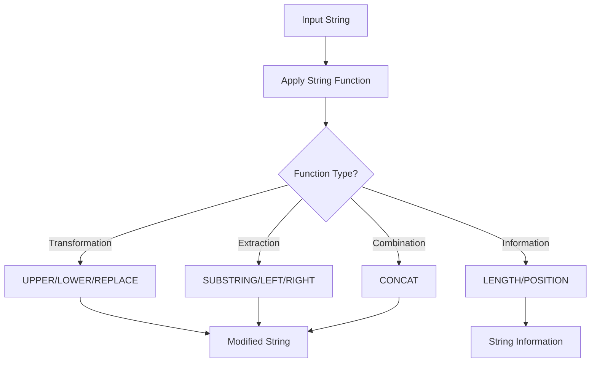

# SQL String Functions

## Introduction

When working with databases, you'll frequently need to manipulate text data. SQL provides a rich set of string functions that allow you to transform, extract, and modify text information stored in your database. These functions are essential tools for data cleaning, reporting, and analysis tasks.

In this tutorial, we'll explore the most commonly used SQL string functions, understand how they work, and see practical examples of how they can be applied in real-world scenarios.

## Common SQL String Functions

### LENGTH / LEN

The `LENGTH` function (called `LEN` in some database systems like SQL Server) returns the number of characters in a string.

```sql
-- Example: Find the length of a string
SELECT LENGTH('Hello World') AS string_length;
```

Output:
```
string_length
-------------
11
```

### UPPER and LOWER

These functions convert a string to uppercase or lowercase.

```sql
-- Convert to uppercase
SELECT UPPER('Hello World') AS uppercase_text;

-- Convert to lowercase
SELECT LOWER('Hello World') AS lowercase_text;
```

Output:
```
uppercase_text
--------------
HELLO WORLD

lowercase_text
--------------
hello world
```

### CONCAT

The `CONCAT` function joins two or more strings together.

```sql
-- Joining first and last names
SELECT CONCAT('John', ' ', 'Doe') AS full_name;
```

Output:
```
full_name
---------
John Doe
```

Many database systems also support the concatenation operator `||` or `+` (depending on the SQL dialect):

```sql
-- Using concatenation operator (varies by database)
SELECT 'John' || ' ' || 'Doe' AS full_name;  -- Oracle, PostgreSQL, SQLite
SELECT 'John' + ' ' + 'Doe' AS full_name;    -- SQL Server
```

### SUBSTRING / SUBSTR

This function extracts a portion of a string.

```sql
-- Syntax (general): SUBSTRING(string, start_position, length)
SELECT SUBSTRING('Hello World', 1, 5) AS extracted_text;
```

Output:
```
extracted_text
--------------
Hello
```

**Note:** In some database systems like Oracle, the function is named `SUBSTR`. Additionally, some databases start counting positions from 0, while others start from 1.

### TRIM, LTRIM, and RTRIM

These functions remove spaces or specified characters from the beginning (LTRIM), end (RTRIM), or both sides (TRIM) of a string.

```sql
-- Remove spaces from both ends
SELECT TRIM('   Hello World   ') AS trimmed_text;

-- Remove spaces from left side only
SELECT LTRIM('   Hello World   ') AS left_trimmed;

-- Remove spaces from right side only
SELECT RTRIM('   Hello World   ') AS right_trimmed;
```

Output:
```
trimmed_text
------------
Hello World

left_trimmed
------------
Hello World   

right_trimmed
-------------
   Hello World
```

### REPLACE

The `REPLACE` function substitutes all occurrences of a substring with another substring.

```sql
-- Replace 'World' with 'SQL'
SELECT REPLACE('Hello World', 'World', 'SQL') AS replaced_text;
```

Output:
```
replaced_text
-------------
Hello SQL
```

### LEFT and RIGHT

These functions return a specified number of characters from the left or right side of a string.

```sql
-- Get the leftmost 5 characters
SELECT LEFT('Hello World', 5) AS left_chars;

-- Get the rightmost 5 characters
SELECT RIGHT('Hello World', 5) AS right_chars;
```

Output:
```
left_chars
----------
Hello

right_chars
-----------
World
```

**Note:** These functions might not be available in all database systems. For example, in Oracle, you would use `SUBSTR` instead.

### POSITION / INSTR / CHARINDEX

These functions find the position of a substring within a string.

```sql
-- Find the position of 'World' in the string (PostgreSQL, MySQL)
SELECT POSITION('World' IN 'Hello World') AS position;

-- Oracle version
SELECT INSTR('Hello World', 'World') AS position;

-- SQL Server version
SELECT CHARINDEX('World', 'Hello World') AS position;
```

Output:
```
position
--------
7
```

## Practical Examples

### Example 1: Formatting Names in a Customer Database

Let's say you have a customer table with first and last names, but you want to display their initials:

```sql
-- Creating a sample table
CREATE TABLE customers (
    id INT PRIMARY KEY,
    first_name VARCHAR(50),
    last_name VARCHAR(50),
    email VARCHAR(100)
);

-- Insert sample data
INSERT INTO customers VALUES
(1, 'John', 'Smith', 'john.smith@example.com'),
(2, 'Sarah', 'Johnson', 'sarah.j@example.com'),
(3, 'Robert', 'Williams', 'rob.williams@example.com');

-- Generate initials from names
SELECT 
    id,
    first_name,
    last_name,
    CONCAT(
        UPPER(LEFT(first_name, 1)), 
        UPPER(LEFT(last_name, 1))
    ) AS initials
FROM customers;
```

Output:
```
id   first_name   last_name   initials
-----------------------------------
1    John         Smith       JS
2    Sarah        Johnson     SJ
3    Robert       Williams    RW
```

### Example 2: Cleaning Email Addresses

If you need to extract the domain part of email addresses:

```sql
-- Extract email domains
SELECT 
    email,
    SUBSTRING(
        email, 
        POSITION('@' IN email) + 1, 
        LENGTH(email) - POSITION('@' IN email)
    ) AS domain
FROM customers;
```

Output:
```
email                       domain
---------------------------------------
john.smith@example.com      example.com
sarah.j@example.com         example.com
rob.williams@example.com    example.com
```

### Example 3: Searching for Partial Matches

Find all customers whose names contain a specific pattern:

```sql
-- Find customers with 'ill' in their last name
SELECT 
    first_name,
    last_name
FROM customers
WHERE LOWER(last_name) LIKE '%ill%';
```

Output:
```
first_name   last_name
----------------------
Robert       Williams
```

## Database-Specific String Functions

Different database systems offer additional string functions:

### PostgreSQL

```sql
-- Split a string into an array
SELECT string_to_array('apple,orange,banana', ',') AS fruits;

-- Regular expression replacement
SELECT regexp_replace('Hello 123 World', '[0-9]+', 'NUM') AS result;
```

### MySQL

```sql
-- Format a number as a string
SELECT FORMAT(1234.5678, 2) AS formatted_number;

-- Reverse a string
SELECT REVERSE('Hello') AS reversed;
```

### SQL Server

```sql
-- Remove non-alphanumeric characters
SELECT 
    first_name,
    last_name,
    PATINDEX('%[^a-zA-Z0-9]%', first_name + last_name) AS has_special_chars
FROM customers;
```

## Performance Considerations

When working with string functions in large datasets, keep these points in mind:

1. **Indexing**: String operations often can't use indexes effectively, especially with wildcards at the beginning of a LIKE pattern.

2. **Case sensitivity**: Be aware that string comparisons may be case-sensitive or case-insensitive depending on your database collation settings.

3. **Function overhead**: Extensive use of string functions in queries can impact performance.



## Summary

SQL string functions are powerful tools for manipulating text data within your database queries. They allow you to:

- Transform text by changing case, replacing content, or trimming spaces
- Extract portions of strings
- Combine strings together
- Find information about strings such as length or positions

These functions are essential for data cleaning, reporting, and analysis tasks when working with text data in databases.

## Exercises

To practice what you've learned, try these exercises:

1. Write a query to extract the username part (before the @) from an email address.
2. Create a query that combines the first name, a space, and the last name to create a full name.
3. Write a query to find all records where a text field contains a specific word, regardless of case.
4. Create a query that masks all but the last four characters of a credit card number (e.g., convert "1234567890123456" to "************3456").

## Additional Resources

- [MySQL String Functions Documentation](https://dev.mysql.com/doc/refman/8.0/en/string-functions.html)
- [PostgreSQL String Functions Documentation](https://www.postgresql.org/docs/current/functions-string.html)
- [SQL Server String Functions Documentation](https://learn.microsoft.com/en-us/sql/t-sql/functions/string-functions-transact-sql)
- [Oracle String Functions Documentation](https://docs.oracle.com/en/database/oracle/oracle-database/19/sqlrf/Single-Row-Functions.html#GUID-13B2A799-7C99-427F-9533-FA473A9A6694)