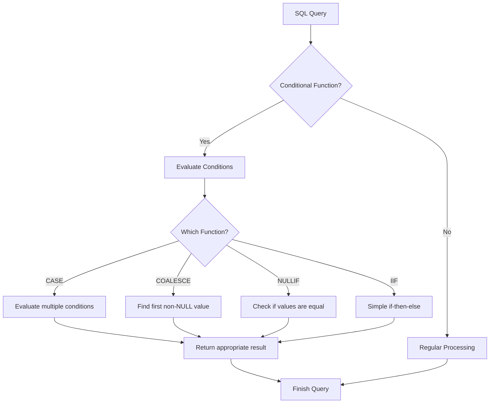

# SQL Conditional Functions

## Introduction

Conditional functions in SQL allow you to perform different actions based on whether certain conditions are met. They're essentially SQL's version of "if-then-else" logic that you might be familiar with from other programming languages. 

Conditional functions are powerful tools that help you:
- Transform data based on specific conditions
- Handle NULL values elegantly
- Create more readable and maintainable queries
- Solve complex business logic requirements within your database queries

In this tutorial, we'll explore the most commonly used SQL conditional functions, with clear examples and real-world applications that will help you understand when and how to use them effectively.

## The CASE Expression

The CASE expression is the most versatile conditional function in SQL. It works like an if-then-else statement, allowing you to evaluate conditions and return different values based on which condition is true.

There are two forms of the CASE expression:

### Simple CASE Expression

The simple CASE expression compares an expression to a set of simple expressions to determine the result.

**Syntax:**
```sql
CASE expression
    WHEN value1 THEN result1
    WHEN value2 THEN result2
    ...
    ELSE default_result
END
```

**Example: Converting numeric grades to letter grades**

```sql
SELECT 
    student_name,
    numeric_grade,
    CASE numeric_grade
        WHEN 90 THEN 'A'
        WHEN 80 THEN 'B'
        WHEN 70 THEN 'C'
        WHEN 60 THEN 'D'
        ELSE 'F'
    END AS letter_grade
FROM student_grades;
```

**Output:**
```
| student_name | numeric_grade | letter_grade |
|--------------|---------------|--------------|
| Alice        | 90            | A            |
| Bob          | 75            | C            |
| Charlie      | 85            | B            |
| Dana         | 55            | F            |
```

### Searched CASE Expression

The searched CASE expression evaluates a set of Boolean expressions to determine the result.

**Syntax:**
```sql
CASE
    WHEN condition1 THEN result1
    WHEN condition2 THEN result2
    ...
    ELSE default_result
END
```

**Example: Categorizing products by price range**

```sql
SELECT 
    product_name,
    price,
    CASE
        WHEN price < 10 THEN 'Budget'
        WHEN price BETWEEN 10 AND 50 THEN 'Mid-range'
        WHEN price > 50 THEN 'Premium'
        ELSE 'Uncategorized'
    END AS price_category
FROM products;
```

**Output:**
```
| product_name    | price | price_category |
|-----------------|-------|----------------|
| Basic Pen       | 5.99  | Budget         |
| Notebook        | 12.50 | Mid-range      |
| Fountain Pen    | 89.99 | Premium        |
| Pencil Set      | 8.75  | Budget         |
| Leather Journal | 65.00 | Premium        |
```

## The COALESCE Function

The COALESCE function returns the first non-NULL expression in a list of expressions. It's very useful for handling NULL values in your data.

**Syntax:**
```sql
COALESCE(expression1, expression2, ..., expressionN)
```

**Example: Providing default values for missing data**

```sql
SELECT 
    customer_id,
    first_name,
    last_name,
    COALESCE(phone_number, email, 'No contact info') AS contact_info
FROM customers;
```

**Output:**
```
| customer_id | first_name | last_name | contact_info           |
|-------------|------------|-----------|------------------------|
| 1           | John       | Smith     | 555-123-4567           |
| 2           | Jane       | Doe       | jane.doe@example.com   |
| 3           | Robert     | Johnson   | robert@example.com     |
| 4           | Sarah      | Williams  | No contact info        |
```

In this example, the COALESCE function tries to use the phone number first. If it's NULL, it tries to use the email. If both are NULL, it uses the default text "No contact info".

## The NULLIF Function

The NULLIF function compares two expressions and returns NULL if they are equal, or the first expression if they are not equal.

**Syntax:**
```sql
NULLIF(expression1, expression2)
```

**Example: Avoiding division by zero**

```sql
SELECT 
    product_name,
    total_cost,
    total_sales,
    total_sales / NULLIF(total_cost, 0) AS profit_ratio
FROM product_financials;
```

**Output:**
```
| product_name | total_cost | total_sales | profit_ratio |
|--------------|------------|-------------|--------------|
| Product A    | 1000       | 1500        | 1.5          |
| Product B    | 2000       | 3000        | 1.5          |
| Product C    | 0          | 500         | NULL         |
| Product D    | 1500       | 1000        | 0.67         |
```

In this example, for Product C, the total_cost is 0. Without NULLIF, this would cause a division by zero error. With NULLIF, when total_cost is 0, it returns NULL, which makes the entire division operation return NULL instead of causing an error.

## The IIF Function (SQL Server, Azure SQL Database)

The IIF function is a shorthand way to write simple CASE expressions. It returns one value if a condition is TRUE, or another value if a condition is FALSE.

**Syntax:**
```sql
IIF(condition, true_value, false_value)
```

**Example: Flagging overdue payments**

```sql
SELECT 
    payment_id,
    due_date,
    payment_date,
    IIF(payment_date > due_date, 'Overdue', 'On time') AS payment_status
FROM payments;
```

**Output:**
```
| payment_id | due_date   | payment_date | payment_status |
|------------|------------|--------------|----------------|
| 1          | 2023-01-15 | 2023-01-10   | On time        |
| 2          | 2023-02-15 | 2023-02-20   | Overdue        |
| 3          | 2023-03-15 | 2023-03-15   | On time        |
| 4          | 2023-04-15 | 2023-04-18   | Overdue        |
```

## Real-World Applications

Let's explore some practical applications of conditional functions in real-world scenarios:

### 1. Customer Segmentation

```sql
SELECT 
    customer_id,
    customer_name,
    total_purchases,
    CASE
        WHEN total_purchases > 10000 THEN 'Platinum'
        WHEN total_purchases BETWEEN 5000 AND 10000 THEN 'Gold'
        WHEN total_purchases BETWEEN 1000 AND 4999 THEN 'Silver'
        ELSE 'Bronze'
    END AS customer_tier
FROM customers;
```

### 2. Financial Reporting with Dynamic Categorization

```sql
SELECT 
    transaction_date,
    amount,
    CASE
        WHEN category IN ('Salary', 'Investment', 'Interest') THEN 'Income'
        WHEN category IN ('Rent', 'Utilities', 'Groceries') THEN 'Essential Expenses'
        WHEN category IN ('Dining', 'Entertainment', 'Travel') THEN 'Discretionary Expenses'
        ELSE 'Other'
    END AS financial_category
FROM transactions;
```

### 3. Inventory Status Alert System

```sql
SELECT 
    product_id,
    product_name,
    current_stock,
    minimum_stock,
    CASE
        WHEN current_stock = 0 THEN 'Out of Stock'
        WHEN current_stock < minimum_stock THEN 'Low Stock'
        WHEN current_stock BETWEEN minimum_stock AND minimum_stock * 2 THEN 'Adequate Stock'
        ELSE 'Fully Stocked'
    END AS stock_status
FROM inventory;
```

### 4. Email Formatting with COALESCE

```sql
SELECT 
    employee_id,
    first_name,
    last_name,
    COALESCE(
        company_email, 
        first_name || '.' || last_name || '@company.com', 
        'employee' || employee_id || '@company.com'
    ) AS email_address
FROM employees;
```

## Performance Considerations

When using conditional functions, keep these performance tips in mind:

1. **Indexing**: Columns used in CASE expressions within WHERE clauses might not utilize indexes effectively.

2. **Complex Logic**: Break down extremely complex CASE expressions into multiple steps or consider using temporary tables for better readability and maintenance.

3. **NULL Handling**: Remember that NULL comparisons need special handling. For example, `NULL = NULL` evaluates to FALSE in SQL, not TRUE.



## Summary

Conditional functions in SQL provide powerful tools for implementing business logic directly in your database queries:

- **CASE**: The most versatile conditional function for evaluating multiple conditions
- **COALESCE**: Ideal for providing fallback values when dealing with NULL data
- **NULLIF**: Perfect for avoiding errors like division by zero
- **IIF**: A concise way to express simple if-then-else logic (in supported database systems)

By mastering these functions, you can write more efficient and expressive SQL queries that handle different conditions elegantly.

## Additional Resources and Exercises

### Resources
- The official documentation for your specific database system (MySQL, PostgreSQL, SQL Server, Oracle, etc.)
- [SQL Fiddle](http://sqlfiddle.com/) - Test and experiment with SQL queries online
- [W3Schools SQL Tutorial](https://www.w3schools.com/sql/) - Practice SQL interactively
- [Mode Analytics SQL Tutorial](https://mode.com/sql-tutorial/) - In-depth SQL learning resource

### Exercises

1. **Customer Classification**: 
   Create a query that classifies customers as 'New' (less than 30 days), 'Regular' (30-365 days), or 'Loyal' (more than 365 days) based on their registration date.

2. **Grade Calculation**: 
   Write a query to calculate letter grades (A, B, C, D, F) from numeric scores where:
   - A: 90-100
   - B: 80-89
   - C: 70-79
   - D: 60-69
   - F: Below 60

3. **Shipping Cost Calculator**: 
   Create a query that calculates shipping costs based on:
   - Order total (less than $50: $5.99 shipping)
   - Order total ($50-$100: $3.99 shipping)
   - Order total (over $100: Free shipping)
   - Express shipping option (adds $10 regardless of order total)

4. **NULL Handling Challenge**: 
   Write a query that combines first_name, middle_name, and last_name into a full_name field, handling NULL values appropriately without showing the word "NULL" in the result.