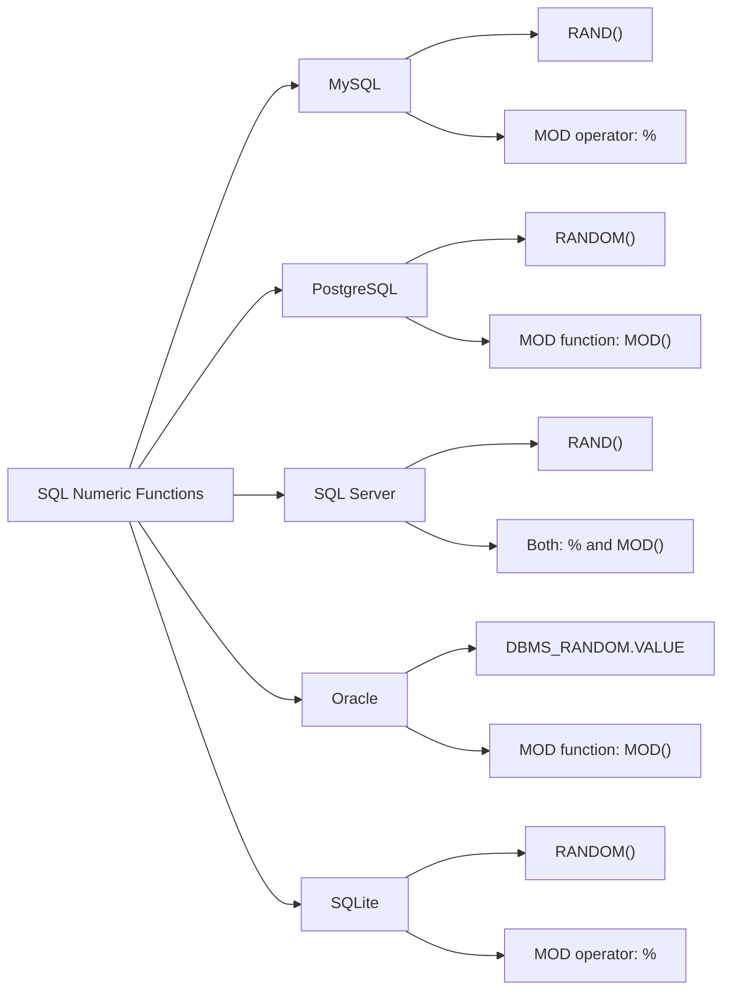

# SQL Numeric Functions

## Introduction

SQL Numeric Functions are built-in functions that allow you to perform mathematical operations on numeric data in your database. These functions are essential tools for data analysis, calculations, and transformations within your SQL queries. Whether you need to round values, calculate averages, or perform complex mathematical operations, SQL numeric functions make these tasks straightforward and efficient.

In this guide, we'll explore the most commonly used SQL numeric functions, their syntax, and practical applications. By the end of this tutorial, you'll be comfortable using these functions to solve real-world data problems.

## Common SQL Numeric Functions

### Basic Arithmetic Functions

SQL provides standard arithmetic operations through operators rather than functions:

| Operator | Description | Example | Result |
|----------|-------------|---------|--------|
| + | Addition | `SELECT 5 + 3;` | 8 |
| - | Subtraction | `SELECT 10 - 4;` | 6 |
| * | Multiplication | `SELECT 6 * 3;` | 18 |
| / | Division | `SELECT 20 / 4;` | 5 |
| % (or MOD) | Modulo (remainder) | `SELECT 10 % 3;` | 1 |

### Rounding Functions

#### ROUND()

The `ROUND()` function rounds a number to a specified number of decimal places.

**Syntax:**
```sql
ROUND(number, decimal_places)
```

**Example:**
```sql
SELECT ROUND(123.456, 2) AS rounded_value;
```

**Output:**
```
rounded_value
-------------
123.46
```

#### CEILING() / CEIL()

The `CEILING()` function (also called `CEIL()` in some SQL dialects) returns the smallest integer greater than or equal to the given number.

**Syntax:**
```sql
CEILING(number)
```

**Example:**
```sql
SELECT CEILING(45.1) AS ceiling_value;
```

**Output:**
```
ceiling_value
-------------
46
```

#### FLOOR()

The `FLOOR()` function returns the largest integer less than or equal to the given number.

**Syntax:**
```sql
FLOOR(number)
```

**Example:**
```sql
SELECT FLOOR(45.9) AS floor_value;
```

**Output:**
```
floor_value
-----------
45
```

#### TRUNCATE()

The `TRUNCATE()` function cuts off the decimal portion of a number without rounding.

**Syntax:**
```sql
TRUNCATE(number, decimal_places)
```

**Example:**
```sql
SELECT TRUNCATE(123.456, 1) AS truncated_value;
```

**Output:**
```
truncated_value
---------------
123.4
```

### Mathematical Functions

#### ABS()

The `ABS()` function returns the absolute (positive) value of a number.

**Syntax:**
```sql
ABS(number)
```

**Example:**
```sql
SELECT ABS(-15) AS absolute_value;
```

**Output:**
```
absolute_value
--------------
15
```

#### POWER() / POW()

The `POWER()` function (or `POW()` in some dialects) returns the value of a number raised to the power of another number.

**Syntax:**
```sql
POWER(base, exponent)
```

**Example:**
```sql
SELECT POWER(2, 3) AS power_value;
```

**Output:**
```
power_value
-----------
8
```

#### SQRT()

The `SQRT()` function returns the square root of a number.

**Syntax:**
```sql
SQRT(number)
```

**Example:**
```sql
SELECT SQRT(25) AS square_root;
```

**Output:**
```
square_root
-----------
5
```

#### SIGN()

The `SIGN()` function returns the sign of a number: 1 for positive, -1 for negative, and 0 for zero.

**Syntax:**
```sql
SIGN(number)
```

**Example:**
```sql
SELECT 
  SIGN(10) AS positive_sign,
  SIGN(-5) AS negative_sign,
  SIGN(0) AS zero_sign;
```

**Output:**
```
positive_sign | negative_sign | zero_sign
--------------|--------------|-----------
            1 |           -1 |         0
```

### Trigonometric Functions

Many SQL implementations include standard trigonometric functions:

- `SIN()` - Returns the sine of an angle (in radians)
- `COS()` - Returns the cosine of an angle (in radians)
- `TAN()` - Returns the tangent of an angle (in radians)
- `ASIN()` - Returns the arc sine (in radians)
- `ACOS()` - Returns the arc cosine (in radians)
- `ATAN()` - Returns the arc tangent (in radians)

**Example:**
```sql
SELECT 
  SIN(RADIANS(30)) AS sine_30_degrees,
  COS(RADIANS(60)) AS cosine_60_degrees;
```

**Output:**
```
sine_30_degrees | cosine_60_degrees
----------------|------------------
           0.5  |               0.5
```

### Random Number Functions

#### RAND() / RANDOM()

The `RAND()` function (or `RANDOM()` in some SQL dialects) generates a random float value between 0 and 1.

**Syntax:**
```sql
RAND()
```

**Example:**
```sql
SELECT RAND() AS random_value;
```

**Output:**
```
random_value
------------
0.6892346159
```

To generate a random integer within a specific range (e.g., 1 to 100):

```sql
SELECT FLOOR(1 + RAND() * 100) AS random_int;
```

## Practical Applications

### Example 1: Sales Data Analysis

Let's say we have a table of product sales and want to calculate various metrics:

```sql
-- Sample table: product_sales
-- columns: product_id, product_name, unit_price, quantity_sold

-- Calculate total revenue rounded to 2 decimal places
SELECT 
  product_name,
  unit_price,
  quantity_sold,
  ROUND(unit_price * quantity_sold, 2) AS total_revenue
FROM product_sales;

-- Calculate discount based on quantity
SELECT 
  product_name,
  unit_price,
  quantity_sold,
  CASE 
    WHEN quantity_sold > 100 THEN ROUND(unit_price * 0.9, 2)
    WHEN quantity_sold > 50 THEN ROUND(unit_price * 0.95, 2)
    ELSE unit_price
  END AS discounted_price
FROM product_sales;
```

### Example 2: Statistical Calculations

For a dataset of student exam scores:

```sql
-- Sample table: student_scores
-- columns: student_id, student_name, score

-- Calculate normalized scores (0-1 scale)
SELECT 
  student_name,
  score,
  ROUND(score / 100, 2) AS normalized_score
FROM student_scores;

-- Calculate letter grades based on curved scoring
SELECT
  student_name,
  score,
  CASE
    WHEN score >= CEIL(AVG(score) OVER() + 15) THEN 'A'
    WHEN score >= CEIL(AVG(score) OVER() + 5) THEN 'B'
    WHEN score >= CEIL(AVG(score) OVER() - 5) THEN 'C'
    WHEN score >= CEIL(AVG(score) OVER() - 15) THEN 'D'
    ELSE 'F'
  END AS letter_grade
FROM student_scores;
```

### Example 3: Financial Calculations

For a financial database:

```sql
-- Sample table: investments
-- columns: investment_id, principal, rate, years

-- Calculate compound interest
SELECT
  investment_id,
  principal,
  rate,
  years,
  ROUND(principal * POWER(1 + rate, years), 2) AS future_value
FROM investments;

-- Calculate monthly payment for a loan
SELECT
  loan_id,
  principal,
  annual_rate,
  term_years,
  ROUND(
    principal * (annual_rate/12) * POWER(1 + annual_rate/12, term_years*12) / 
    (POWER(1 + annual_rate/12, term_years*12) - 1),
    2
  ) AS monthly_payment
FROM loans;
```

## Function Compatibility Across SQL Dialects

It's important to note that while most SQL numeric functions are standard across different database systems, there can be variations in syntax and available functions. Here's a quick reference for common database systems:



## Summary

SQL Numeric Functions provide powerful tools for manipulating and analyzing numerical data in your database. We've covered the most important functions including:

- Basic arithmetic operations
- Rounding functions (ROUND, CEILING, FLOOR, TRUNCATE)
- Mathematical functions (ABS, POWER, SQRT, SIGN)
- Trigonometric functions
- Random number generation

These functions can be combined with other SQL features like aggregate functions, window functions, and conditional logic to perform complex data analysis and transformations.

By mastering SQL numeric functions, you'll be able to handle a wide range of computational tasks directly in your database queries, improving efficiency and reducing the need for post-processing in application code.

## Exercises

1. Write a SQL query to round the following numbers to 2 decimal places: 123.4567, 987.6543, 45.5, and -67.89.

2. Create a query that generates 10 random integers between 50 and 150.

3. Write a query to calculate the distance between two points (x1, y1) and (x2, y2) using the formula: √[(x2 - x1)² + (y2 - y1)²].

4. Using a table of products with columns for regular_price and discount_rate, write a query to calculate the final price (regular_price - (regular_price * discount_rate)) rounded to the nearest cent.

5. Create a query that categorizes temperature readings into "Cold" (below 32°F), "Moderate" (32°F to 75°F), or "Hot" (above 75°F).

## Additional Resources

- [MySQL Numeric Functions Documentation](https://dev.mysql.com/doc/refman/8.0/en/numeric-functions.html)
- [PostgreSQL Mathematical Functions](https://www.postgresql.org/docs/current/functions-math.html)
- [SQL Server Mathematical Functions](https://learn.microsoft.com/en-us/sql/t-sql/functions/mathematical-functions-transact-sql)
- [W3Schools SQL Functions Tutorial](https://www.w3schools.com/sql/sql_functions.asp)
- [SQLite Core Functions](https://www.sqlite.org/lang_corefunc.html)