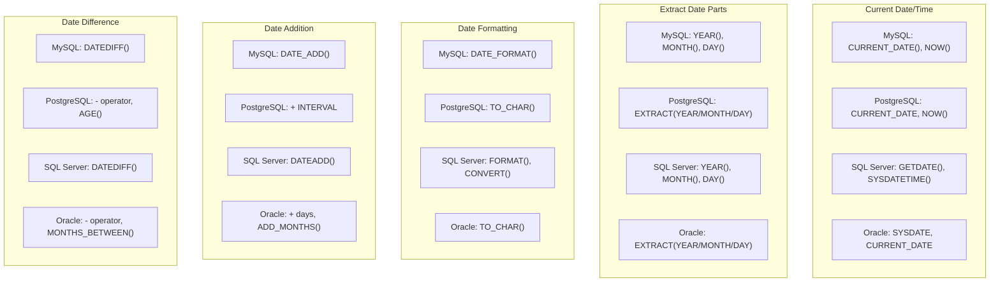

# SQL Date Functions

Working with dates and times is a common task in database applications. SQL provides a rich set of date functions that allow you to manipulate, format, and perform calculations with date and time values. In this tutorial, we'll explore the most commonly used SQL date functions and how to apply them in real-world scenarios.

## Introduction to SQL Date Functions

Date functions in SQL allow you to:
- Extract specific parts of a date (year, month, day, etc.)
- Format dates for display
- Perform calculations between dates
- Convert between different date formats
- Add or subtract time intervals from dates

Different database systems (MySQL, PostgreSQL, SQL Server, Oracle) have their own implementations of date functions, but many core concepts remain similar across platforms.

## Date Data Types

Before diving into date functions, let's understand the common date-related data types:

| Data Type | Description | Example |
|-----------|-------------|---------|
| DATE | Stores date values (without time) | '2023-11-15' |
| TIME | Stores time values (without date) | '14:30:00' |
| DATETIME/TIMESTAMP | Stores both date and time values | '2023-11-15 14:30:00' |

## Getting Current Date and Time

One of the most basic operations is retrieving the current date and time:

```sql
-- MySQL/PostgreSQL
SELECT CURRENT_DATE();  -- Returns current date
SELECT CURRENT_TIME();  -- Returns current time
SELECT CURRENT_TIMESTAMP();  -- Returns current date and time

-- SQL Server
SELECT GETDATE();  -- Returns current date and time
SELECT SYSDATETIME();  -- Returns current date and time with higher precision

-- Oracle
SELECT SYSDATE FROM dual;  -- Returns current date and time
SELECT CURRENT_DATE FROM dual;  -- Returns current date
```

**Output example:**
```
CURRENT_DATE()
--------------
2025-03-03

CURRENT_TIMESTAMP()
-------------------
2025-03-03 10:45:23
```

## Extracting Parts of a Date

You can extract specific components from date values:

```sql
-- MySQL/PostgreSQL
SELECT EXTRACT(YEAR FROM date_column) FROM table_name;
SELECT EXTRACT(MONTH FROM date_column) FROM table_name;
SELECT EXTRACT(DAY FROM date_column) FROM table_name;

-- SQL Server
SELECT YEAR(date_column) FROM table_name;
SELECT MONTH(date_column) FROM table_name;
SELECT DAY(date_column) FROM table_name;

-- Oracle
SELECT EXTRACT(YEAR FROM date_column) FROM table_name;
SELECT EXTRACT(MONTH FROM date_column) FROM table_name;
SELECT EXTRACT(DAY FROM date_column) FROM table_name;
```

**Example:**
```sql
-- Using a sample orders table
SELECT 
    order_id,
    order_date,
    EXTRACT(YEAR FROM order_date) AS order_year,
    EXTRACT(MONTH FROM order_date) AS order_month,
    EXTRACT(DAY FROM order_date) AS order_day
FROM orders
LIMIT 5;
```

**Output:**
```
order_id | order_date  | order_year | order_month | order_day
---------|-------------|------------|-------------|----------
1001     | 2025-01-15  | 2025       | 1           | 15
1002     | 2025-01-20  | 2025       | 1           | 20
1003     | 2025-02-05  | 2025       | 2           | 5
1004     | 2025-02-10  | 2025       | 2           | 10
1005     | 2025-03-01  | 2025       | 3           | 1
```

## Date Formatting

Formatting dates for display is a common requirement:

```sql
-- MySQL
SELECT DATE_FORMAT(date_column, '%Y-%m-%d') FROM table_name;
SELECT DATE_FORMAT(date_column, '%d/%m/%Y') FROM table_name;
SELECT DATE_FORMAT(date_column, '%W, %M %d, %Y') FROM table_name;

-- PostgreSQL
SELECT TO_CHAR(date_column, 'YYYY-MM-DD') FROM table_name;
SELECT TO_CHAR(date_column, 'DD/MM/YYYY') FROM table_name;
SELECT TO_CHAR(date_column, 'Day, Month DD, YYYY') FROM table_name;

-- SQL Server
SELECT FORMAT(date_column, 'yyyy-MM-dd') FROM table_name;
SELECT FORMAT(date_column, 'dd/MM/yyyy') FROM table_name;
SELECT FORMAT(date_column, 'dddd, MMMM dd, yyyy') FROM table_name;

-- Oracle
SELECT TO_CHAR(date_column, 'YYYY-MM-DD') FROM table_name;
SELECT TO_CHAR(date_column, 'DD/MM/YYYY') FROM table_name;
SELECT TO_CHAR(date_column, 'Day, Month DD, YYYY') FROM table_name;
```

**Example:**
```sql
-- MySQL example with sample data
SELECT 
    order_id,
    order_date,
    DATE_FORMAT(order_date, '%Y-%m-%d') AS formatted_date,
    DATE_FORMAT(order_date, '%d/%m/%Y') AS european_format,
    DATE_FORMAT(order_date, '%W, %M %d, %Y') AS long_format
FROM orders
LIMIT 3;
```

**Output:**
```
order_id | order_date  | formatted_date | european_format | long_format
---------|-------------|----------------|-----------------|---------------------------
1001     | 2025-01-15  | 2025-01-15     | 15/01/2025      | Wednesday, January 15, 2025
1002     | 2025-01-20  | 2025-01-20     | 20/01/2025      | Monday, January 20, 2025
1003     | 2025-02-05  | 2025-02-05     | 05/02/2025      | Wednesday, February 05, 2025
```

## Date Calculations

### Adding and Subtracting Time Intervals

You can add or subtract intervals from dates:

```sql
-- MySQL
SELECT DATE_ADD(date_column, INTERVAL 1 DAY) FROM table_name;
SELECT DATE_ADD(date_column, INTERVAL 2 MONTH) FROM table_name;
SELECT DATE_SUB(date_column, INTERVAL 1 YEAR) FROM table_name;

-- PostgreSQL
SELECT date_column + INTERVAL '1 day' FROM table_name;
SELECT date_column + INTERVAL '2 month' FROM table_name;
SELECT date_column - INTERVAL '1 year' FROM table_name;

-- SQL Server
SELECT DATEADD(day, 1, date_column) FROM table_name;
SELECT DATEADD(month, 2, date_column) FROM table_name;
SELECT DATEADD(year, -1, date_column) FROM table_name;

-- Oracle
SELECT date_column + 1 FROM table_name;  -- Add 1 day
SELECT ADD_MONTHS(date_column, 2) FROM table_name;
SELECT ADD_MONTHS(date_column, -12) FROM table_name;  -- Subtract 1 year
```

**Example:**
```sql
-- MySQL example
SELECT 
    order_id,
    order_date,
    DATE_ADD(order_date, INTERVAL 7 DAY) AS delivery_due_date,
    DATE_ADD(order_date, INTERVAL 30 DAY) AS payment_due_date,
    DATE_SUB(order_date, INTERVAL 1 DAY) AS processing_date
FROM orders
LIMIT 3;
```

**Output:**
```
order_id | order_date  | delivery_due_date | payment_due_date | processing_date
---------|-------------|-------------------|------------------|----------------
1001     | 2025-01-15  | 2025-01-22        | 2025-02-14       | 2025-01-14
1002     | 2025-01-20  | 2025-01-27        | 2025-02-19       | 2025-01-19
1003     | 2025-02-05  | 2025-02-12        | 2025-03-07       | 2025-02-04
```

### Finding Date Differences

Calculate the difference between two dates:

```sql
-- MySQL
SELECT DATEDIFF(end_date, start_date) FROM table_name;  -- Returns days

-- PostgreSQL
SELECT end_date - start_date FROM table_name;  -- Returns days
SELECT AGE(end_date, start_date) FROM table_name;  -- Returns interval

-- SQL Server
SELECT DATEDIFF(day, start_date, end_date) FROM table_name;
SELECT DATEDIFF(month, start_date, end_date) FROM table_name;
SELECT DATEDIFF(year, start_date, end_date) FROM table_name;

-- Oracle
SELECT end_date - start_date FROM table_name;  -- Returns days
SELECT MONTHS_BETWEEN(end_date, start_date) FROM table_name;
```

**Example:**
```sql
-- Sample order fulfillment data
SELECT 
    order_id,
    order_date,
    ship_date,
    DATEDIFF(ship_date, order_date) AS processing_days
FROM orders
WHERE ship_date IS NOT NULL
LIMIT 5;
```

**Output:**
```
order_id | order_date  | ship_date   | processing_days
---------|-------------|-------------|----------------
1001     | 2025-01-15  | 2025-01-18  | 3
1002     | 2025-01-20  | 2025-01-21  | 1
1003     | 2025-02-05  | 2025-02-07  | 2
1004     | 2025-02-10  | 2025-02-14  | 4
1005     | 2025-03-01  | 2025-03-03  | 2
```

## Converting Between Date Formats

Converting strings to dates and vice versa:

```sql
-- MySQL
SELECT STR_TO_DATE('15/01/2025', '%d/%m/%Y');
SELECT DATE_FORMAT(date_column, '%Y-%m-%d');

-- PostgreSQL
SELECT TO_DATE('15/01/2025', 'DD/MM/YYYY');
SELECT TO_CHAR(date_column, 'YYYY-MM-DD');

-- SQL Server
SELECT CONVERT(DATE, '15/01/2025', 103);  -- 103 is the format code for dd/mm/yyyy
SELECT CONVERT(VARCHAR, date_column, 120);  -- 120 is the format code for yyyy-mm-dd

-- Oracle
SELECT TO_DATE('15/01/2025', 'DD/MM/YYYY') FROM dual;
SELECT TO_CHAR(date_column, 'YYYY-MM-DD') FROM table_name;
```

**Example:**
```sql
-- MySQL example
SELECT 
    'January 15, 2025' AS text_date,
    STR_TO_DATE('January 15, 2025', '%M %d, %Y') AS converted_date,
    
    '2025-01-15' AS iso_date,
    STR_TO_DATE('2025-01-15', '%Y-%m-%d') AS converted_iso_date,
    
    '15/01/2025' AS european_date,
    STR_TO_DATE('15/01/2025', '%d/%m/%Y') AS converted_european_date;
```

**Output:**
```
text_date         | converted_date | iso_date   | converted_iso_date | european_date | converted_european_date
------------------|----------------|------------|--------------------|--------------|--------------------------
January 15, 2025  | 2025-01-15     | 2025-01-15 | 2025-01-15         | 15/01/2025   | 2025-01-15
```

## Practical Examples

Let's explore some real-world applications of SQL date functions:

### Example 1: Generating a Monthly Sales Report

```sql
-- Generate monthly sales totals for the current year
SELECT 
    EXTRACT(MONTH FROM order_date) AS month,
    DATE_FORMAT(order_date, '%M') AS month_name,
    COUNT(*) AS total_orders,
    SUM(order_amount) AS total_sales
FROM orders
WHERE EXTRACT(YEAR FROM order_date) = EXTRACT(YEAR FROM CURRENT_DATE())
GROUP BY EXTRACT(MONTH FROM order_date), DATE_FORMAT(order_date, '%M')
ORDER BY month;
```

**Output:**
```
month | month_name | total_orders | total_sales
------|------------|--------------|------------
1     | January    | 245          | 24560.75
2     | February   | 198          | 19875.50
3     | March      | 102          | 10245.25
```

### Example 2: Finding Overdue Orders

```sql
-- Find orders that are overdue (delivery date has passed but status is not 'delivered')
SELECT 
    order_id,
    customer_name,
    order_date,
    DATE_ADD(order_date, INTERVAL 3 DAY) AS expected_delivery,
    DATEDIFF(CURRENT_DATE(), DATE_ADD(order_date, INTERVAL 3 DAY)) AS days_overdue
FROM orders
WHERE 
    order_status != 'Delivered' 
    AND DATE_ADD(order_date, INTERVAL 3 DAY) < CURRENT_DATE()
ORDER BY days_overdue DESC;
```

**Output:**
```
order_id | customer_name  | order_date  | expected_delivery | days_overdue
---------|----------------|-------------|-------------------|-------------
1056     | John Smith     | 2025-02-15  | 2025-02-18        | 13
1078     | Sarah Johnson  | 2025-02-20  | 2025-02-23        | 8
1095     | Michael Brown  | 2025-02-25  | 2025-02-28        | 3
```

### Example 3: Calculating Age from Birth Date

```sql
-- Calculate ages of employees
SELECT 
    employee_id,
    employee_name,
    birth_date,
    TIMESTAMPDIFF(YEAR, birth_date, CURRENT_DATE()) AS age
FROM employees
ORDER BY age DESC;
```

**Output:**
```
employee_id | employee_name  | birth_date  | age
------------|----------------|-------------|----
1005        | Robert Wilson  | 1965-04-12  | 59
1002        | Jane Williams  | 1972-08-23  | 52
1008        | Susan Miller   | 1980-11-05  | 44
1015        | David Garcia   | 1990-01-30  | 35
```

### Example 4: Grouping Data by Date Periods

```sql
-- Group sales data by quarter
SELECT 
    CONCAT('Q', QUARTER(order_date)) AS quarter,
    COUNT(*) AS total_orders,
    SUM(order_amount) AS total_sales
FROM orders
WHERE YEAR(order_date) = YEAR(CURRENT_DATE())
GROUP BY QUARTER(order_date)
ORDER BY quarter;
```

**Output:**
```
quarter | total_orders | total_sales
--------|--------------|------------
Q1      | 545          | 54680.50
Q2      | 0            | 0.00
Q3      | 0            | 0.00
Q4      | 0            | 0.00
```

## Date Function Comparison Across Database Systems

Here's a quick reference for equivalent date functions across major database systems:



## Summary

SQL date functions are powerful tools for working with temporal data in databases. In this tutorial, we've covered:

- Retrieving current date and time
- Extracting components from dates (year, month, day)
- Formatting dates for display
- Performing date calculations (addition, subtraction, differences)
- Converting between date formats
- Real-world applications through practical examples

Working proficiently with dates in SQL enables you to perform sophisticated data analysis, generate time-based reports, and build applications that handle temporal data effectively.

## Additional Resources and Exercises

### Resources:
- [MySQL Date and Time Functions](https://dev.mysql.com/doc/refman/8.0/en/date-and-time-functions.html)
- [PostgreSQL Date/Time Functions](https://www.postgresql.org/docs/current/functions-datetime.html)
- [SQL Server Date and Time Functions](https://docs.microsoft.com/en-us/sql/t-sql/functions/date-and-time-data-types-and-functions-transact-sql)
- [Oracle Date and Time Functions](https://docs.oracle.com/en/database/oracle/oracle-database/19/sqlrf/Single-Row-Functions.html#GUID-D11E2E30-C998-4435-A3F1-206C928F2FF2)

### Practice Exercises:

1. **Basic Date Manipulation**:
   - Write a query to display today's date, the first day of the current month, and the last day of the current month.

2. **Date Extraction**:
   - Given a table of events with a datetime column, write a query to count events by day of the week.

3. **Date Calculations**:
   - Create a query that calculates the age of products in your inventory (in days, months, and years).

4. **Date Reporting**:
   - Write a query to generate a report of sales by week for the past 4 weeks.

5. **Advanced Date Functions**:
   - Create a query that identifies the busiest hour of the day based on order timestamps.

By mastering SQL date functions, you'll significantly enhance your ability to analyze and work with time-based data in your database applications.