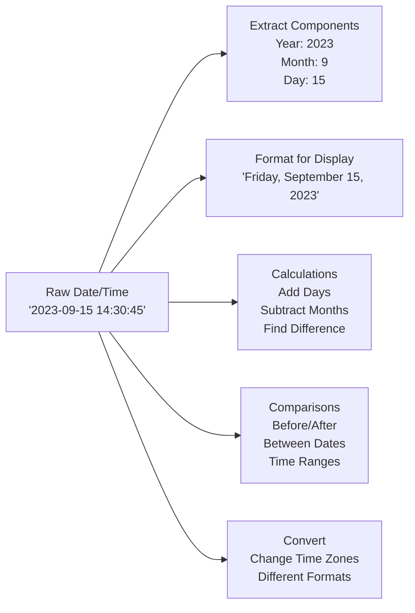

# SQL Time Functions

## Introduction

Time is a critical dimension in almost every application that interacts with a database. Whether you're tracking when a user created an account, analyzing sales trends over time, or scheduling future events, SQL provides powerful functions to work with date and time values.

SQL time functions allow you to:
- Extract specific components from date/time values
- Perform calculations with dates
- Format dates for display
- Compare time periods
- Convert between different time formats

In this guide, we'll explore the most commonly used SQL time functions, how they work, and how to apply them in real-world scenarios.

## Date and Time Data Types

Before diving into functions, let's understand the common date and time data types in SQL:

| Data Type | Description | Example |
|-----------|-------------|---------|
| DATE | Stores date values (year, month, day) | '2023-09-15' |
| TIME | Stores time values (hour, minute, second) | '14:30:00' |
| DATETIME/TIMESTAMP | Stores both date and time values | '2023-09-15 14:30:00' |
| INTERVAL | Represents a period of time | '1 day', '2 hours' |

:::note
Specific data types and their syntax may vary across different database systems (MySQL, PostgreSQL, SQL Server, Oracle, etc.).
:::

## Current Date and Time Functions

Let's start with functions that return the current date and/or time:

### Getting Current Date and Time

```sql
-- Get current date (MySQL, PostgreSQL, SQLite)
SELECT CURRENT_DATE;

-- Get current time (MySQL, PostgreSQL)
SELECT CURRENT_TIME;

-- Get current date and time
SELECT CURRENT_TIMESTAMP; -- Standard SQL
SELECT NOW(); -- MySQL, PostgreSQL
SELECT GETDATE(); -- SQL Server
SELECT SYSDATE; -- Oracle
```

#### Example Output:

```
CURRENT_DATE
------------
2023-09-15

CURRENT_TIME
------------
14:30:45

CURRENT_TIMESTAMP
----------------
2023-09-15 14:30:45
```

## Extracting Components from Dates

Often you need to extract specific parts from a date value:

```sql
-- MySQL, PostgreSQL
SELECT 
  EXTRACT(YEAR FROM CURRENT_DATE) AS year,
  EXTRACT(MONTH FROM CURRENT_DATE) AS month,
  EXTRACT(DAY FROM CURRENT_DATE) AS day;

-- Alternative methods (MySQL)
SELECT 
  YEAR('2023-09-15') AS year,
  MONTH('2023-09-15') AS month,
  DAY('2023-09-15') AS day;

-- SQL Server
SELECT 
  DATEPART(YEAR, '2023-09-15') AS year,
  DATEPART(MONTH, '2023-09-15') AS month,
  DATEPART(DAY, '2023-09-15') AS day;
```

#### Example Output:

```
year | month | day
-----|-------|----
2023 | 9     | 15
```

## Date Formatting Functions

Converting dates to different string formats is a common requirement:

```sql
-- MySQL
SELECT DATE_FORMAT('2023-09-15 14:30:45', '%W, %M %d, %Y') AS formatted_date;

-- PostgreSQL
SELECT TO_CHAR(TIMESTAMP '2023-09-15 14:30:45', 'Day, Month DD, YYYY') AS formatted_date;

-- SQL Server
SELECT FORMAT(CAST('2023-09-15 14:30:45' AS DATETIME), 'dddd, MMMM dd, yyyy') AS formatted_date;
```

#### Example Output:

```
formatted_date
-----------------------
Friday, September 15, 2023
```

### Common Format Specifiers

#### MySQL Format Specifiers:
- `%Y` - Year (4 digits)
- `%m` - Month (01-12)
- `%d` - Day (01-31)
- `%H` - Hour (00-23)
- `%i` - Minutes (00-59)
- `%s` - Seconds (00-59)
- `%W` - Weekday name (Sunday-Saturday)
- `%M` - Month name (January-December)

## Date Arithmetic

SQL allows you to perform calculations with dates:

### Adding and Subtracting Time

```sql
-- MySQL
SELECT 
  DATE_ADD('2023-09-15', INTERVAL 10 DAY) AS future_date,
  DATE_SUB('2023-09-15', INTERVAL 5 DAY) AS past_date;

-- PostgreSQL
SELECT 
  '2023-09-15'::date + INTERVAL '10 days' AS future_date,
  '2023-09-15'::date - INTERVAL '5 days' AS past_date;

-- SQL Server
SELECT 
  DATEADD(DAY, 10, '2023-09-15') AS future_date,
  DATEADD(DAY, -5, '2023-09-15') AS past_date;
```

#### Example Output:

```
future_date | past_date
------------|----------
2023-09-25  | 2023-09-10
```

### Calculating Date Differences

```sql
-- MySQL
SELECT DATEDIFF('2023-09-15', '2023-08-15') AS days_difference;

-- PostgreSQL
SELECT '2023-09-15'::date - '2023-08-15'::date AS days_difference;

-- SQL Server
SELECT DATEDIFF(DAY, '2023-08-15', '2023-09-15') AS days_difference;
```

#### Example Output:

```
days_difference
---------------
31
```

## Practical Examples

Let's explore some real-world examples of using SQL time functions:

### Example 1: User Registration Analysis

Imagine you have a users table with a `registration_date` column:

```sql
-- Create a sample users table
CREATE TABLE users (
  user_id INT PRIMARY KEY,
  username VARCHAR(50),
  registration_date DATETIME
);

-- Insert sample data
INSERT INTO users VALUES 
  (1, 'user1', '2023-01-15 10:30:00'),
  (2, 'user2', '2023-02-20 14:15:00'),
  (3, 'user3', '2023-02-28 09:45:00'),
  (4, 'user4', '2023-03-10 16:20:00'),
  (5, 'user5', '2023-03-15 11:10:00');

-- Count registrations by month
SELECT 
  EXTRACT(YEAR FROM registration_date) AS year,
  EXTRACT(MONTH FROM registration_date) AS month,
  COUNT(*) AS registrations
FROM users
GROUP BY 
  EXTRACT(YEAR FROM registration_date),
  EXTRACT(MONTH FROM registration_date)
ORDER BY year, month;
```

#### Example Output:

```
year | month | registrations
-----|-------|-------------
2023 | 1     | 1
2023 | 2     | 2
2023 | 3     | 2
```

### Example 2: Order Fulfillment Metrics

For an e-commerce application with orders:

```sql
-- Calculate average order fulfillment time
SELECT 
  AVG(DATEDIFF(shipped_date, order_date)) AS avg_fulfillment_days
FROM orders
WHERE YEAR(order_date) = 2023;

-- Find orders that took more than 3 days to fulfill
SELECT 
  order_id, 
  order_date, 
  shipped_date,
  DATEDIFF(shipped_date, order_date) AS days_to_fulfill
FROM orders
WHERE DATEDIFF(shipped_date, order_date) > 3
ORDER BY days_to_fulfill DESC;
```

### Example 3: Time-Based Data Aggregation

```sql
-- Aggregate sales data by quarter
SELECT 
  EXTRACT(YEAR FROM sale_date) AS year,
  CONCAT('Q', EXTRACT(QUARTER FROM sale_date)) AS quarter,
  SUM(amount) AS total_sales
FROM sales
GROUP BY 
  EXTRACT(YEAR FROM sale_date),
  EXTRACT(QUARTER FROM sale_date)
ORDER BY year, quarter;

-- Find sales trends by day of week
SELECT 
  DAYNAME(sale_date) AS day_of_week, -- MySQL
  -- TO_CHAR(sale_date, 'Day') AS day_of_week, -- PostgreSQL
  -- FORMAT(sale_date, 'dddd') AS day_of_week, -- SQL Server
  COUNT(*) AS transaction_count,
  AVG(amount) AS avg_sale_amount
FROM sales
GROUP BY DAYNAME(sale_date)
ORDER BY 
  FIELD(day_of_week, 'Monday', 'Tuesday', 'Wednesday', 'Thursday', 'Friday', 'Saturday', 'Sunday'); -- MySQL
  -- Use CASE for PostgreSQL/SQL Server ordering
```

## Working with Time Zones

For applications that operate globally, handling time zones is essential:

```sql
-- PostgreSQL time zone examples
SELECT 
  CURRENT_TIMESTAMP AS server_time,
  CURRENT_TIMESTAMP AT TIME ZONE 'UTC' AS utc_time,
  CURRENT_TIMESTAMP AT TIME ZONE 'America/New_York' AS eastern_time;

-- Convert timestamps between time zones (PostgreSQL)
SELECT 
  '2023-09-15 14:30:00 UTC'::timestamptz AT TIME ZONE 'America/Los_Angeles' AS pacific_time;
```

:::tip
When working with time zones:
- Store timestamps in UTC when possible
- Convert to local time zones only for display purposes
- Be mindful of daylight saving time changes
:::

## Database-Specific Features

Different database systems have unique date/time functions:

### MySQL

```sql
-- Week functions
SELECT 
  YEARWEEK('2023-09-15') AS year_week,
  WEEKOFYEAR('2023-09-15') AS week_number;

-- Working with UTC time
SELECT UTC_TIMESTAMP();

-- Validating dates
SELECT STR_TO_DATE('15/09/2023', '%d/%m/%Y') AS converted_date;
```

### PostgreSQL

```sql
-- Age calculation
SELECT AGE('2023-09-15', '2000-01-01') AS age;

-- Generate series of dates
SELECT generate_series(
  '2023-01-01'::timestamp,
  '2023-01-10'::timestamp,
  '1 day'::interval
) AS date_series;
```

### SQL Server

```sql
-- Find first day of month
SELECT DATEADD(MONTH, DATEDIFF(MONTH, 0, GETDATE()), 0) AS first_day_of_month;

-- Find last day of month
SELECT DATEADD(DAY, -1, DATEADD(MONTH, DATEDIFF(MONTH, 0, GETDATE()) + 1, 0)) AS last_day_of_month;
```

## Date and Time Best Practices

When working with dates and times in SQL:

1. **Use appropriate data types**: Choose the right date/time type for your data.
2. **Consider time zones**: Be explicit about time zones, especially for applications with global users.
3. **Index date columns**: If you frequently query by date ranges, add indexes on date columns.
4. **Be mindful of formats**: Different database systems use different default formats.
5. **Handle NULL values**: Use `COALESCE()` or similar functions to handle missing date values.

```sql
-- Example of handling NULL dates
SELECT COALESCE(shipping_date, CURRENT_DATE) AS effective_date
FROM orders;
```

## Visualizing Time Data

Here's a simple diagram showing common date/time operations:



## Summary

SQL time functions provide powerful tools for working with date and time data in your database:

- Retrieving current date and time values
- Extracting components from dates (year, month, day, etc.)
- Formatting dates for display
- Performing arithmetic operations on dates
- Analyzing time-based data

Mastering these functions is essential for any developer working with databases, as time is a crucial dimension in most applications.

## Exercises

To practice your SQL time function skills, try these exercises:

1. Write a query to find all orders placed last month.
2. Calculate the average time between order placement and shipping for each product category.
3. Group customer signups by day of week to find which days have the highest registration rates.
4. Create a query to show a "cohort analysis" of user retention by signup month.
5. Write a function to determine if a given date is a business day (not a weekend or holiday).

## Additional Resources

To learn more about SQL time functions:

- [MySQL Date and Time Functions](https://dev.mysql.com/doc/refman/8.0/en/date-and-time-functions.html)
- [PostgreSQL Date/Time Functions](https://www.postgresql.org/docs/current/functions-datetime.html)
- [SQL Server Date and Time Data Types and Functions](https://learn.microsoft.com/en-us/sql/t-sql/functions/date-and-time-data-types-and-functions-transact-sql)
- [Oracle Date/Time Functions](https://docs.oracle.com/en/database/oracle/oracle-database/19/sqlrf/Single-Row-Functions.html#GUID-3F6B88C2-485B-457F-AAB5-2999F8F51F9A)

Remember that the specific syntax and availability of functions may vary across different database management systems. Always consult your database's documentation for the most accurate information.