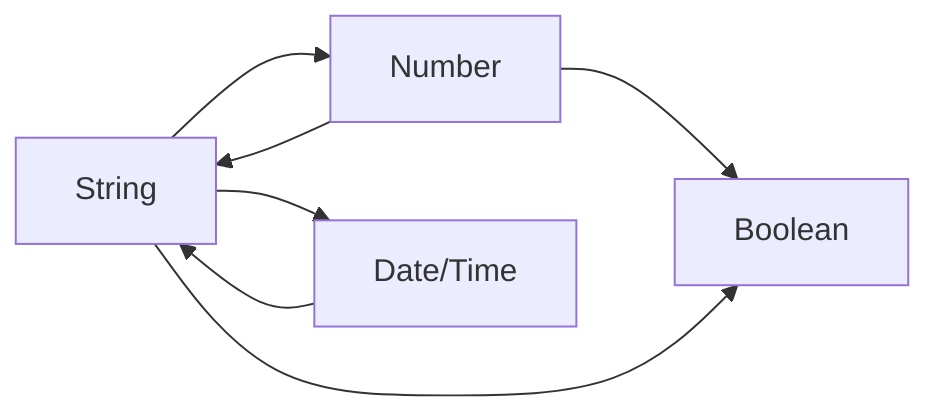

# SQL Conversion Functions

## Introduction

When working with databases, you'll often need to convert data from one type to another. SQL provides several conversion functions that allow you to transform strings to numbers, dates to strings, or perform other type conversions. These functions are essential for data manipulation and ensuring that your data is in the right format for calculations, comparisons, or display.

In this guide, we'll explore the most commonly used SQL conversion functions, their syntax, and practical applications. Whether you're preparing data for reports, cleaning up imported data, or performing calculations, these functions will be valuable tools in your SQL toolkit.

## Common SQL Conversion Functions

### CAST and CONVERT

The `CAST` and `CONVERT` functions are the primary methods for converting data types in SQL. While they serve similar purposes, they have different syntax and some database systems may prefer one over the other.

#### CAST Function

The `CAST` function uses ANSI SQL syntax that works across most database systems:

```sql
CAST(expression AS datatype)
```

Example:
```sql
SELECT CAST('123' AS INT) AS converted_number;
```

Output:
```
converted_number
---------------
123
```

#### CONVERT Function

The `CONVERT` function is commonly used in SQL Server and has a slightly different syntax:

```sql
CONVERT(datatype, expression [, style])
```

The optional style parameter allows for formatting, especially for date conversions.

Example:
```sql
SELECT CONVERT(INT, '123') AS converted_number;
```

Output:
```
converted_number
---------------
123
```

### Type-Specific Conversion Functions

Many database systems also provide specialized conversion functions for specific types:

#### TO_NUMBER (Oracle, PostgreSQL)

Converts a string to a number:

```sql
SELECT TO_NUMBER('123.45') AS converted_number;
```

Output:
```
converted_number
---------------
123.45
```

#### TO_CHAR / TO_DATE (Oracle, PostgreSQL)

Convert between dates and strings:

```sql
-- Convert date to string
SELECT TO_CHAR(CURRENT_DATE, 'YYYY-MM-DD') AS formatted_date;

-- Convert string to date
SELECT TO_DATE('2023-01-15', 'YYYY-MM-DD') AS parsed_date;
```

Output:
```
formatted_date
--------------
2023-01-15

parsed_date
-----------
2023-01-15
```

#### STR (SQL Server)

Converts a number to a string:

```sql
SELECT STR(123.45, 6, 2) AS converted_string;
```

Output:
```
converted_string
---------------
123.45
```

## Common Conversion Scenarios

Let's explore some common scenarios where you might need to use conversion functions:

### 1. String to Number Conversion

Often, you'll receive data with numbers stored as strings. To perform mathematical operations, you need to convert them first:

```sql
-- Calculate total from string values
SELECT 
    product_name,
    CAST(price AS DECIMAL(10,2)) * CAST(quantity AS INT) AS total_value
FROM orders;
```

### 2. Formatting Dates for Display

When displaying dates to users, you often need to format them in a specific way:

```sql
-- SQL Server example
SELECT 
    order_id,
    CONVERT(VARCHAR, order_date, 103) AS formatted_date
FROM orders;

-- PostgreSQL/Oracle example
SELECT 
    order_id,
    TO_CHAR(order_date, 'DD/MM/YYYY') AS formatted_date
FROM orders;
```

### 3. Data Type Validation

Conversion functions can be used to validate if a string can be converted to the expected type:

```sql
-- Validate if a string can be converted to a date
SELECT 
    input_value,
    CASE 
        WHEN TRY_CONVERT(DATE, input_value) IS NOT NULL THEN 'Valid date'
        ELSE 'Invalid date'
    END AS validation_result
FROM user_inputs;
```

## Best Practices for Data Conversion

When working with SQL conversion functions, keep these best practices in mind:

1. **Error Handling**: Failed conversions can cause queries to fail. Use functions like `TRY_CAST` or `TRY_CONVERT` (in SQL Server) to handle conversion errors gracefully.

2. **Consider Performance**: Excessive type conversions can impact query performance. When possible, store data in the appropriate type from the beginning.

3. **Implicit vs. Explicit Conversion**: SQL will sometimes perform implicit conversions, but explicit conversions using functions make your code more readable and predictable.

4. **Database Compatibility**: Be aware that conversion functions and their syntax can vary between database systems.

Here's a diagram showing the common conversion paths between data types:



## Real-World Examples

### Example 1: Cleaning Import Data

When importing data from external sources, conversions are often necessary:

```sql
CREATE TABLE cleaned_sales AS
SELECT
    CAST(product_id AS INT) AS product_id,
    product_name,
    CAST(sale_amount AS DECIMAL(10,2)) AS sale_amount,
    TO_DATE(sale_date, 'MM/DD/YYYY') AS sale_date
FROM raw_sales_import;
```

### Example 2: Creating a Report with Formatted Output

```sql
SELECT
    customer_name,
    TO_CHAR(order_date, 'Month DD, YYYY') AS order_date,
    CAST(total_amount AS INT) AS rounded_amount,
    CASE 
        WHEN CAST(total_amount AS INT) > 1000 THEN 'High Value'
        ELSE 'Standard'
    END AS order_category
FROM orders
WHERE order_date > TO_DATE('2023-01-01', 'YYYY-MM-DD');
```

### Example 3: Data Analysis with Converted Types

```sql
SELECT
    CAST(EXTRACT(YEAR FROM order_date) AS VARCHAR) AS year,
    CAST(EXTRACT(MONTH FROM order_date) AS VARCHAR) AS month,
    SUM(CAST(order_amount AS DECIMAL(10,2))) AS monthly_total
FROM orders
GROUP BY 
    EXTRACT(YEAR FROM order_date),
    EXTRACT(MONTH FROM order_date)
ORDER BY 
    year, month;
```

## Summary

SQL conversion functions are essential tools for data manipulation and format transformation in databases. In this guide, we've covered:

- The primary conversion functions: `CAST` and `CONVERT`
- Type-specific conversion functions like `TO_NUMBER`, `TO_CHAR`, and `STR`
- Common scenarios requiring data type conversions
- Best practices for using conversion functions effectively
- Real-world examples demonstrating practical applications

By mastering these conversion functions, you'll be better equipped to handle diverse data formats, ensure data integrity, and produce the desired output in your SQL queries.

## Exercises

Try these exercises to practice your understanding of SQL conversion functions:

1. Write a query to convert the string '2023-07-15' to a date and then extract the month name.

2. Create a query that formats the current date as 'Day, Month DD, YYYY' (e.g., 'Monday, July 15, 2023').

3. Write a query to round the number 123.456 to 2 decimal places and convert it to a string.

4. Create a table with a string column containing mixed data (numbers, dates, text) and write queries to identify which rows contain valid numbers and which contain valid dates.

## Additional Resources

- [SQL Server Documentation on CAST and CONVERT](https://docs.microsoft.com/en-us/sql/t-sql/functions/cast-and-convert-transact-sql)
- [PostgreSQL Type Conversion Functions](https://www.postgresql.org/docs/current/functions-formatting.html)
- [Oracle TO_CHAR, TO_NUMBER, and TO_DATE Functions](https://docs.oracle.com/cd/B19306_01/server.102/b14200/functions180.htm)
- [MySQL Type Conversion Functions](https://dev.mysql.com/doc/refman/8.0/en/cast-functions.html)