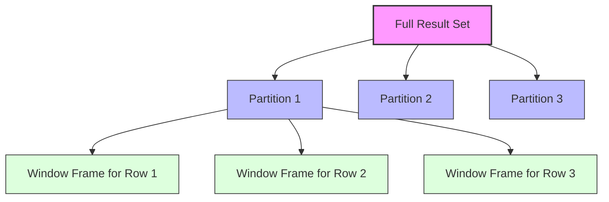

# SQL Analytical Functions

## Introduction

SQL Analytical Functions (also known as Window Functions) are powerful tools that perform calculations across a set of table rows related to the current row. Unlike regular aggregate functions that group rows into a single output row, analytical functions operate on a window or "frame" of rows while preserving the identity of each row. This allows for complex analysis and reporting capabilities directly within your SQL queries.

These functions are particularly valuable when you need to:
- Calculate running totals or moving averages
- Rank items within groups
- Compare values between rows
- Analyze trends over time
- Create sophisticated reports without complex subqueries or temporary tables

In this guide, we'll explore the most commonly used analytical functions, their syntax, and practical applications to help you leverage their power in your database queries.

## Understanding the Window Concept

Before diving into specific functions, let's understand the concept of a "window" in SQL.

A window defines a set of rows on which a function operates. It's specified using the `OVER` clause, which can include:

1. **PARTITION BY**: Divides rows into groups (similar to GROUP BY)
2. **ORDER BY**: Determines the order of rows within each partition
3. **Frame clause**: Specifies which rows within the partition to include

Here's the general syntax:

```sql
function_name(<arguments>) OVER (
    PARTITION BY <columns> 
    ORDER BY <columns> 
    <frame_clause>
)
```

The frame clause can be:
```sql
ROWS BETWEEN <start> AND <end>
-- or
RANGE BETWEEN <start> AND <end>
```

Where `<start>` and `<end>` can be:
- `UNBOUNDED PRECEDING`: All rows before the current row
- `n PRECEDING`: n rows before the current row
- `CURRENT ROW`: The current row
- `n FOLLOWING`: n rows after the current row
- `UNBOUNDED FOLLOWING`: All rows after the current row

Let's visualize this concept:



## Types of Analytical Functions

SQL analytical functions can be broadly categorized into:

1. **Ranking Functions**: Assign ranks to rows within a partition
2. **Value Functions**: Retrieve values from other rows within the window
3. **Aggregate Window Functions**: Perform aggregations within the window
4. **Distribution Functions**: Calculate statistical distributions

Let's explore each category with examples.

## Ranking Functions

### ROW_NUMBER()

The `ROW_NUMBER()` function assigns a unique sequential integer to each row within a partition.

**Syntax:**
```sql
ROW_NUMBER() OVER (
    [PARTITION BY column1, column2, ...]
    [ORDER BY column1 [ASC|DESC], column2 [ASC|DESC], ...]
)
```

**Example:** Assign a sequential number to each employee within their department, ordered by salary:

```sql
SELECT 
    employee_id,
    first_name,
    department,
    salary,
    ROW_NUMBER() OVER (
        PARTITION BY department 
        ORDER BY salary DESC
    ) AS salary_rank
FROM employees;
```

**Result:**

| employee_id | first_name | department | salary | salary_rank |
|-------------|------------|------------|--------|-------------|
| 103         | Alexander  | IT         | 90000  | 1           |
| 107         | Diana      | IT         | 85000  | 2           |
| 105         | Bruce      | IT         | 75000  | 3           |
| 102         | Barbara    | HR         | 82000  | 1           |
| 106         | Clark      | HR         | 72000  | 2           |
| 104         | Donna      | HR         | 65000  | 3           |
| 101         | Arthur     | Sales      | 95000  | 1           |
| 108         | Edward     | Sales      | 78000  | 2           |

### RANK() and DENSE_RANK()

These functions assign ranks to rows within a partition, with `RANK()` leaving gaps for ties and `DENSE_RANK()` leaving no gaps.

**Syntax:**
```sql
RANK() OVER (
    [PARTITION BY column1, column2, ...]
    ORDER BY column1 [ASC|DESC], column2 [ASC|DESC], ...
)

DENSE_RANK() OVER (
    [PARTITION BY column1, column2, ...]
    ORDER BY column1 [ASC|DESC], column2 [ASC|DESC], ...
)
```

**Example:** Rank employees within departments based on salary:

```sql
SELECT 
    employee_id,
    first_name,
    department,
    salary,
    RANK() OVER (
        PARTITION BY department 
        ORDER BY salary DESC
    ) AS salary_rank,
    DENSE_RANK() OVER (
        PARTITION BY department 
        ORDER BY salary DESC
    ) AS dense_salary_rank
FROM employees;
```

**Result:**

| employee_id | first_name | department | salary | salary_rank | dense_salary_rank |
|-------------|------------|------------|--------|-------------|-------------------|
| 103         | Alexander  | IT         | 90000  | 1           | 1                 |
| 107         | Diana      | IT         | 85000  | 2           | 2                 |
| 109         | Fiona      | IT         | 85000  | 2           | 2                 |
| 105         | Bruce      | IT         | 75000  | 4           | 3                 |
| 102         | Barbara    | HR         | 82000  | 1           | 1                 |
| 106         | Clark      | HR         | 72000  | 2           | 2                 |
| 104         | Donna      | HR         | 65000  | 3           | 3                 |
| 101         | Arthur     | Sales      | 95000  | 1           | 1                 |
| 108         | Edward     | Sales      | 78000  | 2           | 2                 |

Notice how for the IT department, both Diana and Fiona have the same salary. With `RANK()`, they both get rank 2, but the next rank is 4 (skipping 3). With `DENSE_RANK()`, they both get rank 2, and the next rank is 3 (no gap).

### NTILE(n)

The `NTILE(n)` function divides the rows in a partition into `n` approximately equal groups and assigns a group number.

**Syntax:**
```sql
NTILE(n) OVER (
    [PARTITION BY column1, column2, ...]
    ORDER BY column1 [ASC|DESC], column2 [ASC|DESC], ...
)
```

**Example:** Divide employees in each department into 3 salary bands:

```sql
SELECT 
    employee_id,
    first_name,
    department,
    salary,
    NTILE(3) OVER (
        PARTITION BY department 
        ORDER BY salary DESC
    ) AS salary_band
FROM employees;
```

**Result:**

| employee_id | first_name | department | salary | salary_band |
|-------------|------------|------------|--------|-------------|
| 103         | Alexander  | IT         | 90000  | 1           |
| 107         | Diana      | IT         | 85000  | 1           |
| 109         | Fiona      | IT         | 85000  | 2           |
| 105         | Bruce      | IT         | 75000  | 2           |
| 111         | Henry      | IT         | 70000  | 3           |
| 102         | Barbara    | HR         | 82000  | 1           |
| 106         | Clark      | HR         | 72000  | 2           |
| 104         | Donna      | HR         | 65000  | 3           |

## Value Functions

### LAG() and LEAD()

These functions access data from a previous row (`LAG()`) or a following row (`LEAD()`) within the partition.

**Syntax:**
```sql
LAG(expression [, offset [, default]]) OVER (
    [PARTITION BY column1, column2, ...]
    ORDER BY column1 [ASC|DESC], column2 [ASC|DESC], ...
)

LEAD(expression [, offset [, default]]) OVER (
    [PARTITION BY column1, column2, ...]
    ORDER BY column1 [ASC|DESC], column2 [ASC|DESC], ...
)
```

**Example:** Compare each employee's salary with the previous and next employee in their department:

```sql
SELECT 
    employee_id,
    first_name,
    department,
    salary,
    LAG(salary) OVER (
        PARTITION BY department 
        ORDER BY salary DESC
    ) AS previous_salary,
    LEAD(salary) OVER (
        PARTITION BY department 
        ORDER BY salary DESC
    ) AS next_salary
FROM employees;
```

**Result:**

| employee_id | first_name | department | salary | previous_salary | next_salary |
|-------------|------------|------------|--------|-----------------|-------------|
| 103         | Alexander  | IT         | 90000  | NULL            | 85000       |
| 107         | Diana      | IT         | 85000  | 90000           | 85000       |
| 109         | Fiona      | IT         | 85000  | 85000           | 75000       |
| 105         | Bruce      | IT         | 75000  | 85000           | 70000       |
| 111         | Henry      | IT         | 70000  | 75000           | NULL        |
| 102         | Barbara    | HR         | 82000  | NULL            | 72000       |
| 106         | Clark      | HR         | 72000  | 82000           | 65000       |
| 104         | Donna      | HR         | 65000  | 72000           | NULL        |

### FIRST_VALUE() and LAST_VALUE()

These functions return the first and last values in an ordered set of values within the window.

**Syntax:**
```sql
FIRST_VALUE(expression) OVER (
    [PARTITION BY column1, column2, ...]
    ORDER BY column1 [ASC|DESC], column2 [ASC|DESC], ...
    [frame_clause]
)

LAST_VALUE(expression) OVER (
    [PARTITION BY column1, column2, ...]
    ORDER BY column1 [ASC|DESC], column2 [ASC|DESC], ...
    [frame_clause]
)
```

**Example:** Show the highest and lowest salary in each department alongside each employee:

```sql
SELECT 
    employee_id,
    first_name,
    department,
    salary,
    FIRST_VALUE(salary) OVER (
        PARTITION BY department 
        ORDER BY salary DESC
        ROWS BETWEEN UNBOUNDED PRECEDING AND UNBOUNDED FOLLOWING
    ) AS highest_salary,
    LAST_VALUE(salary) OVER (
        PARTITION BY department 
        ORDER BY salary DESC
        ROWS BETWEEN UNBOUNDED PRECEDING AND UNBOUNDED FOLLOWING
    ) AS lowest_salary
FROM employees;
```

**Result:**

| employee_id | first_name | department | salary | highest_salary | lowest_salary |
|-------------|------------|------------|--------|----------------|---------------|
| 103         | Alexander  | IT         | 90000  | 90000          | 70000         |
| 107         | Diana      | IT         | 85000  | 90000          | 70000         |
| 109         | Fiona      | IT         | 85000  | 90000          | 70000         |
| 105         | Bruce      | IT         | 75000  | 90000          | 70000         |
| 111         | Henry      | IT         | 70000  | 90000          | 70000         |
| 102         | Barbara    | HR         | 82000  | 82000          | 65000         |
| 106         | Clark      | HR         | 72000  | 82000          | 65000         |
| 104         | Donna      | HR         | 65000  | 82000          | 65000         |

Note the importance of the frame clause (`ROWS BETWEEN UNBOUNDED PRECEDING AND UNBOUNDED FOLLOWING`) for `LAST_VALUE()`. Without it, the function would only see rows from the start of the partition to the current row, not giving the true "last" value.

## Aggregate Window Functions

Standard aggregate functions like `SUM()`, `AVG()`, `MIN()`, `MAX()`, and `COUNT()` can be used as window functions with the `OVER` clause.

**Example:** Calculate running totals and department averages:

```sql
SELECT 
    employee_id,
    first_name,
    department,
    salary,
    SUM(salary) OVER (
        PARTITION BY department
    ) AS dept_total_salary,
    AVG(salary) OVER (
        PARTITION BY department
    ) AS dept_avg_salary,
    SUM(salary) OVER (
        PARTITION BY department
        ORDER BY salary
        ROWS UNBOUNDED PRECEDING
    ) AS running_total
FROM employees;
```

**Result:**

| employee_id | first_name | department | salary | dept_total_salary | dept_avg_salary | running_total |
|-------------|------------|------------|--------|-------------------|-----------------|---------------|
| 111         | Henry      | IT         | 70000  | 405000            | 81000           | 70000         |
| 105         | Bruce      | IT         | 75000  | 405000            | 81000           | 145000        |
| 107         | Diana      | IT         | 85000  | 405000            | 81000           | 230000        |
| 109         | Fiona      | IT         | 85000  | 405000            | 81000           | 315000        |
| 103         | Alexander  | IT         | 90000  | 405000            | 81000           | 405000        |
| 104         | Donna      | HR         | 65000  | 219000            | 73000           | 65000         |
| 106         | Clark      | HR         | 72000  | 219000            | 73000           | 137000        |
| 102         | Barbara    | HR         | 82000  | 219000            | 73000           | 219000        |

## Distribution Functions

### PERCENT_RANK()

Calculates the relative rank of a row within a group of rows, returning a value between 0 and 1.

**Syntax:**
```sql
PERCENT_RANK() OVER (
    [PARTITION BY column1, column2, ...]
    ORDER BY column1 [ASC|DESC], column2 [ASC|DESC], ...
)
```

**Example:** Calculate the percentage rank of salaries within departments:

```sql
SELECT 
    employee_id,
    first_name,
    department,
    salary,
    PERCENT_RANK() OVER (
        PARTITION BY department 
        ORDER BY salary
    ) AS percent_rank
FROM employees;
```

**Result:**

| employee_id | first_name | department | salary | percent_rank |
|-------------|------------|------------|--------|--------------|
| 111         | Henry      | IT         | 70000  | 0.00         |
| 105         | Bruce      | IT         | 75000  | 0.25         |
| 107         | Diana      | IT         | 85000  | 0.50         |
| 109         | Fiona      | IT         | 85000  | 0.50         |
| 103         | Alexander  | IT         | 90000  | 1.00         |
| 104         | Donna      | HR         | 65000  | 0.00         |
| 106         | Clark      | HR         | 72000  | 0.50         |
| 102         | Barbara    | HR         | 82000  | 1.00         |

### CUME_DIST()

Calculates the cumulative distribution of a value within a group of values, returning a value between 0 and 1.

**Syntax:**
```sql
CUME_DIST() OVER (
    [PARTITION BY column1, column2, ...]
    ORDER BY column1 [ASC|DESC], column2 [ASC|DESC], ...
)
```

**Example:** Calculate the cumulative distribution of salaries within departments:

```sql
SELECT 
    employee_id,
    first_name,
    department,
    salary,
    CUME_DIST() OVER (
        PARTITION BY department 
        ORDER BY salary
    ) AS cume_dist
FROM employees;
```

**Result:**

| employee_id | first_name | department | salary | cume_dist |
|-------------|------------|------------|--------|-----------|
| 111         | Henry      | IT         | 70000  | 0.20      |
| 105         | Bruce      | IT         | 75000  | 0.40      |
| 107         | Diana      | IT         | 85000  | 0.80      |
| 109         | Fiona      | IT         | 85000  | 0.80      |
| 103         | Alexander  | IT         | 90000  | 1.00      |
| 104         | Donna      | HR         | 65000  | 0.33      |
| 106         | Clark      | HR         | 72000  | 0.67      |
| 102         | Barbara    | HR         | 82000  | 1.00      |

## Real-World Applications

Let's explore some practical applications of analytical functions in real-world scenarios.

### Identifying Sales Trends

Analyze monthly sales trends using running totals and moving averages:

```sql
SELECT 
    month,
    sales_amount,
    SUM(sales_amount) OVER (ORDER BY month) AS running_total,
    AVG(sales_amount) OVER (
        ORDER BY month
        ROWS BETWEEN 2 PRECEDING AND CURRENT ROW
    ) AS three_month_avg
FROM monthly_sales;
```

**Result:**

| month      | sales_amount | running_total | three_month_avg |
|------------|--------------|---------------|-----------------|
| 2023-01-01 | 45000        | 45000         | 45000.00        |
| 2023-02-01 | 52000        | 97000         | 48500.00        |
| 2023-03-01 | 48000        | 145000        | 48333.33        |
| 2023-04-01 | 55000        | 200000        | 51666.67        |
| 2023-05-01 | 60000        | 260000        | 54333.33        |
| 2023-06-01 | 58000        | 318000        | 57666.67        |

### Finding Top Customers in Each Region

Identify the top 3 customers by revenue in each region:

```sql
WITH RankedCustomers AS (
    SELECT 
        customer_id,
        customer_name,
        region,
        total_revenue,
        ROW_NUMBER() OVER (
            PARTITION BY region 
            ORDER BY total_revenue DESC
        ) AS revenue_rank
    FROM customer_sales
)
SELECT 
    customer_id,
    customer_name,
    region,
    total_revenue
FROM RankedCustomers
WHERE revenue_rank <= 3;
```

**Result:**

| customer_id | customer_name    | region  | total_revenue |
|-------------|------------------|---------|---------------|
| C103        | Acme Corp        | East    | 245000        |
| C107        | Global Industries| East    | 190000        |
| C112        | Metro Solutions  | East    | 165000        |
| C205        | Pacific Traders  | West    | 280000        |
| C210        | Summit Group     | West    | 255000        |
| C208        | Valley Tech      | West    | 230000        |
| C304        | Northern Supply  | North   | 220000        |
| C309        | Alpine Services  | North   | 200000        |
| C312        | Peak Enterprises | North   | 185000        |

### Calculating Year-over-Year Growth

Compare current month performance with the same month in the previous year:

```sql
SELECT 
    year,
    month,
    sales,
    LAG(sales) OVER (
        PARTITION BY month 
        ORDER BY year
    ) AS prev_year_sales,
    CASE 
        WHEN LAG(sales) OVER (PARTITION BY month ORDER BY year) IS NULL THEN NULL
        ELSE (sales - LAG(sales) OVER (PARTITION BY month ORDER BY year)) / 
             LAG(sales) OVER (PARTITION BY month ORDER BY year) * 100 
    END AS yoy_growth
FROM yearly_sales;
```

**Result:**

| year | month | sales   | prev_year_sales | yoy_growth |
|------|-------|---------|-----------------|------------|
| 2022 | Jan   | 320000  | NULL            | NULL       |
| 2023 | Jan   | 345000  | 320000          | 7.81       |
| 2024 | Jan   | 382000  | 345000          | 10.72      |
| 2022 | Feb   | 340000  | NULL            | NULL       |
| 2023 | Feb   | 352000  | 340000          | 3.53       |
| 2024 | Feb   | 375000  | 352000          | 6.53       |
| 2022 | Mar   | 360000  | NULL            | NULL       |
| 2023 | Mar   | 378000  | 360000          | 5.00       |
| 2024 | Mar   | 410000  | 378000          | 8.47       |

### Identifying Salary Gaps

Find the salary difference between employees in the same department:

```sql
SELECT 
    employee_id,
    first_name,
    department,
    salary,
    salary - LEAD(salary, 1, 0) OVER (
        PARTITION BY department 
        ORDER BY salary DESC
    ) AS salary_gap
FROM employees;
```

**Result:**

| employee_id | first_name | department | salary | salary_gap |
|-------------|------------|------------|--------|------------|
| 103         | Alexander  | IT         | 90000  | 5000       |
| 107         | Diana      | IT         | 85000  | 0          |
| 109         | Fiona      | IT         | 85000  | 10000      |
| 105         | Bruce      | IT         | 75000  | 5000       |
| 111         | Henry      | IT         | 70000  | 70000      |
| 102         | Barbara    | HR         | 82000  | 10000      |
| 106         | Clark      | HR         | 72000  | 7000       |
| 104         | Donna      | HR         | 65000  | 65000      |

## Common Mistakes and Optimization Tips

### Common Mistakes

1. **Forgetting the frame clause with LAST_VALUE**:
   Without the proper frame clause, `LAST_VALUE()` will only consider rows up to the current row, not the actual last row in the partition.

   ```sql
   -- Incorrect usage (may not give expected results)
   LAST_VALUE(salary) OVER (PARTITION BY department ORDER BY salary)

   -- Correct usage
   LAST_VALUE(salary) OVER (
       PARTITION BY department 
       ORDER BY salary
       ROWS BETWEEN UNBOUNDED PRECEDING AND UNBOUNDED FOLLOWING
   )
   ```

2. **Using window functions in WHERE clauses**:
   Window functions cannot be used directly in WHERE clauses. Instead, use a subquery or CTE:

   ```sql
   -- This will fail
   SELECT * FROM employees 
   WHERE ROW_NUMBER() OVER (PARTITION BY department ORDER BY salary DESC) <= 3;

   -- This is correct
   WITH RankedEmployees AS (
       SELECT 
           *,
           ROW_NUMBER() OVER (PARTITION BY department ORDER BY salary DESC) AS rank
       FROM employees
   )
   SELECT * FROM RankedEmployees WHERE rank <= 3;
   ```

### Optimization Tips

1. **Use window functions to avoid self-joins**:
   Window functions can often replace complex self-joins, improving both readability and performance.

2. **Be specific with frame clauses**:
   Using more specific frame clauses (e.g., `ROWS BETWEEN 2 PRECEDING AND CURRENT ROW` instead of `ROWS UNBOUNDED PRECEDING`) can improve performance when working with large datasets.

3. **Consider index optimization**:
   Queries with window functions often benefit from indexes on columns used in `PARTITION BY` and `ORDER BY` clauses.

4. **Use CTEs for complex window function queries**:
   Common Table Expressions make complex window function queries more readable and maintainable.

## Summary

SQL Analytical Functions provide powerful capabilities for data analysis directly within your SQL queries. They allow you to perform complex calculations across rows while maintaining row identity, eliminating the need for complex self-joins or multiple queries.

Key takeaways:
- Analytical functions operate on a defined window of rows using the `OVER` clause
- They can partition data and operate on ordered sets of rows
- Common types include ranking functions, value functions, and aggregate window functions
- They excel at tasks like ranking, comparisons between rows, running totals, and trend analysis
- Proper use of window frame specifications is crucial for correct results

By mastering these functions, you can significantly enhance your data analysis capabilities and write more efficient SQL queries.

## Additional Resources and Exercises

### Additional Resources
- [PostgreSQL Window Functions Documentation](https://www.postgresql.org/docs/current/tutorial-window.html)
- [SQL Server Window Functions](https://docs.microsoft.com/en-us/sql/t-sql/queries/select-over-clause-transact-sql)
- [MySQL Window Functions](https://dev.mysql.com/doc/refman/8.0/en/window-functions.html)
- [Oracle Analytic Functions](https://docs.oracle.com/en/database/oracle/oracle-database/19/sqlrf/Analytic-Functions.html)

### Practice Exercises

1. **Basic Ranking**
   Write a query to rank products by sales volume within each category.

2. **Moving Averages**
   Calculate a 3-month moving average of sales for each product.

3. **Gap Analysis**
   Find gaps in a sequence of order IDs using window functions.

4. **Percentile Analysis**
   Categorize customers into quartiles based on their total spending.

5. **Year-over-Year Comparison**
   Compare quarterly sales data with the same quarter from the previous year and calculate growth percentages.