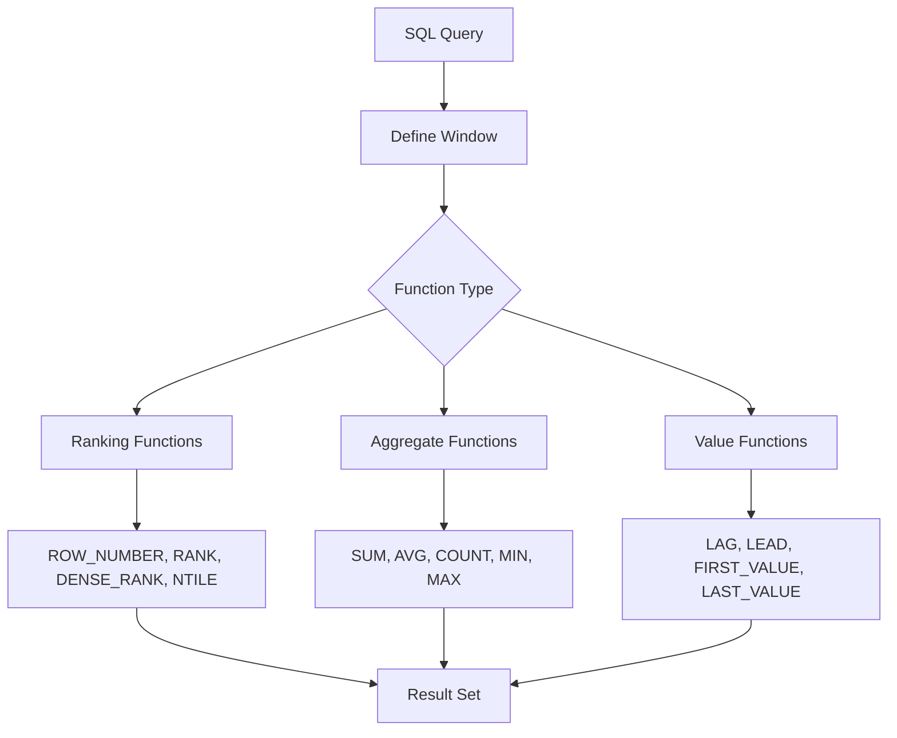

# SQL Window Functions

## Introduction

SQL Window Functions are a powerful feature that allow you to perform calculations across a set of table rows that are somehow related to the current row. Unlike regular aggregate functions which collapse groups of rows into a single value, window functions maintain the separate identity of each row while still performing calculations across a specified "window" of rows.

Think of a window function as opening a window to a set of rows and performing calculations just within that window. This capability enables complex data analysis operations that would otherwise require multiple queries or join operations.

## Why Use Window Functions?

Window functions solve several common analytical problems elegantly:

- Calculating running totals or cumulative sums
- Finding moving averages
- Ranking rows within groups
- Accessing values from preceding or following rows
- Comparing current row values to group statistics

## Basic Syntax

The general syntax for window functions follows this pattern:

```sql
SELECT
    column1,
    column2,
    window_function() OVER (
        [PARTITION BY partition_column]
        [ORDER BY sort_column]
        [frame_clause]
    ) AS alias
FROM table_name;
```

Let's break down these components:

- `window_function()`: The function to apply (e.g., `ROW_NUMBER()`, `SUM()`, `AVG()`)
- `OVER`: Indicates that this is a window function
- `PARTITION BY`: Divides rows into groups (windows) for the function to operate on
- `ORDER BY`: Defines the logical order of rows within each partition
- `frame_clause`: Specifies which rows within the partition to include in the window (e.g., `ROWS BETWEEN 1 PRECEDING AND 1 FOLLOWING`)

## Common Window Functions

### Ranking Functions

#### ROW_NUMBER()

Assigns a unique sequential integer to each row within a partition.

```sql
SELECT 
    product_category,
    product_name,
    price,
    ROW_NUMBER() OVER (PARTITION BY product_category ORDER BY price DESC) AS price_rank
FROM products;
```

**Output:**
```
product_category   product_name   price   price_rank
--------------------------------------------------
Electronics        Laptop         1200    1
Electronics        Smartphone     800     2
Electronics        Headphones     200     3
Clothing           Winter Coat    150     1
Clothing           Jeans          80      2
Clothing           T-shirt        25      3
```

#### RANK() and DENSE_RANK()

These functions assign ranks to rows within a partition. The difference is in how they handle ties:

- `RANK()` leaves gaps in the ranking when there are ties
- `DENSE_RANK()` doesn't leave gaps

```sql
SELECT 
    student_name,
    test_score,
    RANK() OVER (ORDER BY test_score DESC) AS rank,
    DENSE_RANK() OVER (ORDER BY test_score DESC) AS dense_rank
FROM student_scores;
```

**Output:**
```
student_name   test_score   rank   dense_rank
-------------------------------------------
Alice          95           1      1
Bob            95           1      1
Charlie        90           3      2
David          85           4      3
Eve            85           4      3
Frank          80           6      4
```

### Aggregate Window Functions

You can use standard aggregate functions like `SUM()`, `AVG()`, `COUNT()`, `MIN()`, and `MAX()` as window functions.

#### Running Total Example

```sql
SELECT 
    sale_date,
    amount,
    SUM(amount) OVER (ORDER BY sale_date) AS running_total
FROM sales;
```

**Output:**
```
sale_date    amount    running_total
-----------------------------------
2023-01-01   100       100
2023-01-02   150       250
2023-01-03   200       450
2023-01-04   120       570
2023-01-05   180       750
```

#### Group Comparisons

Compare each row to aggregated group values:

```sql
SELECT 
    department,
    employee_name,
    salary,
    AVG(salary) OVER (PARTITION BY department) AS dept_avg_salary,
    salary - AVG(salary) OVER (PARTITION BY department) AS diff_from_avg
FROM employees;
```

**Output:**
```
department    employee_name    salary    dept_avg_salary    diff_from_avg
-------------------------------------------------------------------
Engineering   Alice            85000     80000              5000
Engineering   Bob              75000     80000              -5000
Engineering   Charlie          80000     80000              0
Marketing     David            65000     70000              -5000
Marketing     Eve              75000     70000              5000
Sales         Frank            90000     85000              5000
Sales         Grace            80000     85000              -5000
```

### Value Functions

#### LAG() and LEAD()

These functions access data from previous or following rows without using a self-join.

```sql
SELECT 
    product_name,
    month,
    sales,
    LAG(sales, 1) OVER (PARTITION BY product_name ORDER BY month) AS prev_month_sales,
    sales - LAG(sales, 1) OVER (PARTITION BY product_name ORDER BY month) AS sales_growth
FROM monthly_sales;
```

**Output:**
```
product_name    month      sales    prev_month_sales    sales_growth
-----------------------------------------------------------------
Product A       2023-01    1000     NULL                NULL
Product A       2023-02    1200     1000                200
Product A       2023-03    950      1200                -250
Product B       2023-01    800      NULL                NULL
Product B       2023-02    820      800                 20
Product B       2023-03    880      820                 60
```

#### FIRST_VALUE() and LAST_VALUE()

Return the first or last value in an ordered set of values.

```sql
SELECT 
    department,
    employee_name,
    salary,
    FIRST_VALUE(employee_name) OVER (
        PARTITION BY department 
        ORDER BY salary DESC
    ) AS highest_paid_employee
FROM employees;
```

**Output:**
```
department    employee_name    salary    highest_paid_employee
---------------------------------------------------------
Engineering   Alice            85000     Alice
Engineering   Charlie          80000     Alice
Engineering   Bob              75000     Alice
Marketing     Eve              75000     Eve
Marketing     David            65000     Eve
Sales         Frank            90000     Frank
Sales         Grace            80000     Frank
```

## Window Frame Clause

The frame clause defines exactly which rows are included in the window for each calculation. The syntax is:

```sql
ROWS BETWEEN <start> AND <end>
```

Where `<start>` and `<end>` can be:
- `UNBOUNDED PRECEDING`: All rows before the current row
- `n PRECEDING`: n rows before the current row
- `CURRENT ROW`: The current row
- `n FOLLOWING`: n rows after the current row
- `UNBOUNDED FOLLOWING`: All rows after the current row

### Moving Average Example

Calculate a 3-day moving average of sales:

```sql
SELECT 
    sale_date,
    daily_sales,
    AVG(daily_sales) OVER (
        ORDER BY sale_date
        ROWS BETWEEN 1 PRECEDING AND 1 FOLLOWING
    ) AS moving_avg_3day
FROM daily_sales;
```

**Output:**
```
sale_date    daily_sales    moving_avg_3day
------------------------------------------
2023-01-01   100            125
2023-01-02   150            150
2023-01-03   200            190
2023-01-04   220            190
2023-01-05   150            185
```

## Real-World Examples

### Example 1: Sales Performance Analysis

Identify each month's sales performance and compare it to previous months and department averages:

```sql
SELECT 
    department,
    sales_month,
    sales_amount,
    SUM(sales_amount) OVER (
        PARTITION BY department 
        ORDER BY sales_month
    ) AS cumulative_sales,
    LAG(sales_amount) OVER (
        PARTITION BY department 
        ORDER BY sales_month
    ) AS prev_month_sales,
    sales_amount - LAG(sales_amount) OVER (
        PARTITION BY department 
        ORDER BY sales_month
    ) AS monthly_growth,
    AVG(sales_amount) OVER (
        PARTITION BY department
    ) AS dept_avg_sales,
    RANK() OVER (
        PARTITION BY department 
        ORDER BY sales_amount DESC
    ) AS sales_rank_in_dept
FROM monthly_department_sales;
```

### Example 2: Student Performance Tracking

Analyze student test scores across different subjects and time periods:

```sql
SELECT
    student_name,
    subject,
    test_date,
    score,
    AVG(score) OVER (
        PARTITION BY student_name
    ) AS student_avg_score,
    score - AVG(score) OVER (
        PARTITION BY student_name
    ) AS diff_from_student_avg,
    AVG(score) OVER (
        PARTITION BY subject
    ) AS subject_avg_score,
    RANK() OVER (
        PARTITION BY subject 
        ORDER BY score DESC
    ) AS rank_in_subject,
    LAG(score) OVER (
        PARTITION BY student_name, subject 
        ORDER BY test_date
    ) AS previous_test_score,
    score - LAG(score) OVER (
        PARTITION BY student_name, subject 
        ORDER BY test_date
    ) AS score_improvement
FROM student_test_scores;
```

### Example 3: Website User Activity Analysis

Analyze user engagement and identify patterns:

```sql
SELECT
    user_id,
    activity_date,
    pages_viewed,
    SUM(pages_viewed) OVER (
        PARTITION BY user_id 
        ORDER BY activity_date
    ) AS cumulative_pages,
    AVG(pages_viewed) OVER (
        PARTITION BY user_id 
        ORDER BY activity_date
        ROWS BETWEEN 6 PRECEDING AND CURRENT ROW
    ) AS rolling_7day_avg,
    NTILE(4) OVER (
        ORDER BY SUM(pages_viewed) OVER (
            PARTITION BY user_id
        ) DESC
    ) AS user_activity_quartile
FROM user_activity;
```

## Visual Explanation of Window Functions



## Common Mistakes and How to Avoid Them

1. **Forgetting the `PARTITION BY` clause**: Without partitioning, the window function will apply to the entire result set. Always consider if your calculation should be grouped.

2. **Confusing `ROW_NUMBER()`, `RANK()`, and `DENSE_RANK()`**: Remember that `RANK()` leaves gaps for ties, `DENSE_RANK()` doesn't leave gaps, and `ROW_NUMBER()` always assigns sequential numbers regardless of ties.

3. **Misunderstanding window frames**: By default, frame clauses are different depending on whether you include an `ORDER BY` in your window definition. Be explicit with your frame clause to avoid surprises.

4. **Overlapping calculations**: If you need multiple window functions with different partitioning or ordering, you'll need to define them separately.

## Performance Considerations

Window functions can be resource-intensive, especially on large datasets. Here are some tips:

1. **Be specific with your `PARTITION BY` clauses**: Smaller partitions mean less work per window.

2. **Limit the window size when possible**: Using a frame clause like `ROWS BETWEEN 5 PRECEDING AND CURRENT ROW` is more efficient than processing the entire partition.

3. **Consider adding appropriate indexes**: Indexes on columns used in `PARTITION BY` and `ORDER BY` clauses can improve performance.

4. **Use Common Table Expressions (CTEs)**: Breaking complex window function queries into CTEs can make them more readable and sometimes more efficient.

## Summary

SQL Window Functions are a powerful tool for data analysis that allow you to:

- Perform calculations across related rows without grouping the results
- Create running totals, moving averages, and rankings
- Compare current rows to previous or following rows
- Analyze data within specific partitions or groups

By mastering window functions, you can write more efficient and elegant SQL queries for complex analytical tasks that would otherwise require multiple queries or complex joins.

## Practice Exercises

1. **Basic Ranking**: Write a query that ranks products by price within each category, using both `RANK()` and `DENSE_RANK()`.

2. **Running Totals**: Calculate the running total of sales by date for each salesperson.

3. **Moving Averages**: Calculate a 7-day moving average of daily website visitors.

4. **Percentile Analysis**: Use `NTILE()` to divide customers into quartiles based on their total purchases.

5. **Year-over-Year Comparison**: Compare each month's sales to the same month from the previous year using `LAG()`.

## Additional Resources

- [PostgreSQL Window Functions Documentation](https://www.postgresql.org/docs/current/tutorial-window.html)
- [Microsoft SQL Server Window Functions](https://docs.microsoft.com/en-us/sql/t-sql/queries/select-over-clause-transact-sql)
- [MySQL Window Functions](https://dev.mysql.com/doc/refman/8.0/en/window-functions.html)
- [Advanced SQL Window Functions for Analytics](https://mode.com/sql-tutorial/sql-window-functions/)
- [Practical SQL: A Beginner's Guide to Storytelling with Data](https://www.amazon.com/Practical-SQL-Beginners-Guide-Storytelling/dp/1593278276)