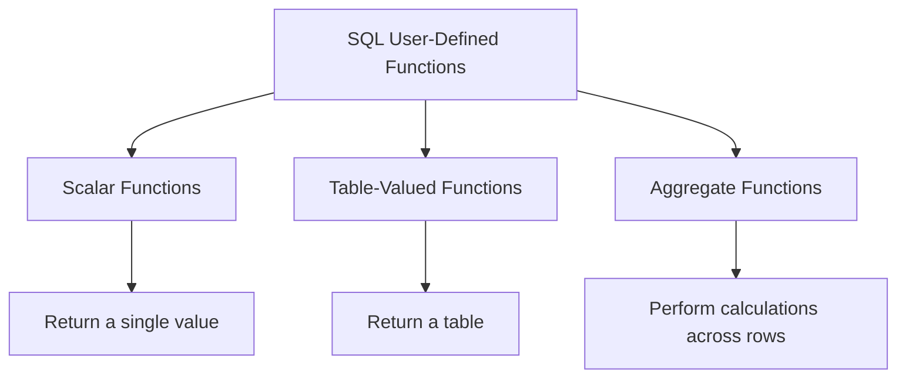

# SQL User-Defined Functions

## Introduction

SQL User-Defined Functions (UDFs) are custom functions created by users to encapsulate complex logic and calculations that can be reused across multiple queries. They act as extensions to the built-in SQL functions, allowing you to create specialized functionality tailored to your specific requirements.

Unlike built-in functions like `SUM()`, `COUNT()`, or `UPPER()` that come pre-installed with your database system, user-defined functions let you write your own logic once and then call it whenever needed, just like you would with any other function.

## Why Use User-Defined Functions?

User-defined functions offer several advantages:

- **Code Reusability**: Write logic once and reuse it across multiple queries
- **Improved Readability**: Complex calculations can be abstracted into simple function calls
- **Easier Maintenance**: Modify the function in one place instead of updating multiple queries
- **Encapsulation**: Hide complex implementation details behind a simple interface
- **Consistency**: Ensure the same logic is applied consistently throughout your database

## Types of User-Defined Functions

In SQL, there are primarily three types of user-defined functions:



### 1. Scalar Functions

Scalar functions return a single value based on the input parameters. They're similar to built-in functions like `UPPER()` or `ABS()`.

### 2. Table-Valued Functions

Table-valued functions return a table as their output rather than a single value. There are two subtypes:
- **Inline Table-Valued Functions**: Return a table based on a single SELECT statement
- **Multi-Statement Table-Valued Functions**: Can contain multiple statements and return a table variable

### 3. Aggregate Functions

Aggregate functions operate on multiple rows and return a single summarized value, similar to built-in functions like `SUM()` or `AVG()`.

## Creating a Scalar Function

Let's start with a simple scalar function example. The basic syntax for creating a scalar function is:

```sql
CREATE FUNCTION function_name (parameter1 datatype, parameter2 datatype, ...)
RETURNS return_datatype
AS
BEGIN
    -- Function body
    RETURN value
END
```

### Example: Calculate Age

Here's a function that calculates a person's age based on their birth date:

```sql
CREATE FUNCTION CalculateAge (@BirthDate DATE)
RETURNS INT
AS
BEGIN
    DECLARE @Age INT
    SET @Age = DATEDIFF(YEAR, @BirthDate, GETDATE()) - 
               CASE 
                  WHEN (MONTH(@BirthDate) > MONTH(GETDATE())) OR 
                       (MONTH(@BirthDate) = MONTH(GETDATE()) AND DAY(@BirthDate) > DAY(GETDATE()))
                  THEN 1
                  ELSE 0
               END
    RETURN @Age
END
```

#### How to Use It:

```sql
SELECT 
    FirstName,
    LastName,
    BirthDate,
    dbo.CalculateAge(BirthDate) AS Age
FROM 
    Employees
```

#### Sample Output:

| FirstName | LastName | BirthDate  | Age |
|-----------|----------|------------|-----|
| John      | Doe      | 1985-05-15 | 38  |
| Jane      | Smith    | 1990-11-20 | 33  |
| Mark      | Johnson  | 1978-02-28 | 45  |

## Creating a Table-Valued Function

Table-valued functions return an entire table instead of a single value. Here's the basic syntax:

### Inline Table-Valued Function

```sql
CREATE FUNCTION function_name (parameter1 datatype, parameter2 datatype, ...)
RETURNS TABLE
AS
RETURN
    (SELECT statement)
```

### Example: Get Employees By Department

```sql
CREATE FUNCTION GetEmployeesByDepartment (@DepartmentID INT)
RETURNS TABLE
AS
RETURN
(
    SELECT 
        EmployeeID,
        FirstName,
        LastName,
        Email,
        HireDate
    FROM 
        Employees
    WHERE 
        DepartmentID = @DepartmentID
)
```

#### How to Use It:

```sql
SELECT * FROM dbo.GetEmployeesByDepartment(3)
```

#### Sample Output:

| EmployeeID | FirstName | LastName | Email               | HireDate   |
|------------|-----------|----------|---------------------|------------|
| 8          | Sarah     | Wilson   | swilson@example.com | 2020-03-15 |
| 12         | Robert    | Brown    | rbrown@example.com  | 2021-07-10 |
| 15         | Lisa      | Taylor   | ltaylor@example.com | 2019-11-22 |

### Multi-Statement Table-Valued Function

For more complex scenarios, you might need a multi-statement table-valued function:

```sql
CREATE FUNCTION function_name (parameter1 datatype, parameter2 datatype, ...)
RETURNS @ResultTable TABLE
(
    column1 datatype,
    column2 datatype,
    ...
)
AS
BEGIN
    -- Insert data into @ResultTable
    INSERT INTO @ResultTable (column1, column2, ...)
    SELECT ...
    
    -- Additional operations
    
    RETURN
END
```

### Example: Get Sales Report

```sql
CREATE FUNCTION GetSalesReport (@StartDate DATE, @EndDate DATE)
RETURNS @SalesReport TABLE
(
    ProductID INT,
    ProductName VARCHAR(100),
    TotalQuantity INT,
    TotalRevenue DECIMAL(18,2),
    AveragePrice DECIMAL(18,2)
)
AS
BEGIN
    INSERT INTO @SalesReport
    SELECT 
        p.ProductID,
        p.ProductName,
        SUM(s.Quantity) AS TotalQuantity,
        SUM(s.Quantity * s.UnitPrice) AS TotalRevenue,
        AVG(s.UnitPrice) AS AveragePrice
    FROM 
        Sales s
    JOIN 
        Products p ON s.ProductID = p.ProductID
    WHERE 
        s.SaleDate BETWEEN @StartDate AND @EndDate
    GROUP BY 
        p.ProductID, p.ProductName
    
    RETURN
END
```

#### How to Use It:

```sql
SELECT * FROM dbo.GetSalesReport('2023-01-01', '2023-12-31')
```

#### Sample Output:

| ProductID | ProductName     | TotalQuantity | TotalRevenue | AveragePrice |
|-----------|-----------------|---------------|--------------|--------------|
| 101       | Laptop Pro      | 145           | 217500.00    | 1500.00      |
| 102       | Smartphone X    | 320           | 192000.00    | 600.00       |
| 103       | Wireless Earbuds| 580           | 58000.00     | 100.00       |

## Creating an Aggregate Function

Aggregate functions perform calculations on multiple rows and return a single result. While less common than scalar or table-valued functions, they can be useful for specialized calculations.

The syntax varies by database system, but here's a simplified example in SQL Server:

```sql
CREATE FUNCTION Median (@Value DECIMAL(18,2))
RETURNS DECIMAL(18,2)
AS
EXTERNAL NAME Assembly.ClassName.MethodName
```

Note: Creating aggregate functions often requires additional programming beyond standard SQL, such as CLR integration in SQL Server.

## Practical Applications of User-Defined Functions

### 1. Data Validation and Transformation

```sql
CREATE FUNCTION FormatPhoneNumber (@Phone VARCHAR(20))
RETURNS VARCHAR(20)
AS
BEGIN
    DECLARE @Formatted VARCHAR(20)
    
    -- Remove non-numeric characters
    SET @Phone = REPLACE(REPLACE(REPLACE(REPLACE(REPLACE(
                  @Phone, '(', ''), ')', ''), '-', ''), ' ', ''), '.', '')
    
    -- Format as (XXX) XXX-XXXX
    IF LEN(@Phone) = 10
        SET @Formatted = '(' + SUBSTRING(@Phone, 1, 3) + ') ' + 
                         SUBSTRING(@Phone, 4, 3) + '-' + 
                         SUBSTRING(@Phone, 7, 4)
    ELSE
        SET @Formatted = @Phone
    
    RETURN @Formatted
END
```

### 2. Business Logic Implementation

```sql
CREATE FUNCTION CalculateDiscount (@CustomerID INT, @OrderTotal DECIMAL(18,2))
RETURNS DECIMAL(18,2)
AS
BEGIN
    DECLARE @Discount DECIMAL(18,2) = 0
    DECLARE @CustomerType VARCHAR(20)
    DECLARE @YearsAsMember INT
    
    -- Get customer information
    SELECT 
        @CustomerType = CustomerType,
        @YearsAsMember = DATEDIFF(YEAR, JoinDate, GETDATE())
    FROM 
        Customers
    WHERE 
        CustomerID = @CustomerID
    
    -- Apply discount based on customer type and loyalty
    IF @CustomerType = 'Premium'
        SET @Discount = @OrderTotal * 0.10
    ELSE IF @CustomerType = 'Standard' AND @YearsAsMember > 2
        SET @Discount = @OrderTotal * 0.05
    
    -- Additional discount for large orders
    IF @OrderTotal > 1000
        SET @Discount = @Discount + (@OrderTotal * 0.03)
    
    RETURN @Discount
END
```

### 3. Reporting and Analytics

```sql
CREATE FUNCTION GetRevenueGrowth (@PreviousPeriod DECIMAL(18,2), @CurrentPeriod DECIMAL(18,2))
RETURNS DECIMAL(18,2)
AS
BEGIN
    DECLARE @Growth DECIMAL(18,2)
    
    IF @PreviousPeriod = 0
        SET @Growth = 100 -- Handle division by zero
    ELSE
        SET @Growth = ((@CurrentPeriod - @PreviousPeriod) / @PreviousPeriod) * 100
    
    RETURN @Growth
END
```

## Best Practices for User-Defined Functions

1. **Keep Functions Simple**: Focus on a single purpose for each function
2. **Optimize Performance**: Be mindful of how functions affect query performance
3. **Use Appropriate Return Types**: Choose the right data type for your function's output
4. **Handle Edge Cases**: Include error handling and edge case management
5. **Document Your Functions**: Add comments explaining the purpose and usage
6. **Test Thoroughly**: Verify function behavior with various inputs
7. **Consider Indexing**: Be aware that functions in WHERE clauses may prevent index usage
8. **Schema Binding**: Use `WITH SCHEMABINDING` to prevent changes to underlying objects

## Common Pitfalls to Avoid

1. **Overusing Functions**: Not every piece of logic needs to be a function
2. **Performance Issues**: Functions in WHERE clauses can cause full table scans
3. **Excessive Complexity**: Avoid overly complex logic that's hard to maintain
4. **Recursive Functions**: Use recursion carefully as it can lead to performance problems
5. **Side Effects**: Avoid functions that modify data outside their scope

## Database System Differences

User-defined functions have some variations across different database systems:

| Database System | Key Differences                                                     |
|-----------------|---------------------------------------------------------------------|
| SQL Server      | Supports scalar, table-valued, and aggregate functions              |
| MySQL           | Uses a slightly different syntax with `DELIMITER` statements        |
| PostgreSQL      | Can use multiple programming languages (SQL, PL/pgSQL, Python, etc.)|
| Oracle          | Uses PL/SQL blocks for function creation                            |
| SQLite          | Limited UDF support, requires C programming for complex functions   |

## Modifying and Dropping Functions

### Altering a Function

```sql
ALTER FUNCTION CalculateAge (@BirthDate DATE)
RETURNS INT
AS
BEGIN
    -- Updated implementation
    RETURN DATEDIFF(YEAR, @BirthDate, GETDATE())
END
```

### Dropping a Function

```sql
DROP FUNCTION CalculateAge
```

## Summary

User-defined functions in SQL provide a powerful way to encapsulate logic, improve code reusability, and enhance your database capabilities. By creating your own custom functions, you can:

- Simplify complex queries
- Ensure consistency across your database
- Improve code maintainability
- Implement business rules more effectively
- Create a more modular database design

Whether you're working with scalar functions for simple calculations, table-valued functions for complex data retrieval, or aggregate functions for customized summaries, UDFs offer flexibility that goes beyond the built-in functions provided by SQL.

## Practice Exercises

1. Create a scalar function that converts temperatures from Celsius to Fahrenheit
2. Develop a table-valued function that returns products with inventory below a specified threshold
3. Write a function to calculate the total price of an order including applicable taxes and discounts
4. Create a function that generates a random password of a specified length
5. Implement a function to calculate the day of the week (Monday, Tuesday, etc.) from a given date

## Additional Resources

- [SQL Server Functions Documentation](https://docs.microsoft.com/en-us/sql/t-sql/statements/create-function-transact-sql)
- [MySQL User-Defined Functions](https://dev.mysql.com/doc/refman/8.0/en/create-procedure.html)
- [PostgreSQL User-Defined Functions](https://www.postgresql.org/docs/current/sql-createfunction.html)
- [Oracle PL/SQL Functions](https://docs.oracle.com/en/database/oracle/oracle-database/19/lnpls/CREATE-FUNCTION-statement.html)

Remember that practice is key to mastering user-defined functions. Start with simple examples and gradually work your way up to more complex scenarios as you become more comfortable with the syntax and capabilities.