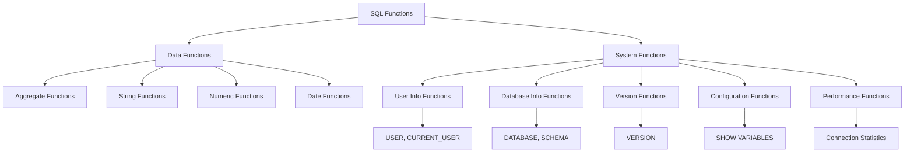

# SQL System Functions

## Introduction

SQL System Functions are built-in functions that provide information about the database system itself, rather than operating on data within your tables. These functions help database administrators and developers retrieve valuable metadata about the database environment, sessions, users, and system configuration.

Unlike regular SQL functions that process data from tables, system functions give you insights into the database engine's state, user sessions, configuration parameters, and more. They serve as essential tools for database maintenance, monitoring, and troubleshooting.

## Common SQL System Functions

Let's explore some of the most frequently used SQL system functions across different database management systems (DBMS).

### User and Session Information Functions

These functions provide information about the current user and session:

```sql
-- Current user functions
SELECT USER;         -- Returns the current user name
SELECT CURRENT_USER; -- Returns the authenticated user name
SELECT SESSION_USER; -- Returns the session user name

-- Example output:
-- USER: john_doe
-- CURRENT_USER: john_doe
-- SESSION_USER: john_doe
```

The differences between these functions can be subtle and vary by database system, but generally:
- `USER` returns the user currently executing the statement
- `CURRENT_USER` returns the authenticated user name (which may differ due to role settings)
- `SESSION_USER` returns the user who established the session

### Database Information Functions

These functions return information about the current database:

```sql
-- Database information
SELECT DATABASE();      -- MySQL/PostgreSQL: Returns current database name
SELECT DB_NAME();       -- SQL Server: Returns current database name
SELECT CURRENT_SCHEMA;  -- PostgreSQL: Returns current schema

-- Example output:
-- DATABASE(): my_company_db
-- DB_NAME(): my_company_db
-- CURRENT_SCHEMA: public
```

### Version Information

Each database system provides functions to retrieve version information:

```sql
-- Version information
SELECT VERSION();           -- MySQL/PostgreSQL: Database version
SELECT @@VERSION;           -- SQL Server: SQL Server version

-- Example output for MySQL:
-- VERSION(): 8.0.32

-- Example output for SQL Server:
-- @@VERSION: Microsoft SQL Server 2019 (RTM) - 15.0.2000.5 (X64)
```

### Date and Time System Functions

These functions return the current date and time according to the database server:

```sql
-- Current date/time functions
SELECT CURRENT_DATE;     -- Returns current date
SELECT CURRENT_TIME;     -- Returns current time
SELECT CURRENT_TIMESTAMP; -- Returns current date and time

-- Example output:
-- CURRENT_DATE: 2025-03-03
-- CURRENT_TIME: 14:30:25
-- CURRENT_TIMESTAMP: 2025-03-03 14:30:25
```

## System Diagnostic Functions

These functions help diagnose performance issues and monitor database activity.

### Connection Information

```sql
-- MySQL connection ID
SELECT CONNECTION_ID();  -- Returns the connection ID for the current connection

-- Example output:
-- CONNECTION_ID(): 145
```

### Server Status

```sql
-- MySQL: Server uptime and statistics
SELECT VARIABLE_NAME, VARIABLE_VALUE 
FROM performance_schema.global_status 
WHERE VARIABLE_NAME IN ('UPTIME', 'QUESTIONS', 'THREADS_CONNECTED')
LIMIT 3;

-- Example output:
-- VARIABLE_NAME      VARIABLE_VALUE
-- UPTIME             1234567
-- QUESTIONS          789012
-- THREADS_CONNECTED  42
```

## Practical Examples

Let's explore some practical applications of SQL system functions in real-world scenarios.

### Example 1: Logging User Activity

When building an audit trail for database changes, system functions can automatically capture who made changes and when:

```sql
-- Creating a table with audit columns
CREATE TABLE customer_orders (
    order_id INT PRIMARY KEY,
    customer_id INT,
    order_amount DECIMAL(10,2),
    created_by VARCHAR(50) DEFAULT CURRENT_USER,
    created_at TIMESTAMP DEFAULT CURRENT_TIMESTAMP
);

-- Inserting data (audit columns filled automatically)
INSERT INTO customer_orders (order_id, customer_id, order_amount)
VALUES (1001, 5002, 299.99);

-- Example result when querying:
-- order_id  customer_id  order_amount  created_by  created_at
-- 1001      5002         299.99        john_doe    2025-03-03 14:35:22
```

### Example 2: Database Information Dashboard

System administrators often need to build monitoring dashboards. Here's how system functions can help:

```sql
-- MySQL dashboard query
SELECT 
    USER() AS current_user,
    DATABASE() AS current_database,
    VERSION() AS database_version,
    CURRENT_TIMESTAMP AS server_time;

-- Example output:
-- current_user  current_database  database_version        server_time
-- john@localhost  inventory_db     8.0.32-MySQL Community  2025-03-03 14:37:45
```

### Example 3: Dynamic SQL with System Functions

System functions can make your SQL scripts more dynamic and environment-aware:

```sql
-- Creating a backup table with timestamped name
SET @backup_table = CONCAT('customers_backup_', 
                          DATE_FORMAT(CURRENT_DATE, '%Y%m%d'));

SET @sql = CONCAT('CREATE TABLE ', @backup_table, 
                 ' AS SELECT * FROM customers');

-- In MySQL you would execute with:
PREPARE stmt FROM @sql;
EXECUTE stmt;
DEALLOCATE PREPARE stmt;

-- This would create a table named something like:
-- customers_backup_20250303
```

## Database-Specific System Functions

Different database systems offer specialized system functions for their environments.

### MySQL System Functions

```sql
-- Show all system variables
SHOW VARIABLES;

-- Show specific system variable
SELECT @@max_connections;

-- Example output:
-- @@max_connections: 151
```

### SQL Server System Functions

```sql
-- SQL Server instance information
SELECT SERVERPROPERTY('ProductVersion') AS Version,
       SERVERPROPERTY('Edition') AS Edition,
       SERVERPROPERTY('ProductLevel') AS ServicePack;

-- Example output:
-- Version             Edition                       ServicePack
-- 15.0.2000.5         Developer Edition (64-bit)    RTM
```

### PostgreSQL System Functions

```sql
-- PostgreSQL system information
SELECT current_database(), current_schemas(true), inet_server_addr(), 
       inet_server_port(), pg_backend_pid();

-- Example output:
-- current_database  current_schemas       inet_server_addr  inet_server_port  pg_backend_pid
-- mydb              {public,pg_catalog}   127.0.0.1         5432              12345
```

## System Function Diagrams

Here's a diagram showing how system functions fit into the SQL ecosystem:



## Summary

SQL System Functions are powerful tools that provide essential information about your database environment. Key points to remember:

1. System functions retrieve metadata about the database system itself
2. They help with monitoring, troubleshooting, and auditing database operations
3. Each database management system has its own set of system functions
4. Common categories include user information, database information, and version information
5. System functions can be combined with regular SQL queries to build powerful administrative tools

By mastering SQL system functions, you'll gain deeper insights into your database environment and build more robust applications that can adapt to different database contexts.

## Additional Resources

- [MySQL System Function Reference](https://dev.mysql.com/doc/refman/8.0/en/information-functions.html)
- [PostgreSQL System Information Functions](https://www.postgresql.org/docs/current/functions-info.html)
- [SQL Server System Functions](https://learn.microsoft.com/en-us/sql/t-sql/functions/system-functions-transact-sql)

## Exercises

1. Write a query that displays your username, current database, and the server's version.
2. Create a table that automatically records the creation timestamp and user for each new record.
3. Write a query that shows the current date and time in your database server's timezone.
4. Research and list three system functions specific to your database system (MySQL, PostgreSQL, SQL Server, etc.) that weren't covered in this guide.
5. Create a monitoring query that shows how many connections are currently active in your database.