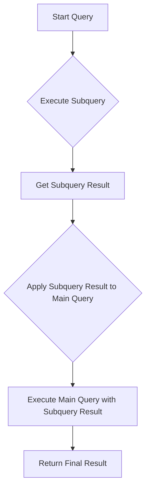

# SQL Subqueries Basics

## Introduction

In SQL, a subquery (also known as a nested query or inner query) is a query that is nested within another query. Think of it as a query within a query - the inner query executes first and its results are used by the outer query to complete its execution. Subqueries provide a powerful way to handle complex database operations that would otherwise require multiple separate queries or complex joins.

In this tutorial, we'll explore the basics of SQL subqueries, how they work, when to use them, and examine practical examples to help solidify your understanding.

## What is a Subquery?

A subquery is a SELECT statement that is embedded within another SQL statement (which could be a SELECT, INSERT, UPDATE, or DELETE). The subquery is executed first, and its result is used in the execution of the outer query.

Let's take a look at the basic syntax:

```sql
SELECT column_name(s)
FROM table_name
WHERE column_name operator (SELECT column_name FROM table_name WHERE condition);
```

In this structure:
- The query inside the parentheses is the subquery (inner query)
- The query containing the subquery is the main query (outer query)

## Types of Subqueries

Subqueries can be categorized based on their relationship with the outer query:

1. **Independent Subqueries**: Also called non-correlated subqueries, these can be executed independently of the outer query.
2. **Correlated Subqueries**: These reference columns from the outer query and are executed once for each row processed by the outer query.

They can also be categorized based on the result they return:

1. **Single-value Subqueries**: Return exactly one value
2. **Multiple-value Subqueries**: Return multiple values (usually used with IN, ANY, ALL operators)
3. **Table Subqueries**: Return a result set that acts like a table

## Basic Subquery Examples

### Example 1: Single-value Subquery

Let's start with a simple example using a database with two tables: `employees` and `departments`.

```sql
-- Find employees who earn more than the average salary
SELECT employee_id, first_name, last_name, salary
FROM employees
WHERE salary > (SELECT AVG(salary) FROM employees);
```

**Input**: The query is executed on a table with employee data.

**Output**:
```
employee_id | first_name | last_name | salary
------------|------------|-----------|-------
103         | Alexander  | Hunold    | 9000
104         | Bruce      | Ernst     | 6000
145         | John       | Russell   | 14000
146         | Karen      | Partners  | 13500
...
```

In this example:
1. The subquery `(SELECT AVG(salary) FROM employees)` calculates the average salary.
2. The outer query then selects employees whose salary is greater than this average.

### Example 2: Multiple-value Subquery

```sql
-- Find all employees who work in the IT department
SELECT employee_id, first_name, last_name
FROM employees
WHERE department_id IN (SELECT department_id FROM departments WHERE department_name = 'IT');
```

**Input**: The query is executed against employees and departments tables.

**Output**:
```
employee_id | first_name | last_name
------------|------------|----------
103         | Alexander  | Hunold
104         | Bruce      | Ernst
105         | David      | Austin
106         | Valli      | Pataballa
107         | Diana      | Lorentz
```

Here, the subquery returns the department_id for the IT department, and the outer query finds all employees in that department.

## Subqueries in Different Clauses

Subqueries can be used in various parts of an SQL statement:

### In the SELECT Clause

```sql
-- Display each employee's name and the difference from the average salary
SELECT first_name, 
       last_name, 
       salary,
       salary - (SELECT AVG(salary) FROM employees) AS difference_from_avg
FROM employees
ORDER BY difference_from_avg DESC;
```

**Output**:
```
first_name | last_name | salary | difference_from_avg
-----------|-----------|--------|--------------------
Steven     | King      | 24000  | 17600
Neena      | Kochhar   | 17000  | 10600
Lex        | De Haan   | 17000  | 10600
...
```

### In the FROM Clause

When used in the FROM clause, the subquery creates a derived table:

```sql
-- Calculate the average salary by department using a derived table
SELECT d.department_name,
       AVG(e.salary) as avg_salary
FROM employees e
JOIN (SELECT department_id, department_name 
      FROM departments 
      WHERE location_id = 1700) d
ON e.department_id = d.department_id
GROUP BY d.department_name;
```

**Output**:
```
department_name | avg_salary
----------------|------------
Executive       | 19333.33
IT              | 5760.00
Marketing       | 9500.00
Purchasing      | 4150.00
```

### In the WHERE Clause

```sql
-- Find employees who earn the highest salary in their department
SELECT e.first_name, e.last_name, e.department_id, e.salary
FROM employees e
WHERE e.salary = (SELECT MAX(salary) 
                 FROM employees 
                 WHERE department_id = e.department_id);
```

**Output**:
```
first_name | last_name | department_id | salary
-----------|-----------|---------------|-------
Steven     | King      | 90            | 24000
Neena      | Kochhar   | 90            | 17000
Lex        | De Haan   | 90            | 17000
Alexander  | Hunold    | 60            | 9000
...
```

This is a correlated subquery because the inner query references the outer query (through `e.department_id`).

## Practical Applications of Subqueries

### Finding Outliers

```sql
-- Find employees who earn more than twice the average salary
SELECT first_name, last_name, salary
FROM employees
WHERE salary > 2 * (SELECT AVG(salary) FROM employees);
```

### Data Manipulation

```sql
-- Give a 10% raise to employees who haven't received a raise in the last year
UPDATE employees
SET salary = salary * 1.1
WHERE employee_id IN (
    SELECT employee_id
    FROM job_history
    WHERE end_date < DATE_SUB(CURRENT_DATE, INTERVAL 1 YEAR)
);
```

### Complex Filtering

```sql
-- Find departments that have more than 5 employees
SELECT department_id, department_name
FROM departments
WHERE department_id IN (
    SELECT department_id
    FROM employees
    GROUP BY department_id
    HAVING COUNT(*) > 5
);
```

## Best Practices for Subqueries

1. **Keep it Simple**: When possible, use joins instead of subqueries for better performance, especially for simple operations.

2. **Avoid Correlated Subqueries When Possible**: Correlated subqueries execute once for each row in the outer query, which can be inefficient for large datasets.

3. **Use Meaningful Aliases**: This improves readability, especially for complex queries.

4. **Test Performance**: Compare the performance of subqueries versus joins for your specific use case.

5. **Limit Nesting Depth**: Excessively nested subqueries can make SQL difficult to read and debug.

## Common Subquery Operators

- **IN**: Checks if a value matches any value in a list or subquery
- **EXISTS**: Tests for the existence of any rows in the subquery
- **ANY/SOME**: Returns TRUE if any of the subquery values meet the condition
- **ALL**: Returns TRUE if all of the subquery values meet the condition

### Example with EXISTS

```sql
-- Find departments that have at least one employee
SELECT department_name
FROM departments d
WHERE EXISTS (
    SELECT 1
    FROM employees e
    WHERE e.department_id = d.department_id
);
```

## Visualizing Subquery Execution

The following diagram illustrates how a basic subquery executes:



## Summary

Subqueries are a powerful feature in SQL that allow you to:

- Write complex queries that would otherwise require multiple steps
- Filter data based on aggregate calculations
- Create dynamic queries that adapt to the data
- Perform operations that would be difficult or impossible with simple joins

By mastering subqueries, you'll significantly enhance your SQL toolkit and be able to solve more complex data problems efficiently.


## Exercises

1. Write a query to find employees who earn more than the average salary in their department.
2. Write a query to find the department with the highest average salary.
3. Write a query to find employees who have changed jobs at least once (hint: use the job_history table).
4. Write a query to find departments that have no employees.
5. Write a query to find the employee(s) with the highest salary in the company.