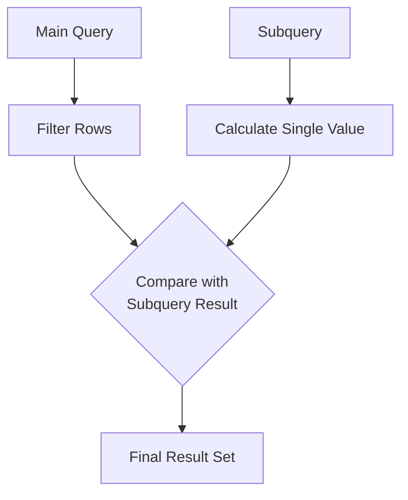

# SQL Single Row Subqueries

## Introduction

In SQL, a subquery is a query nested inside another query. A **single row subquery** is a specific type of subquery that returns exactly one row of results. These powerful tools allow you to use the result from one query as input for another query, enabling more complex and dynamic database operations.

Single row subqueries are particularly useful when you need to compare values or filter data based on calculations that need to be determined at runtime. They can appear in various parts of a SQL statement, including the SELECT, WHERE, HAVING, and FROM clauses.

## Basic Syntax

A single row subquery follows this general pattern:

```sql
SELECT column1, column2, ...
FROM table_name
WHERE column_name comparison_operator (SELECT column_name FROM table_name WHERE condition);
```

The key characteristics of a single row subquery:
- It is enclosed in parentheses
- It must return exactly one row and one column
- It is used with single row comparison operators `(=, >, <, >=, <=, <>)`

## Single Row Subqueries in the WHERE Clause

One of the most common uses for single row subqueries is in the WHERE clause to filter results based on a calculated value.

### Example 1: Finding Employees with Salary Above Average

Let's say we have an `employees` table and want to find all employees who earn more than the average salary:

```sql
SELECT employee_id, first_name, last_name, salary
FROM employees
WHERE salary > (SELECT AVG(salary) FROM employees);
```

**Input**: The employees table with salary data
**Output**: 
```
employee_id | first_name | last_name | salary
------------|------------|-----------|-------
101         | John       | Smith     | 75000
103         | Sarah      | Johnson   | 82000
105         | Michael    | Williams  | 78000
```

In this example:
1. The subquery `(SELECT AVG(salary) FROM employees)` calculates the average salary across all employees
2. The main query then returns only those employees whose salary is greater than this average value

### Example 2: Finding the Most Recent Order

If we have an `orders` table and want to find details about the most recent order:

```sql
SELECT order_id, customer_id, order_date, total_amount
FROM orders
WHERE order_date = (SELECT MAX(order_date) FROM orders);
```

**Input**: The orders table with various order dates
**Output**: 
```
order_id | customer_id | order_date  | total_amount
---------|-------------|-------------|-------------
10089    | 456         | 2023-09-15  | 234.50
```

The subquery finds the maximum (most recent) order date, and the main query filters for only the orders that occurred on that date.

## Single Row Subqueries in the SELECT Clause

You can also use single row subqueries in the SELECT clause to calculate values as part of your result set.

### Example 3: Comparing Individual Sales to Average

```sql
SELECT 
    sales_rep_id,
    sales_rep_name,
    monthly_sales,
    (SELECT AVG(monthly_sales) FROM sales_representatives) AS average_sales,
    monthly_sales - (SELECT AVG(monthly_sales) FROM sales_representatives) AS difference_from_average
FROM 
    sales_representatives;
```

**Input**: The sales_representatives table with monthly sales figures
**Output**: 
```
sales_rep_id | sales_rep_name | monthly_sales | average_sales | difference_from_average
-------------|----------------|---------------|---------------|-----------------------
1            | Amy Johnson     | 45000         | 37500         | 7500
2            | Mark Williams   | 32000         | 37500         | -5500
3            | Sarah Davis     | 38500         | 37500         | 1000
4            | James Brown     | 34500         | 37500         | -3000
```

This query:
1. Retrieves each sales representative's ID, name, and monthly sales
2. Calculates the average monthly sales across all representatives using a subquery
3. Calculates how much each representative deviates from the average

## Using Single Row Subqueries with Functions

Subqueries often work well with SQL functions to perform more complex calculations.

### Example 4: Finding Employees with the Longest Tenure

```sql
SELECT employee_id, first_name, last_name, hire_date
FROM employees
WHERE hire_date = (SELECT MIN(hire_date) FROM employees);
```

**Input**: The employees table with hire dates
**Output**: 
```
employee_id | first_name | last_name | hire_date
------------|------------|-----------|----------
105         | Robert     | Chen      | 2010-03-15
```

This query uses the MIN function in the subquery to find the earliest hire date, then returns the employee(s) who started on that date.

## Using Single Row Subqueries with HAVING Clause

The HAVING clause filters grouped results, and can use subqueries just like the WHERE clause.

### Example 5: Finding Departments with Above-Average Headcount

```sql
SELECT 
    department_id, 
    department_name, 
    COUNT(*) AS employee_count
FROM 
    employees
GROUP BY 
    department_id, department_name
HAVING 
    COUNT(*) > (SELECT AVG(dept_count) FROM (
        SELECT department_id, COUNT(*) AS dept_count 
        FROM employees 
        GROUP BY department_id
    ) AS dept_counts);
```

**Input**: The employees table with department information
**Output**: 
```
department_id | department_name | employee_count
--------------|-----------------|---------------
3             | Engineering     | 42
5             | Sales           | 38
```

This more complex example:
1. Groups employees by department and counts them
2. Uses a nested subquery to calculate the average department size
3. Returns only departments with above-average employee counts

## Common Errors with Single Row Subqueries

When working with single row subqueries, be aware of these common errors:

### 1. Multiple Row Error

If you use a single row operator `(like =, >, <)` but your subquery returns multiple rows, you'll get an error:

```sql
-- This will cause an error if multiple employees have the same last_name
SELECT employee_id, first_name, salary
FROM employees
WHERE last_name = (SELECT last_name FROM employees WHERE salary > 80000);
```

To fix this, either ensure your subquery returns only one row, or use a multiple row operator like IN.

### 2. No Rows Error

If your subquery returns no rows, the comparison will be made with NULL, which might give unexpected results:

```sql
-- If no employees have a salary over 200000, this returns no results
SELECT employee_id, first_name, last_name
FROM employees
WHERE department_id = (SELECT department_id FROM employees WHERE salary > 200000);
```

## Real-World Applications

### Finding Products that Exceed Category Average Price

In an e-commerce database:

```sql
SELECT 
    product_id,
    product_name,
    price,
    category_id
FROM 
    products p
WHERE 
    price > (SELECT AVG(price) FROM products WHERE category_id = p.category_id);
```

This query finds premium products in each category by comparing each product's price to the average price for its specific category.

### Identifying Customers Who Placed Orders Larger Than Their Average

```sql
SELECT 
    o.order_id,
    o.customer_id,
    c.customer_name,
    o.total_amount
FROM 
    orders o
JOIN 
    customers c ON o.customer_id = c.customer_id
WHERE 
    o.total_amount > (
        SELECT AVG(total_amount) 
        FROM orders 
        WHERE customer_id = o.customer_id
    );
```

This query identifies orders where customers spent more than their personal average, which could be useful for identifying potential upselling opportunities.

## Visualizing Single Row Subqueries

Here's a visualization of how a single row subquery works in a WHERE clause:



## Summary

Single row subqueries are a powerful SQL feature that allows you to:
- Use the result of one query as a filter or calculation in another query
- Create more dynamic and flexible SQL statements
- Solve complex data problems with cleaner, more maintainable code

Key points to remember:
- Single row subqueries must return exactly one row and one column
- They work with comparison operators like `=, >, <, >=, <=, <>`
- They can be used in SELECT, WHERE, HAVING clauses, and more
- Care must be taken to ensure they always return a single row

## Additional Resources

To further your understanding of SQL subqueries:

1. [SQL W3Schools Subquery Tutorial](https://www.w3schools.com/sql/sql_subqueries.asp)
2. [PostgreSQL Subquery Documentation](https://www.postgresql.org/docs/current/functions-subquery.html)
3. [MySQL Subquery Documentation](https://dev.mysql.com/doc/refman/8.0/en/subqueries.html)

## Exercises

To practice your skills with single row subqueries, try these exercises:

1. Write a query to find employees who earn more than their department's average salary.
2. Find the product with the highest price in each category.
3. Identify customers who placed an order more recently than the average customer's most recent order.
4. Find orders with a total amount greater than the average order amount for their respective month.
5. Write a query to identify departments that have a higher employee count than the department with the lowest average salary.