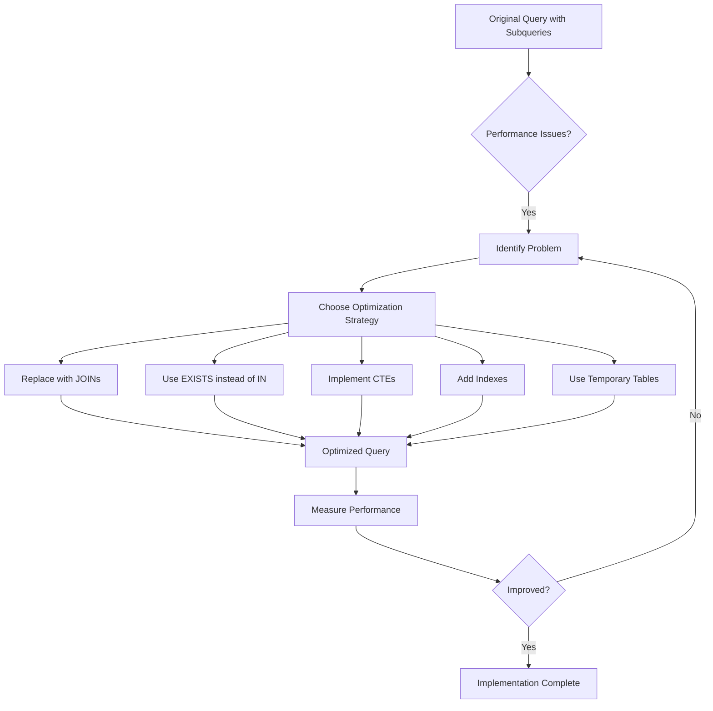

# SQL Subquery Optimization

## Introduction

Subqueries are powerful SQL features that allow you to nest one query within another. While they enable complex data operations, they can sometimes lead to performance issues if not properly optimized. This guide will explore techniques to make your subqueries run faster and more efficiently, which is especially important as your databases grow larger.

## Why Optimize Subqueries?

Subqueries, when not optimized, can significantly slow down your queries for several reasons:

1. Each subquery might execute once for every row in the outer query
2. Inefficient subqueries can cause excessive memory usage
3. Complex nested subqueries can create execution bottlenecks

Let's learn how to identify these issues and fix them!

## Common Subquery Performance Issues

### Issue 1: Correlated Subqueries

A correlated subquery references columns from the outer query, causing it to run once for each row processed by the outer query.

```sql
-- Inefficient correlated subquery
SELECT employee_name, 
       (SELECT department_name 
        FROM departments 
        WHERE departments.dept_id = employees.dept_id) AS department
FROM employees;
```

The subquery runs once for each employee, which becomes expensive with large datasets.

### Issue 2: Unnecessary Subqueries

Sometimes developers use subqueries when simpler solutions would work better.

```sql
-- Inefficient approach with subquery
SELECT *
FROM products
WHERE product_id IN (SELECT product_id 
                     FROM products 
                     WHERE price > 100);

-- This could be simplified to:
SELECT *
FROM products
WHERE price > 100;
```

### Issue 3: Multiple Nested Subqueries

Deeply nested subqueries create complex execution plans that are difficult to optimize.

```sql
-- Inefficient nested subqueries
SELECT product_name
FROM products
WHERE category_id IN (
    SELECT category_id 
    FROM categories 
    WHERE category_name IN (
        SELECT category_name 
        FROM category_groups 
        WHERE group_id = 5
    )
);
```

## Optimization Techniques

Let's explore effective strategies to optimize your subqueries:

### 1. Replace Subqueries with JOINs

JOINs often perform better than correlated subqueries:

```sql
-- Instead of:
SELECT employee_name, 
       (SELECT department_name 
        FROM departments 
        WHERE departments.dept_id = employees.dept_id) AS department
FROM employees;

-- Use JOIN:
SELECT e.employee_name, d.department_name
FROM employees e
JOIN departments d ON e.dept_id = d.dept_id;
```

### 2. Use EXISTS Instead of IN for Large Result Sets

When checking if values exist in a large result set, EXISTS often performs better than IN:

```sql
-- Instead of:
SELECT customer_name
FROM customers
WHERE customer_id IN (SELECT customer_id FROM orders WHERE order_date > '2023-01-01');

-- Use EXISTS:
SELECT customer_name
FROM customers c
WHERE EXISTS (SELECT 1 FROM orders o WHERE o.customer_id = c.customer_id AND o.order_date > '2023-01-01');
```

### 3. Utilize Temporary Tables for Complex Subqueries

For complex operations, breaking down the query using temporary tables can improve performance:

```sql
-- Create a temporary table for intermediate results
CREATE TEMPORARY TABLE recent_orders AS
SELECT customer_id, COUNT(*) as order_count
FROM orders
WHERE order_date > '2023-01-01'
GROUP BY customer_id;

-- Use the temporary table
SELECT c.customer_name, r.order_count
FROM customers c
JOIN recent_orders r ON c.customer_id = r.customer_id
WHERE r.order_count > 5;
```

### 4. Apply Indexing Strategically

Ensure columns used in subquery conditions are properly indexed:

```sql
-- Add indexes on frequently queried columns
CREATE INDEX idx_orders_customer_id ON orders(customer_id);
CREATE INDEX idx_orders_order_date ON orders(order_date);
```

### 5. Use Common Table Expressions (CTEs)

CTEs can improve readability and sometimes performance:

```sql
-- Using CTE instead of nested subqueries
WITH category_selection AS (
    SELECT category_id 
    FROM category_groups 
    JOIN categories USING (category_name)
    WHERE group_id = 5
)
SELECT product_name
FROM products
WHERE category_id IN (SELECT category_id FROM category_selection);
```

## Real-world Example: Sales Analysis

Let's optimize a complex sales analysis query:

**Original Query with Subqueries:**

```sql
SELECT 
    p.product_name,
    p.price,
    (SELECT COUNT(*) FROM orders o 
     JOIN order_items oi ON o.order_id = oi.order_id 
     WHERE oi.product_id = p.product_id) AS total_orders,
    (SELECT SUM(oi.quantity) FROM order_items oi 
     WHERE oi.product_id = p.product_id) AS total_quantity,
    (SELECT AVG(r.rating) FROM reviews r 
     WHERE r.product_id = p.product_id) AS avg_rating
FROM products p
WHERE p.category_id IN (
    SELECT category_id FROM categories WHERE parent_category_id = 5
);
```

**Optimized Version:**

```sql
WITH category_list AS (
    SELECT category_id 
    FROM categories 
    WHERE parent_category_id = 5
)
SELECT 
    p.product_name,
    p.price,
    COUNT(oi.order_id) AS total_orders,
    SUM(oi.quantity) AS total_quantity,
    AVG(r.rating) AS avg_rating
FROM products p
JOIN category_list cl ON p.category_id = cl.category_id
LEFT JOIN order_items oi ON p.product_id = oi.product_id
LEFT JOIN orders o ON oi.order_id = o.order_id
LEFT JOIN reviews r ON p.product_id = r.product_id
GROUP BY p.product_id, p.product_name, p.price;
```

The optimized version:
- Replaces multiple subqueries with a single CTE and JOINs
- Processes the data in a single pass rather than multiple subquery executions
- Often performs significantly better, especially on larger datasets

## Measuring Performance Improvements

To verify your optimizations are working, use the EXPLAIN statement to analyze query execution plans:

```sql
-- Check execution plan before optimization
EXPLAIN SELECT * FROM products WHERE product_id IN (SELECT product_id FROM order_items WHERE quantity > 10);

-- Check execution plan after optimization
EXPLAIN SELECT p.* FROM products p JOIN order_items oi ON p.product_id = oi.product_id WHERE oi.quantity > 10;
```

Key metrics to look for in the EXPLAIN output:
- Reduced number of rows examined
- Better use of indexes
- Fewer table scans
- Simpler execution plan

## Query Optimization Visualization

Here's a visualization of how optimization transforms query execution:



## Best Practices Summary

1. **Prefer JOINs over correlated subqueries** whenever possible
2. **Use EXISTS instead of IN** for checking existence in large datasets
3. **Break complex queries into CTEs** for better readability and potential performance gains
4. **Apply indexes strategically** on columns used in subquery conditions
5. **Consider temporary tables** for multi-step processing
6. **Test with EXPLAIN** to verify performance improvements
7. **Avoid unnecessary subqueries** that can be expressed more simply
8. **Limit subquery nesting depth** to maintain query performance

## Exercises

To reinforce your learning, try these exercises:

1. Optimize the following query:
```sql
SELECT customer_name 
FROM customers 
WHERE customer_id IN (
    SELECT customer_id 
    FROM orders 
    WHERE order_amount > (
        SELECT AVG(order_amount) FROM orders
    )
);
```

2. Identify the performance issues in this query and rewrite it:
```sql
SELECT product_name, 
       (SELECT category_name FROM categories WHERE categories.category_id = products.category_id) AS category,
       (SELECT COUNT(*) FROM reviews WHERE reviews.product_id = products.product_id) AS review_count
FROM products;
```

3. Create a query that finds all customers who have placed orders for all products in category 5, first using subqueries and then optimize it.

## Additional Resources

- [SQL Performance Explained](https://use-the-index-luke.com/) - A deep dive into SQL query performance
- [Database Indexing Strategies](https://www.postgresql.org/docs/current/indexes.html) - PostgreSQL indexing documentation
- [Query Plan Visualization Tools](https://explain.dalibo.com/) - Visualize and understand query execution plans

By applying these optimization techniques, you'll be able to write more efficient SQL queries that perform well even as your data grows. Remember that query optimization is often about finding the right balance between readability and performance.