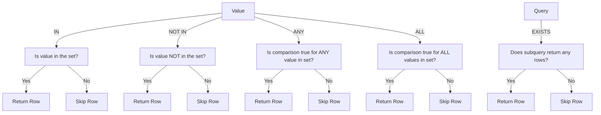

# SQL Multiple Row Subqueries

## Introduction

In SQL, subqueries are powerful tools that allow you to nest one query inside another. While single-row subqueries return exactly one value or row, **multiple row subqueries** return multiple rows of results. These are particularly useful when you need to compare values against a set of results rather than a single value.

Multiple row subqueries enable you to write more complex and flexible queries by using operators like `IN`, `ANY`, `ALL`, and `EXISTS` to work with sets of values. This guide will walk you through how to use multiple row subqueries effectively in your SQL code.

## Understanding Multiple Row Subqueries

A multiple row subquery is a nested query that returns more than one row of results. Since they return multiple values, you need special operators to work with them:

- `IN`: Checks if a value matches any value in the subquery result set
- `NOT IN`: Checks if a value doesn't match any value in the subquery result set
- `ANY` / `SOME`: Compares a value to each value in the subquery result set (returns true if any comparison is true)
- `ALL`: Compares a value to each value in the subquery result set (returns true only if all comparisons are true)
- `EXISTS`: Checks if the subquery returns any rows at all

Let's explore each of these operators with examples.

## The IN Operator

The `IN` operator is probably the most commonly used operator with multiple row subqueries. It checks if a value matches any value in the result set returned by the subquery.

### Syntax

```sql
SELECT column1, column2, ...
FROM table_name
WHERE column_name IN (SELECT column_name FROM table_name WHERE condition);
```

### Example: Finding Employees in Specific Departments

Imagine we have two tables: `employees` and `departments`.

```sql
-- Find all employees who work in the IT or HR departments
SELECT employee_id, first_name, last_name
FROM employees
WHERE department_id IN (
    SELECT department_id 
    FROM departments 
    WHERE department_name IN ('IT', 'HR')
);
```

#### Input Data:

**departments table:**
| department_id | department_name |
|---------------|-----------------|
| 1             | IT              |
| 2             | HR              |
| 3             | Marketing       |
| 4             | Finance         |

**employees table:**
| employee_id | first_name | last_name | department_id |
|-------------|------------|-----------|---------------|
| 101         | John       | Smith     | 1             |
| 102         | Jane       | Doe       | 2             |
| 103         | Bob        | Johnson   | 3             |
| 104         | Alice      | Brown     | 1             |
| 105         | Michael    | Wilson    | 2             |
| 106         | Sarah      | Davis     | 4             |

#### Output:
| employee_id | first_name | last_name |
|-------------|------------|-----------|
| 101         | John       | Smith     |
| 102         | Jane       | Doe       |
| 104         | Alice      | Brown     |
| 105         | Michael    | Wilson    |

### How It Works

1. The inner query `SELECT department_id FROM departments WHERE department_name IN ('IT', 'HR')` returns the department IDs for IT and HR (1 and 2).
2. The outer query then selects all employees whose `department_id` matches any value in this set (1 or 2).

## The NOT IN Operator

The `NOT IN` operator is the opposite of `IN`. It selects rows where the column value doesn't match any value returned by the subquery.

### Syntax

```sql
SELECT column1, column2, ...
FROM table_name
WHERE column_name NOT IN (SELECT column_name FROM table_name WHERE condition);
```

### Example: Finding Products Not in Any Order

```sql
-- Find all products that have never been ordered
SELECT product_id, product_name, unit_price
FROM products
WHERE product_id NOT IN (
    SELECT DISTINCT product_id 
    FROM order_details
);
```

#### Input Data:

**products table:**
| product_id | product_name | unit_price |
|------------|--------------|------------|
| 1          | Laptop       | 1200.00    |
| 2          | Mouse        | 25.50      |
| 3          | Keyboard     | 45.75      |
| 4          | Monitor      | 199.99     |
| 5          | Headphones   | 79.99      |

**order_details table:**
| order_id | product_id | quantity |
|----------|------------|----------|
| 1001     | 1          | 2        |
| 1001     | 2          | 1        |
| 1002     | 3          | 1        |
| 1003     | 1          | 1        |

#### Output:
| product_id | product_name | unit_price |
|------------|--------------|------------|
| 4          | Monitor      | 199.99     |
| 5          | Headphones   | 79.99      |

### Be Careful with NULL Values

Important note: The `NOT IN` operator can lead to unexpected results when the subquery returns `NULL` values, as `NOT IN` will return no rows if any result in the subquery is `NULL`. Always consider handling `NULL` values explicitly when using `NOT IN`.

## The ANY and SOME Operators

The `ANY` and `SOME` operators (they're functionally identical) allow you to compare a value to each value in a subquery result set using a comparison operator `(<, >, =, etc.)`. The condition is true if any comparison is true.

### Syntax

```sql
SELECT column1, column2, ...
FROM table_name
WHERE column_name comparison_operator ANY (SELECT column_name FROM table_name WHERE condition);
```

### Example: Finding Employees with Higher-Than-Average Department Salaries

```sql
-- Find employees who earn more than the average salary of any department
SELECT employee_id, first_name, last_name, salary, department_id
FROM employees
WHERE salary > ANY (
    SELECT AVG(salary)
    FROM employees
    GROUP BY department_id
);
```

#### Input Data:

**employees table:**
| employee_id | first_name | last_name | salary  | department_id |
|-------------|------------|-----------|---------|---------------|
| 101         | John       | Smith     | 72000   | 1             |
| 102         | Jane       | Doe       | 65000   | 2             |
| 103         | Bob        | Johnson   | 58000   | 3             |
| 104         | Alice      | Brown     | 85000   | 1             |
| 105         | Michael    | Wilson    | 60000   | 2             |
| 106         | Sarah      | Davis     | 52000   | 4             |

#### Output:
| employee_id | first_name | last_name | salary | department_id |
|-------------|------------|-----------|--------|---------------|
| 101         | John       | Smith     | 72000  | 1             |
| 102         | Jane       | Doe       | 65000  | 2             |
| 104         | Alice      | Brown     | 85000  | 1             |

### How It Works

1. The subquery `SELECT AVG(salary) FROM employees GROUP BY department_id` calculates the average salary for each department.
2. The outer query selects employees whose salary is greater than at least one of these average values.

## The ALL Operator

The `ALL` operator compares a value against all values returned by the subquery. The condition is true only if the comparison is true for all values in the subquery result set.

### Syntax

```sql
SELECT column1, column2, ...
FROM table_name
WHERE column_name comparison_operator ALL (SELECT column_name FROM table_name WHERE condition);
```

### Example: Finding the Highest Paid Employee

```sql
-- Find employees who earn more than the maximum salary in all departments (except their own)
SELECT employee_id, first_name, last_name, salary, department_id
FROM employees e1
WHERE salary > ALL (
    SELECT MAX(salary)
    FROM employees e2
    WHERE e2.department_id != e1.department_id
    GROUP BY department_id
);
```

#### Input Data:

**employees table:**
| employee_id | first_name | last_name | salary  | department_id |
|-------------|------------|-----------|---------|---------------|
| 101         | John       | Smith     | 72000   | 1             |
| 102         | Jane       | Doe       | 65000   | 2             |
| 103         | Bob        | Johnson   | 58000   | 3             |
| 104         | Alice      | Brown     | 95000   | 1             |
| 105         | Michael    | Wilson    | 60000   | 2             |
| 106         | Sarah      | Davis     | 52000   | 4             |

#### Output:
| employee_id | first_name | last_name | salary | department_id |
|-------------|------------|-----------|--------|---------------|
| 104         | Alice      | Brown     | 95000  | 1             |

### How It Works

1. For each employee in the outer query, the subquery calculates the maximum salary in each department except the employee's own department.
2. The outer query selects employees whose salary is greater than ALL of these maximum values.

## The EXISTS Operator

The `EXISTS` operator checks whether the subquery returns any rows. It returns true if the subquery returns at least one row, and false otherwise.

### Syntax

```sql
SELECT column1, column2, ...
FROM table_name
WHERE EXISTS (SELECT column_name FROM table_name WHERE condition);
```

### Example: Finding Customers with Orders

```sql
-- Find all customers who have placed at least one order
SELECT customer_id, customer_name, email
FROM customers c
WHERE EXISTS (
    SELECT 1
    FROM orders o
    WHERE o.customer_id = c.customer_id
);
```

#### Input Data:

**customers table:**
| customer_id | customer_name | email               |
|-------------|--------------|--------------------|
| 1           | Alex Johnson | alex@example.com   |
| 2           | Lisa Smith   | lisa@example.com   |
| 3           | Mike Brown   | mike@example.com   |
| 4           | Emma Davis   | emma@example.com   |

**orders table:**
| order_id | customer_id | order_date  |
|----------|-------------|-------------|
| 1001     | 1           | 2023-01-15  |
| 1002     | 3           | 2023-01-20  |
| 1003     | 1           | 2023-02-05  |

#### Output:
| customer_id | customer_name | email             |
|-------------|--------------|-------------------|
| 1           | Alex Johnson | alex@example.com  |
| 3           | Mike Brown   | mike@example.com  |

### How It Works

1. The subquery checks if there are any orders for each customer in the outer query.
2. The outer query selects customers for whom the subquery returned at least one row.

## Practical Applications of Multiple Row Subqueries

Let's explore some real-world scenarios where multiple row subqueries are particularly useful.

### Finding Departments with Above-Average Salaries

```sql
-- Find departments where the average salary is higher than the company-wide average
SELECT d.department_id, d.department_name, AVG(e.salary) as avg_salary
FROM departments d
JOIN employees e ON d.department_id = e.department_id
GROUP BY d.department_id, d.department_name
HAVING AVG(e.salary) > (
    SELECT AVG(salary)
    FROM employees
);
```

### Finding Inactive Products

```sql
-- Find products that haven't been ordered in the last 3 months
SELECT product_id, product_name, unit_price
FROM products
WHERE product_id NOT IN (
    SELECT DISTINCT product_id
    FROM order_details od
    JOIN orders o ON od.order_id = o.order_id
    WHERE o.order_date >= DATE_SUB(CURRENT_DATE, INTERVAL 3 MONTH)
);
```

### Finding Managers with Multiple Reports

```sql
-- Find managers who manage at least 3 employees
SELECT e1.employee_id, e1.first_name, e1.last_name, COUNT(*) as num_reports
FROM employees e1
WHERE EXISTS (
    SELECT 1
    FROM employees e2
    WHERE e2.manager_id = e1.employee_id
    GROUP BY e2.manager_id
    HAVING COUNT(*) >= 3
)
GROUP BY e1.employee_id, e1.first_name, e1.last_name;
```

## Performance Considerations

When working with multiple row subqueries, be aware of these performance considerations:

1. **Correlated Subqueries**: When the subquery references the outer query (like in the EXISTS example), it may be executed once for each row in the outer query, which can impact performance for large tables.

2. **Alternatives to NOT IN**: When working with large datasets, consider using LEFT JOIN with NULL check instead of NOT IN, especially if NULL values might be present.

3. **IN vs JOIN**: For some queries, a JOIN might be more efficient than an IN subquery. Database optimizers often convert between them, but it's good to test both approaches.

4. **EXISTS vs IN**: For checking existence, EXISTS can sometimes be more efficient than IN because it can stop after finding the first matching row.

Here's a visual representation of how multiple row subqueries with different operators work:



## Common Errors and Troubleshooting

When working with multiple row subqueries, you might encounter these common issues:

1. **Subquery returns more than one row**: This error occurs when you use a single-row operator `(=, <, >)` with a subquery that returns multiple rows. Use IN, ANY, or ALL instead.

2. **Empty result with NOT IN and NULL values**: If your subquery returns any NULL values, NOT IN may return no rows. Always check for NULL values or use NOT EXISTS as an alternative.

3. **Correlated subquery performance**: If your query is slow, check if you're using a correlated subquery that runs for each row in the outer query.

## Summary

Multiple row subqueries are powerful tools in SQL that allow you to write complex queries comparing values against sets of results. The key operators for working with multiple row subqueries are:

- `IN` / `NOT IN`: For membership tests
- `ANY` / `SOME`: For comparing a value to at least one result in the set
- `ALL`: For comparing a value to every result in the set
- `EXISTS`: For checking if a subquery returns any rows

By mastering these operators and understanding when to use each one, you can write more efficient and powerful SQL queries to solve complex data problems.

## Exercises

Try these exercises to reinforce your understanding:

1. Write a query to find customers who have placed orders for all products in a specific category.

2. Find employees who earn more than the average salary of their own department.

3. Identify products that have been ordered by all customers who have placed at least 3 orders.

4. Find departments that have no employees.

5. List managers who have at least one direct report with a salary higher than the average salary across the company.

## Additional Resources

- [SQL Documentation on Subqueries](https://www.postgresql.org/docs/current/sql-expressions.html#SQL-SUBQUERIES)
- [Understanding SQL JOIN vs. Subqueries](https://www.sqlshack.com/sql-join-vs-subquery/)
- [SQL Performance Tuning for Subqueries](https://use-the-index-luke.com/sql/where-clause/subqueries)