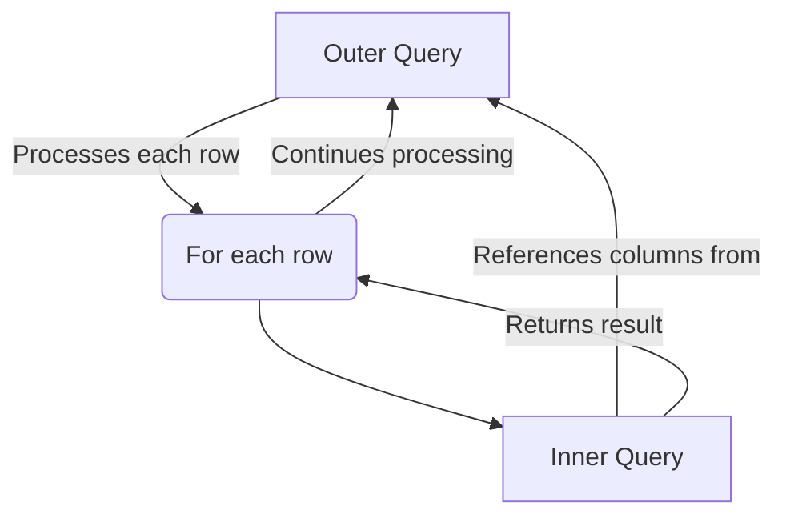

# SQL Correlated Subqueries

## Introduction

In our exploration of SQL subqueries, we've now arrived at one of the most powerful yet sometimes challenging concepts: **correlated subqueries**. Unlike regular subqueries that can execute independently, correlated subqueries are dependent on the outer query and cannot run on their own. They reference columns from the outer query, creating a relationship between the inner and outer queries.

Think of a correlated subquery as a subquery that needs to communicate with the main query during execution. This interdependence allows for some impressive data manipulation capabilities that would be difficult to achieve with other SQL techniques.

## What Makes a Subquery "Correlated"?

A correlated subquery differs from a standard subquery in one key way: **it references columns from the outer query**. This creates a dependency where the inner query must be executed once for each row processed by the outer query.

Let's illustrate this with a simple diagram:



This relationship means that for each row the outer query processes, the inner query runs once, using values from the current outer query row.

## Basic Syntax

Here's the general structure of a correlated subquery:

```sql
SELECT column1, column2, ...
FROM table1 outer
WHERE column1 operator (
    SELECT column1, column2, ...
    FROM table2
    WHERE condition_involving_outer.column
);
```

Notice how the inner query references the outer query's table (usually with an alias like "outer" shown above).

## Correlated Subqueries in Action

Let's start with a simple example. Suppose we have two tables: `employees` and `departments`.

**employees table:**
```
| employee_id | name      | salary | department_id |
|-------------|-----------|--------|---------------|
| 1           | Alice     | 75000  | 1             |
| 2           | Bob       | 65000  | 2             |
| 3           | Charlie   | 85000  | 1             |
| 4           | Diana     | 78000  | 3             |
| 5           | Evan      | 60000  | 2             |
| 6           | Fiona     | 90000  | 1             |
```

**departments table:**
```
| department_id | department_name | location    |
|---------------|-----------------|-------------|
| 1             | Engineering     | Building A  |
| 2             | Marketing       | Building B  |
| 3             | Sales           | Building C  |
```

### Example 1: Finding Employees with Above-Average Salary in Their Department

Let's find all employees who earn more than the average salary in their department:

```sql
SELECT e1.name, e1.salary, d.department_name
FROM employees e1
JOIN departments d ON e1.department_id = d.department_id
WHERE e1.salary > (
    SELECT AVG(e2.salary)
    FROM employees e2
    WHERE e2.department_id = e1.department_id
);
```

**Result:**
```
| name    | salary | department_name |
|---------|--------|-----------------|
| Charlie | 85000  | Engineering     |
| Fiona   | 90000  | Engineering     |
| Diana   | 78000  | Sales           |
```

**Explanation:**
1. The outer query selects employee information and joins with the departments table
2. For each employee in the outer query, the inner query calculates the average salary for their specific department
3. The `WHERE` clause in the outer query compares the employee's salary with this average
4. Only employees with salaries above their department's average are included in the result

### Example 2: Finding Departments with At Least 2 Employees

```sql
SELECT d.department_id, d.department_name, d.location
FROM departments d
WHERE (
    SELECT COUNT(*)
    FROM employees e
    WHERE e.department_id = d.department_id
) >= 2;
```

**Result:**
```
| department_id | department_name | location   |
|---------------|-----------------|------------|
| 1             | Engineering     | Building A |
| 2             | Marketing       | Building B |
```

**Explanation:**
1. The outer query retrieves department information
2. For each department, the correlated subquery counts the number of employees in that department
3. Only departments with at least 2 employees are included in the result

## The EXISTS Operator with Correlated Subqueries

One of the most common uses for correlated subqueries is with the `EXISTS` operator, which checks if any rows are returned by the subquery.

### Example 3: Finding Departments That Have At Least One Employee with Salary > 80,000

```sql
SELECT d.department_name, d.location
FROM departments d
WHERE EXISTS (
    SELECT 1
    FROM employees e
    WHERE e.department_id = d.department_id
    AND e.salary > 80000
);
```

**Result:**
```
| department_name | location   |
|-----------------|------------|
| Engineering     | Building A |
```

**Explanation:**
1. The outer query processes each department
2. For each department, the correlated subquery checks if there's at least one employee with a salary > 80,000
3. The `EXISTS` operator returns true if any rows are found, false otherwise
4. Only departments that have at least one high-earning employee are included in the result

## The NOT EXISTS Operator

Similarly, `NOT EXISTS` checks if the subquery returns no rows.

### Example 4: Finding Employees Who Haven't Completed Any Training Courses

Let's add a new table for this example:

**training_completed table:**
```
| employee_id | course_name          | completion_date |
|-------------|----------------------|-----------------|
| 1           | SQL Fundamentals     | 2023-01-15      |
| 2           | Marketing Basics     | 2023-02-20      |
| 3           | Advanced Programming | 2023-03-10      |
| 1           | Project Management   | 2023-04-05      |
| 5           | Design Principles    | 2023-02-28      |
```

Now, let's find employees who haven't completed any training courses:

```sql
SELECT e.employee_id, e.name
FROM employees e
WHERE NOT EXISTS (
    SELECT 1
    FROM training_completed t
    WHERE t.employee_id = e.employee_id
);
```

**Result:**
```
| employee_id | name    |
|-------------|---------|
| 4           | Diana   |
| 6           | Fiona   |
```

**Explanation:**
1. The outer query goes through each employee
2. The correlated subquery checks if there are any training records for the current employee
3. `NOT EXISTS` returns true only if no records are found
4. The result shows employees with no training records

## UPDATE and DELETE with Correlated Subqueries

Correlated subqueries are also useful in UPDATE and DELETE operations.

### Example 5: Giving a 10% Raise to Employees in Departments Located in Building A

```sql
UPDATE employees e
SET salary = salary * 1.1
WHERE EXISTS (
    SELECT 1
    FROM departments d
    WHERE d.department_id = e.department_id
    AND d.location = 'Building A'
);
```

**Explanation:**
1. The UPDATE statement targets the employees table
2. For each employee, the correlated subquery checks if their department is in Building A
3. If the subquery returns a result (EXISTS is true), the employee gets a 10% raise

## Common Use Cases for Correlated Subqueries

1. **Finding rows that meet complex conditions related to other rows in the same or different tables**
2. **Performing calculations on groups related to each row in the main query**
3. **Filtering based on the existence or non-existence of related records**
4. **Updating or deleting data based on conditions in related tables**

## Performance Considerations

While correlated subqueries are powerful, they can be performance-intensive because the inner query runs once for each row processed by the outer query. For large datasets, consider these alternatives:

1. **Joins**: Often, correlated subqueries can be rewritten using JOINs, which might perform better
2. **Window Functions**: For calculating aggregates within groups, window functions might be more efficient
3. **Common Table Expressions (CTEs)**: These can sometimes replace correlated subqueries with better readability and performance

### Example 6: Rewriting Our First Example Using a JOIN

The query to find employees with above-average salary in their department could be rewritten as:

```sql
WITH dept_avgs AS (
    SELECT department_id, AVG(salary) as avg_salary
    FROM employees
    GROUP BY department_id
)
SELECT e.name, e.salary, d.department_name
FROM employees e
JOIN departments d ON e.department_id = d.department_id
JOIN dept_avgs da ON e.department_id = da.department_id
WHERE e.salary > da.avg_salary;
```

This achieves the same result but might perform better on large datasets.

## Real-World Applications

### Example 7: E-commerce Product Analysis

Imagine you have an e-commerce database with `products` and `orders` tables:

```sql
-- Find products that are selling above the average for their category
SELECT p.product_id, p.product_name, p.category, COUNT(o.order_id) as order_count
FROM products p
JOIN order_items o ON p.product_id = o.product_id
GROUP BY p.product_id, p.product_name, p.category
HAVING COUNT(o.order_id) > (
    SELECT AVG(product_orders)
    FROM (
        SELECT p2.product_id, COUNT(o2.order_id) as product_orders
        FROM products p2
        JOIN order_items o2 ON p2.product_id = o2.product_id
        WHERE p2.category = p.category
        GROUP BY p2.product_id
    ) as category_stats
);
```

This query finds products that have more orders than the average for their category, helping identify top performers within each product category.

### Example 8: HR Data Analysis

```sql
-- Find departments where all employees have been with the company for more than 2 years
SELECT d.department_name
FROM departments d
WHERE NOT EXISTS (
    SELECT 1
    FROM employees e
    WHERE e.department_id = d.department_id
    AND e.hire_date > DATE_SUB(CURRENT_DATE, INTERVAL 2 YEAR)
);
```

This query helps HR identify departments with high employee retention, where all employees have been with the company for more than 2 years.

## Common Mistakes and Troubleshooting

When working with correlated subqueries, watch out for these common issues:

1. **Forgetting correlation**: Make sure your subquery references the outer query when correlation is needed
2. **Incorrect aliases**: Double-check your table aliases in both queries
3. **Performance issues**: For large datasets, consider alternatives like JOINs or CTEs
4. **Column ambiguity**: When both inner and outer queries use tables with identical column names, ensure you qualify column names with the appropriate table alias
5. **Infinite loops**: Poorly written correlated subqueries can cause your query to run for an excessively long time

## Summary

Correlated subqueries are a powerful SQL technique that allows you to:

- Reference the outer query from within a subquery
- Perform complex filtering and calculations based on related data
- Check for the existence or absence of related records
- Update or delete data based on conditions in related tables

While they may impact performance on large datasets, they provide elegant solutions to many data problems that would be difficult to solve otherwise. As you continue your SQL journey, mastering correlated subqueries will significantly enhance your data manipulation capabilities.

## Practice Exercises

1. Create two tables: `students` and `courses_taken`. Write a correlated subquery to find students who have taken more than the average number of courses.

2. Using the employees and departments tables from our examples, write a query to find departments where the highest-paid employee earns more than the average salary across all departments.

3. Write a query to find employees who have the highest salary in their respective departments.

4. Create a query to list departments that have no employees.

5. Write an UPDATE statement using a correlated subquery to give a 5% raise to employees who have completed at least 3 training courses.

## Additional Resources

- [SQL Window Functions](https://www.sqltutorial.org/sql-window-functions/) - An alternative approach for some scenarios
- [Common Table Expressions (CTEs)](https://www.essentialsql.com/introduction-common-table-expressions-ctes/) - Another technique that can sometimes replace correlated subqueries
- [SQL EXISTS Operator](https://www.w3schools.com/sql/sql_exists.asp) - More examples of using EXISTS with correlated subqueries
- [SQL Performance Tuning](https://use-the-index-luke.com/) - Tips for optimizing SQL queries, including subqueries