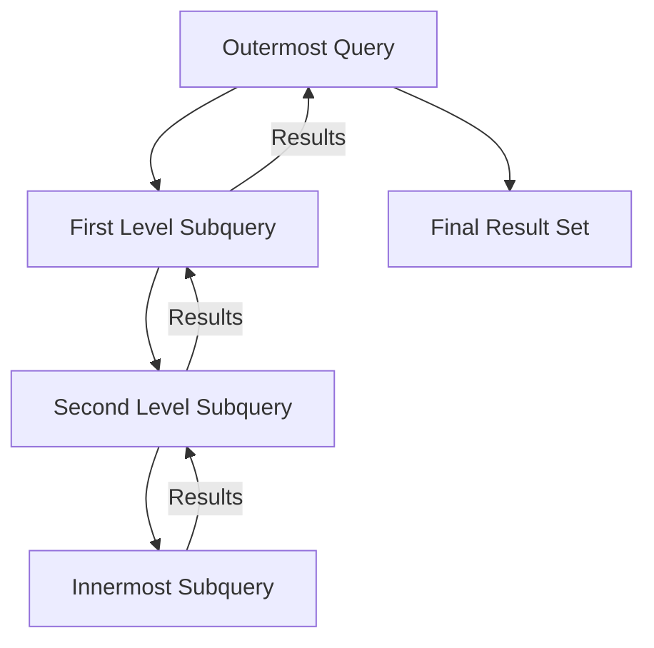

# SQL Nested Subqueries

## Introduction

In SQL, a subquery is a query nested inside another query. Nested subqueries take this concept further by placing a subquery within another subquery, creating multiple levels of query nesting. This powerful technique allows you to solve complex data problems that would be difficult or impossible to solve with simple queries.

In this tutorial, you'll learn:
- What nested subqueries are and when to use them
- How to write and structure nested subqueries
- Common patterns and real-world applications
- Best practices and optimization tips

## Understanding Nested Subqueries

A nested subquery is simply a subquery that contains another subquery. These can go several levels deep, though queries with more than three levels of nesting can become difficult to read and maintain.

### Basic Structure

```sql
SELECT column1, column2
FROM table1
WHERE column3 IN (
    SELECT column4
    FROM table2
    WHERE column5 > (
        SELECT AVG(column6)
        FROM table3
        WHERE condition
    )
);
```

In this structure:
- The innermost query is executed first
- Its results are used by the middle query
- The results of the middle query are then used by the outermost query

## Types of Nested Subqueries

Nested subqueries can be categorized based on where they appear in the main query:

### 1. Nested Subqueries in the WHERE Clause

This is the most common type, used for filtering data based on complex conditions.

#### Example: Find employees who earn more than the average salary in their department

```sql
SELECT employee_name, salary, department_id
FROM employees
WHERE salary > (
    SELECT AVG(salary)
    FROM employees e2
    WHERE e2.department_id = employees.department_id
);
```

**How it works:**
1. For each row in the outer query, the inner subquery calculates the average salary for that employee's department
2. The outer query then compares the employee's salary with this average
3. Only employees with salaries higher than their department's average are returned

**Sample Output:**
```
employee_name  | salary  | department_id
---------------|---------|-------------
John Smith     | 75000   | 101
Maria Garcia   | 82000   | 102
Robert Johnson | 95000   | 101
Lisa Wong      | 79000   | 103
```

### 2. Nested Subqueries in the FROM Clause

When a subquery appears in the FROM clause, it acts as a derived table (or inline view) that you can query like any other table.

#### Example: Calculate the percentage of each department's salary compared to the company total

```sql
SELECT 
    d.department_name,
    dept_totals.dept_salary,
    dept_totals.dept_salary / (
        SELECT SUM(salary) 
        FROM employees
    ) * 100 AS percentage_of_total
FROM departments d
JOIN (
    SELECT 
        department_id,
        SUM(salary) AS dept_salary
    FROM employees
    GROUP BY department_id
) dept_totals ON d.department_id = dept_totals.department_id
ORDER BY percentage_of_total DESC;
```

**How it works:**
1. The innermost subquery calculates the company's total salary
2. The subquery in the FROM clause (dept_totals) calculates each department's total salary
3. The main query joins this with the departments table and calculates the percentage

**Sample Output:**
```
department_name | dept_salary | percentage_of_total
----------------|-------------|--------------------
Engineering     | 850000      | 42.5
Sales           | 620000      | 31.0
Marketing       | 320000      | 16.0
HR              | 210000      | 10.5
```

### 3. Nested Subqueries in the SELECT Clause

Subqueries in the SELECT clause are used to calculate values for each row in the result set.

#### Example: Show each product's price and its difference from the average price in its category

```sql
SELECT 
    product_name,
    price,
    category_id,
    price - (
        SELECT AVG(price)
        FROM products p2
        WHERE p2.category_id = products.category_id
    ) AS diff_from_avg
FROM products;
```

**How it works:**
1. For each row in the main query, the subquery calculates the average price for that product's category
2. The main query then subtracts this average from the product's price

**Sample Output:**
```
product_name    | price  | category_id | diff_from_avg
----------------|--------|-------------|---------------
Laptop          | 1200   | 1           | 300
Desktop         | 1000   | 1           | 100
Tablet          | 600    | 1           | -300
Smartphone      | 800    | 2           | 150
Basic Phone     | 300    | 2           | -350
Smartwatch      | 250    | 3           | 0
```

## Multi-Level Nested Subqueries

Now let's explore more complex scenarios with multiple levels of nesting.

### Example: Find employees who manage departments with the highest average salary

```sql
SELECT employee_name
FROM employees
WHERE employee_id IN (
    SELECT manager_id
    FROM departments
    WHERE department_id IN (
        SELECT department_id
        FROM employees
        GROUP BY department_id
        HAVING AVG(salary) = (
            SELECT MAX(dept_avg.avg_salary)
            FROM (
                SELECT department_id, AVG(salary) AS avg_salary
                FROM employees
                GROUP BY department_id
            ) dept_avg
        )
    )
);
```

**How it works:**
1. The innermost subquery (4th level) calculates the average salary for each department
2. The next level (3rd) finds the maximum of these averages
3. The next level (2nd) identifies departments with this maximum average
4. The next level (1st) finds the managers of these departments
5. The main query returns the names of these managers

This query demonstrates how nested subqueries can solve problems that would be very difficult to express with a single query or even with joins.

## Real-World Applications

### 1. Finding Outliers in Data

```sql
SELECT product_name, sales
FROM product_sales
WHERE sales > (
    SELECT AVG(sales) + (2 * STDDEV(sales))
    FROM product_sales
    WHERE category = product_sales.category
);
```

This query finds products with sales more than two standard deviations above the average in their category - statistical outliers that may warrant investigation.

### 2. Complex Data Hierarchies

```sql
SELECT employee_name
FROM employees
WHERE manager_id IN (
    SELECT employee_id
    FROM employees
    WHERE manager_id = (
        SELECT employee_id
        FROM employees
        WHERE employee_name = 'CEO Name'
    )
);
```

This query finds all employees who report to direct reports of the CEO - essentially finding all employees at the third level of the organization.

### 3. Comparative Analysis

```sql
SELECT 
    region_name,
    current_year_sales,
    (
        SELECT SUM(sales)
        FROM sales
        WHERE region_id = regions.region_id
        AND year = current_year - 1
    ) AS previous_year_sales,
    current_year_sales - (
        SELECT SUM(sales)
        FROM sales
        WHERE region_id = regions.region_id
        AND year = current_year - 1
    ) AS sales_growth
FROM (
    SELECT 
        r.region_id,
        r.region_name,
        SUM(s.sales) AS current_year_sales
    FROM regions r
    JOIN sales s ON r.region_id = s.region_id
    WHERE s.year = current_year
    GROUP BY r.region_id, r.region_name
) regions;
```

This complex query compares current year sales with previous year sales by region, demonstrating how nested subqueries can be used for time-series analysis.

## Visualization of Nested Query Execution

Here's a diagram showing the order of execution for nested queries:



## Best Practices and Optimization Tips

1. **Keep it Simple**: Avoid unnecessary nesting. If a query can be written with joins instead of nested subqueries, it's often more efficient.

2. **Limit Nesting Depth**: Try to keep nesting to 3 levels or less for readability and maintenance.

3. **Use Aliases**: Always use meaningful table aliases, especially when referencing the outer query from an inner query.

4. **Consider Performance**: Deeply nested subqueries can sometimes have performance issues. Test with EXPLAIN PLAN to understand how your database executes them.

5. **Use Common Table Expressions (CTEs)**: For complex queries, consider using CTEs (WITH clause) as an alternative to deeply nested subqueries:

```sql
WITH dept_avg_salaries AS (
    SELECT department_id, AVG(salary) AS avg_salary
    FROM employees
    GROUP BY department_id
),
max_avg_salary AS (
    SELECT MAX(avg_salary) AS max_avg
    FROM dept_avg_salaries
)
SELECT d.department_name
FROM departments d
JOIN dept_avg_salaries das ON d.department_id = das.department_id
JOIN max_avg_salary mas ON das.avg_salary = mas.max_avg;
```

This equivalent query is often more readable than a deeply nested version.

## Common Errors and Troubleshooting

1. **Correlation Problems**: When an inner query references a table from an outer query, make sure the correlation is correct.

2. **Subquery Returns Multiple Rows**: If you use `=` or `<>` operators with a subquery that returns multiple rows, you'll get an error. Use `IN`, `ANY`, `ALL` instead.

3. **NULL Values**: Be careful with NULL values in subqueries, as they can affect your results in unexpected ways.

## Summary

Nested subqueries are a powerful SQL feature that allows you to solve complex data problems by building queries that use the results of other queries. Key points to remember:

- Nested subqueries can appear in the WHERE, FROM, or SELECT clauses
- Inner queries execute first, with results passed to outer queries
- They excel at solving problems involving complex filtering, hierarchical data, and comparative analysis
- While powerful, they should be used judiciously, with attention to readability and performance

By mastering nested subqueries, you'll be able to write SQL that can answer increasingly sophisticated questions about your data.

## Exercises

1. Write a nested subquery to find customers who have placed orders with a total value greater than the average order value.

2. Create a query to find products that have been ordered more than the average number of times their product category has been ordered.

3. Write a query using nested subqueries to find employees who earn more than their manager.

4. Create a query to find departments where all employees earn above the company's average salary.

5. Write a three-level nested query to find customers who have purchased products that are in the top 3 most profitable categories.

## Additional Resources

- [SQL Subqueries: The Complete Guide](https://example.com/sql-subqueries-guide)
- [Optimizing Complex SQL Queries](https://example.com/optimize-sql)
- [Common Table Expressions vs. Nested Subqueries](https://example.com/cte-vs-subqueries)
- [SQL Performance Tuning for Subqueries](https://example.com/subquery-performance)