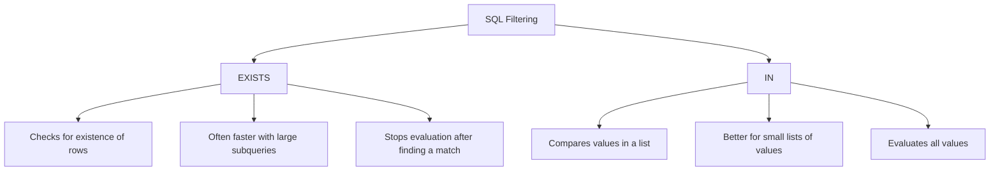

# SQL EXISTS Operator

## Introduction

The `EXISTS` operator is a powerful tool in SQL that allows you to test for the existence of rows in a subquery. Unlike some other operators, `EXISTS` returns a Boolean value (TRUE or FALSE) based on whether the subquery returns any rows. This makes it particularly useful for scenarios where you need to check if certain conditions are met without necessarily needing the actual data from the matching rows.

The `EXISTS` operator is commonly used in WHERE clauses to filter results based on the existence of related data in other tables, making it an essential part of your SQL toolkit, especially when working with related tables in a database.

## Syntax

The basic syntax of the `EXISTS` operator is:

```sql
SELECT column1, column2, ...
FROM table1
WHERE EXISTS (subquery);
```

Similarly, you can use `NOT EXISTS` to find rows where the subquery returns no results:

```sql
SELECT column1, column2, ...
FROM table1
WHERE NOT EXISTS (subquery);
```

## How EXISTS Works

The `EXISTS` operator:
1. Takes a subquery as its argument
2. Returns TRUE if the subquery returns at least one row
3. Returns FALSE if the subquery returns no rows
4. Stops evaluating as soon as it finds a matching row (for efficiency)

Unlike the `IN` operator, which compares specific values, the `EXISTS` operator is only concerned with whether any rows are returned, not what those rows contain.

## Basic Examples

Let's consider a simple database with two tables: `Customers` and `Orders`.

### Example 1: Find customers who have placed at least one order

```sql
SELECT CustomerName
FROM Customers
WHERE EXISTS (
    SELECT 1
    FROM Orders
    WHERE Orders.CustomerID = Customers.CustomerID
);
```

**Input:**

Customers Table:
| CustomerID | CustomerName | Country |
|------------|--------------|---------|
| 1          | John Smith   | USA     |
| 2          | Jane Doe     | Canada  |
| 3          | Bob Johnson  | UK      |

Orders Table:
| OrderID | CustomerID | OrderDate  |
|---------|------------|------------|
| 101     | 1          | 2023-01-15 |
| 102     | 2          | 2023-02-20 |
| 103     | 1          | 2023-03-10 |

**Output:**
| CustomerName |
|--------------|
| John Smith   |
| Jane Doe     |

In this example, John Smith and Jane Doe have placed orders, so they appear in the results. Bob Johnson hasn't placed any orders, so he doesn't appear.

### Example 2: Using NOT EXISTS to find customers without orders

```sql
SELECT CustomerName
FROM Customers
WHERE NOT EXISTS (
    SELECT 1
    FROM Orders
    WHERE Orders.CustomerID = Customers.CustomerID
);
```

**Output:**
| CustomerName |
|--------------|
| Bob Johnson  |

### Notes on the Subquery

You might have noticed we used `SELECT 1` in the subquery. Since the `EXISTS` operator only checks if any rows are returned (not what's in them), we can select any constant value like `1`, `*`, or any column. The performance is typically the same, though some database systems might optimize `SELECT 1` better.

## Practical Applications

### Example 3: Find products that have never been ordered

Consider a scenario with `Products` and `OrderDetails` tables:

```sql
SELECT ProductName, Price
FROM Products
WHERE NOT EXISTS (
    SELECT 1
    FROM OrderDetails
    WHERE OrderDetails.ProductID = Products.ProductID
);
```

This query identifies products that have never appeared in any order, which could be useful for inventory management or marketing decisions.

### Example 4: Find departments with employees earning more than $100,000

Using `Departments` and `Employees` tables:

```sql
SELECT DepartmentName
FROM Departments
WHERE EXISTS (
    SELECT 1
    FROM Employees
    WHERE Employees.DepartmentID = Departments.DepartmentID
    AND Employees.Salary > 100000
);
```

This query helps identify departments that have at least one high-earning employee.

## EXISTS vs. IN

While both `EXISTS` and `IN` can be used in similar scenarios, they work differently:



### When to use EXISTS:
- When checking for the existence of related records
- When working with large datasets (EXISTS can be more efficient)
- When you need to check complex conditions in the subquery

### Example comparing EXISTS and IN:

```sql
-- Using EXISTS
SELECT SupplierName
FROM Suppliers
WHERE EXISTS (
    SELECT 1
    FROM Products
    WHERE Products.SupplierID = Suppliers.SupplierID
    AND Price > 100
);

-- Using IN
SELECT SupplierName
FROM Suppliers
WHERE SupplierID IN (
    SELECT SupplierID
    FROM Products
    WHERE Price > 100
);
```

Both queries find suppliers who supply at least one product priced over $100, but they work differently behind the scenes.

## EXISTS with Correlated Subqueries

The `EXISTS` operator often works with correlated subqueries, where the subquery references the outer query. This is particularly powerful for complex filtering conditions.

### Example 5: Find customers who ordered all products in a specific category

```sql
SELECT CustomerName
FROM Customers C
WHERE NOT EXISTS (
    SELECT 1
    FROM Products P
    WHERE P.CategoryID = 1  -- Assuming CategoryID 1 is 'Beverages'
    AND NOT EXISTS (
        SELECT 1
        FROM Orders O
        JOIN OrderDetails OD ON O.OrderID = OD.OrderID
        WHERE O.CustomerID = C.CustomerID
        AND OD.ProductID = P.ProductID
    )
);
```

This complex query finds customers who have ordered every product in the 'Beverages' category. It uses nested EXISTS and NOT EXISTS operators.

## Performance Considerations

When working with `EXISTS`:

1. **Indexing**: Ensure the columns used in the join condition between the outer query and subquery are properly indexed
2. **Execution Plan**: For complex queries, check the execution plan to ensure optimal performance
3. **Alternative Approaches**: In some cases, JOIN operations might be more efficient than EXISTS

## Summary

The `EXISTS` operator is a powerful SQL feature that checks whether a subquery returns any rows. It's particularly useful for:

- Finding records with or without related records in other tables
- Creating complex filtering conditions
- Working with related data efficiently

Key points to remember:
- `EXISTS` returns TRUE if the subquery returns at least one row
- `NOT EXISTS` returns TRUE if the subquery returns no rows
- It's often used with correlated subqueries, where the subquery references the outer query
- It can be more efficient than `IN` for large datasets

## Exercises

1. Write a query to find all customers who have placed orders in 2023 but not in 2022.
2. Find all employees who have never been assigned to any project.
3. List departments where all employees earn more than $50,000.
4. Find suppliers who supply all product categories.

## Additional Resources

- [SQL EXISTS on W3Schools](https://www.w3schools.com/sql/sql_exists.asp)
- [EXISTS vs. IN Performance Comparison](https://use-the-index-luke.com/sql/where-clause/exists)
- [SQL Subquery Fundamentals](https://mode.com/sql-tutorial/sql-subqueries/)

Remember to practice these concepts with real database queries to solidify your understanding of the `EXISTS` operator!