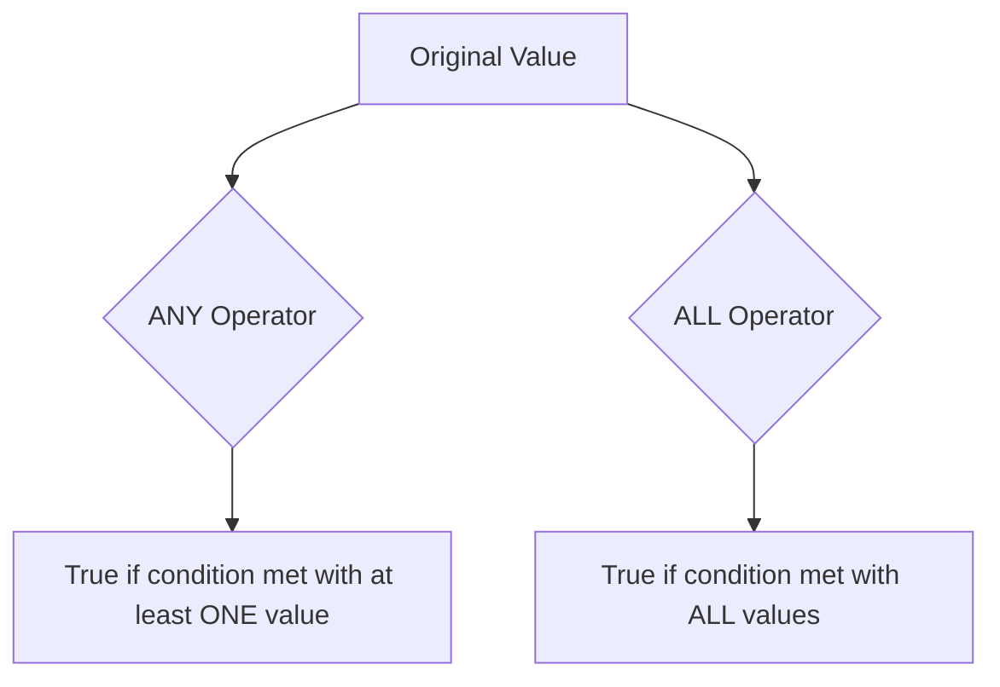

# SQL ANY and ALL Operators

## Introduction

When working with SQL subqueries, you often need to compare a value against multiple results returned by a subquery. This is where the `ANY` and `ALL` operators come in handy. These powerful operators allow you to perform comparisons between a single value and a range of values produced by a subquery.

In this tutorial, we'll dive into:
- What the ANY and ALL operators do
- When and how to use them effectively
- Real-world examples to solidify your understanding

## Understanding ANY and ALL Operators

### The ANY Operator

The `ANY` operator compares a value to each value in a set returned by a subquery. The condition is true if the comparison is true for **at least one** value in the subquery result.

Syntax:
```sql
scalar_expression comparison_operator ANY (subquery)
```

The comparison operators can be:
- `=` (equal to)
- `>` (greater than)
- `<` (less than)
- `>=` (greater than or equal to)
- `<=` (less than or equal to)
- `<>` (not equal to)

### The ALL Operator

The `ALL` operator compares a value to each value in a set returned by a subquery. The condition is true only if the comparison is true for **all** values in the subquery result.

Syntax:
```sql
scalar_expression comparison_operator ALL (subquery)
```

## Visualizing the Difference

To better understand the difference between ANY and ALL:



## Practical Examples

Let's use a sample database with two tables: `Employees` and `Orders`.

**Employees Table:**
| EmployeeID | Name | Department | Salary |
|------------|------|------------|--------|
| 1 | John | Sales | 45000 |
| 2 | Sarah | Marketing | 52000 |
| 3 | Michael | Sales | 48000 |
| 4 | Jessica | IT | 65000 |
| 5 | David | IT | 70000 |

**Orders Table:**
| OrderID | EmployeeID | Amount | Date |
|---------|------------|--------|------|
| 101 | 1 | 1200 | 2023-01-15 |
| 102 | 3 | 850 | 2023-01-20 |
| 103 | 1 | 1450 | 2023-02-05 |
| 104 | 2 | 950 | 2023-02-10 |
| 105 | 4 | 2000 | 2023-02-15 |
| 106 | 3 | 1300 | 2023-03-01 |

### Using the ANY Operator

#### Example 1: Finding employees with salary greater than ANY IT employee

```sql
SELECT Name, Salary
FROM Employees
WHERE Salary > ANY (
    SELECT Salary
    FROM Employees
    WHERE Department = 'IT'
);
```

**Result:**
| Name | Salary |
|------|--------|
| David | 70000 |

**Explanation:**
1. The subquery `SELECT Salary FROM Employees WHERE Department = 'IT'` returns two salaries: 65000 and 70000.
2. The main query checks for employees whose salary is greater than ANY of these values.
3. Only David's salary (70000) is greater than one of the IT department salaries (65000).

#### Example 2: Finding employees who managed orders greater than ANY of John's orders

```sql
SELECT DISTINCT e.Name
FROM Employees e
JOIN Orders o ON e.EmployeeID = o.EmployeeID
WHERE o.Amount > ANY (
    SELECT Amount
    FROM Orders
    WHERE EmployeeID = 1
);
```

**Result:**
| Name |
|------|
| Jessica |
| Michael |

**Explanation:**
1. The subquery returns John's order amounts: 1200 and 1450.
2. The main query finds employees who have any order amount greater than any of John's orders.
3. Jessica and Michael have orders that exceed at least one of John's order amounts.

### Using the ALL Operator

#### Example 1: Finding employees with salary greater than ALL Sales employees

```sql
SELECT Name, Salary
FROM Employees
WHERE Salary > ALL (
    SELECT Salary
    FROM Employees
    WHERE Department = 'Sales'
);
```

**Result:**
| Name | Salary |
|------|--------|
| Sarah | 52000 |
| Jessica | 65000 |
| David | 70000 |

**Explanation:**
1. The subquery returns salaries of Sales employees: 45000 and 48000.
2. The main query finds employees whose salary is greater than ALL of these values.
3. Sarah, Jessica, and David have salaries higher than both Sales employees.

#### Example 2: Finding employees who managed orders greater than ALL of John's orders

```sql
SELECT DISTINCT e.Name
FROM Employees e
JOIN Orders o ON e.EmployeeID = o.EmployeeID
WHERE o.Amount > ALL (
    SELECT Amount
    FROM Orders
    WHERE EmployeeID = 1
);
```

**Result:**
| Name |
|------|
| Jessica |

**Explanation:**
1. The subquery returns John's order amounts: 1200 and 1450.
2. The main query finds employees who have any order amount greater than ALL of John's orders.
3. Only Jessica has an order (2000) that exceeds both of John's order amounts.

## ANY vs. IN Operator

The `= ANY` operator is equivalent to the `IN` operator. Both check if a value matches any value in a set.

```sql
-- These two queries are equivalent
SELECT * FROM Employees WHERE Department = ANY (SELECT Department FROM Employees WHERE Salary > 60000);

SELECT * FROM Employees WHERE Department IN (SELECT Department FROM Employees WHERE Salary > 60000);
```

## ALL vs. NOT IN Operator

The `<> ALL` operator is similar to the `NOT IN` operator. Both check if a value doesn't match any value in a set.

```sql
-- These two queries are equivalent
SELECT * FROM Employees WHERE Department <> ALL (SELECT Department FROM Employees WHERE Salary < 50000);

SELECT * FROM Employees WHERE Department NOT IN (SELECT Department FROM Employees WHERE Salary < 50000);
```

## Real-World Applications

### Finding Outliers in Data

```sql
-- Find products that sell better than ALL products in a specific category
SELECT ProductName, UnitsSold
FROM Products
WHERE UnitsSold > ALL (
    SELECT UnitsSold
    FROM Products
    WHERE Category = 'Electronics'
);
```

### Comparing Performance Across Periods

```sql
-- Find employees whose current month performance exceeds ANY of their previous months
SELECT e.Name
FROM Employees e
JOIN Performance p ON e.EmployeeID = p.EmployeeID
WHERE p.Month = 'Current' AND p.Score > ANY (
    SELECT Score
    FROM Performance
    WHERE EmployeeID = e.EmployeeID AND Month <> 'Current'
);
```

### Filtering Based on Thresholds

```sql
-- Find products that are more expensive than ALL products in the budget category
SELECT ProductName, Price
FROM Products
WHERE Price > ALL (
    SELECT Price
    FROM Products
    WHERE Category = 'Budget'
);
```

## Common Mistakes and Troubleshooting

### Empty Subquery Results

- When using `> ALL (subquery)` with an empty subquery result, the condition is TRUE.
- When using `> ANY (subquery)` with an empty subquery result, the condition is FALSE.

### Null Values in Subqueries

Be careful when your subquery might return NULL values, as comparisons with NULL produce unexpected results. Consider using the IS NULL operator to handle such cases.

## Summary

The `ANY` and `ALL` operators are powerful tools in SQL that allow you to compare values against sets of results from subqueries:

- Use `ANY` when you want a condition to be true if it matches at least one value in the subquery results.
- Use `ALL` when you want a condition to be true only if it matches all values in the subquery results.

These operators are particularly useful for:
- Comparing values across different data sets
- Finding outliers or exceptional cases
- Creating complex filtering conditions
- Simplifying queries that would otherwise require joins or multiple conditions

## Exercises

1. Write a query to find employees who earn more than ANY employee in the Marketing department.
2. Write a query to find employees who have placed orders larger than ALL orders placed in January 2023.
3. Write a query to find products that have been ordered more times than ALL products in the 'Accessories' category.
4. Modify the query from Exercise 1 to find employees who earn more than ALL employees in the Marketing department.

## Additional Resources

- [SQL Server Documentation on ANY](https://docs.microsoft.com/en-us/sql/t-sql/language-elements/any-transact-sql)
- [SQL Server Documentation on ALL](https://docs.microsoft.com/en-us/sql/t-sql/language-elements/all-transact-sql)
- [W3Schools SQL ANY and ALL Tutorial](https://www.w3schools.com/sql/sql_any_all.asp)
- [PostgreSQL Documentation on Subquery Expressions](https://www.postgresql.org/docs/current/functions-subquery.html)