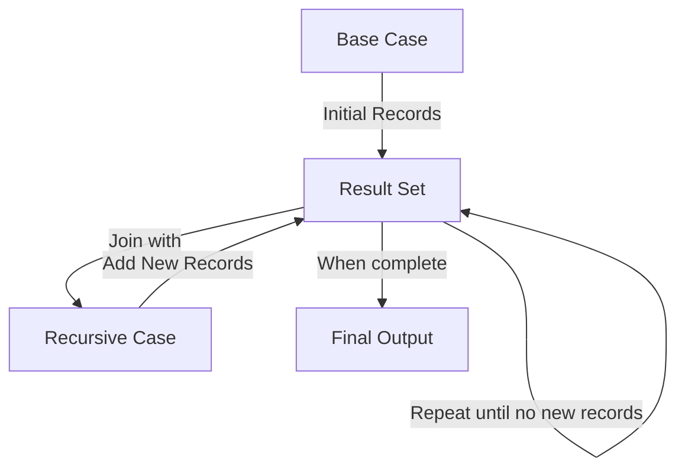

# SQL WITH Clause

## Introduction

The SQL `WITH` clause, also known as Common Table Expressions (CTEs), is a powerful feature that allows you to define temporary result sets that exist only for the duration of a query. Think of it as creating a temporary view or virtual table that you can reference multiple times within your query.

The `WITH` clause makes complex queries more readable, maintainable, and often more efficient by breaking them down into simpler, logical components. It's especially useful when you need to reference the same subquery multiple times or when you want to build queries step by step.

## Syntax

```sql
WITH cte_name [(column_list)] AS (
    -- CTE query definition
    SELECT column1, column2, ...
    FROM table
    WHERE condition
)
-- Main query that uses the CTE
SELECT * 
FROM cte_name
WHERE condition;
```

Key components:
- `cte_name`: The name you assign to your temporary result set
- `column_list`: Optional list of column names for the CTE
- CTE query definition: The SELECT statement that defines your temporary result set
- Main query: The query that references and uses the CTE

## Basic Example

Let's start with a simple example. Suppose we have a `sales` table and want to find transactions above the average sale amount:

```sql
-- Without WITH clause
SELECT * 
FROM sales
WHERE amount > (SELECT AVG(amount) FROM sales);

-- With WITH clause
WITH avg_sales AS (
    SELECT AVG(amount) AS avg_amount
    FROM sales
)
SELECT s.* 
FROM sales s, avg_sales a
WHERE s.amount > a.avg_amount;
```

**Input:**
```
-- sales table
| id | product_id | amount | sale_date  |
|----|------------|--------|------------|
| 1  | 101        | 150.00 | 2023-01-15 |
| 2  | 102        | 75.50  | 2023-01-16 |
| 3  | 101        | 200.00 | 2023-01-20 |
| 4  | 103        | 50.00  | 2023-01-25 |
| 5  | 102        | 125.00 | 2023-02-01 |
```

**Output:**
```
| id | product_id | amount | sale_date  |
|----|------------|--------|------------|
| 1  | 101        | 150.00 | 2023-01-15 |
| 3  | 101        | 200.00 | 2023-01-20 |
| 5  | 102        | 125.00 | 2023-02-01 |
```

In this example, the average amount is 120.10, so we're seeing all sales above that amount.

## Multiple CTEs

You can define multiple CTEs in a single `WITH` clause by separating them with commas:

```sql
WITH
    cte1 AS (
        SELECT column1, column2
        FROM table1
        WHERE condition1
    ),
    cte2 AS (
        SELECT column3, column4
        FROM table2
        WHERE condition2
    )
SELECT *
FROM cte1
JOIN cte2 ON cte1.column1 = cte2.column3;
```

## Practical Example: Sales Analysis

Let's use a more practical example. Imagine we have `sales` and `products` tables, and we want to analyze sales performance:

```sql
WITH 
    monthly_sales AS (
        SELECT 
            EXTRACT(MONTH FROM sale_date) AS month,
            EXTRACT(YEAR FROM sale_date) AS year,
            SUM(amount) AS total_sales
        FROM sales
        GROUP BY EXTRACT(MONTH FROM sale_date), EXTRACT(YEAR FROM sale_date)
    ),
    product_sales AS (
        SELECT 
            p.product_name,
            SUM(s.amount) AS product_total
        FROM sales s
        JOIN products p ON s.product_id = p.product_id
        GROUP BY p.product_name
    )
SELECT 
    ms.month,
    ms.year,
    ms.total_sales,
    ps.product_name,
    ps.product_total,
    (ps.product_total / ms.total_sales * 100) AS percentage
FROM monthly_sales ms
CROSS JOIN product_sales ps
ORDER BY ms.year, ms.month, percentage DESC;
```

**Input:**
```
-- sales table
| id | product_id | amount | sale_date  |
|----|------------|--------|------------|
| 1  | 101        | 150.00 | 2023-01-15 |
| 2  | 102        | 75.50  | 2023-01-16 |
| 3  | 101        | 200.00 | 2023-01-20 |
| 4  | 103        | 50.00  | 2023-01-25 |
| 5  | 102        | 125.00 | 2023-02-01 |

-- products table
| product_id | product_name |
|------------|--------------|
| 101        | Laptop       |
| 102        | Smartphone   |
| 103        | Headphones   |
```

This query:
1. Creates a CTE for monthly sales totals
2. Creates another CTE for total sales by product
3. Joins these CTEs to calculate what percentage each product contributes to monthly sales

## Recursive CTEs

One of the most powerful features of the `WITH` clause is its ability to create recursive queries. A recursive CTE references itself within its definition, which is perfect for hierarchical or tree-structured data:

```sql
WITH RECURSIVE employee_hierarchy AS (
    -- Base case (anchor member)
    SELECT 
        employee_id, 
        name, 
        manager_id, 
        0 AS level
    FROM employees
    WHERE manager_id IS NULL
    
    UNION ALL
    
    -- Recursive case (recursive member)
    SELECT 
        e.employee_id, 
        e.name, 
        e.manager_id, 
        eh.level + 1
    FROM employees e
    JOIN employee_hierarchy eh ON e.manager_id = eh.employee_id
)
SELECT * FROM employee_hierarchy
ORDER BY level, employee_id;
```

This query builds an organizational hierarchy by starting with top-level managers (those with no manager) and recursively adding their subordinates.

**Input:**
```
-- employees table
| employee_id | name    | manager_id |
|-------------|---------|------------|
| 1           | Alice   | NULL       |
| 2           | Bob     | 1          |
| 3           | Charlie | 1          |
| 4           | David   | 2          |
| 5           | Eve     | 2          |
| 6           | Frank   | 3          |
```

**Output:**
```
| employee_id | name    | manager_id | level |
|-------------|---------|------------|-------|
| 1           | Alice   | NULL       | 0     |
| 2           | Bob     | 1          | 1     |
| 3           | Charlie | 1          | 1     |
| 4           | David   | 2          | 2     |
| 5           | Eve     | 2          | 2     |
| 6           | Frank   | 3          | 2     |
```

This shows the organizational hierarchy with Alice at the top, Bob and Charlie reporting to her, and David/Eve reporting to Bob while Frank reports to Charlie.

## How Recursive CTEs Work



The recursive CTE:
1. Starts with the base case (anchor member)
2. Adds those records to the result set
3. Executes the recursive member, joining with current results
4. Adds any new records found to the result set
5. Repeats until no new records are found

## Benefits of the WITH Clause

1. **Readability**: Complex queries become more organized and easier to understand
2. **Maintainability**: Changes can be made in one place rather than multiple subqueries
3. **Performance**: Some databases can optimize CTEs better than nested subqueries
4. **Reusability**: You can reference the same CTE multiple times within your query
5. **Modularity**: Break complex problems into manageable pieces

## Real-World Applications

### 1. Sales Data Analysis

```sql
WITH 
    quarterly_sales AS (
        SELECT 
            EXTRACT(YEAR FROM sale_date) AS year,
            CEIL(EXTRACT(MONTH FROM sale_date) / 3) AS quarter,
            SUM(amount) AS total_sales
        FROM sales
        GROUP BY 
            EXTRACT(YEAR FROM sale_date),
            CEIL(EXTRACT(MONTH FROM sale_date) / 3)
    ),
    quarterly_growth AS (
        SELECT
            year,
            quarter,
            total_sales,
            LAG(total_sales) OVER (ORDER BY year, quarter) AS previous_quarter_sales
        FROM quarterly_sales
    )
SELECT
    year,
    quarter,
    total_sales,
    previous_quarter_sales,
    (total_sales - previous_quarter_sales) AS sales_difference,
    CASE 
        WHEN previous_quarter_sales > 0 
        THEN ROUND((total_sales - previous_quarter_sales) / previous_quarter_sales * 100, 2)
        ELSE NULL
    END AS growth_percentage
FROM quarterly_growth
ORDER BY year, quarter;
```

This query analyzes quarterly sales growth by:
1. First calculating total sales by quarter
2. Then comparing each quarter with the previous one to calculate growth

### 2. Customer Segmentation

```sql
WITH 
    customer_stats AS (
        SELECT
            customer_id,
            COUNT(*) AS total_orders,
            SUM(amount) AS total_spent,
            AVG(amount) AS avg_order_value,
            MAX(order_date) AS last_order_date
        FROM orders
        GROUP BY customer_id
    ),
    customer_segments AS (
        SELECT
            customer_id,
            total_orders,
            total_spent,
            avg_order_value,
            last_order_date,
            CASE
                WHEN total_orders > 10 AND total_spent > 1000 THEN 'VIP'
                WHEN total_orders > 5 AND total_spent > 500 THEN 'Regular'
                WHEN last_order_date > CURRENT_DATE - INTERVAL '90 days' THEN 'New'
                ELSE 'Inactive'
            END AS segment
        FROM customer_stats
    )
SELECT
    segment,
    COUNT(*) AS customer_count,
    ROUND(AVG(total_spent), 2) AS avg_customer_value
FROM customer_segments
GROUP BY segment
ORDER BY avg_customer_value DESC;
```

This query segments customers based on their purchasing behavior and then analyzes each segment.

## Limitations and Considerations

1. **Scope**: CTEs are only available within the query where they are defined
2. **Performance**: While often improving performance, complex recursive CTEs can be resource-intensive
3. **Support**: Not all database systems support all features of CTEs (especially recursive CTEs)
4. **Debugging**: Errors in CTEs can sometimes be harder to debug than regular queries

## Summary

The SQL `WITH` clause is a powerful tool that enables you to write cleaner, more maintainable SQL by breaking complex queries into logical building blocks. By defining temporary result sets that can be referenced multiple times within a query, you can improve both readability and potentially performance.

Key takeaways:
- Use the `WITH` clause to define temporary result sets
- Multiple CTEs can be defined in a single query
- Recursive CTEs are perfect for hierarchical data
- CTEs improve readability, maintainability, and sometimes performance
- The `WITH` clause is supported by most major database systems

## Additional Resources

- [PostgreSQL Documentation on WITH Queries](https://www.postgresql.org/docs/current/queries-with.html)
- [MySQL Documentation on WITH (Common Table Expressions)](https://dev.mysql.com/doc/refman/8.0/en/with.html)
- [SQL Server Documentation on WITH common_table_expression](https://learn.microsoft.com/en-us/sql/t-sql/queries/with-common-table-expression-transact-sql)

## Exercises

1. Write a query using the `WITH` clause to find the top 3 products by sales for each month.
2. Create a recursive CTE to generate a sequence of numbers from 1 to 10.
3. Use multiple CTEs to analyze customer purchasing patterns over time.
4. Implement a query with a `WITH` clause to find employees who earn more than their department's average salary.
5. Convert a complex nested subquery to use the `WITH` clause instead.