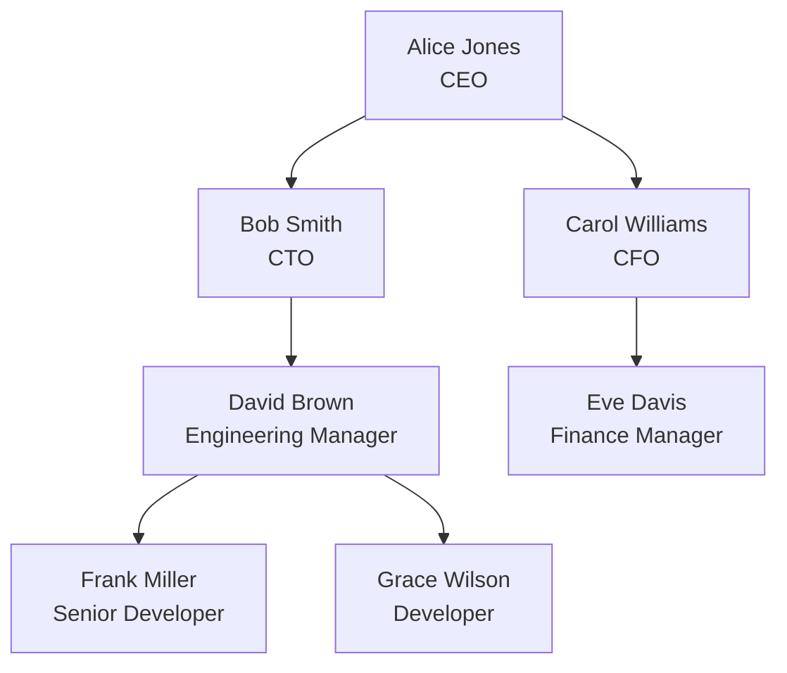

# SQL Common Table Expressions

## Introduction

Common Table Expressions (CTEs) are a powerful SQL feature that allows you to write cleaner, more maintainable, and readable SQL queries. Introduced as part of the SQL-99 standard, CTEs act as temporary result sets that exist only for the duration of a single query. Think of them as named temporary tables that you can reference multiple times within your SQL statement.

CTEs solve many of the readability problems associated with complex subqueries by allowing you to define a subquery once and then reference it multiple times. They're especially useful for breaking down complex queries into simpler, more modular components.

In this guide, we'll explore:
- How CTEs work and their basic syntax
- When and why to use CTEs instead of subqueries
- Creating recursive CTEs for hierarchical data
- Practical examples showing real-world applications

## Basic CTE Syntax

A CTE is defined using the `WITH` clause followed by the expression name and an `AS` keyword that contains the query definition:

```sql
WITH cte_name AS (
    SELECT column1, column2, ...
    FROM table_name
    WHERE condition
)
SELECT * FROM cte_name;
```

Let's break down the components:

1. `WITH` keyword starts the CTE definition
2. `cte_name` is the name you assign to your CTE (you can choose any valid SQL identifier)
3. `AS` keyword indicates that you're about to define what the CTE will contain
4. The query in parentheses defines the data your CTE will contain
5. The main query follows, which can reference the CTE by name

## Simple CTE Example

Let's start with a basic example using a sample `employees` table:

```sql
-- Sample table structure
-- employees(employee_id, first_name, last_name, department_id, salary)

-- Using a CTE to find employees with above-average salary
WITH above_avg_salary AS (
    SELECT AVG(salary) as avg_salary
    FROM employees
)
SELECT e.employee_id, e.first_name, e.last_name, e.salary
FROM employees e, above_avg_salary avg
WHERE e.salary > avg.avg_salary
ORDER BY e.salary DESC;
```

**Output:**
```
employee_id | first_name | last_name | salary
-----------------------------------------
123         | John       | Smith     | 85000
456         | Sarah      | Johnson   | 82000
789         | Michael    | Brown     | 78000
...
```

In this example, the CTE calculates the average salary once, and then the main query uses that value to filter employees who earn above the average.

## Multiple CTEs in a Single Query

You can define multiple CTEs separated by commas within a single `WITH` clause:

```sql
WITH 
    dept_count AS (
        SELECT department_id, COUNT(*) as employee_count
        FROM employees
        GROUP BY department_id
    ),
    high_salary_employees AS (
        SELECT department_id, COUNT(*) as high_earners
        FROM employees
        WHERE salary > 75000
        GROUP BY department_id
    )
SELECT 
    d.department_id,
    d.employee_count,
    h.high_earners,
    (h.high_earners * 100.0 / d.employee_count) as high_earner_percentage
FROM dept_count d
JOIN high_salary_employees h ON d.department_id = h.department_id
ORDER BY high_earner_percentage DESC;
```

**Output:**
```
department_id | employee_count | high_earners | high_earner_percentage
-----------------------------------------------------------------
3             | 12             | 8            | 66.67
1             | 15             | 6            | 40.00
2             | 10             | 3            | 30.00
...
```

This example uses two CTEs to calculate department statistics, then joins them in the main query to calculate the percentage of high earners in each department.

## CTEs vs. Subqueries: When to Use Each

CTEs offer several advantages over traditional subqueries:

| Feature | CTEs | Subqueries |
|---------|------|------------|
| Readability | Better for complex queries | Can become nested and hard to read |
| Reusability | Can be referenced multiple times | Must be repeated if needed multiple times |
| Recursive capability | Supports recursive queries | No recursive capability |
| Performance | Generally similar | Generally similar |

Use CTEs when:
- Your query is complex with multiple levels of nesting
- You need to reference the same subquery result multiple times
- You need to work with hierarchical data (recursive CTEs)
- You want to improve the readability of your query

## Recursive CTEs

One of the most powerful features of CTEs is the ability to create recursive queries. Recursive CTEs allow you to query hierarchical or tree-structured data, such as organizational charts, bill of materials, or file systems.

A recursive CTE has two parts:
1. An anchor member (the starting point)
2. A recursive member (the part that references itself)

Here's the basic syntax:

```sql
WITH RECURSIVE cte_name AS (
    -- Anchor member
    SELECT columns FROM table WHERE condition
    
    UNION ALL
    
    -- Recursive member
    SELECT columns FROM table
    JOIN cte_name ON join_condition
    WHERE condition
)
SELECT * FROM cte_name;
```

> Note: Some database systems like SQL Server don't require the `RECURSIVE` keyword, while others like PostgreSQL and SQLite do.

### Example: Employee Hierarchy

Let's say we have an `employees` table with a self-referencing `manager_id` column:

```sql
-- employees(employee_id, first_name, last_name, manager_id, position)

WITH RECURSIVE emp_hierarchy AS (
    -- Anchor member: CEO (no manager)
    SELECT employee_id, first_name, last_name, manager_id, position, 0 as level
    FROM employees
    WHERE manager_id IS NULL
    
    UNION ALL
    
    -- Recursive member: All other employees
    SELECT e.employee_id, e.first_name, e.last_name, e.manager_id, e.position, h.level + 1
    FROM employees e
    JOIN emp_hierarchy h ON e.manager_id = h.employee_id
)
SELECT 
    level,
    employee_id,
    first_name,
    last_name,
    position
FROM emp_hierarchy
ORDER BY level, employee_id;
```

**Output:**
```
level | employee_id | first_name | last_name | position
-----------------------------------------------------
0     | 1           | Alice      | Jones     | CEO
1     | 2           | Bob        | Smith     | CTO
1     | 3           | Carol      | Williams  | CFO
2     | 4           | David      | Brown     | Engineering Manager
2     | 5           | Eve        | Davis     | Finance Manager
3     | 6           | Frank      | Miller    | Senior Developer
3     | 7           | Grace      | Wilson    | Developer
...
```

This query builds an organizational chart showing the hierarchy of employees, with the level indicating their position in the hierarchy.

Let's visualize this hierarchy:



### Example: Finding Paths in a Graph

Recursive CTEs are also useful for finding paths in a graph. Consider a `flights` table representing direct flights between cities:

```sql
-- flights(from_city, to_city, airline, cost)

WITH RECURSIVE routes AS (
    -- Anchor member: direct flights from 'New York'
    SELECT 
        from_city, 
        to_city, 
        airline,
        cost,
        1 as stops,
        ARRAY[from_city, to_city] as path
    FROM flights
    WHERE from_city = 'New York'
    
    UNION ALL
    
    -- Recursive member: connecting flights
    SELECT 
        f.from_city, 
        f.to_city, 
        f.airline,
        r.cost + f.cost,
        r.stops + 1,
        r.path || f.to_city
    FROM flights f
    JOIN routes r ON f.from_city = r.to_city
    WHERE r.stops < 3  -- limit to 3 stops
    AND NOT f.to_city = ANY(r.path)  -- avoid cycles
)
SELECT 
    path,
    stops,
    cost
FROM routes
WHERE to_city = 'Tokyo'
ORDER BY cost;
```

**Output:**
```
path                                   | stops | cost
-----------------------------------------------------------
{New York,Los Angeles,Tokyo}           | 2     | 1200
{New York,Chicago,San Francisco,Tokyo} | 3     | 1350
{New York,London,Dubai,Tokyo}          | 3     | 1500
...
```

This query finds all possible routes from New York to Tokyo with up to 3 stops, and orders them by total cost.

## Real-World Applications

### Example 1: Sales Data Analysis

Let's analyze sales data to find the top-performing products by category and compare them to the category average:

```sql
-- Sample tables:
-- products(product_id, name, category_id, price)
-- sales(sale_id, product_id, quantity, sale_date)
-- categories(category_id, category_name)

WITH 
    product_sales AS (
        SELECT 
            p.product_id,
            p.name as product_name,
            c.category_id,
            c.category_name,
            SUM(s.quantity) as total_units_sold,
            SUM(s.quantity * p.price) as total_revenue
        FROM sales s
        JOIN products p ON s.product_id = p.product_id
        JOIN categories c ON p.category_id = c.category_id
        WHERE s.sale_date >= DATE_SUB(CURRENT_DATE, INTERVAL 1 YEAR)
        GROUP BY p.product_id, p.name, c.category_id, c.category_name
    ),
    category_stats AS (
        SELECT 
            category_id,
            category_name,
            AVG(total_units_sold) as avg_units_sold,
            AVG(total_revenue) as avg_revenue
        FROM product_sales
        GROUP BY category_id, category_name
    )
SELECT 
    ps.product_name,
    ps.category_name,
    ps.total_units_sold,
    cs.avg_units_sold,
    ROUND((ps.total_units_sold / cs.avg_units_sold * 100) - 100, 1) as percent_above_avg,
    ps.total_revenue
FROM product_sales ps
JOIN category_stats cs ON ps.category_id = cs.category_id
WHERE ps.total_units_sold > cs.avg_units_sold
ORDER BY percent_above_avg DESC
LIMIT 10;
```

**Output:**
```
product_name        | category_name | total_units_sold | avg_units_sold | percent_above_avg | total_revenue
----------------------------------------------------------------------------------------------
Premium Headphones  | Electronics   | 1250             | 420            | 197.6             | 187500
Organic Coffee      | Beverages     | 3200             | 1100           | 190.9             | 41600
Designer Handbag    | Fashion       | 580              | 210            | 176.2             | 145000
Gaming Mouse        | Electronics   | 980              | 420            | 133.3             | 58800
...
```

This analysis shows which products are performing above their category average, helping identify star performers in each product category.

### Example 2: Identifying Customer Segments

Let's use CTEs to segment customers based on their purchasing behavior:

```sql
-- Sample tables:
-- customers(customer_id, name, email, signup_date)
-- orders(order_id, customer_id, order_date, total_amount)

WITH 
    customer_spending AS (
        SELECT 
            c.customer_id,
            c.name,
            SUM(o.total_amount) as total_spent,
            COUNT(o.order_id) as order_count,
            AVG(o.total_amount) as avg_order_value,
            DATEDIFF(CURRENT_DATE, MIN(o.order_date)) as days_since_first_order,
            DATEDIFF(CURRENT_DATE, MAX(o.order_date)) as days_since_last_order
        FROM customers c
        JOIN orders o ON c.customer_id = o.customer_id
        WHERE o.order_date >= DATE_SUB(CURRENT_DATE, INTERVAL 1 YEAR)
        GROUP BY c.customer_id, c.name
    ),
    customer_segments AS (
        SELECT 
            customer_id,
            name,
            total_spent,
            order_count,
            CASE
                WHEN total_spent > 1000 AND days_since_last_order < 30 THEN 'VIP'
                WHEN total_spent > 500 AND days_since_last_order < 60 THEN 'Regular'
                WHEN days_since_last_order > 90 THEN 'At Risk'
                ELSE 'Occasional'
            END as segment
        FROM customer_spending
    )
SELECT 
    segment,
    COUNT(*) as customer_count,
    ROUND(AVG(total_spent), 2) as avg_spending,
    ROUND(AVG(order_count), 1) as avg_orders
FROM customer_segments
GROUP BY segment
ORDER BY avg_spending DESC;
```

**Output:**
```
segment     | customer_count | avg_spending | avg_orders
--------------------------------------------------------
VIP         | 124            | 2345.67      | 12.3
Regular     | 567            | 785.42       | 6.8
Occasional  | 1432           | 312.88       | 3.2
At Risk     | 389            | 235.91       | 2.1
```

This analysis segments customers based on their spending patterns and recency of purchases, allowing for targeted marketing strategies.

## CTEs in Different Database Systems

While CTEs are part of the SQL standard, there are some differences in implementation across database systems:

| Database | Syntax Notes | Recursive Support |
|----------|------------|------------------|
| PostgreSQL | Requires `RECURSIVE` keyword for recursive CTEs | Full support |
| MySQL | Requires version 8.0+ for recursive CTEs | Full support in 8.0+ |
| SQL Server | No `RECURSIVE` keyword needed | Full support |
| SQLite | Requires `RECURSIVE` keyword | Full support |
| Oracle | Uses `WITH` clause | Full support |

Always check your specific database documentation for any implementation details or limitations.

## Summary

Common Table Expressions (CTEs) are a powerful SQL feature that can help you write cleaner, more maintainable queries. They're especially useful when:

- You need to break down complex queries into simpler, modular components
- You want to reference the same subquery multiple times
- You're working with hierarchical data that requires recursive queries
- You want to improve the readability of your SQL code

Key benefits of CTEs include:
- Improved readability and maintainability
- Ability to reuse query logic
- Support for recursive queries to handle hierarchical data
- Cleaner approach to complex joins and aggregations

By mastering CTEs, you'll be able to tackle complex SQL problems with more elegant and efficient solutions.

## Exercises

1. Write a CTE to find the top 3 customers by total spending for each product category.
2. Create a recursive CTE to generate a date series for all days in the current month.
3. Use CTEs to find products that have had increasing sales each month for the past 3 months.
4. Write a query using CTEs to identify employees who earn more than their direct manager.
5. Create a recursive CTE to find all possible combinations of flights between two cities with a maximum of 2 stops.

## Additional Resources

- [PostgreSQL Documentation on WITH Queries](https://www.postgresql.org/docs/current/queries-with.html)
- [Microsoft SQL Server Documentation on CTEs](https://docs.microsoft.com/en-us/sql/t-sql/queries/with-common-table-expression-transact-sql)
- [MySQL Documentation on WITH (Common Table Expressions)](https://dev.mysql.com/doc/refman/8.0/en/with.html)
- [SQLite Documentation on Common Table Expressions](https://www.sqlite.org/lang_with.html)

Remember that practice is key to mastering CTEs. Try incorporating them into your queries to solve real-world problems and you'll quickly see their benefits!