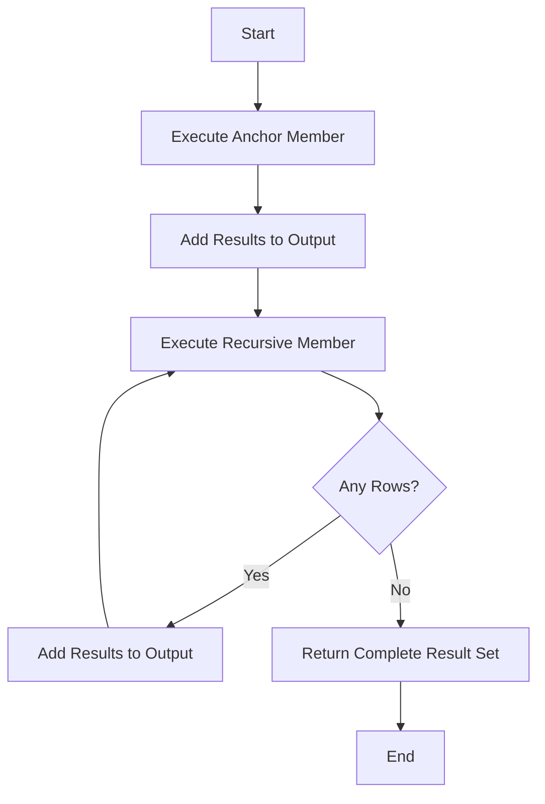

# SQL Recursive Queries

## Introduction

Have you ever needed to query hierarchical data like an organizational chart, a file system, or a bill of materials? Or perhaps you've needed to generate a sequence of dates or numbers? These problems can be challenging with basic SQL queries, but become much simpler with **recursive queries**.

Recursive queries in SQL allow you to reference a query within itself, enabling you to traverse hierarchical data structures or generate sequences through iteration. They're implemented using a special form of Common Table Expression (CTE) called a **recursive CTE**.

In this tutorial, we'll explore how recursive queries work, their syntax, and practical applications that will help you solve complex data problems with elegance and efficiency.

## Prerequisites

Before diving into recursive queries, you should be familiar with:
- Basic SQL queries (SELECT, FROM, WHERE)
- JOINs in SQL
- Regular CTEs (Common Table Expressions)

## Understanding Recursive CTEs

A recursive CTE is a common table expression that references itself. It consists of two parts:

1. **Anchor member**: The initial query that returns the base result set (no recursion)
2. **Recursive member**: The query that references the CTE itself and is executed repeatedly

Here's the general syntax:

```sql
WITH RECURSIVE cte_name AS (
    -- Anchor member
    SELECT initial_columns
    FROM initial_tables
    WHERE initial_conditions
    
    UNION ALL
    
    -- Recursive member
    SELECT recursive_columns
    FROM recursive_tables
    JOIN cte_name ON join_condition
    WHERE recursive_conditions
)
SELECT columns FROM cte_name;
```

> **Note**: Some database systems like PostgreSQL and SQLite use the `WITH RECURSIVE` syntax, while others like SQL Server and MySQL allow `WITH` without explicitly specifying `RECURSIVE`.

## How Recursive CTEs Work

The execution of a recursive CTE follows these steps:

1. Execute the anchor member to create the initial result set (iteration 0)
2. Execute the recursive member, substituting the previous iteration's results
3. Add the results to the result set
4. Repeat steps 2-3 until the recursive member returns no rows
5. Return the complete result set

Let's visualize this process:



## Basic Example: Generating a Sequence

Let's start with a simple example - generating a sequence of numbers from 1 to 10:

```sql
WITH RECURSIVE number_sequence AS (
    -- Anchor member: Start with 1
    SELECT 1 AS n
    
    UNION ALL
    
    -- Recursive member: Add 1 to previous value until we reach 10
    SELECT n + 1
    FROM number_sequence
    WHERE n < 10
)
SELECT n FROM number_sequence;
```

**Output:**
```
 n
---
 1
 2
 3
 4
 5
 6
 7
 8
 9
10
```

Let's break down how this works:

1. The anchor member returns a single row with the value 1
2. The recursive member takes the previous result (1), adds 1, and returns 2
3. This process continues, adding 1 each time, until n reaches 10
4. When n = 10, the WHERE condition (n < 10) fails, and recursion stops

## Working with Hierarchical Data

One of the most common applications of recursive queries is traversing hierarchical data structures. Let's consider an employee organizational chart:

```sql
CREATE TABLE employees (
    employee_id INT PRIMARY KEY,
    name VARCHAR(100),
    manager_id INT,
    FOREIGN KEY (manager_id) REFERENCES employees(employee_id)
);

INSERT INTO employees VALUES
(1, 'John Doe', NULL),       -- CEO
(2, 'Jane Smith', 1),        -- CTO, reports to CEO
(3, 'Bob Johnson', 1),       -- CFO, reports to CEO
(4, 'Alice Williams', 2),    -- Engineering Manager, reports to CTO
(5, 'Charlie Brown', 2),     -- Product Manager, reports to CTO
(6, 'Diana Miller', 4),      -- Senior Developer, reports to Engineering Manager
(7, 'Edward Davis', 4),      -- Developer, reports to Engineering Manager
(8, 'Fiona Clark', 5);       -- Designer, reports to Product Manager
```

Now, let's use a recursive CTE to display the entire organizational hierarchy with levels:

```sql
WITH RECURSIVE org_chart AS (
    -- Anchor member: Start with the CEO (no manager)
    SELECT 
        employee_id,
        name,
        manager_id,
        0 AS level,
        CAST(name AS VARCHAR(1000)) AS path
    FROM 
        employees
    WHERE 
        manager_id IS NULL
    
    UNION ALL
    
    -- Recursive member: Join with employees who have managers in our current result
    SELECT 
        e.employee_id,
        e.name,
        e.manager_id,
        oc.level + 1,
        CAST(oc.path || ' > ' || e.name AS VARCHAR(1000))
    FROM 
        employees e
    JOIN 
        org_chart oc ON e.manager_id = oc.employee_id
)
SELECT 
    level,
    REPEAT('  ', level) || name AS employee,
    path
FROM 
    org_chart
ORDER BY 
    path;
```

**Output:**
```
 level | employee          | path
-------+-------------------+-----------------------------
 0     | John Doe          | John Doe
 1     |   Jane Smith      | John Doe > Jane Smith
 2     |     Alice Williams| John Doe > Jane Smith > Alice Williams
 3     |       Diana Miller| John Doe > Jane Smith > Alice Williams > Diana Miller
 3     |       Edward Davis| John Doe > Jane Smith > Alice Williams > Edward Davis
 2     |     Charlie Brown | John Doe > Jane Smith > Charlie Brown
 3     |       Fiona Clark | John Doe > Jane Smith > Charlie Brown > Fiona Clark
 1     |   Bob Johnson     | John Doe > Bob Johnson
```

In this example:

1. We start with the CEO (the employee with no manager)
2. We recursively find all employees who report to someone in our current result set
3. We track the level of hierarchy and build a path string to show the reporting structure

## Finding Paths in Graph Data

Recursive CTEs are also excellent for solving graph traversal problems. Let's look at a flight connections example:

```sql
CREATE TABLE flights (
    departure_city VARCHAR(50),
    arrival_city VARCHAR(50),
    duration_hours NUMERIC(4,2),
    PRIMARY KEY (departure_city, arrival_city)
);

INSERT INTO flights VALUES
('New York', 'London', 7.5),
('New York', 'Paris', 8.25),
('London', 'Berlin', 2.5),
('London', 'Rome', 3.0),
('Paris', 'Rome', 2.5),
('Paris', 'Madrid', 2.0),
('Rome', 'Athens', 2.5),
('Madrid', 'Lisbon', 1.5);
```

Now, let's find all possible routes from New York to Athens with up to 3 connections:

```sql
WITH RECURSIVE routes AS (
    -- Anchor member: Direct flights from New York
    SELECT 
        departure_city,
        arrival_city,
        1 AS connections,
        ARRAY[departure_city, arrival_city] AS route,
        duration_hours
    FROM 
        flights
    WHERE 
        departure_city = 'New York'
    
    UNION ALL
    
    -- Recursive member: Add connecting flights
    SELECT 
        r.departure_city,
        f.arrival_city,
        r.connections + 1,
        r.route || f.arrival_city,
        r.duration_hours + f.duration_hours
    FROM 
        routes r
    JOIN 
        flights f ON r.arrival_city = f.departure_city
    WHERE 
        r.connections < 3
        AND f.arrival_city <> ALL(r.route) -- Avoid cycles
)
SELECT 
    route,
    connections,
    duration_hours AS total_hours
FROM 
    routes
WHERE 
    arrival_city = 'Athens'
ORDER BY 
    total_hours;
```

**Output:**
```
 route                              | connections | total_hours
-----------------------------------+-------------+-------------
 {New York,Paris,Rome,Athens}      | 3           | 13.25
 {New York,London,Rome,Athens}     | 3           | 13.00
```

This query:

1. Starts with all direct flights from New York
2. Recursively adds connecting flights, limiting to 3 connections
3. Builds a route array and calculates total duration
4. Filters for routes ending in Athens
5. Avoids cycles by ensuring we don't visit the same city twice

## Preventing Infinite Recursion

It's important to ensure your recursive queries terminate. Without proper termination conditions, you could end up with infinite recursion, which database systems typically prevent with maximum recursion depth settings.

Here are strategies to prevent infinite recursion:

1. **Use a limiting condition**: Include a WHERE clause in your recursive member that will eventually return no rows.
2. **Track and limit depth**: Include a counter field and stop when it reaches a maximum value.
3. **Detect cycles**: For graph traversals, keep track of visited nodes to avoid cycles.

Most database systems also have built-in safeguards:

- **PostgreSQL**: Has a `max_recursive_iterations` setting (default: 100)
- **SQL Server**: Limits recursive CTEs to 100 levels by default, but can be specified with `OPTION (MAXRECURSION n)`
- **MySQL**: Has a `cte_max_recursion_depth` system variable (default: 1000)

## Performance Considerations

Recursive queries can be powerful but may impact performance with large data sets. Consider these tips:

1. **Add termination conditions**: Ensure your recursive member has conditions that will stop the recursion.
2. **Use appropriate indexes**: Index the columns used in join conditions.
3. **Limit recursion depth**: Use a level or depth counter to limit how deep the recursion goes.
4. **Filter early**: Apply filters in both the anchor and recursive members when possible.

## Real-World Applications

Recursive CTEs are valuable in many scenarios:

### 1. Organization Charts
As we saw earlier, recursive CTEs can display reporting hierarchies of any depth.

### 2. Bill of Materials (BOM)
Calculate the components needed for manufacturing:

```sql
WITH RECURSIVE bom_explosion AS (
    -- Anchor: Top-level product
    SELECT 
        parent_id,
        component_id,
        quantity,
        1 AS level
    FROM 
        product_components
    WHERE 
        parent_id = 100 -- Product ID
    
    UNION ALL
    
    -- Recursive: Sub-components
    SELECT 
        pc.parent_id,
        pc.component_id,
        be.quantity * pc.quantity,
        be.level + 1
    FROM 
        bom_explosion be
    JOIN 
        product_components pc ON be.component_id = pc.parent_id
)
SELECT 
    component_id,
    SUM(quantity) AS total_quantity
FROM 
    bom_explosion
GROUP BY 
    component_id;
```

### 3. File System Navigation
Traverse directory structures of any depth:

```sql
WITH RECURSIVE directory_contents AS (
    -- Anchor: Start with root directory
    SELECT 
        id,
        name,
        parent_id,
        CAST(name AS VARCHAR(1000)) AS path,
        0 AS depth
    FROM 
        files
    WHERE 
        parent_id IS NULL
    
    UNION ALL
    
    -- Recursive: Find all children
    SELECT 
        f.id,
        f.name,
        f.parent_id,
        CAST(dc.path || '/' || f.name AS VARCHAR(1000)),
        dc.depth + 1
    FROM 
        files f
    JOIN 
        directory_contents dc ON f.parent_id = dc.id
)
SELECT * FROM directory_contents ORDER BY path;
```

### 4. Calendar Generation
Generate a series of dates for reporting:

```sql
WITH RECURSIVE date_series AS (
    -- Anchor: Start date
    SELECT 
        CAST('2023-01-01' AS DATE) AS date
    
    UNION ALL
    
    -- Recursive: Add one day until end date
    SELECT 
        date + INTERVAL '1 day'
    FROM 
        date_series
    WHERE 
        date < '2023-12-31'
)
SELECT date FROM date_series;
```

## Summary

Recursive queries in SQL provide an elegant solution for working with hierarchical data, traversing graphs, and generating sequences. They consist of an anchor member and a recursive member, combined with a UNION ALL operator.

Key takeaways:

1. Recursive CTEs use self-reference to iterate through data
2. They're perfect for hierarchical data like org charts and file systems
3. They can solve graph traversal problems like finding routes
4. Always include termination conditions to prevent infinite recursion
5. Consider performance impacts with large datasets

By mastering recursive queries, you've added a powerful tool to your SQL toolbox that can solve problems that would otherwise require multiple queries or application-level processing.

## Exercises

1. Write a recursive query to generate Fibonacci numbers up to 100.
2. Create a recursive query to find all employees under a specific manager in the employees table.
3. Implement a recursive query to find all possible paths between two cities in the flights table, with no more than 4 connections.
4. Write a recursive query to calculate the factorial of numbers 1 through 10.

## Additional Resources

- [PostgreSQL Documentation on Recursive Queries](https://www.postgresql.org/docs/current/queries-with.html#QUERIES-WITH-RECURSIVE)
- [SQL Server Documentation on Recursive CTEs](https://learn.microsoft.com/en-us/sql/t-sql/queries/with-common-table-expression-transact-sql?view=sql-server-ver16#guidelines-for-defining-and-using-recursive-common-table-expressions)
- [MySQL Recursive CTE Documentation](https://dev.mysql.com/doc/refman/8.0/en/with.html#common-table-expressions-recursive)
- [SQLite WITH RECURSIVE Documentation](https://www.sqlite.org/lang_with.html#recursive_common_table_expressions)