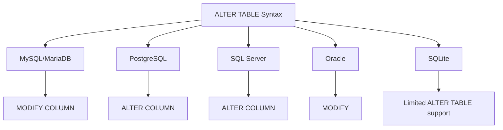

# SQL ALTER TABLE

## Introduction

The `ALTER TABLE` statement is a powerful SQL command that allows you to modify the structure of an existing database table without losing the data it contains. As your application evolves, you'll often need to make changes to your database schema - adding new columns, modifying data types, or implementing constraints. The `ALTER TABLE` statement makes these modifications possible.

This guide will walk you through the various ways you can use `ALTER TABLE` to modify your database tables, with practical examples to help you understand each concept.

## Basic Syntax

The general syntax of the `ALTER TABLE` statement is:

```sql
ALTER TABLE table_name
action;
```

Where `action` can be one of several operations we'll explore below.

## Adding Columns

One of the most common uses of `ALTER TABLE` is to add a new column to an existing table.

### Syntax

```sql
ALTER TABLE table_name
ADD column_name data_type [constraints];
```

### Example

Let's say we have a simple `users` table:

```sql
CREATE TABLE users (
    user_id INT PRIMARY KEY,
    username VARCHAR(50) NOT NULL,
    email VARCHAR(100) NOT NULL
);
```

Now, we want to add a `registration_date` column:

```sql
ALTER TABLE users
ADD registration_date DATE;
```

This will add a new column called `registration_date` of type `DATE` to the `users` table. All existing rows will have a `NULL` value for this new column.

If you want to add a column with a default value:

```sql
ALTER TABLE users
ADD last_login_date DATETIME DEFAULT CURRENT_TIMESTAMP;
```

### Adding Multiple Columns

In many SQL databases, you can add multiple columns in a single `ALTER TABLE` statement:

```sql
ALTER TABLE users
ADD phone_number VARCHAR(20),
ADD address VARCHAR(200),
ADD is_active BOOLEAN DEFAULT TRUE;
```

## Modifying Columns

Sometimes you need to change the data type or constraints of an existing column.

### Syntax

The syntax varies slightly between database systems:

**MySQL/MariaDB:**
```sql
ALTER TABLE table_name
MODIFY COLUMN column_name new_data_type [constraints];
```

**PostgreSQL:**
```sql
ALTER TABLE table_name
ALTER COLUMN column_name TYPE new_data_type [USING expression];
```

**SQL Server:**
```sql
ALTER TABLE table_name
ALTER COLUMN column_name new_data_type [constraints];
```

**Oracle:**
```sql
ALTER TABLE table_name
MODIFY column_name new_data_type [constraints];
```

### Example

Let's modify the `username` column in our `users` table to allow longer usernames:

**MySQL/MariaDB:**
```sql
ALTER TABLE users
MODIFY COLUMN username VARCHAR(100) NOT NULL;
```

**PostgreSQL:**
```sql
ALTER TABLE users
ALTER COLUMN username TYPE VARCHAR(100);
```

**SQL Server:**
```sql
ALTER TABLE users
ALTER COLUMN username VARCHAR(100) NOT NULL;
```

**Oracle:**
```sql
ALTER TABLE users
MODIFY username VARCHAR(100) NOT NULL;
```

## Renaming Columns

If you need to rename a column, most modern database systems provide a way to do this.

### Syntax

**MySQL (version 8.0+):**
```sql
ALTER TABLE table_name
RENAME COLUMN old_column_name TO new_column_name;
```

**PostgreSQL:**
```sql
ALTER TABLE table_name
RENAME COLUMN old_column_name TO new_column_name;
```

**SQL Server:**
```sql
EXEC sp_rename 'table_name.old_column_name', 'new_column_name', 'COLUMN';
```

**Oracle:**
```sql
ALTER TABLE table_name
RENAME COLUMN old_column_name TO new_column_name;
```

### Example

Let's rename the `email` column to `email_address`:

**MySQL (version 8.0+)/PostgreSQL/Oracle:**
```sql
ALTER TABLE users
RENAME COLUMN email TO email_address;
```

**SQL Server:**
```sql
EXEC sp_rename 'users.email', 'email_address', 'COLUMN';
```

## Dropping Columns

When a column is no longer needed, you can remove it from your table.

### Syntax

```sql
ALTER TABLE table_name
DROP COLUMN column_name;
```

### Example

Let's remove the `phone_number` column:

```sql
ALTER TABLE users
DROP COLUMN phone_number;
```

### Dropping Multiple Columns

In some database systems, you can drop multiple columns in a single statement:

```sql
ALTER TABLE users
DROP COLUMN phone_number,
DROP COLUMN address;
```

## Adding Constraints

You can add constraints to existing tables using `ALTER TABLE`.

### Adding a PRIMARY KEY

```sql
ALTER TABLE table_name
ADD PRIMARY KEY (column_name);
```

### Adding a FOREIGN KEY

```sql
ALTER TABLE table_name
ADD CONSTRAINT constraint_name
FOREIGN KEY (column_name) REFERENCES referenced_table(referenced_column);
```

### Adding a UNIQUE Constraint

```sql
ALTER TABLE table_name
ADD CONSTRAINT constraint_name UNIQUE (column_name);
```

### Adding a CHECK Constraint

```sql
ALTER TABLE table_name
ADD CONSTRAINT constraint_name CHECK (condition);
```

### Example

Let's add a unique constraint to the `email_address` column in our `users` table:

```sql
ALTER TABLE users
ADD CONSTRAINT unique_email UNIQUE (email_address);
```

Now, let's add a check constraint to ensure the `username` contains at least 3 characters:

```sql
ALTER TABLE users
ADD CONSTRAINT check_username_length CHECK (LENGTH(username) >= 3);
```

## Dropping Constraints

You can also remove constraints using `ALTER TABLE`.

### Syntax

```sql
ALTER TABLE table_name
DROP CONSTRAINT constraint_name;
```

For PRIMARY KEY (some databases):
```sql
ALTER TABLE table_name
DROP PRIMARY KEY;
```

### Example

Let's drop the unique constraint on the `email_address` column:

```sql
ALTER TABLE users
DROP CONSTRAINT unique_email;
```

## Renaming Tables

You can rename tables using the `ALTER TABLE` statement in most SQL databases:

### Syntax

**MySQL/PostgreSQL/Oracle:**
```sql
ALTER TABLE old_table_name
RENAME TO new_table_name;
```

**SQL Server:**
```sql
EXEC sp_rename 'old_table_name', 'new_table_name';
```

### Example

Let's rename our `users` table to `app_users`:

**MySQL/PostgreSQL/Oracle:**
```sql
ALTER TABLE users
RENAME TO app_users;
```

**SQL Server:**
```sql
EXEC sp_rename 'users', 'app_users';
```

## Real-World Example: Evolving a Product Database

Let's walk through a real-world scenario where we need to make multiple changes to a product database as our application evolves.

### Initial Table

```sql
CREATE TABLE products (
    product_id INT PRIMARY KEY,
    name VARCHAR(100) NOT NULL,
    price DECIMAL(10, 2) NOT NULL,
    description TEXT
);
```

### Phase 1: Adding Inventory Tracking

```sql
-- Add inventory-related columns
ALTER TABLE products
ADD stock_quantity INT DEFAULT 0,
ADD reorder_level INT DEFAULT 10;

-- Add a constraint to ensure stock doesn't go negative
ALTER TABLE products
ADD CONSTRAINT check_positive_stock CHECK (stock_quantity >= 0);
```

### Phase 2: Adding Categorization

```sql
-- Add category information
ALTER TABLE products
ADD category_id INT,
ADD brand VARCHAR(50);

-- Add a foreign key to a categories table
ALTER TABLE products
ADD CONSTRAINT fk_category
FOREIGN KEY (category_id) REFERENCES categories(category_id);
```

### Phase 3: Optimizing the Schema

```sql
-- Rename a confusing column
ALTER TABLE products
RENAME COLUMN name TO product_name;

-- Modify the price to support higher values
ALTER TABLE products
MODIFY COLUMN price DECIMAL(12, 2) NOT NULL;

-- Remove an unused field
ALTER TABLE products
DROP COLUMN description;
```

This example demonstrates how `ALTER TABLE` allows your database schema to evolve alongside your application without having to rebuild everything from scratch.

## Database System Differences

It's important to note that while the `ALTER TABLE` statement is part of the SQL standard, the exact syntax and capabilities can vary between different database management systems:



SQLite, in particular, has limited `ALTER TABLE` functionality compared to other systems. It supports adding columns and renaming tables, but not modifying or dropping columns directly.

## Best Practices

When using `ALTER TABLE`, keep these best practices in mind:

1. **Plan ahead**: Try to anticipate future needs when designing your tables to minimize alterations.

2. **Use transactions**: Wrap complex alterations in a transaction so you can roll back if something goes wrong.

3. **Test on a copy**: Test your alterations on a copy of the production database first.

4. **Consider performance**: Large tables may take significant time to alter, potentially causing downtime.

5. **Be careful with data types**: Changing a column's data type can lead to data loss if the new type can't store all values in the existing data.

6. **Document changes**: Keep track of all schema changes for future reference.

## Summary

The `ALTER TABLE` statement is an essential tool for managing database schema changes. It allows you to:

- Add new columns to existing tables
- Modify the data type or constraints of existing columns
- Rename columns
- Drop unnecessary columns
- Add or remove constraints
- Rename tables

Understanding how to use `ALTER TABLE` effectively will help you maintain and evolve your database schema as your application's requirements change over time.

## Practice Exercises

1. Create a `customers` table with basic information (id, name, email) and then use `ALTER TABLE` to add address fields.

2. Add a foreign key constraint to link a `orders` table with the `customers` table.

3. Change the data type of a `price` column from `DECIMAL(8,2)` to `DECIMAL(10,2)`.

4. Add a unique constraint to ensure no duplicate email addresses in a table.

5. Rename a table and some of its columns to follow a new naming convention.

## Additional Resources

- [MySQL ALTER TABLE Documentation](https://dev.mysql.com/doc/refman/8.0/en/alter-table.html)
- [PostgreSQL ALTER TABLE Documentation](https://www.postgresql.org/docs/current/sql-altertable.html)
- [SQL Server ALTER TABLE Documentation](https://docs.microsoft.com/en-us/sql/t-sql/statements/alter-table-transact-sql)
- [Oracle ALTER TABLE Documentation](https://docs.oracle.com/en/database/oracle/oracle-database/19/sqlrf/ALTER-TABLE.html)
- [W3Schools SQL ALTER TABLE Tutorial](https://www.w3schools.com/sql/sql_alter.asp)