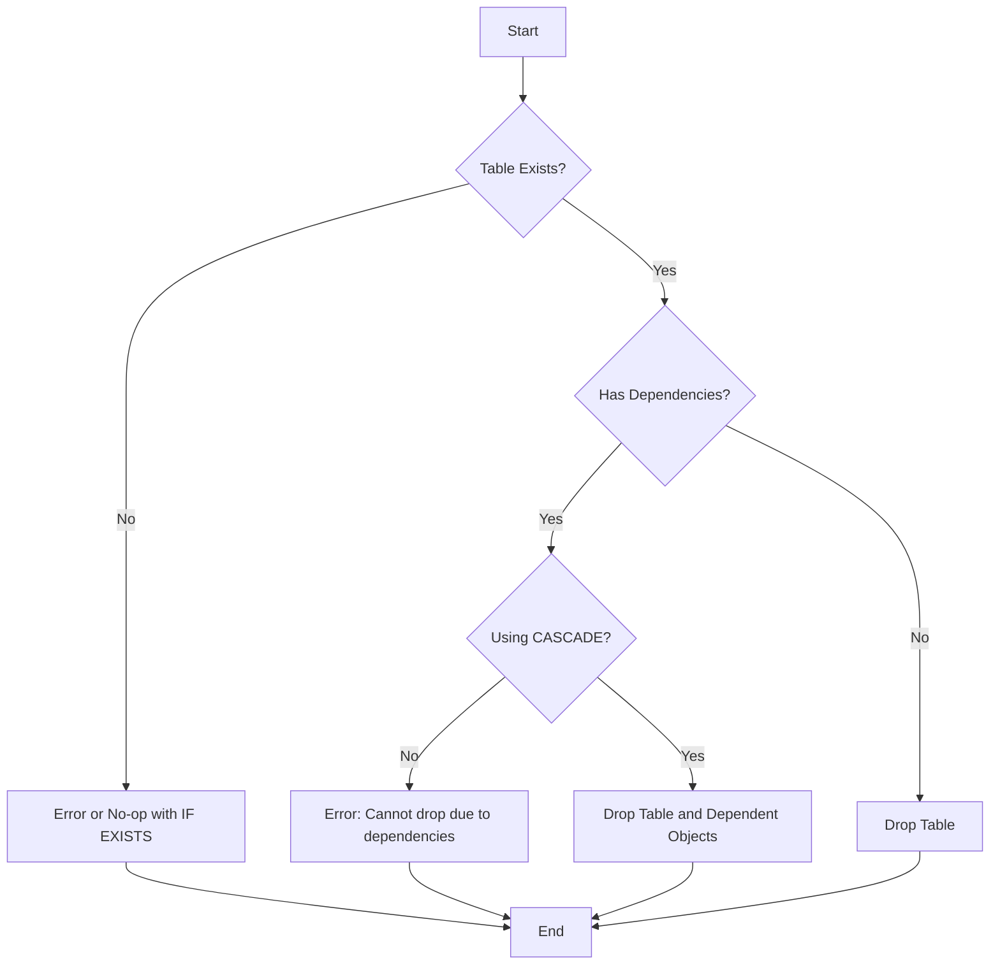

# SQL DROP TABLE

## Introduction

In SQL database management, tables are the fundamental structures used to store and organize data. However, there are situations where you need to completely remove a table from your database. The `DROP TABLE` statement is a Data Definition Language (DDL) command that allows you to permanently delete a table along with all its data, indexes, triggers, constraints, and permission specifications.

This tutorial will guide you through the process of dropping tables in SQL, covering syntax, practical examples, safety measures, and best practices.

## Basic Syntax

The basic syntax for dropping a table in SQL is:

```sql
DROP TABLE [IF EXISTS] table_name;
```

Where:
- `DROP TABLE` is the SQL command that specifies you want to remove a table
- `IF EXISTS` is an optional clause that prevents errors if the table doesn't exist
- `table_name` is the name of the table you want to drop

## Simple Examples

### Example 1: Dropping a table

```sql
DROP TABLE customers;
```

**Result:** The `customers` table is permanently removed from the database along with all its data.

### Example 2: Using IF EXISTS

```sql
DROP TABLE IF EXISTS temporary_logs;
```

**Result:** If the `temporary_logs` table exists, it will be dropped. If it doesn't exist, the query will execute without throwing an error.

## Caution and Safety Measures

Before dropping tables, consider these important safety measures:

1. **Data Loss:** The `DROP TABLE` command permanently deletes all data in the table. This action cannot be undone unless you have a backup.

2. **Backup First:** Always create a backup of your database or the specific table before dropping it.

3. **Dependencies:** Tables with foreign key relationships may cause errors when attempting to drop them.

## Handling Dependencies

When a table is referenced by foreign keys from other tables, you have several options:

### Using CASCADE (in database systems that support it)

```sql
DROP TABLE customers CASCADE;
```

This will drop the `customers` table and any objects that depend on it.

### Dropping Foreign Key Constraints First

```sql
-- First, drop the foreign key constraint
ALTER TABLE orders
DROP CONSTRAINT fk_customer_id;

-- Then drop the table
DROP TABLE customers;
```

## Practical Examples

### Example 1: Database Cleanup

Let's say you're cleaning up your database by removing temporary tables used for data processing:

```sql
-- Dropping multiple tables
DROP TABLE IF EXISTS temp_calculation;
DROP TABLE IF EXISTS import_staging;
DROP TABLE IF EXISTS data_processing_logs;
```

### Example 2: Testing Environment Reset

When resetting a testing environment, you might want to drop and recreate tables:

```sql
-- Drop tables if they exist
DROP TABLE IF EXISTS test_users;
DROP TABLE IF EXISTS test_orders;
DROP TABLE IF EXISTS test_products;

-- Create fresh tables
CREATE TABLE test_users (
    user_id INT PRIMARY KEY,
    username VARCHAR(50) NOT NULL,
    email VARCHAR(100) UNIQUE
);

-- More CREATE TABLE statements...
```

### Example 3: Schema Evolution

During application updates, you might replace an old table structure with a new one:

```sql
-- Create new table with desired structure
CREATE TABLE customers_new (
    customer_id INT PRIMARY KEY,
    full_name VARCHAR(100) NOT NULL,
    contact_number VARCHAR(15),
    email VARCHAR(100) UNIQUE,
    registration_date DATE DEFAULT CURRENT_DATE
);

-- Copy data from the old table to the new one
INSERT INTO customers_new (customer_id, full_name, contact_number, email)
SELECT customer_id, 
       CONCAT(first_name, ' ', last_name) AS full_name, 
       phone, 
       email 
FROM customers;

-- Drop the old table
DROP TABLE customers;

-- Rename the new table to the original name
ALTER TABLE customers_new RENAME TO customers;
```

## Differences Between Database Systems

Different database management systems may have variations in the `DROP TABLE` syntax:

### MySQL

```sql
DROP TABLE IF EXISTS table_name;
```

### PostgreSQL

```sql
DROP TABLE IF EXISTS table_name CASCADE;
```

The `CASCADE` option automatically drops objects that depend on the table.

### SQL Server

```sql
DROP TABLE IF EXISTS dbo.table_name;
```

SQL Server often includes the schema name (like `dbo`).

### Oracle

```sql
DROP TABLE table_name PURGE;
```

The `PURGE` option bypasses the recycle bin, completely removing the table.

## Best Practices

1. **Use IF EXISTS:** Always include the `IF EXISTS` clause to prevent errors when the table doesn't exist.

2. **Script and Test:** Script your DROP TABLE operations and test them in a development environment before running in production.

3. **Transaction Control:** Consider using transactions for complex operations:

```sql
BEGIN TRANSACTION;

-- Attempt to drop the table
DROP TABLE IF EXISTS products;

-- If something goes wrong, you can rollback
-- ROLLBACK;

-- If everything is fine, commit the changes
COMMIT;
```

4. **Document Changes:** Keep a log of structural changes to your database, including dropped tables.

5. **Check Dependencies:** Before dropping a table, check if other objects depend on it:

```sql
-- For PostgreSQL
SELECT * FROM pg_depend 
WHERE refobjid = 'table_name'::regclass::oid;

-- For SQL Server
SELECT * FROM sys.foreign_keys
WHERE referenced_object_id = OBJECT_ID('table_name');
```

## Common Errors and Solutions

### Error: Cannot drop table because it is referenced by a foreign key constraint

**Solution:** Identify and remove the foreign key constraints first, or use CASCADE (if supported).

```sql
-- Find foreign key constraints (SQL Server example)
SELECT name FROM sys.foreign_keys
WHERE referenced_object_id = OBJECT_ID('customers');

-- Drop the constraints before dropping the table
ALTER TABLE orders DROP CONSTRAINT FK_orders_customers;
```

### Error: Table is locked by another process

**Solution:** Identify blocking processes and wait or terminate them.

```sql
-- In PostgreSQL
SELECT * FROM pg_locks WHERE relation = 'table_name'::regclass::oid;

-- In SQL Server
SELECT * FROM sys.dm_tran_locks 
WHERE resource_associated_entity_id = OBJECT_ID('table_name');
```

## Visualizing the DROP TABLE Process



## Summary

The SQL `DROP TABLE` command is a powerful DDL statement for removing tables from a database. Key points to remember:

- Use `DROP TABLE table_name` to permanently remove a table and all its data
- Include `IF EXISTS` to prevent errors when the table doesn't exist
- Consider table dependencies and use appropriate methods to handle them
- Always backup your data before dropping tables
- Understand differences between database management systems
- Follow best practices to ensure safe operations

## Exercises

1. Write a SQL statement to drop a table named `old_inventory` if it exists.
2. Create a SQL script that safely drops a table named `users` and recreates it with a different structure.
3. How would you drop multiple related tables in the correct order to avoid foreign key constraint errors?
4. Write a transaction that attempts to drop a table and rolls back if an error occurs.

## Additional Resources

- [MySQL DROP TABLE Documentation](https://dev.mysql.com/doc/refman/8.0/en/drop-table.html)
- [PostgreSQL DROP TABLE Documentation](https://www.postgresql.org/docs/current/sql-droptable.html)
- [SQL Server DROP TABLE Documentation](https://learn.microsoft.com/en-us/sql/t-sql/statements/drop-table-transact-sql)
- [Oracle DROP TABLE Documentation](https://docs.oracle.com/en/database/oracle/oracle-database/19/sqlrf/DROP-TABLE.html)