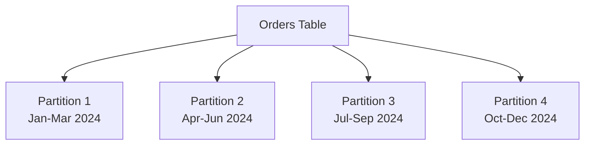
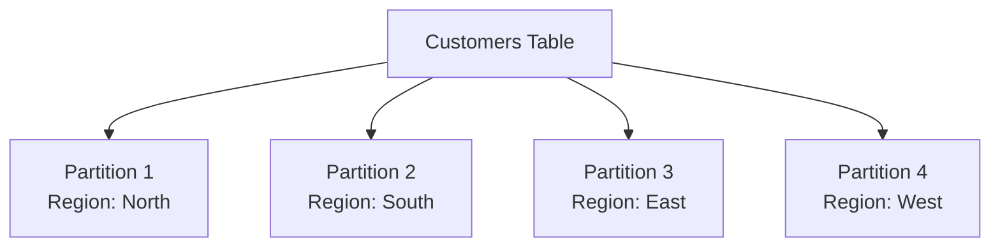

# SQL Table Partitioning

## Introduction

Imagine you have a massive filing cabinet with years of documents. Finding a specific file would take considerable time as you'd need to search through all the drawers. What if you organized the cabinet by year, with each drawer containing documents from a specific time period? That's essentially what table partitioning does for databases.

Table partitioning is a technique that divides large database tables into smaller, more manageable pieces called partitions, while still being treated as a single logical table. Each partition contains a specific subset of the data based on partition criteria like date ranges, value lists, or other conditions.

For growing applications dealing with large datasets, partitioning can significantly improve query performance, maintenance operations, and data manageability.

## Why Use Table Partitioning?

Before diving into how partitioning works, let's understand why it's valuable:

- **Improved query performance**: Queries that filter on the partitioning column can skip irrelevant partitions (partition pruning), reducing I/O operations
- **Easier maintenance**: Operations like backups, index rebuilds, or data archiving can target specific partitions instead of entire tables
- **Better data lifecycle management**: Old data can be easily archived or deleted by dropping partitions
- **Increased availability**: Maintenance on one partition doesn't affect access to other partitions
- **Parallel operations**: Some database systems can parallelize operations across multiple partitions

## Types of Table Partitioning

There are several common types of table partitioning:

### 1. Range Partitioning

This partitions data based on a range of values, commonly used with dates or sequential values.



### 2. List Partitioning

This divides data based on discrete values or lists of values, useful for categorical data.



### 3. Hash Partitioning

This distributes data evenly across partitions using a hashing algorithm on the partition key, useful for data without a clear logical dividing strategy.

### 4. Composite Partitioning

This combines multiple partitioning methods, such as first partitioning by range and then by list within each range partition.

## Implementing Table Partitioning

Let's explore practical examples of implementing table partitioning across different database systems.

### Example 1: Range Partitioning in PostgreSQL

Imagine we have a large `sales` table with millions of records spanning multiple years. We'll partition it by order date:

```sql
-- Create a partitioned table
CREATE TABLE sales (
    sale_id INT NOT NULL,
    product_id INT NOT NULL,
    customer_id INT NOT NULL,
    sale_date DATE NOT NULL,
    amount DECIMAL(10,2) NOT NULL
) PARTITION BY RANGE (sale_date);

-- Create partitions for different quarters
CREATE TABLE sales_q1_2024 PARTITION OF sales
    FOR VALUES FROM ('2024-01-01') TO ('2024-04-01');

CREATE TABLE sales_q2_2024 PARTITION OF sales
    FOR VALUES FROM ('2024-04-01') TO ('2024-07-01');

CREATE TABLE sales_q3_2024 PARTITION OF sales
    FOR VALUES FROM ('2024-07-01') TO ('2024-10-01');

CREATE TABLE sales_q4_2024 PARTITION OF sales
    FOR VALUES FROM ('2024-10-01') TO ('2025-01-01');
```

When you query the `sales` table for a specific date range, PostgreSQL automatically determines which partitions to scan:

```sql
-- This query will only scan the Q1 partition
SELECT * FROM sales 
WHERE sale_date BETWEEN '2024-02-01' AND '2024-03-15';
```

### Example 2: List Partitioning in MySQL

For a `customers` table that you want to partition by region:

```sql
CREATE TABLE customers (
    customer_id INT NOT NULL,
    name VARCHAR(100) NOT NULL,
    region VARCHAR(20) NOT NULL,
    email VARCHAR(100),
    created_at DATETIME
)
PARTITION BY LIST COLUMNS(region) (
    PARTITION p_north VALUES IN ('North'),
    PARTITION p_south VALUES IN ('South'),
    PARTITION p_east VALUES IN ('East'),
    PARTITION p_west VALUES IN ('West')
);
```

Querying customers from a specific region will only access the relevant partition:

```sql
-- This query will only scan the North partition
SELECT * FROM customers WHERE region = 'North';
```

### Example 3: Hash Partitioning in Oracle

When you need to distribute data evenly without a logical division:

```sql
CREATE TABLE orders (
    order_id NUMBER NOT NULL,
    customer_id NUMBER NOT NULL,
    product_id NUMBER NOT NULL,
    order_date DATE,
    amount NUMBER(10,2)
)
PARTITION BY HASH (customer_id)
PARTITIONS 4
STORE IN (tablespace1, tablespace2, tablespace3, tablespace4);
```

This distributes rows evenly across 4 partitions based on a hash of the customer_id.

## Real-World Applications

### Application 1: Time-Series Data Management

A common use case for partitioning is managing time-series data, such as logs, events, or transactions.

**Scenario**: An e-commerce platform tracking billions of user events

**Solution**: Range partition by month, making it easy to:
- Quickly query recent data (most frequent access pattern)
- Archive or purge old data by simply dropping old partitions
- Add new partitions for new time periods

```sql
-- Partition an events table by month
CREATE TABLE user_events (
    event_id BIGINT NOT NULL,
    user_id INT NOT NULL,
    event_type VARCHAR(50) NOT NULL,
    event_time TIMESTAMP NOT NULL,
    event_data JSONB
) PARTITION BY RANGE (event_time);

-- Create monthly partitions
CREATE TABLE user_events_202401 PARTITION OF user_events
    FOR VALUES FROM ('2024-01-01') TO ('2024-02-01');
    
CREATE TABLE user_events_202402 PARTITION OF user_events
    FOR VALUES FROM ('2024-02-01') TO ('2024-03-01');

-- And so on...
```

**Performance impact**: Queries like "Get all user activity from last month" will only scan one partition instead of the entire table, potentially improving query speed by orders of magnitude.

### Application 2: Multi-Tenant Applications

For SaaS applications serving multiple customers (tenants) from the same database:

**Scenario**: A CRM platform with hundreds of business customers, each with their own data

**Solution**: List partition by tenant_id or hash partition if there are many tenants:

```sql
CREATE TABLE customer_data (
    data_id BIGINT NOT NULL,
    tenant_id INT NOT NULL,
    created_at TIMESTAMP,
    data_payload TEXT
) PARTITION BY LIST (tenant_id);

-- Create partitions for major customers
CREATE TABLE customer_data_tenant1 PARTITION OF customer_data
    FOR VALUES IN (1);
    
CREATE TABLE customer_data_tenant2 PARTITION OF customer_data
    FOR VALUES IN (2);

-- Maybe a partition for smaller customers
CREATE TABLE customer_data_others PARTITION OF customer_data
    FOR VALUES IN (3, 4, 5, 6, 7, 8);
```

**Benefits**: 
- Improved isolation between tenants
- Ability to apply different backup or performance tuning strategies per tenant
- Option to migrate specific tenants to dedicated hardware by moving partitions

## Best Practices for Table Partitioning

1. **Choose the right partitioning key**: Select columns that are frequently used in WHERE clauses
2. **Don't over-partition**: Too many partitions can increase management overhead
3. **Consider partition pruning**: Ensure your queries can take advantage of partition elimination
4. **Plan for growth**: Design your partitioning scheme with future data growth in mind
5. **Test thoroughly**: Verify performance improvements with real-world query patterns
6. **Keep partitions balanced**: Avoid situations where one partition grows much larger than others
7. **Use partitioning with indexes**: Consider both partitioning and proper indexing strategies

## Potential Challenges

Table partitioning isn't without challenges:

1. **Maintenance overhead**: More objects to manage in your database
2. **Constraint limitations**: Some databases restrict certain constraints on partitioned tables
3. **Query complexity**: Not all queries benefit from partitioning
4. **Migration effort**: Converting existing tables to partitioned tables requires planning

## Summary

Table partitioning is a powerful technique for managing large datasets by dividing tables into smaller, more manageable pieces based on defined criteria. It offers significant performance improvements for queries that can leverage partition pruning, simplifies maintenance operations, and enables more efficient data lifecycle management.

By understanding the different partitioning strategies and their appropriate use cases, you can implement effective partitioning schemes that scale with your application's growth.

## Additional Resources and Exercises

### Resources
- [PostgreSQL Partitioning Documentation](https://www.postgresql.org/docs/current/ddl-partitioning.html)
- [MySQL Partitioning Guide](https://dev.mysql.com/doc/refman/8.0/en/partitioning.html)
- [Oracle Partitioning Documentation](https://docs.oracle.com/en/database/oracle/oracle-database/19/vldbg/partition-concepts.html)

### Exercises

1. **Basic Partitioning Exercise**:
   Create a partitioned table for storing temperature readings by month, then insert sample data and run queries against specific time periods.

2. **Partition Maintenance Task**:
   Write scripts to automatically create new partitions for upcoming months and archive data from partitions older than one year.

3. **Performance Comparison**:
   Create both a partitioned and non-partitioned version of the same table with identical data, then compare query performance for various scenarios.

4. **Multi-Level Partitioning Challenge**:
   Design a partitioning strategy for a global e-commerce database that efficiently handles queries filtered by both date ranges and geographic regions.