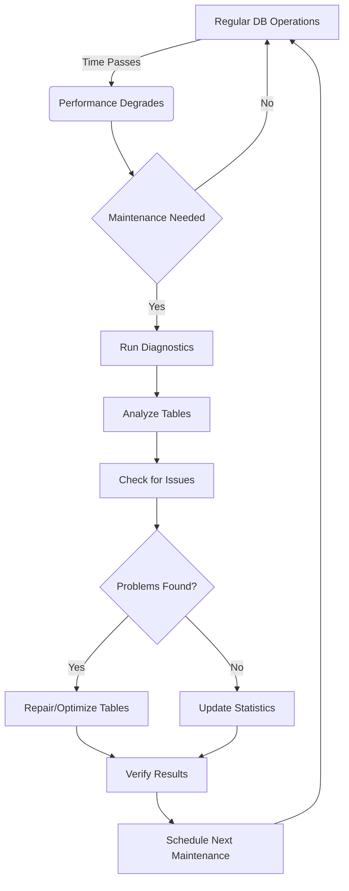

# SQL Table Maintenance

Database tables, like any system, require regular maintenance to ensure optimal performance and reliability. In this guide, we'll explore essential SQL table maintenance operations that will help you keep your databases running smoothly.

## Introduction

Table maintenance involves several key operations that help manage the health and performance of your database tables. These operations include:

- **Analyzing tables** to collect statistics
- **Optimizing tables** to improve performance
- **Repairing tables** when corruption occurs
- **Managing storage space** through various techniques

Whether you're managing a small application database or a large enterprise system, understanding these maintenance tasks is crucial for database administrators and developers alike.

## Why Table Maintenance Matters

Over time, as data is inserted, updated, and deleted from tables:

1. **Fragmentation** occurs when data becomes scattered across storage
2. **Indexes** become inefficient and may need rebuilding
3. **Statistics** become outdated, affecting query optimization
4. **Storage space** may be wasted due to deleted records

Regular maintenance addresses these issues, keeping your database performant and reliable.

## Key Table Maintenance Operations

### Analyzing Tables

The `ANALYZE TABLE` command collects statistics about a table, which the database query optimizer uses to determine the most efficient way to execute queries.

```sql
-- Basic syntax
ANALYZE TABLE table_name;

-- Example with multiple tables
ANALYZE TABLE customers, orders;
```

#### Example: Analyzing a Table

```sql
-- Analyze the customers table
ANALYZE TABLE customers;
```

**Output:**
```
+---------------+---------+----------+----------+
| Table         | Op      | Msg_type | Msg_text |
+---------------+---------+----------+----------+
| shop.customers| analyze | status   | OK       |
+---------------+---------+----------+----------+
```

After analysis, the query optimizer has better information about your data distribution, potentially improving query performance without any other changes.

### Optimizing Tables

Table optimization rebuilds the table to defragment data, update statistics, and reclaim unused space.

```sql
-- Basic syntax
OPTIMIZE TABLE table_name;

-- With additional options (MySQL)
OPTIMIZE TABLE table_name [LOCAL | NO_WRITE_TO_BINLOG];
```

#### Example: Optimizing a Table with Many Deletions

Imagine you have an `orders` table where many old orders have been deleted:

```sql
-- Optimize the orders table
OPTIMIZE TABLE orders;
```

**Output:**
```
+-------------+----------+----------+----------------------------+
| Table       | Op       | Msg_type | Msg_text                   |
+-------------+----------+----------+----------------------------+
| shop.orders | optimize | status   | Table is already up to date|
+-------------+----------+----------+----------------------------+
```

This operation reorganizes the physical storage of table data and index data to reduce storage space and improve I/O efficiency when accessing the table.

### Repairing Tables

If tables become corrupted due to system crashes or other issues, you can use the `REPAIR TABLE` command (note: this is primarily used in MyISAM tables in MySQL).

```sql
-- Basic syntax
REPAIR TABLE table_name;

-- With options
REPAIR TABLE table_name [QUICK | EXTENDED | USE_FRM];
```

#### Example: Repairing a Corrupted Table

```sql
-- Repair a potentially corrupted table
REPAIR TABLE products;
```

**Output:**
```
+---------------+--------+----------+----------+
| Table         | Op     | Msg_type | Msg_text |
+---------------+--------+----------+----------+
| shop.products | repair | status   | OK       |
+---------------+--------+----------+----------+
```

### Checking Tables

The `CHECK TABLE` command verifies table integrity and reports errors if found.

```sql
-- Basic syntax
CHECK TABLE table_name;

-- With options
CHECK TABLE table_name [QUICK | MEDIUM | EXTENDED | CHANGED];
```

#### Example: Checking Table Integrity

```sql
-- Check the inventory table
CHECK TABLE inventory;
```

**Output:**
```
+----------------+-------+----------+----------+
| Table          | Op    | Msg_type | Msg_text |
+----------------+-------+----------+----------+
| shop.inventory | check | status   | OK       |
+----------------+-------+----------+----------+
```

### Managing Table Storage

#### Reclaiming Space with TRUNCATE

If you need to delete all records but keep the table structure, `TRUNCATE` is faster than `DELETE` and immediately reclaims storage space.

```sql
-- Remove all data while keeping structure
TRUNCATE TABLE temp_logs;
```

Before executing this command, ensure you no longer need the data, as this operation cannot be rolled back in most database systems.

#### Rebuilding Tables

For more extensive reorganization, you can rebuild a table entirely:

```sql
-- MySQL example of rebuilding a table
ALTER TABLE customers ENGINE=InnoDB;
```

This forces a complete rebuild of the table and its indexes, which can significantly improve performance for tables that have undergone many modifications.

## Automated Maintenance Strategies

### Using Events for Scheduled Maintenance

In MySQL, you can create events that run maintenance tasks automatically:

```sql
-- Create an event that optimizes tables weekly
CREATE EVENT weekly_table_maintenance
ON SCHEDULE EVERY 1 WEEK
DO
BEGIN
  ANALYZE TABLE customers;
  OPTIMIZE TABLE orders;
  CHECK TABLE inventory;
END;
```

### Partitioning for Easier Maintenance

Table partitioning divides large tables into smaller, more manageable pieces:

```sql
-- Create a partitioned table by year
CREATE TABLE order_history (
  order_id INT,
  customer_id INT,
  order_date DATE,
  total_amount DECIMAL(10,2)
)
PARTITION BY RANGE (YEAR(order_date)) (
  PARTITION p0 VALUES LESS THAN (2020),
  PARTITION p1 VALUES LESS THAN (2021),
  PARTITION p2 VALUES LESS THAN (2022),
  PARTITION p3 VALUES LESS THAN (2023),
  PARTITION p4 VALUES LESS THAN MAXVALUE
);
```

With partitioning, you can perform maintenance on individual partitions while keeping others available:

```sql
-- Optimize just one partition
ALTER TABLE order_history OPTIMIZE PARTITION p1;
```

## Database-Specific Maintenance Considerations

Maintenance operations vary between database systems:

### MySQL/MariaDB
- `OPTIMIZE TABLE` works on InnoDB and MyISAM tables
- `REPAIR TABLE` primarily for MyISAM tables
- Table maintenance can be performed online in newer versions

### PostgreSQL
- `VACUUM` removes dead tuples and updates statistics
- `ANALYZE` collects statistics on tables
- `REINDEX` rebuilds indexes

```sql
-- PostgreSQL maintenance examples
VACUUM ANALYZE customers;
REINDEX TABLE products;
```

### SQL Server
- `DBCC CHECKDB` checks database integrity
- `ALTER INDEX REBUILD` or `REORGANIZE` for index maintenance
- Statistics are often automatically updated

```sql
-- SQL Server maintenance examples
DBCC CHECKDB('ShopDB');
ALTER INDEX ALL ON customers REBUILD;
```

### Oracle
- `ANALYZE TABLE` gathers statistics
- `ALTER TABLE SHRINK SPACE` reclaims space
- Automatic Segment Space Management (ASSM) helps reduce fragmentation

```sql
-- Oracle maintenance examples
ANALYZE TABLE customers COMPUTE STATISTICS;
ALTER TABLE orders SHRINK SPACE CASCADE;
```

## Visualizing the Maintenance Workflow

Here's a diagram showing a typical database maintenance workflow:



## Best Practices for Table Maintenance

1. **Schedule maintenance during low-traffic periods** to minimize impact on users
2. **Regularly check table and index statistics** to ensure the query optimizer has current information
3. **Monitor table growth and fragmentation** to anticipate maintenance needs
4. **Back up before major maintenance operations** to prevent data loss
5. **Document maintenance procedures** for consistency and training
6. **Automate routine maintenance tasks** when possible
7. **Test maintenance operations in non-production environments** before applying to production

## Real-World Application: E-commerce Database Maintenance

Consider an e-commerce platform with several critical tables:

- `products` (frequently updated inventory)
- `customers` (steadily growing user base)
- `orders` (high insert rate)
- `order_items` (high insert rate)
- `order_history` (rarely accessed older data)

A practical maintenance strategy might look like:

```sql
-- Daily maintenance for frequently accessed tables
ANALYZE TABLE products;
ANALYZE TABLE orders;

-- Weekly optimization for tables with many changes
OPTIMIZE TABLE products;
OPTIMIZE TABLE order_items;

-- Monthly maintenance for stable tables
ANALYZE TABLE customers;
OPTIMIZE TABLE customers;

-- Quarterly maintenance for archival data
OPTIMIZE TABLE order_history;
```

This tiered approach prioritizes maintenance based on usage patterns and importance.

## Summary

Effective SQL table maintenance is essential for:

1. Maintaining optimal query performance
2. Ensuring data integrity
3. Managing storage space efficiently
4. Preventing potential issues before they affect users

By implementing regular analysis, optimization, and repair procedures, you can ensure your database continues to perform well as it grows and evolves.

## Additional Resources

- [MySQL Maintenance Documentation](https://dev.mysql.com/doc/refman/8.0/en/mysql-server-maintenance.html)
- [PostgreSQL Routine Maintenance](https://www.postgresql.org/docs/current/routine-vacuuming.html)
- [SQL Server Maintenance Plans](https://docs.microsoft.com/en-us/sql/relational-databases/maintenance-plans/maintenance-plans)

## Exercises

1. Create a maintenance script that checks, analyzes, and optimizes all tables in a database.
2. Research how to identify tables that would benefit most from optimization in your specific database system.
3. Set up a scheduled event that performs weekly maintenance during off-hours.
4. Compare the performance of a frequently used query before and after table optimization.
5. Design a monitoring system that alerts administrators when tables might need maintenance.