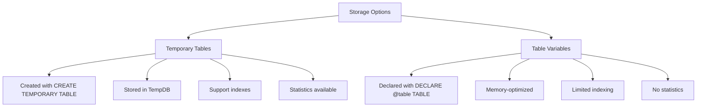

# SQL Temporary Tables

## Introduction

Temporary tables in SQL are special types of tables that allow you to store data temporarily during a database session. They function similarly to regular tables but exist only for the duration of a session or transaction, after which they are automatically dropped by the database system.

Temporary tables are particularly useful when you need to:
- Store intermediate results for complex queries
- Break down complicated operations into simpler steps
- Improve query performance by reducing redundant calculations
- Organize data temporarily before final processing

In this tutorial, we'll explore how to create and work with temporary tables in SQL, along with practical examples to help you understand when and how to use them effectively.

## Creating Temporary Tables

There are two main ways to create temporary tables in SQL:

### Method 1: CREATE TEMPORARY TABLE

The most common way to create a temporary table is using the `CREATE TEMPORARY TABLE` statement:

```sql
CREATE TEMPORARY TABLE temp_employees (
    id INT,
    name VARCHAR(100),
    department VARCHAR(50),
    salary DECIMAL(10,2)
);
```

This creates a temporary table named `temp_employees` with four columns.

### Method 2: SELECT INTO

Some database systems allow you to create temporary tables using the `SELECT INTO` syntax:

```sql
SELECT id, name, department, salary
INTO #temp_employees
FROM employees
WHERE department = 'Engineering';
```

> **Note**: In SQL Server, temporary tables are often prefixed with a single hash (`#`) for local temporary tables or double hash (`##`) for global temporary tables. Syntax may vary across different database systems.

## Populating Temporary Tables

You can populate temporary tables just like regular tables, using `INSERT` statements:

```sql
-- Insert single row
INSERT INTO temp_employees (id, name, department, salary)
VALUES (1, 'John Doe', 'Engineering', 85000.00);

-- Insert multiple rows
INSERT INTO temp_employees (id, name, department, salary)
VALUES
    (2, 'Jane Smith', 'Engineering', 92000.00),
    (3, 'Bob Johnson', 'Engineering', 78000.00);

-- Insert data from an existing table
INSERT INTO temp_employees
SELECT id, name, department, salary
FROM employees
WHERE department = 'Marketing';
```

## Example: Using Temporary Tables for Intermediate Results

Let's walk through a practical example where temporary tables can simplify a complex task:

**Scenario**: You need to calculate the average salary by department, but only for departments with more than 5 employees.

Without temporary tables, you might need a complex query with subqueries. Using temporary tables, you can break it down:

```sql
-- Step 1: Create a temporary table to store department counts
CREATE TEMPORARY TABLE dept_counts AS
SELECT department, COUNT(*) as emp_count
FROM employees
GROUP BY department;

-- Step 2: Create a temporary table for departments with > 5 employees
CREATE TEMPORARY TABLE qualifying_depts AS
SELECT department
FROM dept_counts
WHERE emp_count > 5;

-- Step 3: Calculate average salaries for qualifying departments
SELECT e.department, AVG(e.salary) as avg_salary
FROM employees e
JOIN qualifying_depts q ON e.department = q.department
GROUP BY e.department;
```

**Output example**:
```
department   | avg_salary
-------------+-----------
Engineering  | 88750.50
Marketing    | 76200.75
Sales        | 82300.25
```

By breaking down the problem, we've made the query more readable and potentially more efficient.

## When to Use Temporary Tables

Temporary tables are particularly useful in the following scenarios:

1. **Multi-step data processing**: When you need to perform operations in stages
2. **Performance optimization**: To avoid recalculating the same subquery multiple times
3. **Storing intermediate results**: When working with complex data transformations
4. **Simplifying complex joins**: Breaking down queries with multiple joins into simpler steps

## Differences Between Temporary Tables and Table Variables

Many SQL systems also offer table variables as an alternative to temporary tables. Here's a comparison:



## Real-World Example: Sales Report Generation

Let's look at a practical example of using temporary tables to generate a sales report:

```sql
-- Create temporary table for monthly sales
CREATE TEMPORARY TABLE monthly_sales AS
SELECT 
    product_id,
    DATE_TRUNC('month', sale_date) AS month,
    SUM(quantity) AS units_sold,
    SUM(quantity * price) AS revenue
FROM sales
GROUP BY product_id, DATE_TRUNC('month', sale_date);

-- Create temporary table for product categories
CREATE TEMPORARY TABLE product_categories AS
SELECT p.product_id, p.name AS product_name, c.name AS category
FROM products p
JOIN categories c ON p.category_id = c.id;

-- Generate final report
SELECT 
    pc.category,
    pc.product_name,
    ms.month,
    ms.units_sold,
    ms.revenue,
    ms.revenue / ms.units_sold AS avg_price
FROM monthly_sales ms
JOIN product_categories pc ON ms.product_id = pc.product_id
ORDER BY pc.category, pc.product_name, ms.month;
```

**Output example**:
```
category    | product_name     | month      | units_sold | revenue  | avg_price
------------+------------------+------------+------------+----------+----------
Electronics | Smartphone X     | 2023-01-01 | 120        | 60000.00 | 500.00
Electronics | Smartphone X     | 2023-02-01 | 145        | 72500.00 | 500.00
Electronics | Wireless Earbuds | 2023-01-01 | 200        | 19800.00 | 99.00
Home        | Coffee Maker     | 2023-01-01 | 85         | 8500.00  | 100.00
```

## Scope and Lifetime of Temporary Tables

Temporary tables have different scopes and lifetimes depending on the database system:

- **Session-level temporary tables**: Exist until the session ends
- **Transaction-level temporary tables**: Exist until the transaction ends
- **Local temporary tables**: Visible only to the connection that created them
- **Global temporary tables**: Visible to all connections

Here's how temporary tables are handled in different database systems:

| Database System | Syntax | Scope | Prefix |
|----------------|--------|-------|--------|
| MySQL | `CREATE TEMPORARY TABLE` | Session | None |
| PostgreSQL | `CREATE TEMPORARY TABLE` | Session | None |
| SQL Server | `CREATE TABLE #temp` | Connection | `#` (local) or `##` (global) |
| Oracle | `CREATE GLOBAL TEMPORARY TABLE` | Transaction or Session | None |
| SQLite | `CREATE TEMPORARY TABLE` | Connection | None |

## Common Operations with Temporary Tables

You can perform most standard SQL operations on temporary tables:

```sql
-- Query data
SELECT * FROM temp_employees;

-- Update data
UPDATE temp_employees 
SET salary = salary * 1.1
WHERE department = 'Engineering';

-- Delete data
DELETE FROM temp_employees
WHERE salary < 50000;

-- Join with other tables
SELECT t.name, t.salary, d.location
FROM temp_employees t
JOIN departments d ON t.department = d.name;

-- Drop the temporary table (optional, as it will be dropped automatically)
DROP TABLE temp_employees;
```

## Performance Considerations

While temporary tables are useful, keep these performance considerations in mind:

1. **Indexing**: Add indexes to temporary tables when performing operations on large datasets
2. **Memory usage**: Be aware of memory consumption with large temporary tables
3. **Alternative approaches**: For simple cases, CTEs (Common Table Expressions) or subqueries might be more efficient
4. **Clean-up**: Although temporary tables are automatically dropped, it's good practice to explicitly drop them when no longer needed

## Summary

Temporary tables in SQL provide a powerful tool for breaking down complex problems into more manageable steps. They allow you to store intermediate results temporarily, which can improve both query readability and performance.

Key takeaways:
- Temporary tables exist only for the duration of a session or transaction
- They're created using `CREATE TEMPORARY TABLE` or `SELECT INTO` (in some database systems)
- They're useful for storing intermediate results and simplifying complex queries
- Different database systems have slightly different implementations of temporary tables
- Consider performance implications when working with large temporary tables

## Practice Exercises

1. Create a temporary table containing the top 10 customers by total purchases.
2. Use a temporary table to find products that haven't had any sales in the last 30 days.
3. Implement a report that shows department performance using temporary tables to break down the calculation steps.
4. Compare the performance of a complex query with and without using temporary tables.

## Additional Resources

- [MySQL Temporary Tables Documentation](https://dev.mysql.com/doc/refman/8.0/en/temporary-tables.html)
- [PostgreSQL Temporary Tables](https://www.postgresql.org/docs/current/sql-createtable.html)
- [SQL Server Temporary Tables](https://docs.microsoft.com/en-us/sql/t-sql/statements/create-table-transact-sql)
- [Oracle Global Temporary Tables](https://docs.oracle.com/en/database/oracle/oracle-database/19/sqlrf/CREATE-GLOBAL-TEMPORARY-TABLE.html)