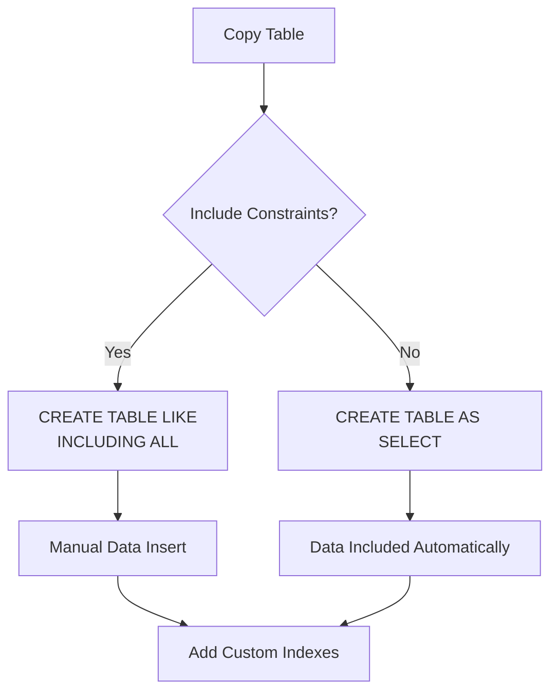

# SQL Copy Table

## Introduction

Copying database tables is a common operation in SQL that allows you to duplicate table structures and data. This can be useful for creating backups, testing new features without affecting production data, or migrating data between databases. In this tutorial, we'll explore different methods to copy tables in SQL, covering both structure and data duplication.

## Why Copy Tables?

Before diving into the how, let's understand why you might need to copy tables:

- **Creating backup copies** before making significant changes
- **Testing new features** with production-like data
- **Creating development or staging environments**
- **Archiving historical data** while maintaining the original table structure
- **Transferring data** between databases or servers

## Basic Table Copying Techniques

### Copying Table Structure Only

Sometimes you only need to duplicate a table's structure without its data. This is perfect for creating template tables or preparing for a data migration.

```sql
-- Basic syntax for copying just the table structure
CREATE TABLE new_table LIKE original_table;
```

This command creates an exact replica of the original table's structure, including:
- Column names and data types
- Primary keys
- Indexes
- Constraints (such as NOT NULL)

Example:

```sql
-- Create a sample employees table
CREATE TABLE employees (
    employee_id INT PRIMARY KEY,
    first_name VARCHAR(50) NOT NULL,
    last_name VARCHAR(50) NOT NULL,
    hire_date DATE,
    salary DECIMAL(10, 2)
);

-- Create an empty copy with the same structure
CREATE TABLE employees_backup LIKE employees;
```

### Copying Table with Complete Data

To create an exact duplicate of both structure and data:

```sql
-- Create a new table and copy all data
CREATE TABLE new_table AS SELECT * FROM original_table;
```

Example:

```sql
-- Copy employees table with all data
CREATE TABLE employees_complete_copy AS SELECT * FROM employees;
```

**Output:**
```
Query OK, X rows affected (0.XX sec)
```
Where X represents the number of rows copied.

### Copying Table with Partial Data

You can also selectively copy data by adding a WHERE clause:

```sql
-- Copy table with filtered data
CREATE TABLE new_table AS 
SELECT * FROM original_table
WHERE condition;
```

Example:

```sql
-- Copy only employees hired in 2023
CREATE TABLE employees_2023 AS 
SELECT * FROM employees
WHERE YEAR(hire_date) = 2023;
```

## Advanced Table Copying Techniques

### Copying with Specific Columns

You can choose to copy only specific columns:

```sql
-- Copy specific columns
CREATE TABLE new_table AS
SELECT column1, column2, column3
FROM original_table;
```

Example:

```sql
-- Create a simplified employee directory
CREATE TABLE employee_directory AS
SELECT employee_id, first_name, last_name
FROM employees;
```

### Copying with Transformed Data

You can transform data during the copy process:

```sql
-- Copy with data transformation
CREATE TABLE new_table AS
SELECT 
    column1,
    UPPER(column2) AS column2,
    column3 * 1.1 AS column3
FROM original_table;
```

Example:

```sql
-- Create a table with adjusted salaries
CREATE TABLE employees_salary_projection AS
SELECT 
    employee_id,
    first_name,
    last_name,
    salary AS current_salary,
    salary * 1.05 AS projected_salary
FROM employees;
```

### Copying Structure and Later Inserting Data

For more control, you can separate the structure copying and data insertion:

```sql
-- Step 1: Copy the structure
CREATE TABLE new_table LIKE original_table;

-- Step 2: Insert the data
INSERT INTO new_table
SELECT * FROM original_table;
```

This approach is useful when you need to:
- Modify the table structure before adding data
- Add indexes after data insertion (for better performance)
- Apply different transformations to different columns

Example:

```sql
-- Step 1: Create empty structure
CREATE TABLE employees_backup LIKE employees;

-- Step 2: Insert only active employees
INSERT INTO employees_backup
SELECT * FROM employees
WHERE termination_date IS NULL;
```

## Database-Specific Methods

Different database systems offer specific methods for copying tables.

### MySQL

MySQL provides specific syntax for handling duplicated primary keys:

```sql
-- Copy structure and data with INSERT IGNORE
CREATE TABLE new_table LIKE original_table;
INSERT IGNORE INTO new_table SELECT * FROM original_table;
```

Or to replace duplicates:

```sql
-- Copy with REPLACE to handle duplicates
CREATE TABLE new_table LIKE original_table;
REPLACE INTO new_table SELECT * FROM original_table;
```

### PostgreSQL

PostgreSQL offers table inheritance:

```sql
-- Create a new table inheriting the structure
CREATE TABLE new_table (LIKE original_table INCLUDING ALL);

-- Copy the data
INSERT INTO new_table SELECT * FROM original_table;
```

### SQL Server

SQL Server provides the SELECT INTO statement:

```sql
-- SQL Server syntax
SELECT * INTO new_table FROM original_table;
```

And for just the structure:

```sql
-- Copy only structure in SQL Server
SELECT * INTO new_table FROM original_table WHERE 1=0;
```

## Working with Constraints and Indexes

When copying tables, you need to consider how constraints and indexes are handled.



### Primary Keys

When using `CREATE TABLE AS SELECT`, primary keys usually aren't copied. You need to add them manually:

```sql
-- Add primary key after copying
CREATE TABLE employees_copy AS SELECT * FROM employees;
ALTER TABLE employees_copy ADD PRIMARY KEY (employee_id);
```

### Foreign Keys

Foreign keys typically need to be recreated:

```sql
-- Add foreign key after copying
ALTER TABLE employees_copy 
ADD CONSTRAINT fk_department
FOREIGN KEY (department_id) REFERENCES departments(department_id);
```

## Real-World Applications

### Creating a Historical Data Archive

As your database grows, you might want to archive old data while keeping it accessible:

```sql
-- Create an archive table
CREATE TABLE orders_archive LIKE orders;

-- Move completed orders older than 1 year to archive
INSERT INTO orders_archive
SELECT * FROM orders
WHERE order_status = 'Completed' 
AND order_date < DATE_SUB(CURRENT_DATE, INTERVAL 1 YEAR);

-- Remove archived orders from main table
DELETE FROM orders
WHERE order_status = 'Completed' 
AND order_date < DATE_SUB(CURRENT_DATE, INTERVAL 1 YEAR);
```

### Creating a Development Environment

When setting up a development environment, you often need a copy of production data:

```sql
-- Create dev tables with production structure
CREATE TABLE dev_customers LIKE production.customers;
CREATE TABLE dev_orders LIKE production.orders;

-- Copy a subset of data for testing
INSERT INTO dev_customers
SELECT * FROM production.customers
LIMIT 1000;

INSERT INTO dev_orders
SELECT o.* FROM production.orders o
JOIN dev_customers c ON o.customer_id = c.customer_id;
```

### Periodic Backup Creation

Automated backups with timestamps:

```sql
-- Create a timestamped backup
SET @backup_name = CONCAT('employees_backup_', DATE_FORMAT(NOW(), '%Y%m%d'));
SET @sql = CONCAT('CREATE TABLE ', @backup_name, ' AS SELECT * FROM employees');
PREPARE stmt FROM @sql;
EXECUTE stmt;
DEALLOCATE PREPARE stmt;
```

## Performance Considerations

Copying large tables can be resource-intensive. Here are some tips:

1. **Use transactions** for data consistency
2. **Schedule copies** during low-traffic periods
3. **Copy in batches** for very large tables
4. **Add indexes after** inserting data
5. **Consider disk space** requirements before copying
6. **Use server-side commands** like `mysqldump` for very large tables

Example of batch copying:

```sql
-- Copy large table in batches
CREATE TABLE large_table_copy LIKE large_table;

SET @batch_size = 10000;
SET @total_rows = (SELECT COUNT(*) FROM large_table);
SET @offset = 0;

WHILE @offset < @total_rows DO
    INSERT INTO large_table_copy
    SELECT * FROM large_table
    LIMIT @offset, @batch_size;
    
    SET @offset = @offset + @batch_size;
END WHILE;
```

## Common Errors and Troubleshooting

### Insufficient Storage Space

If you encounter space issues:

```
ERROR 1114 (HY000): The table 'new_table' is full
```

Solutions:
- Free up disk space
- Use a different storage location
- Optimize the table structure
- Copy only necessary columns or rows

### Duplicate Key Errors

When copying data that violates unique constraints:

```
ERROR 1062 (23000): Duplicate entry '1001' for key 'PRIMARY'
```

Solutions:
- Use `INSERT IGNORE` to skip duplicates
- Use `REPLACE INTO` to replace existing records
- Modify the data during copy to ensure uniqueness

### Handling NULL Values

When copying between tables with different NULL constraints:

```sql
-- Convert NULL values during copy
CREATE TABLE strict_employees AS
SELECT
    employee_id,
    first_name,
    last_name,
    COALESCE(phone_number, 'Not Available') AS phone_number
FROM employees;
```

## Summary

Copying SQL tables is a versatile operation with multiple approaches depending on your needs:

- Use `CREATE TABLE LIKE` when you only need the structure
- Use `CREATE TABLE AS SELECT` for structure and data
- Add `WHERE` clauses for selective data copying
- Consider constraints and indexes for complete copies
- Choose database-specific methods for optimal performance
- Be mindful of performance for large tables

Mastering table copying techniques allows you to efficiently manage database operations, create effective backup strategies, and maintain development environments with production-like data.

## Exercises

1. Create a copy of a customers table that includes only customers who have made a purchase in the last 6 months.
2. Create a backup copy of an employees table that transforms all email addresses to lowercase.
3. Copy a products table structure, but add an additional 'discontinued' column to the new table.
4. Create a copy of an orders table that combines customer information by joining with a customers table.
5. Write a script that creates daily backups of a transaction table with appropriate date-based naming.

## Additional Resources

- [MySQL Documentation on CREATE TABLE](https://dev.mysql.com/doc/refman/8.0/en/create-table.html)
- [PostgreSQL Documentation on CREATE TABLE](https://www.postgresql.org/docs/current/sql-createtable.html)
- [SQL Server Documentation on SELECT INTO](https://docs.microsoft.com/en-us/sql/t-sql/queries/select-into-clause-transact-sql)
- [Database Backup Best Practices](https://www.sqlshack.com/database-backup-best-practices/)