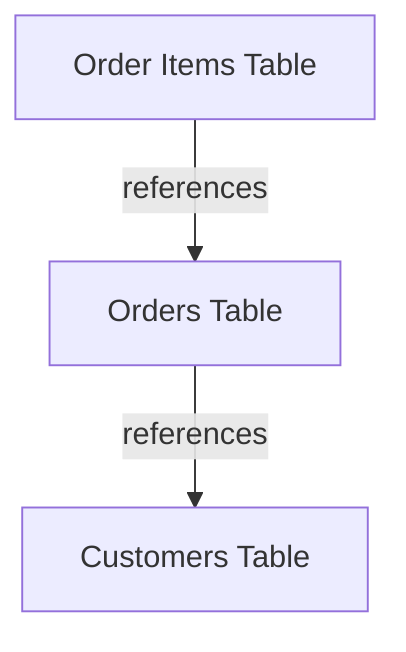

# SQL Rename Table

## Introduction

In database management, you'll often need to rename tables as your application evolves or when restructuring your database schema. Renaming a table is a fundamental SQL operation that allows you to change a table's name without altering its structure or contents.

This guide covers how to rename tables across various database management systems, providing you with the knowledge to confidently perform this operation regardless of your database platform.

## Why Rename Tables?

There are several reasons why you might need to rename a table:

- Improving naming conventions for better clarity
- Restructuring your database schema
- Fixing naming mistakes
- Converting from a temporary development name to a production name
- During database migrations or upgrades

## Syntax Variations by Database System

Different database systems use different syntax for renaming tables. Let's explore each one:

### MySQL / MariaDB

MySQL and MariaDB provide two different methods to rename a table:

#### Method 1: Using RENAME TABLE

```sql
RENAME TABLE current_table_name TO new_table_name;
```

#### Method 2: Using ALTER TABLE

```sql
ALTER TABLE current_table_name RENAME TO new_table_name;
```

### SQL Server (T-SQL)

SQL Server uses the `sp_rename` stored procedure:

```sql
EXEC sp_rename 'current_table_name', 'new_table_name';
```

### PostgreSQL

PostgreSQL uses the ALTER TABLE statement:

```sql
ALTER TABLE current_table_name RENAME TO new_table_name;
```

### Oracle

Oracle also uses the ALTER TABLE statement:

```sql
ALTER TABLE current_table_name RENAME TO new_table_name;
```

### SQLite

SQLite uses the ALTER TABLE syntax:

```sql
ALTER TABLE current_table_name RENAME TO new_table_name;
```

## Detailed Examples

Let's go through some detailed examples to better understand how to rename tables in different scenarios.

### Example 1: Basic Table Rename in MySQL

Imagine we have a table called `customers_old` and we want to rename it to `customers`.

```sql
-- First, let's create a sample table for demonstration
CREATE TABLE customers_old (
    id INT PRIMARY KEY AUTO_INCREMENT,
    name VARCHAR(100),
    email VARCHAR(100),
    created_at TIMESTAMP DEFAULT CURRENT_TIMESTAMP
);

-- Insert some sample data
INSERT INTO customers_old (name, email) VALUES 
('John Doe', 'john@example.com'),
('Jane Smith', 'jane@example.com');

-- Now, let's rename the table
RENAME TABLE customers_old TO customers;

-- Verify the change
SHOW TABLES;
SELECT * FROM customers;
```

**Output:**
```
Tables_in_database
customers

id  name        email             created_at
1   John Doe    john@example.com  2023-03-15 10:30:45
2   Jane Smith  jane@example.com  2023-03-15 10:30:45
```

### Example 2: Renaming Multiple Tables in MySQL

MySQL allows you to rename multiple tables in a single statement:

```sql
-- Create sample tables
CREATE TABLE products_2022 (
    id INT PRIMARY KEY,
    name VARCHAR(100)
);

CREATE TABLE orders_2022 (
    id INT PRIMARY KEY,
    product_id INT
);

-- Rename multiple tables at once
RENAME TABLE 
    products_2022 TO products_archive,
    orders_2022 TO orders_archive;

-- Verify changes
SHOW TABLES;
```

**Output:**
```
Tables_in_database
orders_archive
products_archive
```

### Example 3: Renaming a Table in SQL Server

```sql
-- Create a sample table
CREATE TABLE employee_data (
    emp_id INT PRIMARY KEY,
    emp_name VARCHAR(100),
    department VARCHAR(50)
);

-- Rename the table using sp_rename
EXEC sp_rename 'employee_data', 'employees';

-- Verify the change
SELECT * FROM INFORMATION_SCHEMA.TABLES WHERE TABLE_NAME = 'employees';
```

**Output:**
```
TABLE_CATALOG  TABLE_SCHEMA  TABLE_NAME  TABLE_TYPE
database_name  dbo           employees   BASE TABLE
```

### Example 4: Renaming a Table in PostgreSQL

```sql
-- Create a sample table
CREATE TABLE student_info (
    student_id SERIAL PRIMARY KEY,
    student_name VARCHAR(100),
    grade VARCHAR(2)
);

-- Rename the table
ALTER TABLE student_info RENAME TO students;

-- Verify the change
SELECT table_name FROM information_schema.tables 
WHERE table_schema = 'public' AND table_name = 'students';
```

**Output:**
```
table_name
students
```

## Best Practices for Renaming Tables

When renaming tables in a database, consider the following best practices:

1. **Backup Your Database**: Always create a backup before performing schema changes.

2. **Check Dependencies**: Identify any views, foreign keys, triggers, or stored procedures that reference the table being renamed.

3. **Plan for Downtime**: Renaming tables may lock the table briefly. Plan to execute during low traffic periods.

4. **Update Related Objects**: After renaming, update any views, triggers, or stored procedures that reference the old table name.

5. **Test in Development**: Always test your rename operations in a development environment before applying to production.

6. **Use Transactions**: When renaming multiple related tables, consider using transactions to ensure all or none of the renames succeed.

## Working with Foreign Keys and Constraints

When a table has foreign key relationships, you may need to take additional steps when renaming it. Let's look at how to handle this:



### Example: Renaming a Table with Foreign Keys in MySQL

```sql
-- Create related tables
CREATE TABLE customers (
    customer_id INT PRIMARY KEY,
    name VARCHAR(100)
);

CREATE TABLE orders (
    order_id INT PRIMARY KEY,
    customer_id INT,
    order_date DATE,
    FOREIGN KEY (customer_id) REFERENCES customers(customer_id)
);

-- To rename customers table safely
-- Option 1: Use RENAME TABLE (MySQL automatically updates the constraints)
RENAME TABLE customers TO clients;

-- Verify that the foreign key still works
SHOW CREATE TABLE orders;
```

In PostgreSQL and SQL Server, you may need to drop and recreate foreign keys when renaming tables, especially in complex scenarios.

## Renaming Tables in Database Migration Scripts

When working with database migrations in application development, table renaming is often part of the schema evolution. Here's an example of how this might look in a migration script:

```sql
-- Migration script: 2023_03_15_rename_user_tables.sql

-- Step 1: Rename the main table
ALTER TABLE users RENAME TO app_users;

-- Step 2: Rename related tables
ALTER TABLE user_profiles RENAME TO app_user_profiles;
ALTER TABLE user_settings RENAME TO app_user_settings;

-- Step 3: Update view that references these tables
CREATE OR REPLACE VIEW app_user_data AS
SELECT au.id, au.username, aup.full_name, aus.theme
FROM app_users au
JOIN app_user_profiles aup ON au.id = aup.user_id
JOIN app_user_settings aus ON au.id = aus.user_id;
```

## Potential Issues and Solutions

### Handling Temporary Tables During Rename

If you need to preserve data while restructuring a table, you might use a temporary table in the process:

```sql
-- Create a new table with the desired structure
CREATE TABLE customers_new (
    id INT PRIMARY KEY AUTO_INCREMENT,
    full_name VARCHAR(150),  -- Changed from 'name' to 'full_name'
    email VARCHAR(100),
    created_at TIMESTAMP DEFAULT CURRENT_TIMESTAMP
);

-- Copy data from old to new table, mapping columns as needed
INSERT INTO customers_new (id, full_name, email, created_at)
SELECT id, name, email, created_at FROM customers;

-- Rename tables to swap them
RENAME TABLE 
    customers TO customers_old_backup,
    customers_new TO customers;

-- Verify the new table
SELECT * FROM customers;

-- Once verified, you can drop the backup
-- DROP TABLE customers_old_backup;
```

### Resolving Name Conflicts

If you're trying to rename a table to a name that already exists, you'll encounter an error. Here's how to handle it:

```sql
-- First check if the target name exists
SELECT table_name FROM information_schema.tables 
WHERE table_schema = 'your_database' AND table_name = 'target_name';

-- If it exists and you want to replace it, rename or drop the existing table first
DROP TABLE IF EXISTS target_name;

-- Then proceed with your rename
RENAME TABLE source_name TO target_name;
```

## Summary

Renaming tables is a fundamental operation in database management that varies slightly across different database systems. In this guide, we've covered:

- The syntax for renaming tables in MySQL/MariaDB, SQL Server, PostgreSQL, Oracle, and SQLite
- Detailed examples showing how to rename tables in various scenarios
- Best practices for safely renaming tables
- Handling dependencies like foreign keys during rename operations
- Working with table renames in migration scripts
- Troubleshooting common issues when renaming tables

By following the patterns and practices outlined in this guide, you can confidently perform table rename operations in your database projects.

## Additional Resources

- [MySQL Documentation: RENAME TABLE](https://dev.mysql.com/doc/refman/8.0/en/rename-table.html)
- [PostgreSQL Documentation: ALTER TABLE](https://www.postgresql.org/docs/current/sql-altertable.html)
- [SQL Server Documentation: sp_rename](https://learn.microsoft.com/en-us/sql/relational-databases/system-stored-procedures/sp-rename-transact-sql)

## Exercises

1. Create a table called `inventory` and then rename it to `stock_items`.

2. Create two related tables with a foreign key relationship, then rename both tables while preserving the relationship.

3. Write a migration script that renames a table and all its associated objects (indexes, triggers, etc.).

4. Create a table with the wrong name (with a typo), then correct it using the appropriate rename command for your database system.

5. Investigate what happens when you try to rename a table to a name that already exists in your database. How does your specific database system handle this situation?