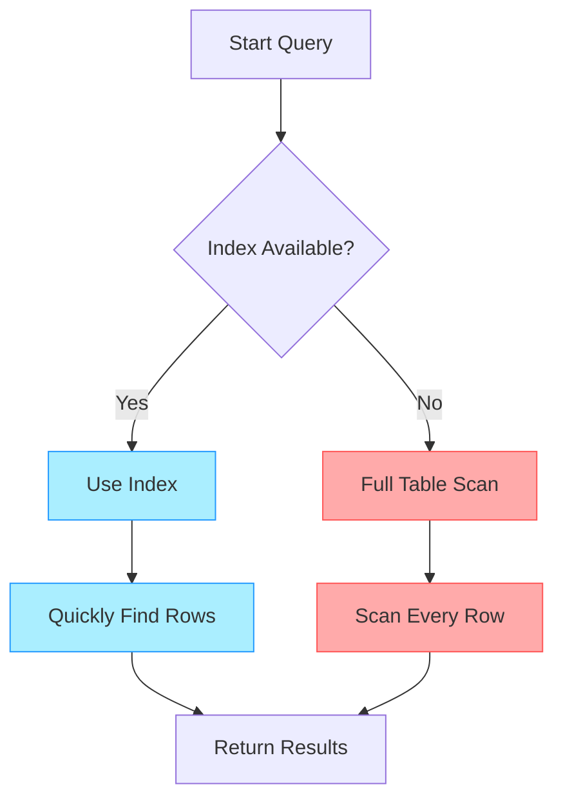

# SQL Index Creation

## Introduction

Indexes are special lookup tables that the database search engine can use to speed up data retrieval. They work similarly to the index at the back of a book - instead of scanning every page to find information, you can quickly look up specific terms. In SQL databases, indexes improve query performance by allowing the database engine to find data without scanning the entire table.

This tutorial will guide you through the process of creating, using, and managing indexes in SQL databases. We'll explore different types of indexes, when to use them, and best practices to optimize your database performance.

## Why Use Indexes?

Before diving into index creation, let's understand why indexes are crucial:

1. **Faster data retrieval**: Indexes significantly speed up SELECT queries
2. **Improved sorting performance**: Indexes can help ORDER BY clauses perform more efficiently
3. **Efficient join operations**: Indexes improve the performance of tables linked with JOIN statements
4. **Unique constraint enforcement**: Unique indexes ensure data integrity by preventing duplicate values

However, indexes also come with trade-offs:

1. **Storage overhead**: Indexes require additional disk space
2. **Write performance impact**: INSERT, UPDATE, and DELETE operations may become slower as indexes need to be updated

## Basic Index Syntax

The basic syntax for creating an index in SQL is:

```sql
CREATE INDEX index_name
ON table_name (column1, column2, ...);
```

Let's see this in action with a simple example:

```sql
-- First, let's create a sample table
CREATE TABLE employees (
    employee_id INT PRIMARY KEY,
    first_name VARCHAR(50),
    last_name VARCHAR(50),
    email VARCHAR(100),
    hire_date DATE,
    department VARCHAR(50)
);

-- Now, let's create an index on the last_name column
CREATE INDEX idx_employees_last_name
ON employees (last_name);
```

This creates an index called `idx_employees_last_name` on the `last_name` column of the `employees` table.

## Types of Indexes

SQL databases support several types of indexes. Let's explore the most common ones:

### 1. Single-Column Indexes

As shown in our first example, these are indexes on just one column:

```sql
CREATE INDEX idx_employees_hire_date
ON employees (hire_date);
```

### 2. Composite Indexes (Multi-Column)

These indexes involve multiple columns and are useful for queries that filter on those columns together:

```sql
CREATE INDEX idx_employees_dept_hire
ON employees (department, hire_date);
```

This index is most effective when your queries filter by department first, then by hire date. The order of columns in a composite index matters!

### 3. Unique Indexes

Unique indexes ensure that no duplicate values are inserted into the specified columns:

```sql
CREATE UNIQUE INDEX idx_employees_email
ON employees (email);
```

Now, attempting to insert a record with an email that already exists in the table will result in an error:

```sql
-- This will succeed
INSERT INTO employees (employee_id, first_name, last_name, email, hire_date, department)
VALUES (1, 'John', 'Doe', 'john.doe@example.com', '2023-01-15', 'IT');

-- This will fail because of the unique index on email
INSERT INTO employees (employee_id, first_name, last_name, email, hire_date, department)
VALUES (2, 'Jane', 'Smith', 'john.doe@example.com', '2023-02-20', 'Marketing');
```

Output for the second INSERT:
```
Error: Duplicate key value violates unique constraint "idx_employees_email"
Detail: Key (email)=(john.doe@example.com) already exists.
```

### 4. Partial Indexes

Some database systems (like PostgreSQL) support partial indexes, which only index a subset of the table that satisfies a certain condition:

```sql
-- Only index employees in the IT department
CREATE INDEX idx_it_employees
ON employees (employee_id)
WHERE department = 'IT';
```

## How Indexes Work: A Visual Explanation

Let's visualize how indexes improve query performance:



Imagine searching for all employees hired in 2023 in a table with 1 million rows:

**Without an index** on the `hire_date` column:
- The database must check every single row (1 million reads)
- This is called a "full table scan"
- Very slow for large tables

**With an index** on the `hire_date` column:
- The database first checks the index (much smaller than the full table)
- The index points directly to the relevant rows
- Often requires only a few hundred reads instead of millions

## When to Create Indexes

Consider creating indexes when:

1. **Columns are frequently used in WHERE clauses**
2. **Columns are used in JOIN conditions**
3. **Columns are used in ORDER BY or GROUP BY clauses**
4. **Columns have high cardinality** (many unique values)

Avoid creating unnecessary indexes when:

1. **Tables are very small**
2. **Columns are rarely used in queries**
3. **Columns have low cardinality** (few unique values)
4. **Tables are frequently updated with many INSERT/UPDATE/DELETE operations**

## Creating Indexes on Primary and Foreign Keys

Primary keys are automatically indexed in most database systems, but foreign keys often need manual indexing:

```sql
-- Create a departments table
CREATE TABLE departments (
    department_id INT PRIMARY KEY,
    department_name VARCHAR(50)
);

-- Add a foreign key to employees table
ALTER TABLE employees
ADD CONSTRAINT fk_department
FOREIGN KEY (department) REFERENCES departments(department_name);

-- Create an index on the foreign key
CREATE INDEX idx_employees_department
ON employees (department);
```

Indexing foreign keys is essential for optimizing JOIN operations.

## Practical Example: Optimizing a Query

Let's look at a real-world example of how indexes improve performance.

Consider a database for an e-commerce site with an `orders` table containing millions of records:

```sql
-- Create orders table
CREATE TABLE orders (
    order_id INT PRIMARY KEY,
    customer_id INT,
    order_date DATE,
    status VARCHAR(20),
    total_amount DECIMAL(10, 2)
);

-- Insert millions of records (this would take a while in reality)
-- INSERT INTO orders VALUES...

-- Query to find all orders for a specific customer in the last month
SELECT * FROM orders
WHERE customer_id = 12345
AND order_date >= '2023-09-01';
```

Without proper indexes, this query might take several seconds to complete. Let's add an appropriate index:

```sql
-- Create a composite index for this specific query pattern
CREATE INDEX idx_orders_customer_date
ON orders (customer_id, order_date);
```

After creating this index, the same query might run in milliseconds instead of seconds!

## Maintaining Indexes

Indexes need maintenance to remain effective:

### Viewing Existing Indexes

To view all indexes in your database (syntax varies by database system):

```sql
-- PostgreSQL
SELECT indexname, indexdef
FROM pg_indexes
WHERE tablename = 'employees';

-- MySQL
SHOW INDEX FROM employees;

-- SQL Server
EXEC sp_helpindex 'employees';
```

### Removing Unused Indexes

Unused indexes consume space and slow down write operations. To remove an index:

```sql
DROP INDEX idx_employees_last_name;
```

### Rebuilding Indexes

Over time, indexes can become fragmented. Rebuilding them can improve performance:

```sql
-- SQL Server
ALTER INDEX idx_employees_dept_hire ON employees REBUILD;

-- MySQL
ALTER TABLE employees DROP INDEX idx_employees_dept_hire;
ALTER TABLE employees ADD INDEX idx_employees_dept_hire (department, hire_date);

-- PostgreSQL
REINDEX INDEX idx_employees_dept_hire;
```

## Performance Analysis

Most database systems provide tools to analyze query performance and index usage:

```sql
-- PostgreSQL: Use EXPLAIN to see the query plan
EXPLAIN SELECT * FROM employees WHERE last_name = 'Smith';

-- Sample output:
-- Index Scan using idx_employees_last_name on employees
--   Index Cond: (last_name = 'Smith'::text)
```

If the output shows "Index Scan," your index is being used. If it shows "Sequential Scan," the query is not using any index.

## Best Practices for SQL Indexes

1. **Be selective about indexing**: Don't create indexes on every column
2. **Index high-selectivity columns**: Columns with many unique values benefit most from indexing
3. **Consider query patterns**: Index columns frequently used in WHERE, JOIN, ORDER BY clauses
4. **Watch for duplicate indexes**: Avoid creating multiple indexes on the same set of columns
5. **Monitor index usage**: Drop indexes that aren't being used
6. **Consider the order of columns** in composite indexes based on query patterns
7. **Balance read and write performance**: Remember that indexes slow down data modifications

## Summary

SQL indexes are powerful tools for optimizing database performance. By creating appropriate indexes on columns frequently used in queries, you can dramatically improve the speed of your applications. Remember:

- Indexes speed up data retrieval but slow down data modification
- Create indexes on columns used in WHERE, JOIN, and ORDER BY clauses
- Different types of indexes (single-column, composite, unique) serve different purposes
- Maintain your indexes regularly for optimal performance
- Monitor and analyze query performance to ensure indexes are being used effectively

## Exercises

1. Create a `products` table with columns for `product_id`, `name`, `category`, `price`, and `stock_quantity`. Create appropriate indexes for this table.

2. Write a query to find all products in the "Electronics" category with a price less than $500. Which index would best support this query?

3. Create a `customers` table and an `orders` table with a foreign key relationship. Add appropriate indexes for JOIN operations.

4. Using your database system's tools, analyze the execution plan for a query before and after adding an index. How does the performance change?

## Additional Resources

- [Database Indexing Strategies](https://use-the-index-luke.com/)
- [PostgreSQL Index Documentation](https://www.postgresql.org/docs/current/indexes.html)
- [MySQL Index Documentation](https://dev.mysql.com/doc/refman/8.0/en/optimization-indexes.html)
- [SQL Server Index Design Guide](https://docs.microsoft.com/en-us/sql/relational-databases/sql-server-index-design-guide)