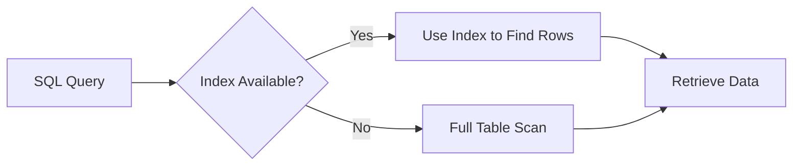
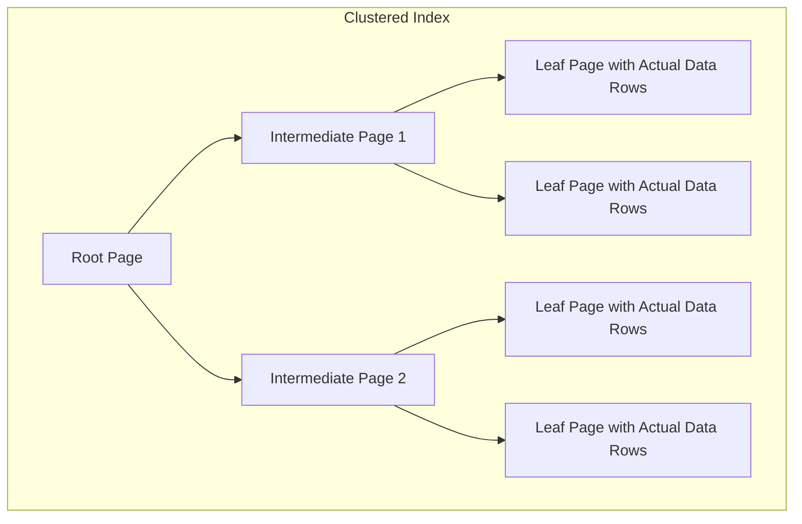
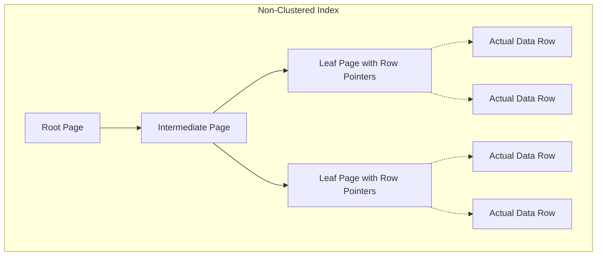

# SQL Index Types

## Introduction

When you're working with databases, especially those containing large amounts of data, query performance becomes crucial. Imagine trying to find a specific book in a library without any organization system - you'd have to check each book one by one! SQL indexes serve the same purpose as a library's catalog or book index - they help the database quickly locate the data you're looking for without scanning every row in a table.

In this guide, we'll explore various types of SQL indexes, how they work, when to use them, and their impact on database performance. By understanding indexes, you'll be able to significantly speed up your database queries and build more efficient applications.

## What Are SQL Indexes?

An index in SQL is a data structure that improves the speed of data retrieval operations on a database table. Indexes are created using one or more columns of a database table, providing the basis for both rapid random lookups and efficient access of ordered records.

Think of an index as a sorted copy of selected columns from a table, with pointers to the actual rows. When the database executes a query that can use an index, it can quickly find the requested rows by searching the index instead of scanning the entire table.



## Basic SQL Index Types

### 1. Single-Column Index

As the name suggests, this index is created on a single column of a table. It's the most basic type of index and is useful when queries frequently filter or sort by that specific column.

```sql
-- Creating a single-column index on the 'last_name' column
CREATE INDEX idx_customers_last_name ON customers (last_name);

-- Query that would use this index
SELECT * FROM customers WHERE last_name = 'Smith';
```

**When to use**: When you frequently search, filter, or sort by a specific column.

### 2. Unique Index

A unique index ensures that the indexed column(s) do not have duplicate values. This type of index is automatically created when you define a UNIQUE or PRIMARY KEY constraint on a table column.

```sql
-- Creating a unique index
CREATE UNIQUE INDEX idx_products_code ON products (product_code);

-- This will enforce uniqueness and fail if a duplicate product_code is inserted
INSERT INTO products (product_code, name, price) VALUES ('P1001', 'New Product', 29.99);
```

**When to use**: When you need to enforce data uniqueness beyond primary keys, like email addresses, usernames, or product codes.

### 3. Composite Index (Multi-Column Index)

A composite index is created on two or more columns of a table. The order of columns in a composite index is important because it affects which queries can use the index effectively.

```sql
-- Creating a composite index on 'last_name' and 'first_name'
CREATE INDEX idx_customers_name ON customers (last_name, first_name);

-- Query that would use this index effectively
SELECT * FROM customers WHERE last_name = 'Johnson' AND first_name = 'Robert';

-- Query that would use this index partially
SELECT * FROM customers WHERE last_name = 'Johnson';

-- Query that would NOT use this index effectively
SELECT * FROM customers WHERE first_name = 'Robert';
```

**When to use**: When you frequently query data based on a combination of columns, especially with AND conditions.

## Advanced SQL Index Types

### 4. Clustered Index

A clustered index determines the physical order of data in a table. A table can have only one clustered index because the data rows themselves can be sorted in only one order. By default, the primary key of a table becomes the clustered index.

```sql
-- In SQL Server, creating a clustered index (if not already defined by primary key)
CREATE CLUSTERED INDEX idx_orders_date ON orders (order_date);
```

**When to use**: For columns that are frequently used in range queries, sorting operations, or grouping operations.



### 5. Non-Clustered Index

Unlike a clustered index, a non-clustered index doesn't sort the physical data in the table. Instead, it creates a separate structure that references the data rows. A table can have multiple non-clustered indexes.

```sql
-- Creating a non-clustered index
CREATE NONCLUSTERED INDEX idx_employees_dept ON employees (department_id);
```

**When to use**: When you need multiple indexes on a table or when the query patterns don't justify rearranging the physical data.



### 6. Covering Index

A covering index includes all the columns referenced in a query, allowing the database engine to retrieve the required data directly from the index without accessing the table.

```sql
-- Creating a covering index for a specific query
CREATE INDEX idx_products_covering ON products (category_id, price) INCLUDE (product_name);

-- Query that can use this covering index without accessing the table
SELECT product_name FROM products WHERE category_id = 3 AND price > 50;
```

**When to use**: When you have specific queries that always access the same set of columns.

### 7. Full-Text Index

A full-text index enables full-text search capabilities, allowing efficient searches for word or phrase matches within text data.

```sql
-- Creating a full-text index (syntax varies by database system)
-- SQL Server example:
CREATE FULLTEXT INDEX ON articles(content) 
KEY INDEX PK_articles;

-- Example search query
SELECT title FROM articles 
WHERE CONTAINS(content, 'database optimization');
```

**When to use**: When you need to perform text searches beyond simple pattern matching, especially for articles, product descriptions, or any large text fields.

## Special Index Types

### 8. Bitmap Index

A bitmap index uses bit arrays for each possible value in the indexed column, making them highly efficient for columns with low cardinality (few unique values).

```sql
-- Oracle syntax
CREATE BITMAP INDEX idx_orders_status ON orders(status);
```

**When to use**: On columns with few unique values (like status fields, boolean fields) in data warehousing environments where data is read-heavy but not frequently updated.

### 9. Spatial Index

Spatial indexes optimize queries that involve geographic or geometric data.

```sql
-- Creating a spatial index (SQL Server example)
CREATE SPATIAL INDEX idx_locations_geo 
ON locations(location_point);

-- Query using spatial data
SELECT * FROM locations 
WHERE location_point.STDistance(@userLocation) < 10000;
```

**When to use**: When working with geographical data, maps, or any application requiring location-based queries.

### 10. Hash Index

Hash indexes use a hash function to compute an address from a column value. They are excellent for equality comparisons but don't work for range queries.

```sql
-- In MySQL, specifying HASH with memory tables
CREATE TABLE lookups (
    id INT, 
    value VARCHAR(100),
    INDEX USING HASH (id)
) ENGINE=MEMORY;
```

**When to use**: For exact equality lookups, especially in memory-optimized tables.

## Impact of Indexes on Database Operations

While indexes can drastically improve query performance, they come with trade-offs:

| Operation | Impact with Indexes |
|-----------|---------------------|
| SELECT | Generally faster, especially for filtered queries |
| INSERT | Slightly slower due to index updates |
| UPDATE | Slower when updating indexed columns |
| DELETE | Slightly slower due to index updates |
| Storage Space | Increased disk usage for each additional index |

## Best Practices for Using SQL Indexes

1. **Index columns used in WHERE, JOIN, ORDER BY, and GROUP BY clauses**
   ```sql
   -- If you frequently run this query:
   SELECT * FROM orders WHERE customer_id = 123 ORDER BY order_date;
   
   -- Consider this index:
   CREATE INDEX idx_orders_customer_date ON orders(customer_id, order_date);
   ```

2. **Avoid over-indexing**
   Too many indexes can slow down write operations and increase storage requirements.

3. **Consider column cardinality**
   Columns with many unique values (high cardinality) often benefit more from indexes.

4. **Monitor and maintain indexes**
   Regularly analyze index usage and rebuild fragmented indexes.
   ```sql
   -- Example index maintenance in SQL Server
   ALTER INDEX idx_customers_name ON customers REBUILD;
   ```

5. **Be aware of index selectivity**
   An index is more effective when it helps select a small percentage of rows from a table.

## Practical Example: Optimizing a Customer Database

Let's consider a real-world scenario where proper indexing significantly improves performance:

```sql
-- Create a customers table
CREATE TABLE customers (
    customer_id INT PRIMARY KEY,
    first_name VARCHAR(50),
    last_name VARCHAR(50),
    email VARCHAR(100),
    city VARCHAR(50),
    registration_date DATE,
    status VARCHAR(20)
);

-- Insert sample data (in a real scenario, this would be thousands or millions of rows)
INSERT INTO customers VALUES 
(1, 'John', 'Smith', 'john.smith@example.com', 'New York', '2023-01-15', 'active'),
(2, 'Jane', 'Doe', 'jane.doe@example.com', 'Chicago', '2023-02-20', 'inactive'),
-- ... many more rows

-- Common queries that might be slow without proper indexes:

-- 1. Find all active customers from a specific city
SELECT * FROM customers WHERE status = 'active' AND city = 'New York';

-- 2. List customers ordered by registration date
SELECT * FROM customers ORDER BY registration_date DESC;

-- 3. Find a customer by email (which should be unique)
SELECT * FROM customers WHERE email = 'john.smith@example.com';
```

To optimize these queries, we can add the following indexes:

```sql
-- Index for query 1: composite index on status and city
CREATE INDEX idx_customers_status_city ON customers(status, city);

-- Index for query 2: registration date
CREATE INDEX idx_customers_reg_date ON customers(registration_date);

-- Index for query 3: unique constraint/index on email
CREATE UNIQUE INDEX idx_customers_email ON customers(email);
```

After adding these indexes, the query execution time could improve from seconds to milliseconds, especially as the table grows larger.

## Summary

SQL indexes are powerful tools for optimizing database performance. By strategically creating indexes on your tables, you can significantly reduce query execution time and improve your application's responsiveness. However, it's important to strike the right balance - too many indexes can slow down write operations and increase storage requirements.

Remember these key points:
- Use single-column indexes for simple filtering and sorting
- Create composite indexes for queries with multiple conditions
- Consider unique indexes to enforce data integrity
- Choose clustered indexes carefully as you can only have one per table
- Monitor and maintain your indexes regularly

## Additional Resources and Exercises

### Further Learning
- [SQL Performance Tuning](https://use-the-index-luke.com/) - A deep dive into index optimization
- [Database Journal: Indexing Strategies](https://www.databasejournal.com/) - Articles on advanced indexing
- [MySQL Documentation: Optimization](https://dev.mysql.com/doc/refman/8.0/en/optimization.html) - Official documentation on optimization

### Practice Exercises

1. **Basic Index Creation**
   Create a table representing books in a library and add appropriate indexes to optimize searches by title, author, and publication year.

2. **Index Analysis**
   For an existing database, identify which tables would benefit most from indexes and explain why.

3. **Performance Testing**
   Create a large test table (at least 100,000 rows) and measure the performance difference between queries with and without appropriate indexes.

4. **Index Maintenance**
   Write scripts to identify fragmented or unused indexes in your database.

5. **Advanced Indexing Challenge**
   Design an optimal indexing strategy for an e-commerce database with tables for products, customers, orders, and reviews. Consider the most common query patterns and justify your indexing choices.