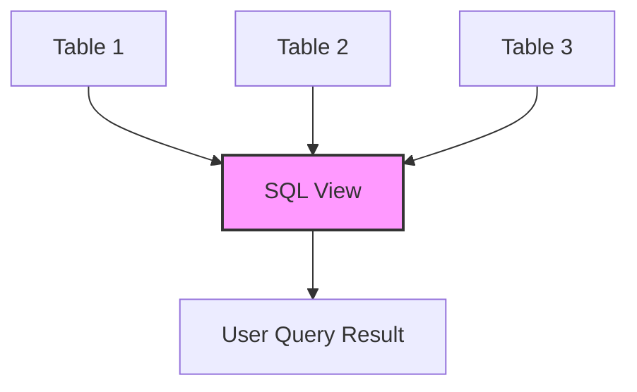

# SQL View Creation

## Introduction

SQL views are virtual tables based on the result set of a SQL statement. Unlike physical tables that store data, views are dynamic and don't store data themselves; instead, they provide an alternative way to look at data from one or more tables. 

Views serve as a powerful abstraction layer that can simplify complex queries, enhance security, and improve the organization of your database interactions. In this tutorial, we'll explore how to create, use, and manage SQL views effectively.

## What is a SQL View?

A view is essentially a saved SQL query that you can reference like a regular table. When you query a view, the database executes the underlying SQL statement and returns the results as if they were coming from an actual table.

Think of a view as a virtual window into your data that shows only what you want to see:



## Basic View Creation Syntax

The basic syntax for creating a view is:

```sql
CREATE VIEW view_name AS
SELECT column1, column2, ...
FROM table_name
WHERE condition;
```

Let's break this down:
- `CREATE VIEW view_name`: Specifies that we're creating a view with the given name
- `AS`: Connects the view name with the query that defines it
- `SELECT...`: The standard SQL query that will be executed whenever the view is accessed

## Creating Your First View

Let's start with a simple example. Suppose we have a `customers` table with many columns, but we frequently need to access just basic contact information:

```sql
-- Original table structure
CREATE TABLE customers (
    customer_id INT PRIMARY KEY,
    first_name VARCHAR(50),
    last_name VARCHAR(50),
    email VARCHAR(100),
    phone VARCHAR(20),
    address VARCHAR(200),
    city VARCHAR(50),
    state VARCHAR(20),
    zipcode VARCHAR(10),
    registration_date DATE,
    last_purchase_date DATE,
    total_purchases DECIMAL(10,2)
);

-- Creating a simple contact information view
CREATE VIEW customer_contacts AS
SELECT customer_id, first_name, last_name, email, phone
FROM customers;
```

Now, instead of writing:

```sql
SELECT customer_id, first_name, last_name, email, phone
FROM customers;
```

You can simply use:

```sql
SELECT * FROM customer_contacts;
```

### Example Output:

```
customer_id | first_name | last_name | email                 | phone
------------|------------|-----------|----------------------|-------------
1           | John       | Smith     | john.smith@email.com | 555-123-4567
2           | Jane       | Doe       | jane.doe@email.com   | 555-987-6543
3           | Robert     | Johnson   | rob.j@email.com      | 555-456-7890
```

## Creating Views with Calculations and Functions

Views can include calculations, functions, and even column aliases:

```sql
CREATE VIEW customer_summary AS
SELECT 
    customer_id,
    CONCAT(first_name, ' ', last_name) AS full_name,
    DATEDIFF(NOW(), last_purchase_date) AS days_since_last_purchase,
    total_purchases,
    CASE 
        WHEN total_purchases > 1000 THEN 'Premium'
        WHEN total_purchases > 500 THEN 'Regular'
        ELSE 'New'
    END AS customer_status
FROM customers;
```

When queried, this view will calculate these values on-the-fly:

```sql
SELECT * FROM customer_summary;
```

### Example Output:

```
customer_id | full_name      | days_since_last_purchase | total_purchases | customer_status
------------|----------------|--------------------------|-----------------|----------------
1           | John Smith     | 15                       | 1250.50         | Premium
2           | Jane Doe       | 3                        | 750.25          | Regular
3           | Robert Johnson | 45                       | 250.75          | New
```

## Creating Views with Joins

Views really shine when working with multiple tables. Let's say we have `orders` and `customers` tables:

```sql
CREATE VIEW customer_orders AS
SELECT 
    c.customer_id,
    c.first_name,
    c.last_name,
    o.order_id,
    o.order_date,
    o.total_amount
FROM 
    customers c
JOIN 
    orders o ON c.customer_id = o.customer_id;
```

This view combines data from both tables, making it easy to retrieve order information along with customer details:

```sql
SELECT * FROM customer_orders WHERE total_amount > 100;
```

### Example Output:

```
customer_id | first_name | last_name | order_id | order_date  | total_amount
------------|------------|-----------|----------|-------------|-------------
1           | John       | Smith     | 1001     | 2023-03-15  | 125.99
2           | Jane       | Doe       | 1002     | 2023-03-16  | 199.50
1           | John       | Smith     | 1005     | 2023-03-18  | 310.75
```

## Updating Views

Views can be updated after creation using the `CREATE OR REPLACE VIEW` syntax:

```sql
CREATE OR REPLACE VIEW customer_contacts AS
SELECT customer_id, first_name, last_name, email, phone, city, state
FROM customers;
```

This modifies our earlier view to include city and state information.

## Materialized vs. Non-Materialized Views

Standard SQL views (what we've discussed so far) are sometimes called "non-materialized views." They execute their query every time you access them.

Some database systems (like PostgreSQL and Oracle) also support "materialized views", which store the query results physically:

```sql
-- PostgreSQL syntax example
CREATE MATERIALIZED VIEW customer_summary_mat AS
SELECT 
    customer_id,
    CONCAT(first_name, ' ', last_name) AS full_name,
    total_purchases
FROM customers;
```

Materialized views must be refreshed to update their data:

```sql
-- PostgreSQL syntax example
REFRESH MATERIALIZED VIEW customer_summary_mat;
```

## View Limitations and Considerations

### When Using Views:

1. **Performance**: Views don't improve query performance by themselves; they execute the underlying query each time they're accessed.

2. **Updateability**: Not all views are updateable. Views with aggregations, `DISTINCT`, `GROUP BY`, or certain joins may be read-only.

3. **Cascading Dependencies**: If you change underlying tables, you might need to update dependent views.

4. **Complexity**: While views can hide complexity, they can also create hidden dependencies that make database changes more difficult.

## Advanced View Features

### Creating Indexed Views (SQL Server)

In SQL Server, you can create indexed views (materialized views) for performance:

```sql
-- SQL Server syntax
CREATE VIEW sales_summary WITH SCHEMABINDING AS
SELECT 
    product_id, 
    SUM(quantity) AS total_quantity,
    SUM(price * quantity) AS total_value
FROM 
    dbo.sales
GROUP BY 
    product_id;

-- Create an index on the view
CREATE UNIQUE CLUSTERED INDEX IX_sales_summary
ON sales_summary (product_id);
```

### Creating Views with Security Checks

```sql
CREATE VIEW my_orders AS
SELECT * FROM orders
WHERE customer_id = USER_ID();
```

This view would only show orders belonging to the current user.

## Practical Examples

### Example 1: Reporting View

Create a view for monthly sales reports:

```sql
CREATE VIEW monthly_sales AS
SELECT 
    DATE_FORMAT(order_date, '%Y-%m') AS month,
    COUNT(*) AS order_count,
    SUM(total_amount) AS total_sales
FROM 
    orders
GROUP BY 
    DATE_FORMAT(order_date, '%Y-%m');
```

### Example 2: Data Export View

Create a view for exporting only non-sensitive customer data:

```sql
CREATE VIEW exportable_customers AS
SELECT 
    customer_id,
    first_name,
    last_name,
    city,
    state,
    registration_date
FROM 
    customers;
```

### Example 3: Cross-Database View

Some database systems allow views that combine data from multiple databases:

```sql
-- MySQL example
CREATE VIEW combined_products AS
SELECT 
    product_id,
    product_name,
    'Current' AS inventory_source
FROM 
    current_db.products
UNION ALL
SELECT 
    product_id,
    product_name,
    'Archive' AS inventory_source
FROM 
    archive_db.products;
```

## Dropping Views

When you no longer need a view, you can remove it using the `DROP VIEW` statement:

```sql
DROP VIEW customer_contacts;
```

## Best Practices for Using Views

1. **Use meaningful names** that indicate what the view represents
2. **Document your views** with comments explaining their purpose
3. **Be cautious with complex views** that join many tables or include subqueries
4. **Consider performance implications** for frequently accessed views
5. **Regularly review and maintain views** to ensure they're still necessary and optimal
6. **Use views for security** to restrict sensitive data access
7. **Don't nest views too deeply** as it can lead to performance issues

## Summary

SQL views are powerful tools for abstracting complexity, enhancing security, and providing consistent data access patterns across your application. They act as virtual tables defined by SQL queries that can join multiple tables, apply filters, or compute values.

By using views effectively, you can:
- Simplify complex queries
- Restrict access to sensitive data
- Provide a consistent interface to your data
- Make your database more maintainable

Remember that views execute their underlying query each time they're accessed, so they're best used to simplify access patterns rather than to improve performance (unless using materialized views).

## Exercises

1. Create a view that shows the top 10 customers by total purchase amount.
2. Create a view joining three tables: customers, orders, and order_items.
3. Create a view with calculated columns for customer retention metrics.
4. Try to update data through a view and observe when it works and when it doesn't.
5. Create a view that filters data based on the current date.

## Additional Resources

- [MySQL Documentation on Views](https://dev.mysql.com/doc/refman/8.0/en/views.html)
- [PostgreSQL Views Tutorial](https://www.postgresql.org/docs/current/tutorial-views.html)
- [SQL Server Views](https://docs.microsoft.com/en-us/sql/relational-databases/views/views)
- [Using Views for Database Security](https://www.sqlshack.com/using-views-to-implement-sql-server-security/)