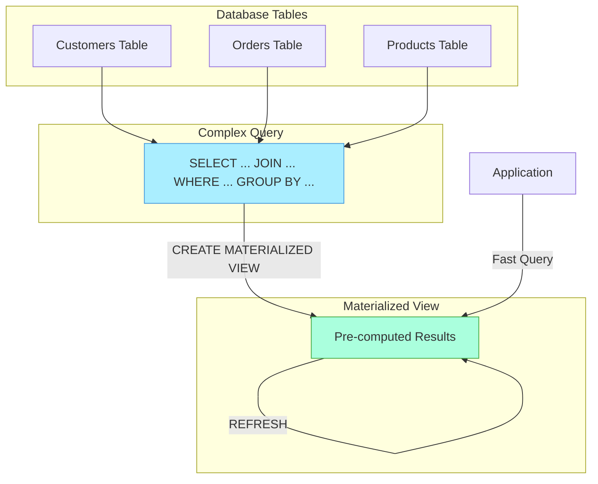

# SQL Materialized Views

## Introduction

When working with databases, you'll often find yourself running the same complex queries repeatedly. This can become a performance bottleneck, especially when these queries involve multiple joins, aggregations, or large datasets. **SQL Materialized Views** offer an elegant solution to this problem.

A materialized view is a database object that contains the results of a query. Unlike regular views, which execute their defining query each time they're accessed, materialized views physically store the query results like a table. This allows for much faster data retrieval at the cost of some data freshness.

In this tutorial, you'll learn:
- What materialized views are and how they differ from regular views
- When to use materialized views
- How to create, refresh, and query materialized views
- Best practices and real-world applications

## Materialized Views vs. Regular Views

Before diving deeper, let's understand the key differences between regular views and materialized views:

| Feature | Regular View | Materialized View |
|---------|-------------|-------------------|
| Data Storage | No data storage (virtual) | Physically stores data |
| Query Execution | Executes query every time | Uses stored results |
| Data Freshness | Always current | Only updated when refreshed |
| Performance | Slower for complex queries | Faster data retrieval |
| Disk Space | Minimal | Requires storage space |

## Creating Materialized Views

The syntax for creating materialized views varies between database systems. We'll cover the most common implementations:

### PostgreSQL

```sql
CREATE MATERIALIZED VIEW mv_customer_summary AS
SELECT 
    c.country,
    COUNT(customer_id) AS customer_count,
    AVG(age) AS average_age
FROM 
    customers c
GROUP BY 
    c.country
WITH DATA;
```

### Oracle

```sql
CREATE MATERIALIZED VIEW mv_customer_summary
BUILD IMMEDIATE
REFRESH ON DEMAND
AS
SELECT 
    c.country,
    COUNT(customer_id) AS customer_count,
    AVG(age) AS average_age
FROM 
    customers c
GROUP BY 
    c.country;
```

### SQL Server (Using Indexed Views)

SQL Server doesn't have materialized views by name, but indexed views serve a similar purpose:

```sql
-- Create a view with SCHEMABINDING
CREATE VIEW dbo.vw_customer_summary
WITH SCHEMABINDING
AS
SELECT 
    c.country,
    COUNT_BIG(*) AS customer_count,
    SUM(age) AS total_age
FROM 
    dbo.customers c
GROUP BY 
    c.country;
GO

-- Add a unique clustered index to materialize the view
CREATE UNIQUE CLUSTERED INDEX idx_vw_customer_summary
ON dbo.vw_customer_summary (country);
```

## Querying Materialized Views

Once created, you can query a materialized view just like a regular table:

```sql
-- This query will be much faster than running the original complex query
SELECT * FROM mv_customer_summary
WHERE customer_count > 100
ORDER BY average_age DESC;
```

## Refreshing Materialized Views

Since materialized views store data at creation time, they need to be refreshed to reflect changes in the underlying tables.

### PostgreSQL

```sql
-- Complete refresh (rebuilds the entire view)
REFRESH MATERIALIZED VIEW mv_customer_summary;

-- With CONCURRENTLY option (allows queries during refresh, requires unique index)
REFRESH MATERIALIZED VIEW CONCURRENTLY mv_customer_summary;
```

### Oracle

```sql
-- Complete refresh
BEGIN
    DBMS_MVIEW.REFRESH('mv_customer_summary', 'C');
END;
/

-- Fast refresh (only updates changed data, requires additional setup)
BEGIN
    DBMS_MVIEW.REFRESH('mv_customer_summary', 'F');
END;
/
```

## Real-World Example: Sales Dashboard

Let's see a practical example of using materialized views for a sales dashboard application.

### Scenario

Imagine an e-commerce platform with millions of order records. The sales dashboard needs to display:
- Daily sales totals
- Top-selling products
- Sales by region
- Monthly revenue trends

Without materialized views, each dashboard load would require complex queries scanning the entire orders table, resulting in slow performance.

### Solution with Materialized Views

```sql
-- Create materialized view for daily sales summary
CREATE MATERIALIZED VIEW mv_daily_sales AS
SELECT 
    DATE(order_date) AS sale_date,
    SUM(order_total) AS daily_revenue,
    COUNT(order_id) AS order_count,
    COUNT(DISTINCT customer_id) AS customer_count
FROM 
    orders
WHERE 
    order_status = 'completed'
GROUP BY 
    DATE(order_date);

-- Create materialized view for top-selling products
CREATE MATERIALIZED VIEW mv_top_products AS
SELECT 
    p.product_id,
    p.product_name,
    p.category,
    SUM(oi.quantity) AS total_quantity,
    SUM(oi.quantity * oi.unit_price) AS total_revenue
FROM 
    order_items oi
JOIN 
    products p ON oi.product_id = p.product_id
JOIN 
    orders o ON oi.order_id = o.order_id
WHERE 
    o.order_status = 'completed'
GROUP BY 
    p.product_id, p.product_name, p.category;

-- Create materialized view for regional sales
CREATE MATERIALIZED VIEW mv_regional_sales AS
SELECT 
    c.country,
    c.region,
    COUNT(o.order_id) AS order_count,
    SUM(o.order_total) AS total_revenue
FROM 
    orders o
JOIN 
    customers c ON o.customer_id = c.customer_id
WHERE 
    o.order_status = 'completed'
GROUP BY 
    c.country, c.region;
```

With these materialized views in place, dashboard queries become simple and fast:

```sql
-- Get top 10 products
SELECT * FROM mv_top_products
ORDER BY total_revenue DESC
LIMIT 10;

-- Get sales for a specific region
SELECT * FROM mv_regional_sales
WHERE region = 'Europe';

-- Get last 7 days of sales
SELECT * FROM mv_daily_sales
WHERE sale_date >= CURRENT_DATE - INTERVAL '7 days';
```

### Refresh Strategy

For this dashboard, you might set up:
- Daily refresh of all views during off-peak hours
- Additional refreshes of the daily sales view every hour

```sql
-- Set up a scheduled job to refresh views daily at midnight
REFRESH MATERIALIZED VIEW mv_daily_sales;
REFRESH MATERIALIZED VIEW mv_top_products;
REFRESH MATERIALIZED VIEW mv_regional_sales;
```

## Visual Representation of Materialized Views

Here's a diagram showing how materialized views work in a database:



## When to Use Materialized Views

Materialized views are particularly useful when:

1. **Complex, expensive queries** need to be executed frequently
2. You have **read-heavy workloads** with relatively infrequent data changes
3. **Real-time data** is not strictly necessary (some delay is acceptable)
4. **Reporting and analytics** applications where historical data changes infrequently

## When NOT to Use Materialized Views

Materialized views might not be the best choice when:

1. **Data changes very frequently**, requiring constant refreshes
2. **Absolute data freshness** is critical for your application
3. The **underlying query is simple** and already performs well
4. You have **limited storage space** (materialized views consume additional space)

## Performance Considerations

To get the most out of materialized views:

1. **Create indexes** on materialized views for faster query performance
2. **Consider partial refreshes** for large datasets when supported
3. **Schedule refreshes** during off-peak hours to minimize impact
4. **Monitor space usage** as materialized views consume additional storage
5. **Analyze query patterns** to determine which queries benefit most from materialization

## Summary

Materialized views provide a powerful way to improve query performance in SQL databases by storing the results of complex queries. They strike a balance between the speed of pre-computed results and the freshness of data, making them ideal for reporting, dashboards, and analytics applications.

Key takeaways:
- Materialized views physically store query results, unlike regular views
- They significantly improve performance for complex, frequently-executed queries
- They need to be refreshed to stay up-to-date with the underlying data
- Different database systems have varying implementations and capabilities
- They're best used for read-heavy workloads where some data latency is acceptable

## Exercises

1. Create a materialized view that shows the top 5 customers by total purchase amount
2. Write a script to refresh a materialized view once per day
3. Compare the performance of a complex query with and without using a materialized view
4. Design a materialized view for a monthly sales report
5. Create a materialized view with appropriate indexes for optimal query performance

## Additional Resources

- [PostgreSQL Documentation on Materialized Views](https://www.postgresql.org/docs/current/rules-materializedviews.html)
- [Oracle Materialized Views Concepts](https://docs.oracle.com/en/database/oracle/oracle-database/19/dwhsg/refreshing-materialized-views.html)
- [SQL Server Indexed Views](https://docs.microsoft.com/en-us/sql/relational-databases/views/create-indexed-views)
- Book: "SQL Performance Explained" by Markus Winand
- Book: "Database Design for Mere Mortals" by Michael J. Hernandez

Happy coding!