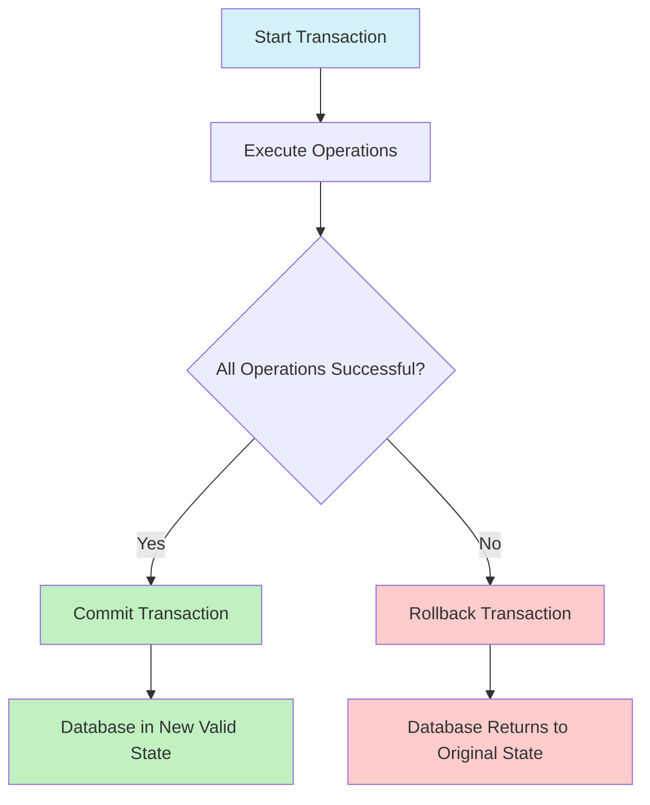

# SQL Transaction Basics

In database operations, maintaining data integrity is crucial. Imagine transferring money between bank accounts - you wouldn't want money to disappear if the system crashed mid-transfer! This is where SQL transactions come to the rescue.

## What is a SQL Transaction?

A transaction is a sequence of SQL operations that are treated as a single logical unit of work. Either all operations in a transaction succeed (commit), or none of them take effect (rollback).

Think of a transaction like a shopping trip:
- You put items in your cart (individual operations)
- At checkout, you either complete your purchase (commit) or abandon your cart (rollback)

## The ACID Properties

Transactions follow four fundamental principles known as ACID properties:

1. **Atomicity**: A transaction is all or nothing. If any part fails, the entire transaction fails.
2. **Consistency**: A transaction brings the database from one valid state to another.
3. **Isolation**: Concurrent transactions don't interfere with each other.
4. **Durability**: Once a transaction is committed, it remains so even in case of system failure.

Let's visualize how ACID properties protect our data:



## Basic Transaction Syntax

Here's the standard structure of a SQL transaction:

```sql
-- Start a transaction
BEGIN TRANSACTION;

-- SQL operations
INSERT INTO accounts (user_id, balance) VALUES (1, 1000);
UPDATE products SET stock = stock - 1 WHERE product_id = 101;

-- Commit if everything is successful
COMMIT;

-- Or rollback if something goes wrong
-- ROLLBACK;
```

## Transaction Example: Bank Transfer

Let's explore a real-world example of transferring $100 from Account A to Account B:

```sql
-- Start transaction
BEGIN TRANSACTION;

-- Check if Account A has sufficient funds
DECLARE @balance DECIMAL(10,2);
SELECT @balance = balance FROM accounts WHERE account_id = 'A';

IF @balance >= 100
BEGIN
    -- Deduct from Account A
    UPDATE accounts 
    SET balance = balance - 100 
    WHERE account_id = 'A';
    
    -- Add to Account B
    UPDATE accounts 
    SET balance = balance + 100 
    WHERE account_id = 'B';
    
    -- Successful completion
    COMMIT TRANSACTION;
    PRINT 'Transfer completed successfully';
END
ELSE
BEGIN
    -- Insufficient funds, cancel the transaction
    ROLLBACK TRANSACTION;
    PRINT 'Insufficient funds, transfer cancelled';
END
```

### Expected Output:

For successful transfer:
```
Transfer completed successfully
```

For insufficient funds:
```
Insufficient funds, transfer cancelled
```

## Error Handling in Transactions

In real applications, we need to handle unexpected errors. Here's how:

```sql
BEGIN TRY
    BEGIN TRANSACTION;
        
    -- Deduct from Account A
    UPDATE accounts 
    SET balance = balance - 100 
    WHERE account_id = 'A';
    
    -- Simulate error (division by zero)
    -- DELETE FROM nonexistent_table;
    
    -- Add to Account B
    UPDATE accounts 
    SET balance = balance + 100 
    WHERE account_id = 'B';
    
    COMMIT TRANSACTION;
    PRINT 'Transaction committed successfully';
END TRY
BEGIN CATCH
    ROLLBACK TRANSACTION;
    PRINT 'Error occurred: ' + ERROR_MESSAGE();
END CATCH
```

This ensures that if any operation fails, the entire transaction is rolled back, maintaining database consistency.

## Transaction Isolation Levels

SQL provides different isolation levels that control how transactions interact with each other:

1. **READ UNCOMMITTED**: Allows dirty reads (seeing uncommitted changes from other transactions)
2. **READ COMMITTED**: Prevents dirty reads but allows non-repeatable reads
3. **REPEATABLE READ**: Prevents dirty and non-repeatable reads but allows phantom reads
4. **SERIALIZABLE**: Highest isolation level, prevents all concurrency issues

Here's how to set an isolation level:

```sql
-- Set transaction isolation level
SET TRANSACTION ISOLATION LEVEL READ COMMITTED;

-- Start transaction
BEGIN TRANSACTION;

-- SQL operations

COMMIT;
```

## Practical Tips for Using Transactions

1. **Keep transactions short**: Long-running transactions can lock resources and affect performance
2. **Only include necessary operations**: Don't include operations that don't need to be part of the atomic unit
3. **Handle errors properly**: Always include error handling to ensure proper rollback
4. **Consider isolation levels**: Choose the appropriate isolation level based on your application needs
5. **Test thoroughly**: Simulate failure scenarios to ensure your transactions behave as expected

## Real-World Applications

Transactions are essential in many business operations:

1. **Financial systems**: Banking transfers, payments, accounting entries
2. **Inventory management**: Order processing, stock updates
3. **User registration**: Creating user profiles with default settings
4. **Content management**: Publishing articles with associated metadata
5. **E-commerce**: Order placement with inventory updates

## Summary

SQL transactions are a powerful mechanism for maintaining data integrity in your database operations. By understanding and implementing the ACID properties, you can ensure that your database remains in a consistent state even when errors occur.

Remember:
- Transactions group operations into atomic units
- ACID properties ensure reliability
- Use BEGIN, COMMIT, and ROLLBACK statements
- Always include error handling
- Choose appropriate isolation levels

## Exercises

1. Write a transaction that creates a new user and adds default settings to a user_settings table
2. Modify the bank transfer example to handle transfers between multiple accounts
3. Implement a transaction for an e-commerce order that updates product inventory and creates order records
4. Research how your particular database system (MySQL, PostgreSQL, SQL Server) implements transaction isolation levels

## Additional Resources

- [PostgreSQL Transaction Documentation](https://www.postgresql.org/docs/current/tutorial-transactions.html)
- [MySQL Transaction Documentation](https://dev.mysql.com/doc/refman/8.0/en/commit.html)
- [SQL Server Transaction Documentation](https://docs.microsoft.com/en-us/sql/t-sql/language-elements/transactions-transact-sql)
- Book: "SQL Performance Explained" by Markus Winand