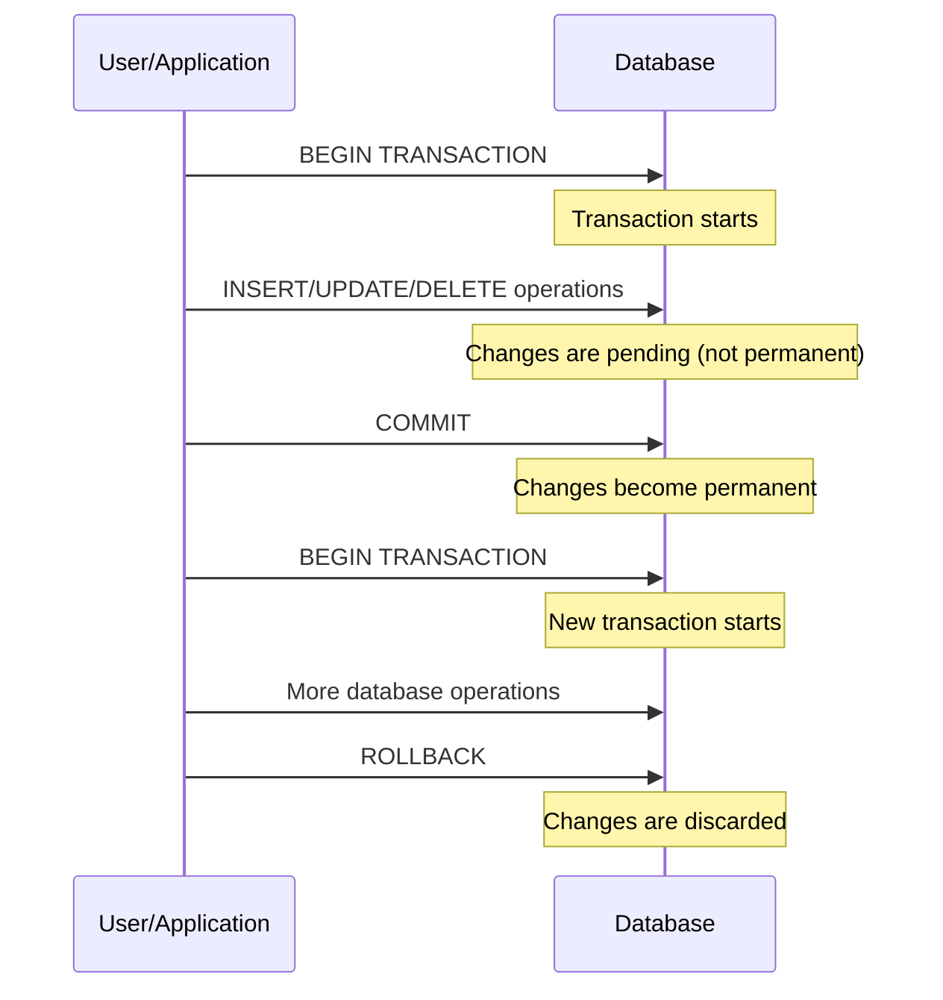

# SQL COMMIT - Making Changes Permanent

## Introduction

When working with databases, it's essential to maintain data integrity, especially when performing multiple related operations. SQL transactions provide a way to group a set of operations together as a single unit of work, ensuring that either all operations succeed or none of them take effect.

The **SQL COMMIT** statement is a crucial part of transaction management, as it permanently saves all changes made during the current transaction. Think of COMMIT as the "save button" for your database changes - once you commit, your changes are permanently stored in the database and become visible to other users.

## Understanding SQL COMMIT

### What is COMMIT?

A COMMIT is a statement that finalizes a transaction in a database by making all pending data changes permanent. When you execute a COMMIT, you're telling the database to:

1. Save all changes made during the current transaction
2. End the current transaction
3. Make the changes visible to other users and sessions
4. Release any locks held during the transaction

### Basic Syntax

The syntax for the COMMIT statement is straightforward:

```sql
COMMIT;
-- Or in some database systems:
COMMIT TRANSACTION;
-- Or:
COMMIT WORK;
```

All these variations perform the same action - they permanently save your changes to the database.

## How Transactions and COMMIT Work Together

To understand COMMIT fully, you need to see it in the context of a transaction:



## COMMIT in Action: Code Examples

### Example 1: Basic Transaction with COMMIT

Let's walk through a simple bank transfer example:

```sql
-- Start a new transaction
BEGIN TRANSACTION;

-- Deduct $500 from Account A
UPDATE accounts 
SET balance = balance - 500 
WHERE account_id = 'A123';

-- Add $500 to Account B
UPDATE accounts 
SET balance = balance + 500 
WHERE account_id = 'B456';

-- If both operations were successful, make the changes permanent
COMMIT;
```

If both UPDATE statements execute without errors, the COMMIT statement makes both changes permanent. The money is successfully transferred from one account to another.

### Example 2: Transaction with Error Checking

```sql
BEGIN TRANSACTION;

-- Attempt to deduct $500 from Account A
UPDATE accounts 
SET balance = balance - 500 
WHERE account_id = 'A123';

-- Check if Account A has sufficient funds
IF (SELECT balance FROM accounts WHERE account_id = 'A123') < 0 THEN
    -- If account would be overdrawn, cancel the transaction
    ROLLBACK;
    SELECT 'Transaction canceled: Insufficient funds' AS message;
ELSE
    -- Add $500 to Account B
    UPDATE accounts 
    SET balance = balance + 500 
    WHERE account_id = 'B456';
    
    -- Complete the transaction
    COMMIT;
    SELECT 'Transaction completed successfully' AS message;
END IF;
```

This example shows how COMMIT is used only when all conditions are met.

## Comparing COMMIT, ROLLBACK, and SAVEPOINT

Understanding the relationships between these transaction commands is important:

| Command | Purpose | Effect |
|---------|---------|--------|
| COMMIT | Save changes permanently | Makes all changes permanent and ends the transaction |
| ROLLBACK | Undo changes | Discards all changes made in the current transaction |
| SAVEPOINT | Create a point to roll back to | Creates a marker within a transaction |

## Auto-commit Mode

Many database systems and client applications operate in "auto-commit" mode by default, where each SQL statement is automatically committed immediately after execution. While convenient for simple operations, you need to explicitly disable auto-commit when working with transactions:

```sql
-- In MySQL
SET autocommit = 0;

-- In PostgreSQL
BEGIN;

-- In SQL Server
BEGIN TRANSACTION;

-- In SQLite
BEGIN TRANSACTION;
```

## Practical Applications

### E-commerce Order Processing

```sql
BEGIN TRANSACTION;

-- Insert the order header
INSERT INTO orders (order_id, customer_id, order_date, total_amount)
VALUES (12345, 101, CURRENT_DATE, 250.00);

-- Insert order details/items
INSERT INTO order_items (order_id, product_id, quantity, price)
VALUES
    (12345, 1001, 2, 75.00),
    (12345, 1002, 1, 100.00);

-- Update inventory for each product
UPDATE products
SET stock_quantity = stock_quantity - 2
WHERE product_id = 1001;

UPDATE products
SET stock_quantity = stock_quantity - 1
WHERE product_id = 1002;

-- Everything successful? Commit the changes
COMMIT;
```

This transaction ensures that order creation, item recording, and inventory updates are all handled as a single unit of work.

### Database Schema Changes

```sql
BEGIN TRANSACTION;

-- Add a new column
ALTER TABLE employees ADD COLUMN department_id INT;

-- Update existing records
UPDATE employees SET department_id = 1 WHERE team = 'Engineering';
UPDATE employees SET department_id = 2 WHERE team = 'Marketing';
UPDATE employees SET department_id = 3 WHERE team = 'Sales';

-- Check if updates were successful
IF (SELECT COUNT(*) FROM employees WHERE department_id IS NULL) = 0 THEN
    -- No NULL values, so commit the changes
    COMMIT;
    SELECT 'Schema update successful' AS message;
ELSE
    -- Found NULL values, roll back the changes
    ROLLBACK;
    SELECT 'Schema update failed: Not all records updated' AS message;
END IF;
```

## COMMIT Performance Considerations

While COMMIT is essential for data integrity, it does impact performance:

1. **Frequent commits**: Committing very frequently (after each small operation) can slow down bulk operations
2. **Infrequent commits**: Having very large transactions without committing can:
   - Lock database resources for extended periods
   - Risk losing more work if a failure occurs
   - Consume more memory/resources during the transaction

Best practice is to commit:
- After a logical unit of work is complete
- Frequently enough to reduce lock contention
- Not so frequently that performance suffers

## Database-Specific COMMIT Behavior

Different database systems have slight variations in COMMIT behavior:

### MySQL
```sql
-- Start transaction explicitly
START TRANSACTION;

-- Make some changes
INSERT INTO products (name, price) VALUES ('New Product', 19.99);

-- Commit the changes
COMMIT;
```

### PostgreSQL
```sql
-- Begin a transaction block
BEGIN;

-- Make changes
UPDATE products SET price = price * 1.1 WHERE category = 'Electronics';

-- Commit changes
COMMIT;
```

### SQL Server
```sql
-- Start a transaction
BEGIN TRANSACTION;

-- Make changes
DELETE FROM order_items WHERE order_id = 5432;
DELETE FROM orders WHERE order_id = 5432;

-- Commit the transaction
COMMIT TRANSACTION;
```

### SQLite
```sql
-- Begin transaction
BEGIN TRANSACTION;

-- Make changes
CREATE TABLE temp_data AS SELECT * FROM sales WHERE year = 2023;

-- Commit changes
COMMIT;
```

## Common Errors and Troubleshooting

### "Transaction Already Committed"
This error occurs when trying to commit a transaction that has already been committed:

```sql
BEGIN TRANSACTION;
UPDATE products SET price = 29.99 WHERE product_id = 101;
COMMIT;
COMMIT; -- Error: Transaction already committed
```

### "No Transaction Active"
This happens when trying to commit without an active transaction:

```sql
-- No BEGIN TRANSACTION statement
UPDATE products SET price = 29.99 WHERE product_id = 101;
COMMIT; -- Error in some databases: No transaction active
```

### Deadlocks
When transactions block each other:

```sql
-- Transaction 1
BEGIN TRANSACTION;
UPDATE accounts SET balance = balance - 100 WHERE account_id = 'A123';
-- Meanwhile, Transaction 2 is updating account 'B456'
UPDATE accounts SET balance = balance - 200 WHERE account_id = 'B456';
-- Deadlock may occur here if Transaction 2 is now trying to update 'A123'
```

Solution: Keep transactions short and update tables in a consistent order.

## Summary

The SQL COMMIT statement is a fundamental part of transaction management that permanently saves database changes. Key points to remember:

- COMMIT makes all changes in the current transaction permanent
- Once committed, changes cannot be rolled back
- COMMIT releases all locks acquired during the transaction
- Proper transaction management helps maintain data integrity
- Balance between too frequent and too infrequent commits is important

## Exercises

1. Write a transaction that transfers $200 between two accounts and commits only if both accounts have a positive balance after the transfer.

2. Create a transaction that adds a new customer and their initial order, with multiple order items. The transaction should only commit if all the ordered products have sufficient inventory.

3. Write a script that demonstrates the difference between auto-commit mode and explicit transaction control.

## Additional Resources

- [SQL Transactions Documentation](https://www.w3schools.com/sql/sql_transactions.asp)
- [PostgreSQL Transaction Documentation](https://www.postgresql.org/docs/current/tutorial-transactions.html)
- [MySQL Transaction and Commit Documentation](https://dev.mysql.com/doc/refman/8.0/en/commit.html)
- [SQL Server Transaction Control](https://learn.microsoft.com/en-us/sql/t-sql/language-elements/transactions-transact-sql)