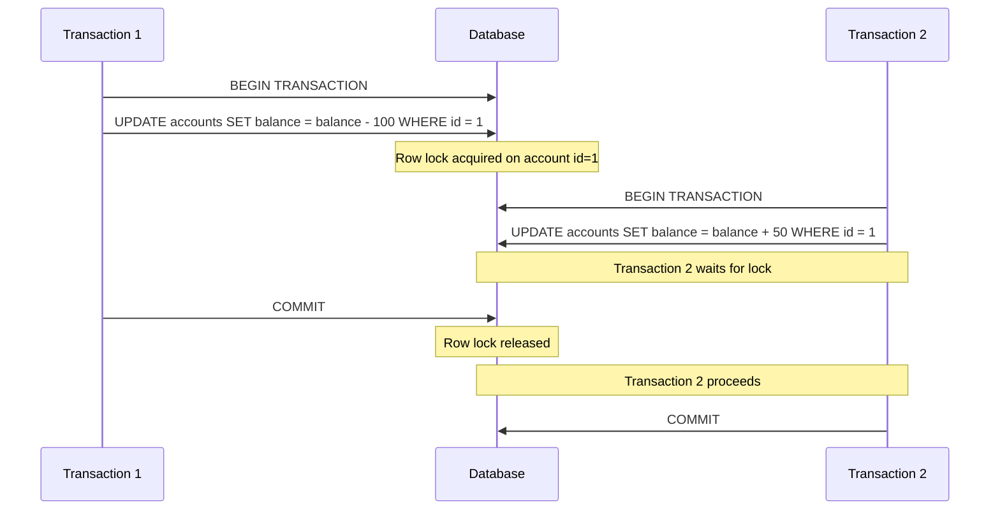

# SQL Transaction Performance

## Introduction

Transaction performance is a critical aspect of database management that directly impacts the efficiency and responsiveness of your applications. In SQL, a transaction is a sequence of operations performed as a single logical unit of work, ensuring data integrity through the ACID properties (Atomicity, Consistency, Isolation, Durability). However, poorly implemented transactions can lead to significant performance bottlenecks.

This guide will help you understand how to optimize SQL transaction performance, identify common issues, and implement best practices to create efficient database operations.

## Transaction Performance Fundamentals

### Why Transaction Performance Matters

Poor transaction performance can lead to several issues:

- Slow application response times
- Database connection pool exhaustion
- Deadlocks and timeouts
- Increased server resource consumption
- Poor user experience

Understanding how to optimize transactions is essential for developing scalable applications.

## Key Factors Affecting Transaction Performance

### 1. Transaction Size and Duration

The longer a transaction runs and the more operations it contains, the greater its impact on performance.

```sql
-- Poor performance: Large transaction with many operations
BEGIN TRANSACTION;
    -- Imagine hundreds of operations here
    UPDATE Products SET Price = Price * 1.1;
    UPDATE OrderItems SET Discount = 0.05 WHERE ProductID IN (SELECT ProductID FROM Products WHERE Category = 'Electronics');
    -- Many more operations...
COMMIT;

-- Better performance: Smaller, focused transactions
BEGIN TRANSACTION;
    UPDATE Products SET Price = Price * 1.1;
COMMIT;

BEGIN TRANSACTION;
    UPDATE OrderItems SET Discount = 0.05 WHERE ProductID IN (SELECT ProductID FROM Products WHERE Category = 'Electronics');
COMMIT;
```

### 2. Lock Contention

Transactions acquire locks on database resources, potentially blocking other transactions from accessing the same resources.



### 3. Isolation Level

Higher isolation levels provide stronger data consistency but can reduce concurrency and performance.

```sql
-- Lowest isolation, highest performance (but potential dirty reads)
SET TRANSACTION ISOLATION LEVEL READ UNCOMMITTED;

-- Balanced isolation and performance
SET TRANSACTION ISOLATION LEVEL READ COMMITTED;

-- Higher isolation, lower performance
SET TRANSACTION ISOLATION LEVEL REPEATABLE READ;

-- Highest isolation, lowest performance
SET TRANSACTION ISOLATION LEVEL SERIALIZABLE;
```

## Performance Optimization Techniques

### 1. Keep Transactions Short and Focused

```sql
-- Instead of one large transaction
BEGIN TRANSACTION;
    -- Process 10,000 records in a single transaction
    UPDATE Orders SET Status = 'Processed' WHERE OrderDate < '2023-01-01';
COMMIT;

-- Better approach: Batch processing
DECLARE @BatchSize INT = 1000;
DECLARE @Processed INT = 0;

WHILE @Processed < (SELECT COUNT(*) FROM Orders WHERE OrderDate < '2023-01-01')
BEGIN
    BEGIN TRANSACTION;
        UPDATE TOP (@BatchSize) Orders
        SET Status = 'Processed'
        WHERE OrderDate < '2023-01-01'
        AND Status != 'Processed';
    COMMIT;
    
    SET @Processed = @Processed + @BatchSize;
END;
```

### 2. Use Appropriate Indexes

Transactions involving queries without proper indexes will be slower and hold locks longer.

```sql
-- Slow transaction due to table scan
BEGIN TRANSACTION;
    UPDATE Customers
    SET Status = 'Active'
    WHERE LastPurchaseDate > '2023-01-01';
COMMIT;

-- First, add an index to improve performance
CREATE INDEX IX_Customers_LastPurchaseDate ON Customers(LastPurchaseDate);

-- Now the same transaction will perform better
BEGIN TRANSACTION;
    UPDATE Customers
    SET Status = 'Active'
    WHERE LastPurchaseDate > '2023-01-01';
COMMIT;
```

### 3. Choose the Right Isolation Level

Select the lowest isolation level that meets your consistency requirements:

```sql
-- Example: Read-only reporting query doesn't need high isolation
BEGIN TRANSACTION;
SET TRANSACTION ISOLATION LEVEL READ UNCOMMITTED;
    SELECT CategoryName, SUM(OrderTotal) as TotalSales
    FROM Orders
    JOIN Categories ON Orders.CategoryID = Categories.CategoryID
    GROUP BY CategoryName;
COMMIT;

-- Example: Financial transaction needs higher isolation
BEGIN TRANSACTION;
SET TRANSACTION ISOLATION LEVEL SERIALIZABLE;
    UPDATE Accounts SET Balance = Balance - 100 WHERE AccountID = 1;
    UPDATE Accounts SET Balance = Balance + 100 WHERE AccountID = 2;
COMMIT;
```

### 4. Minimize Lock Time

Perform any non-database operations outside the transaction:

```sql
-- Poor performance: Processing data inside transaction
BEGIN TRANSACTION;
    SELECT * FROM LargeTable WHERE ProcessingNeeded = 1;
    -- Imagine complex processing here taking several seconds
    UPDATE LargeTable SET ProcessingNeeded = 0 WHERE ProcessingNeeded = 1;
COMMIT;

-- Better performance: Process data outside transaction
DECLARE @DataToProcess TABLE (ID INT, Data VARCHAR(MAX));

-- Read data
INSERT INTO @DataToProcess
SELECT ID, Data FROM LargeTable WHERE ProcessingNeeded = 1;

-- Process data outside transaction
-- Imagine complex processing here...

-- Quick update in transaction
BEGIN TRANSACTION;
    UPDATE LargeTable 
    SET ProcessingNeeded = 0 
    WHERE ID IN (SELECT ID FROM @DataToProcess);
COMMIT;
```

## Common Performance Issues and Solutions

### Deadlocks

Deadlocks occur when two or more transactions block each other by holding locks that the other transaction needs.

```mermaid
graph LR
    T1("Transaction 1") --"Holds lock on A"---> A["Resource A"]
    T1 -.."Wants lock on B".-> B["Resource B"]
    T2("Transaction 2") --"Holds lock on B"---> B
    T2 -.."Wants lock on A".-> A
    
    style A fill:#f9f,stroke:#333,stroke-width:2px
    style B fill:#bbf,stroke:#333,stroke-width:2px
```

**Solution:** Access resources in the same order across all transactions.

```sql
-- Both transactions access tables in the same order (Products then Inventory)
-- Transaction 1
BEGIN TRANSACTION;
    UPDATE Products SET Price = Price * 1.1 WHERE ProductID = 101;
    UPDATE Inventory SET Quantity = Quantity - 5 WHERE ProductID = 101;
COMMIT;

-- Transaction 2
BEGIN TRANSACTION;
    UPDATE Products SET Price = Price * 0.9 WHERE ProductID = 202;
    UPDATE Inventory SET Quantity = Quantity + 10 WHERE ProductID = 202;
COMMIT;
```

### Blocking

Long-running transactions can block other transactions, reducing concurrency.

**Solution:** Use row versioning with optimistic concurrency control when appropriate.

```sql
-- Enable snapshot isolation for the database
ALTER DATABASE YourDatabase
SET ALLOW_SNAPSHOT_ISOLATION ON;

-- Use snapshot isolation for read operations
SET TRANSACTION ISOLATION LEVEL SNAPSHOT;
BEGIN TRANSACTION;
    -- This read won't block writers
    SELECT * FROM Products;
COMMIT;
```

### Connection Pool Exhaustion

Long-running transactions can hold database connections for extended periods.

**Solution:** Implement connection timeouts and transaction monitoring.

```sql
-- Set a maximum execution time (SQL Server)
BEGIN TRANSACTION;
    SET LOCK_TIMEOUT 5000; -- 5 seconds
    UPDATE LargeTable SET Status = 'Processed';
COMMIT;
```

## Practical Example: Order Processing System

Let's optimize a typical e-commerce order processing flow:

```sql
-- Original implementation (inefficient)
BEGIN TRANSACTION;
    -- Check inventory
    SELECT ProductID, Quantity FROM Inventory WHERE ProductID IN (101, 102, 103);
    
    -- Calculate total (this could involve complex logic)
    -- ... complex calculation logic ...
    
    -- Create order
    INSERT INTO Orders (CustomerID, OrderDate, TotalAmount) 
    VALUES (1001, GETDATE(), 156.78);
    
    DECLARE @OrderID INT = SCOPE_IDENTITY();
    
    -- Add order items
    INSERT INTO OrderItems (OrderID, ProductID, Quantity, Price) 
    VALUES 
        (@OrderID, 101, 2, 29.99),
        (@OrderID, 102, 1, 49.99),
        (@OrderID, 103, 3, 15.60);
    
    -- Update inventory (reduces available quantities)
    UPDATE Inventory SET Quantity = Quantity - 2 WHERE ProductID = 101;
    UPDATE Inventory SET Quantity = Quantity - 1 WHERE ProductID = 102;
    UPDATE Inventory SET Quantity = Quantity - 3 WHERE ProductID = 103;
    
    -- Process payment (could be slow and involve external services)
    -- ... payment processing logic ...
    
    -- Update order status
    UPDATE Orders SET Status = 'Paid' WHERE OrderID = @OrderID;
COMMIT;
```

**Optimized implementation:**

```sql
-- Step 1: Check inventory outside transaction
DECLARE @ProductsToOrder TABLE (ProductID INT, OrderQuantity INT);
INSERT INTO @ProductsToOrder VALUES (101, 2), (102, 1), (103, 3);

-- Verify availability (outside transaction)
IF EXISTS (
    SELECT 1 FROM Inventory i
    JOIN @ProductsToOrder p ON i.ProductID = p.ProductID
    WHERE i.Quantity < p.OrderQuantity
)
BEGIN
    SELECT 'Insufficient inventory' AS Message;
    RETURN;
END

-- Step 2: Calculate order total (outside transaction)
DECLARE @TotalAmount DECIMAL(10,2) = 0;
SELECT @TotalAmount = SUM(p.Price * pto.OrderQuantity)
FROM Products p
JOIN @ProductsToOrder pto ON p.ProductID = pto.ProductID;

-- Step 3: Create order and update inventory (in transaction)
BEGIN TRANSACTION;
    -- Create order
    INSERT INTO Orders (CustomerID, OrderDate, TotalAmount, Status) 
    VALUES (1001, GETDATE(), @TotalAmount, 'Pending');
    
    DECLARE @OrderID INT = SCOPE_IDENTITY();
    
    -- Add order items
    INSERT INTO OrderItems (OrderID, ProductID, Quantity, Price)
    SELECT @OrderID, p.ProductID, pto.OrderQuantity, p.Price
    FROM Products p
    JOIN @ProductsToOrder pto ON p.ProductID = pto.ProductID;
    
    -- Update inventory with a single statement
    UPDATE i
    SET i.Quantity = i.Quantity - pto.OrderQuantity
    FROM Inventory i
    JOIN @ProductsToOrder pto ON i.ProductID = pto.ProductID;
COMMIT;

-- Step 4: Process payment (outside transaction)
-- ... payment processing logic ...

-- Step 5: Update order status (separate transaction)
BEGIN TRANSACTION;
    UPDATE Orders SET Status = 'Paid' WHERE OrderID = @OrderID;
COMMIT;
```

The optimized implementation:
1. Performs inventory checks outside the transaction
2. Uses a single statement for inventory updates
3. Separates payment processing from database operations
4. Uses multiple focused transactions instead of one large transaction

## Performance Monitoring and Measurement

To optimize transaction performance, you need to measure it first:

### 1. Using Execution Plans

Execution plans show how SQL Server executes your queries:

```sql
-- View the execution plan for a transaction
SET STATISTICS TIME ON;
SET STATISTICS IO ON;

BEGIN TRANSACTION;
    UPDATE Products SET Price = Price * 1.1 WHERE Category = 'Electronics';
COMMIT;

SET STATISTICS TIME OFF;
SET STATISTICS IO OFF;
```

### 2. Using Dynamic Management Views (DMVs)

```sql
-- Find blocking transactions
SELECT * FROM sys.dm_tran_locks WHERE resource_type = 'KEY';

-- Find long-running transactions
SELECT 
    st.session_id,
    DB_NAME(dt.database_id) AS database_name,
    DATEDIFF(SECOND, dt.database_transaction_begin_time, GETDATE()) AS transaction_duration_seconds,
    dt.database_transaction_log_bytes_used/1024 AS log_kb_used
FROM 
    sys.dm_tran_active_transactions at
JOIN 
    sys.dm_tran_database_transactions dt ON at.transaction_id = dt.transaction_id
JOIN 
    sys.dm_tran_session_transactions st ON at.transaction_id = st.transaction_id
ORDER BY 
    transaction_duration_seconds DESC;
```

## Best Practices Summary

1. **Keep transactions short and focused** - Minimize the amount of time locks are held
2. **Use appropriate isolation levels** - Choose the lowest level that meets your needs
3. **Implement proper indexing** - Ensure queries within transactions are optimized
4. **Batch large operations** - Process large datasets in smaller batches
5. **Move non-database operations outside transactions** - Don't include network calls or complex calculations
6. **Access resources in a consistent order** - Prevent deadlocks by maintaining a consistent access pattern
7. **Use connection pooling effectively** - Don't hold connections longer than necessary
8. **Monitor transaction performance** - Use execution plans and DMVs to identify bottlenecks
9. **Consider optimistic concurrency** - Use row versioning for read-heavy scenarios
10. **Implement retry logic** - Handle deadlocks gracefully with automatic retries

## Exercises

1. **Performance Analysis:** Take an existing transaction from your application and analyze its performance using execution plans.

2. **Deadlock Resolution:** Create a sample database with two tables. Write two transactions that access these tables in different orders, causing a deadlock. Then modify the transactions to prevent the deadlock.

3. **Batch Processing:** Implement a batch processing solution for updating 100,000 records while maintaining good performance.

4. **Isolation Level Testing:** Create a test case that demonstrates the differences between the four standard isolation levels.

## Additional Resources

- [SQL Server Transaction Locking and Row Versioning Guide](https://learn.microsoft.com/en-us/sql/relational-databases/sql-server-transaction-locking-and-row-versioning-guide)
- [Understanding and Optimizing SQL Server's Transaction Log](https://www.red-gate.com/simple-talk/databases/sql-server/database-administration-sql-server/understanding-and-optimizing-sql-servers-transaction-log/)
- [SQL Server Execution Plans by Grant Fritchey](https://www.red-gate.com/library/sql-server-execution-plans-third-edition)
- [Transaction Processing: Concepts and Techniques (Gray & Reuter)](https://www.amazon.com/Transaction-Processing-Concepts-Techniques-Management/dp/1558601902)

Remember that transaction performance optimization is a continuous process. As your application grows, you'll need to revisit your transaction designs to ensure they continue to meet performance requirements.