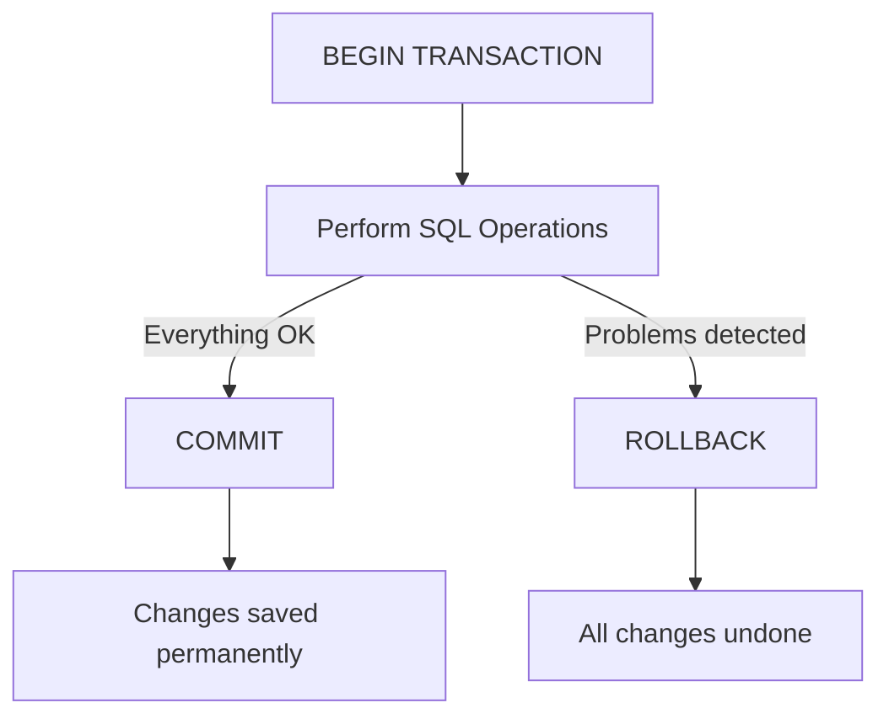

# SQL Rollback

## Introduction

When working with databases, you'll often need to perform multiple related operations that should be treated as a single unit of work. For example, transferring money between bank accounts requires deducting from one account and adding to another. SQL transactions allow you to group these operations and ensure database integrity.

The `ROLLBACK` statement is a critical component of SQL transactions that allows you to undo changes that haven't been committed yet. Think of it as your "undo" button when something goes wrong during a transaction.

## Understanding Transactions and Rollback

Before diving into `ROLLBACK`, let's understand the transaction workflow:

1. Begin a transaction with `BEGIN TRANSACTION`
2. Perform one or more SQL operations (INSERT, UPDATE, DELETE)
3. Either:
   - `COMMIT` the transaction to save all changes permanently, or
   - `ROLLBACK` the transaction to undo all changes



## Basic ROLLBACK Syntax

The basic syntax for a transaction with rollback is:

```sql
BEGIN TRANSACTION;
-- SQL operations here
-- If something goes wrong:
ROLLBACK;
```

If you've started a transaction but then discover a problem or error, executing the `ROLLBACK` statement will revert all changes made since the transaction began.

## ROLLBACK Examples

### Example 1: Simple Rollback

Let's look at a simple example where we try to update a customer's email address but then decide to roll back the change:

```sql
-- Start a transaction
BEGIN TRANSACTION;

-- Update customer email
UPDATE customers
SET email = 'new.email@example.com'
WHERE customer_id = 101;

-- Check the result (optional)
SELECT email FROM customers WHERE customer_id = 101;
-- Output: new.email@example.com

-- Oops, we changed the wrong email! Let's roll back
ROLLBACK;

-- Verify that the email is back to the original value
SELECT email FROM customers WHERE customer_id = 101;
-- Output: original.email@example.com
```

### Example 2: Bank Transfer with Error Handling

Here's a more practical example of a bank transfer with error handling:

```sql
BEGIN TRANSACTION;

-- Variables for our transfer
DECLARE @FromAccount INT = 1001;
DECLARE @ToAccount INT = 2002;
DECLARE @Amount DECIMAL(10,2) = 500.00;
DECLARE @FromBalance DECIMAL(10,2);

-- Check if source account has enough funds
SELECT @FromBalance = balance 
FROM accounts 
WHERE account_id = @FromAccount;

-- If balance is insufficient, roll back
IF @FromBalance < @Amount
BEGIN
    PRINT 'Insufficient funds. Transaction cancelled.';
    ROLLBACK;
    RETURN;
END

-- Deduct from source account
UPDATE accounts
SET balance = balance - @Amount
WHERE account_id = @FromAccount;

-- Add to destination account
UPDATE accounts
SET balance = balance + @Amount
WHERE account_id = @ToAccount;

-- If everything went well, commit the transaction
COMMIT;
PRINT 'Transfer completed successfully.';
```

## When to Use ROLLBACK

The `ROLLBACK` statement is particularly useful in the following scenarios:

1. **Error handling**: When an error occurs during transaction execution
2. **Data validation failures**: When data doesn't meet business rules
3. **Concurrency issues**: When detecting deadlocks or conflicts
4. **Testing**: When exploring the impact of operations without committing changes
5. **User cancellation**: When a user decides to cancel an operation

## Transaction Isolation and ROLLBACK

SQL provides different transaction isolation levels that affect how transactions interact with each other. The `ROLLBACK` behavior remains consistent across isolation levels, but what you're rolling back from might differ.

Common isolation levels include:

- **READ UNCOMMITTED**: Can see uncommitted changes from other transactions
- **READ COMMITTED**: Only sees committed changes
- **REPEATABLE READ**: Ensures same read results throughout transaction
- **SERIALIZABLE**: Highest isolation, transactions are completely isolated


## SAVEPOINT: Partial Rollbacks

If you need finer control, SQL allows you to create savepoints within a transaction and roll back to specific points rather than canceling the entire transaction:

```sql
BEGIN TRANSACTION;

-- First operation
INSERT INTO orders (customer_id, product_id, quantity)
VALUES (123, 456, 1);

-- Create a savepoint after the first operation
SAVE TRANSACTION InsertOrder;

-- Second operation
UPDATE inventory
SET stock = stock - 1
WHERE product_id = 456;

-- Oops, something went wrong with the inventory update!
-- Roll back to the savepoint, keeping the order but undoing the inventory update
ROLLBACK TRANSACTION InsertOrder;

-- Continue with other operations
INSERT INTO order_log (order_id, action)
VALUES (SCOPE_IDENTITY(), 'Order created');

-- Commit the transaction
COMMIT;
```

## Database Specific Syntax

While the concepts are similar across database systems, the specific syntax may vary:

### MySQL and MariaDB
```sql
START TRANSACTION;
-- operations
ROLLBACK;
```

### PostgreSQL
```sql
BEGIN;
-- operations
ROLLBACK;
```

### Oracle
```sql
-- Transactions start automatically
-- operations
ROLLBACK;
```

### SQL Server
```sql
BEGIN TRANSACTION;
-- operations
ROLLBACK TRANSACTION;
```

### SQLite
```sql
BEGIN TRANSACTION;
-- operations
ROLLBACK;
```

## Best Practices for Using ROLLBACK

1. **Always use transactions for related operations** that need to be atomic.
2. **Include proper error handling** to catch exceptions and roll back when necessary.
3. **Keep transactions short** to reduce lock contention.
4. **Test rollback scenarios** to ensure your recovery logic works.
5. **Consider using savepoints** for complex transactions.
6. **Be careful with automatic commits** in your database settings or client applications.

## Common Pitfalls

1. **Forgetting that some statements cause implicit commits** in certain databases (like MySQL).
2. **Not handling nested transactions properly**.
3. **Assuming ROLLBACK will work for schema changes** (DDL statements), which often cause implicit commits.
4. **Holding transactions open too long**, causing concurrency issues.

## Real-World Application: E-commerce Order System

Let's look at a complete example of an e-commerce order system:

```sql
BEGIN TRANSACTION;

DECLARE @CustomerID INT = 201;
DECLARE @ProductID INT = 301;
DECLARE @Quantity INT = 5;
DECLARE @OrderID INT;
DECLARE @InStock INT;

-- Check inventory
SELECT @InStock = stock FROM products WHERE product_id = @ProductID;

IF @InStock < @Quantity
BEGIN
    PRINT 'Not enough inventory available.';
    ROLLBACK;
    RETURN;
END

-- Create order
INSERT INTO orders (customer_id, order_date, status)
VALUES (@CustomerID, GETDATE(), 'PENDING');

-- Get the new order ID
SET @OrderID = SCOPE_IDENTITY();

-- Add order details
INSERT INTO order_items (order_id, product_id, quantity, price)
SELECT @OrderID, @ProductID, @Quantity, price
FROM products
WHERE product_id = @ProductID;

-- Update inventory
UPDATE products
SET stock = stock - @Quantity
WHERE product_id = @ProductID;

-- Check if customer has a loyalty discount
IF EXISTS (
    SELECT 1 FROM loyalty_program 
    WHERE customer_id = @CustomerID AND status = 'ACTIVE'
)
BEGIN
    -- Apply discount
    UPDATE orders
    SET discount = 0.1
    WHERE order_id = @OrderID;
END

-- If everything is successful, commit the transaction
COMMIT;
PRINT 'Order placed successfully!';
```

## Summary

The `ROLLBACK` statement is a crucial safety net in SQL transactions that allows you to:

- Undo changes made during a transaction
- Maintain data integrity when errors occur
- Implement proper error handling in your database operations
- Support partial rollbacks using savepoints

Remember that transactions should follow the ACID properties (Atomicity, Consistency, Isolation, Durability), and the `ROLLBACK` statement is what enables the Atomicity property - ensuring that either all operations in a transaction succeed, or none of them do.

## Exercises

1. Write a transaction that creates a new user and their default profile, with a rollback if any step fails.
2. Implement a transaction with savepoints for a multi-step process like creating an invoice with multiple line items.
3. Create a scenario where you would check business rules and roll back if they aren't met.
4. Write a transaction that handles concurrent user access to the same resource.

## Additional Resources

- [SQL Transactions and ACID Properties](https://www.yourwebsite.com/sql-transactions)
- [Advanced Error Handling in SQL](https://www.yourwebsite.com/sql-error-handling)
- [Transaction Isolation Levels Explained](https://www.yourwebsite.com/isolation-levels)
- [SQL Performance Optimization](https://www.yourwebsite.com/sql-performance)