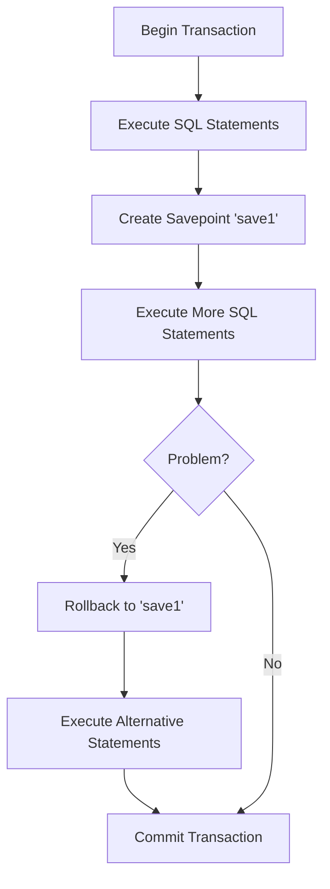

# SQL Savepoint

## Introduction

When working with databases, you often need to perform multiple operations as a single unit of work. SQL transactions allow you to group several SQL statements into a single logical unit. Within these transactions, **savepoints** are special markers that give you even more granular control.

A savepoint acts like a checkpoint within a transaction. Think of it as placing a bookmark in your transaction journey. If something goes wrong after a savepoint, you can roll back to that specific point instead of undoing the entire transaction.

## What are SQL Savepoints?

A savepoint is a point within a transaction that you can roll back to without aborting the entire transaction. This gives you the flexibility to:

- Create multiple "checkpoints" within a single transaction
- Roll back parts of a transaction while keeping other parts intact
- Implement more complex error handling strategies

Let's dive deeper into how savepoints work and when to use them.

## Basic Savepoint Syntax

```sql
-- Start a transaction
BEGIN TRANSACTION;

-- Perform some operations
INSERT INTO Customers (Name, Email) VALUES ('John Doe', 'john@example.com');

-- Create a savepoint
SAVEPOINT save_point_1;

-- Perform more operations
UPDATE Products SET Stock = Stock - 1 WHERE ProductID = 101;

-- If something goes wrong, roll back to the savepoint
ROLLBACK TO save_point_1;

-- Continue with other operations
INSERT INTO Orders (CustomerID, ProductID) VALUES (1, 102);

-- Commit the transaction
COMMIT;
```

## How Savepoints Work

Savepoints operate within the context of a transaction. Here's the typical flow:

1. Start a transaction using `BEGIN TRANSACTION` (or equivalent)
2. Execute some SQL statements
3. Create a savepoint using the `SAVEPOINT` command
4. Execute more SQL statements
5. If needed, roll back to a savepoint using `ROLLBACK TO savepoint_name`
6. Continue with more statements or commit the transaction



## Practical Examples

Let's explore some real-world scenarios where savepoints are particularly useful.

### Example 1: Customer Registration Process

Imagine you're building a customer registration system that involves:
1. Creating a customer record
2. Adding default preferences
3. Sending a welcome email

```sql
BEGIN TRANSACTION;

-- Insert customer data
INSERT INTO Customers (Name, Email, Phone)
VALUES ('Jane Smith', 'jane@example.com', '555-1234');

-- Create a savepoint after customer creation
SAVEPOINT customer_created;

-- Attempt to add default preferences
INSERT INTO CustomerPreferences (CustomerID, PreferenceKey, PreferenceValue)
VALUES 
    (SCOPE_IDENTITY(), 'theme', 'light'),
    (SCOPE_IDENTITY(), 'notifications', 'email');

-- Check if preferences were added correctly
IF @@ERROR <> 0
BEGIN
    -- If there was an error with preferences, rollback to after customer creation
    ROLLBACK TO customer_created;
    
    -- Try a different approach to add preferences
    INSERT INTO CustomerPreferences (CustomerID, PreferenceKey, PreferenceValue)
    SELECT MAX(CustomerID), 'theme', 'light' FROM Customers WHERE Name = 'Jane Smith';
END

-- Record that welcome email was sent
UPDATE Customers 
SET WelcomeEmailSent = 1 
WHERE Email = 'jane@example.com';

COMMIT;
```

### Example 2: Inventory Management System

Consider an inventory management system that needs to process an order:

```sql
BEGIN TRANSACTION;

-- Check if customer exists
DECLARE @CustomerID INT;
SELECT @CustomerID = CustomerID FROM Customers WHERE Email = 'customer@example.com';

-- Create customer if they don't exist
IF @CustomerID IS NULL
BEGIN
    INSERT INTO Customers (Name, Email) VALUES ('New Customer', 'customer@example.com');
    SET @CustomerID = SCOPE_IDENTITY();
END

-- Create a savepoint after ensuring customer exists
SAVEPOINT customer_ready;

-- Create an order
INSERT INTO Orders (CustomerID, OrderDate) VALUES (@CustomerID, GETDATE());
DECLARE @OrderID INT = SCOPE_IDENTITY();

-- Create a savepoint after order creation
SAVEPOINT order_created;

-- Try to add order items
-- Check if enough inventory exists for ProductID 101
DECLARE @AvailableStock INT;
SELECT @AvailableStock = Stock FROM Products WHERE ProductID = 101;

IF @AvailableStock >= 5
BEGIN
    -- Add item to order
    INSERT INTO OrderItems (OrderID, ProductID, Quantity) 
    VALUES (@OrderID, 101, 5);
    
    -- Update inventory
    UPDATE Products SET Stock = Stock - 5 WHERE ProductID = 101;
END
ELSE
BEGIN
    -- Not enough inventory, roll back to after order creation
    ROLLBACK TO order_created;
    
    -- Add a different product instead
    INSERT INTO OrderItems (OrderID, ProductID, Quantity) 
    VALUES (@OrderID, 102, 3);
    
    -- Update inventory for the alternative product
    UPDATE Products SET Stock = Stock - 3 WHERE ProductID = 102;
END

COMMIT;
```

## Multiple Savepoints

You can create multiple savepoints within a single transaction, giving you multiple rollback positions:

```sql
BEGIN TRANSACTION;

INSERT INTO Customers (Name) VALUES ('Customer 1');
SAVEPOINT sp1;

UPDATE Products SET Price = Price * 1.1 WHERE Category = 'Electronics';
SAVEPOINT sp2;

DELETE FROM Inventory WHERE ExpiryDate < GETDATE();
SAVEPOINT sp3;

-- If there's a problem with the delete operation
ROLLBACK TO sp2;

-- Continue with different operations
INSERT INTO Audit (Action, Details) VALUES ('Price Update', 'Electronics prices increased by 10%');

COMMIT;
```

## Database-Specific Syntax

While the concept of savepoints is part of the SQL standard, the exact syntax may vary slightly between database systems:

### MySQL
```sql
START TRANSACTION;
-- SQL statements
SAVEPOINT sp1;
-- More SQL statements
ROLLBACK TO sp1;
COMMIT;
```

### PostgreSQL
```sql
BEGIN;
-- SQL statements
SAVEPOINT sp1;
-- More SQL statements
ROLLBACK TO sp1;
COMMIT;
```

### Oracle
```sql
BEGIN
-- SQL statements
SAVEPOINT sp1;
-- More SQL statements
ROLLBACK TO sp1;
COMMIT;
END;
```

### SQL Server
```sql
BEGIN TRANSACTION;
-- SQL statements
SAVE TRANSACTION sp1;  -- Note the different syntax
-- More SQL statements
ROLLBACK TRANSACTION sp1;
COMMIT TRANSACTION;
```

## Limitations and Considerations

When using savepoints, keep these important points in mind:

1. **Savepoints are only valid within the current transaction** - They cease to exist once the transaction is committed or rolled back entirely.

2. **Savepoint names must be unique** within a transaction.

3. **Memory usage** - Savepoints can increase memory usage in the database since the system needs to maintain information about the transaction state at each savepoint.

4. **Database support varies** - Not all databases support savepoints, and some have limitations on how many savepoints you can create.

5. **Nested transactions** - In some databases, savepoints can be used to implement a form of nested transactions.

## Summary

SQL savepoints are powerful tools that give you fine-grained control within transactions. By creating checkpoints in your transaction flow, you can implement more sophisticated error handling and recovery strategies.

Key takeaways:
- Savepoints let you roll back to a specific point within a transaction
- They're ideal for complex transaction logic with multiple stages
- Syntax varies slightly between database systems
- They help create more robust database operations by allowing partial rollbacks

## Exercises

1. Write a transaction that adds a new product to a database, creates a savepoint, then adds inventory for that product. If the inventory addition fails, roll back to the savepoint and log the error.

2. Create a transaction with three savepoints. After each savepoint, perform a different operation. Then demonstrate rolling back to different savepoints.

3. Research how your specific database system handles savepoints. Are there any special limitations or features?

## Additional Resources

- [SQL Transactions](https://www.w3schools.com/sql/sql_transactions.asp) on W3Schools
- [PostgreSQL Savepoint Documentation](https://www.postgresql.org/docs/current/sql-savepoint.html)
- [MySQL Savepoint Documentation](https://dev.mysql.com/doc/refman/8.0/en/savepoint.html)
- [SQL Server Save Transaction Documentation](https://docs.microsoft.com/en-us/sql/t-sql/language-elements/save-transaction-transact-sql)