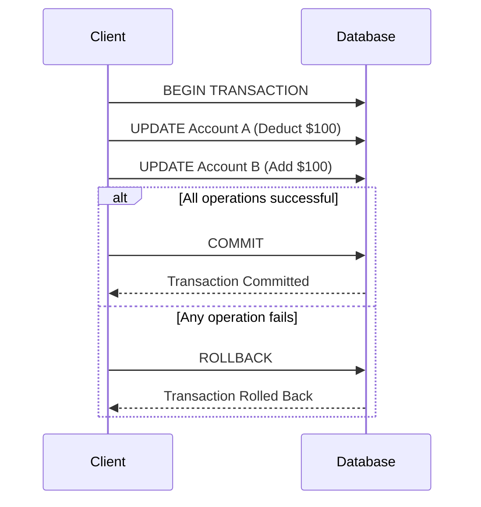
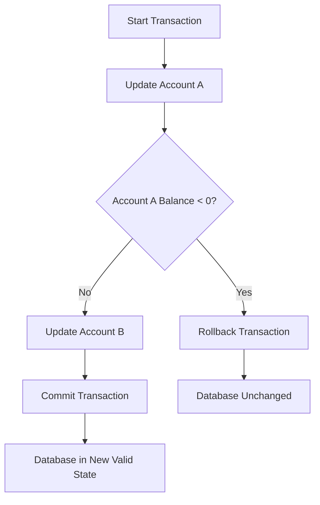
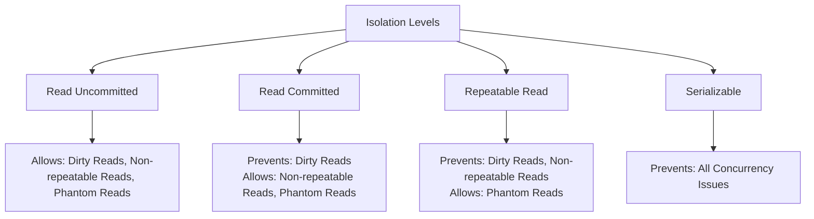

# SQL ACID Properties

## Introduction

When working with databases, ensuring that your data remains accurate and reliable is paramount. This is especially true when multiple users are accessing and modifying the same data simultaneously. This is where SQL transactions and their ACID properties come into play.

ACID is an acronym that stands for **Atomicity**, **Consistency**, **Isolation**, and **Durability**. These four properties guarantee that database transactions are processed reliably, even in the event of errors, power failures, or other unexpected issues. Think of ACID properties as a set of promises that your database management system makes to ensure your data remains correct and dependable.

In this tutorial, we'll explore each of these properties in detail, understand why they're important, and see how they work in real-world scenarios.

## What are SQL Transactions?

Before diving into ACID properties, let's quickly understand what SQL transactions are:

A transaction is a sequence of one or more SQL operations that are executed as a single unit of work. If any operation within the transaction fails, the entire transaction fails and the database is left unchanged. If all operations succeed, the changes are committed to the database.

Here's a simple example of a transaction:

```sql
BEGIN TRANSACTION;
    UPDATE accounts SET balance = balance - 100 WHERE account_id = 123;
    UPDATE accounts SET balance = balance + 100 WHERE account_id = 456;
COMMIT;
```

In this example, we're transferring $100 from one account to another. Both operations need to succeed, or neither should take effect.

## The ACID Properties

Let's explore each of the ACID properties in detail:

### Atomicity

**Atomicity** ensures that all operations within a transaction are treated as a single, indivisible unit. Either all operations succeed, or none of them do.

#### Example: Bank Transfer

Consider a bank transfer where you need to:
1. Deduct money from Account A
2. Add money to Account B

```sql
BEGIN TRANSACTION;
    -- Deduct $100 from Account A
    UPDATE accounts SET balance = balance - 100 WHERE account_id = 'A';
    
    -- Add $100 to Account B
    UPDATE accounts SET balance = balance + 100 WHERE account_id = 'B';
COMMIT;
```

If the system crashes after deducting from Account A but before adding to Account B, atomicity ensures that the entire transaction is rolled back, and Account A's balance is restored.

#### Diagram: Atomicity in Action



### Consistency

**Consistency** ensures that a transaction can only bring the database from one valid state to another, maintaining all predefined rules, constraints, cascades, and triggers.

#### Example: Account Balance Constraint

Let's say we have a rule that an account balance must never fall below $0:

```sql
BEGIN TRANSACTION;
    -- This would violate our constraint if Account A only has $50
    UPDATE accounts SET balance = balance - 100 WHERE account_id = 'A';
    
    -- Check if constraint is violated
    IF (SELECT balance FROM accounts WHERE account_id = 'A') < 0 THEN
        ROLLBACK;
    ELSE
        -- Add $100 to Account B
        UPDATE accounts SET balance = balance + 100 WHERE account_id = 'B';
        COMMIT;
    END IF;
```

If the update would cause Account A's balance to go below $0, the transaction would be rolled back, maintaining database consistency.

#### Diagram: Consistency Enforcement



### Isolation

**Isolation** ensures that concurrent execution of transactions leaves the database in the same state as if the transactions were executed sequentially.

#### Isolation Levels

SQL offers different isolation levels with trade-offs between performance and data consistency:

1. **Read Uncommitted**: Lowest isolation level; allows dirty reads
2. **Read Committed**: Prevents dirty reads
3. **Repeatable Read**: Prevents dirty and non-repeatable reads
4. **Serializable**: Highest isolation level; prevents all concurrency issues

#### Example: Concurrent Bank Transfers

Consider two transactions occurring simultaneously:

Transaction 1:
```sql
BEGIN TRANSACTION;
    -- Read Account A balance (assume it's $500)
    SELECT balance FROM accounts WHERE account_id = 'A';
    
    -- Some processing time
    
    -- Update Account A based on the read value
    UPDATE accounts SET balance = 400 WHERE account_id = 'A';
COMMIT;
```

Transaction 2 (happening concurrently):
```sql
BEGIN TRANSACTION;
    -- Update Account A
    UPDATE accounts SET balance = balance - 200 WHERE account_id = 'A';
COMMIT;
```

Without proper isolation, Transaction 1 might read an outdated value and overwrite changes made by Transaction 2.

#### Setting Isolation Level

You can set the isolation level for your transactions:

```sql
-- Set isolation level for the entire session
SET TRANSACTION ISOLATION LEVEL SERIALIZABLE;

-- Or for a specific transaction
BEGIN TRANSACTION ISOLATION LEVEL SERIALIZABLE;
    -- Transaction operations
COMMIT;
```

#### Diagram: Isolation Levels



### Durability

**Durability** ensures that once a transaction has been committed, it remains committed even in the case of a system failure (power outage, crash, etc.).

#### How Durability Works

1. Changes are written to a transaction log
2. The log is flushed to non-volatile storage (disk)
3. The actual database changes are applied

Even if the system crashes before the changes are applied to the database, the database can recover by replaying the transaction logs.

#### Example: Ensuring Durability

Most database systems handle durability automatically, but you can sometimes configure it:

```sql
-- PostgreSQL example: Wait for WAL (Write-Ahead Log) to be written to disk
SET synchronous_commit = on;

BEGIN TRANSACTION;
    -- Transaction operations
COMMIT;
```

## Real-World Application: E-Commerce Order Processing

Let's look at how ACID properties ensure reliable order processing in an e-commerce application:

```sql
BEGIN TRANSACTION;
    -- 1. Check if product is in stock
    DECLARE @stock INT;
    SELECT @stock = stock FROM products WHERE product_id = 123;
    
    IF @stock >= 1
    BEGIN
        -- 2. Decrease product stock
        UPDATE products SET stock = stock - 1 WHERE product_id = 123;
        
        -- 3. Create order record
        INSERT INTO orders (customer_id, product_id, quantity, price)
        VALUES (456, 123, 1, 29.99);
        
        -- 4. Get the new order ID
        DECLARE @order_id INT;
        SET @order_id = SCOPE_IDENTITY();
        
        -- 5. Record payment
        INSERT INTO payments (order_id, amount, payment_method)
        VALUES (@order_id, 29.99, 'credit_card');
        
        -- All operations successful, commit the transaction
        COMMIT;
    END
    ELSE
    BEGIN
        -- Product not in stock, rollback the transaction
        ROLLBACK;
    END
```

In this example:
- **Atomicity**: Either all steps succeed (decrease stock, create order, record payment) or none do
- **Consistency**: We only process the order if the product is in stock
- **Isolation**: Prevents another customer from purchasing the last item while our transaction is in progress
- **Durability**: Once committed, the order persists even if the system crashes

## Common Transaction Control Commands

Here are the common SQL commands used to control transactions:

```sql
-- Start a transaction
BEGIN TRANSACTION;

-- Commit changes
COMMIT;

-- Undo changes
ROLLBACK;

-- Create a savepoint within a transaction
SAVE TRANSACTION save_point_name;

-- Roll back to a savepoint
ROLLBACK TRANSACTION save_point_name;
```

## Database System Differences

Different database systems may have variations in transaction syntax:

### MySQL

```sql
START TRANSACTION;
-- Operations
COMMIT;
```

### PostgreSQL

```sql
BEGIN;
-- Operations
COMMIT;
```

### SQL Server

```sql
BEGIN TRANSACTION;
-- Operations
COMMIT TRANSACTION;
```

### Oracle

```sql
BEGIN
-- Operations
COMMIT;
```

## Potential Issues and Solutions

### Deadlocks

A deadlock occurs when two transactions are waiting for each other to release locks on resources.

**Solution**: Most database systems automatically detect and resolve deadlocks by rolling back one of the transactions. You can also set transaction timeouts.

### Long-Running Transactions

Long-running transactions can hold locks for extended periods, blocking other transactions.

**Solution**: Keep transactions as short as possible and consider breaking large operations into smaller transactions when appropriate.

## Summary

ACID properties are fundamental concepts in database transactions that ensure data reliability and integrity:

- **Atomicity**: All or nothing execution
- **Consistency**: Database remains in a valid state
- **Isolation**: Transactions are independent of each other
- **Durability**: Committed changes are permanent

Understanding these properties is crucial for developing robust database applications that handle data correctly, especially in concurrent and error-prone environments.

## Exercises

1. Write a transaction that transfers funds between two accounts while ensuring the source account doesn't go below zero.
2. Create a transaction to process a customer order that checks inventory, updates stock, creates an order record, and processes payment.
3. Research and explain how your chosen database system (MySQL, PostgreSQL, etc.) implements ACID properties.
4. Compare the behavior of different isolation levels by running concurrent transactions and observing the results.

## Additional Resources

- [SQL Transactions - W3Schools](https://www.w3schools.com/sql/sql_transactions.asp)
- [Understanding Transaction Isolation Levels](https://docs.microsoft.com/en-us/sql/t-sql/language-elements/transaction-isolation-levels)
- [PostgreSQL Transaction Documentation](https://www.postgresql.org/docs/current/tutorial-transactions.html)
- [MySQL Transaction Documentation](https://dev.mysql.com/doc/refman/8.0/en/commit.html)