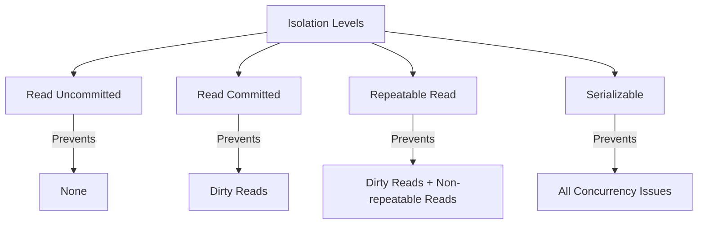

# SQL Transaction Isolation

## Introduction

When multiple users access a database simultaneously, their transactions can potentially interfere with each other, leading to data inconsistencies. SQL transaction isolation levels provide mechanisms to control how and when changes made by one transaction become visible to other concurrent transactions.

Transaction isolation is a crucial concept in database management that helps maintain data integrity in environments where multiple operations occur simultaneously. By understanding isolation levels, you can ensure your applications handle concurrent access correctly while avoiding common concurrency problems.

## What is Transaction Isolation?

Transaction isolation defines the degree to which operations in one transaction are isolated from operations in other concurrent transactions. The SQL standard defines four isolation levels, each offering different trade-offs between consistency and performance:

1. **Read Uncommitted**
2. **Read Committed**
3. **Repeatable Read**
4. **Serializable**

Let's explore each isolation level and the concurrency issues they address.

## Concurrency Problems

Before diving into isolation levels, it's important to understand the common concurrency problems they aim to solve:

### Dirty Reads

A dirty read occurs when one transaction reads data that has been modified but not yet committed by another transaction. If the second transaction rolls back its changes, the first transaction has read invalid data.

### Non-Repeatable Reads

A non-repeatable read happens when a transaction reads the same row twice and gets different values because another transaction modified the row between the reads.

### Phantom Reads

A phantom read occurs when a transaction re-executes a query that returns a set of rows satisfying a condition, and finds that the set of rows has changed due to another recently committed transaction.

Now, let's see how different isolation levels address these issues.

## Isolation Levels

### Read Uncommitted

This is the lowest isolation level, offering minimal protection against concurrency issues.

- **Characteristics**: Transactions can read uncommitted changes made by other transactions.
- **Concurrency Issues**: Allows dirty reads, non-repeatable reads, and phantom reads.
- **Performance**: Highest performance due to minimal locking.

#### Example:

```sql
-- Transaction 1
BEGIN TRANSACTION;
SET TRANSACTION ISOLATION LEVEL READ UNCOMMITTED;

-- Check account balance
SELECT balance FROM accounts WHERE account_id = 123;
-- Returns $1000

-- Meanwhile, Transaction 2 updates the balance but hasn't committed
-- Transaction 2: UPDATE accounts SET balance = 800 WHERE account_id = 123;

-- If we check again in Transaction 1
SELECT balance FROM accounts WHERE account_id = 123;
-- Returns $800 (dirty read) even though Transaction 2 hasn't committed

COMMIT;
```

### Read Committed

This is the default isolation level in many database systems, including PostgreSQL and SQL Server.

- **Characteristics**: Transactions can only read committed changes made by other transactions.
- **Concurrency Issues**: Prevents dirty reads but allows non-repeatable reads and phantom reads.
- **Performance**: Good balance between consistency and performance.

#### Example:

```sql
-- Transaction 1
BEGIN TRANSACTION;
SET TRANSACTION ISOLATION LEVEL READ COMMITTED;

-- Check account balance
SELECT balance FROM accounts WHERE account_id = 123;
-- Returns $1000

-- Meanwhile, Transaction 2 updates and commits
-- Transaction 2: UPDATE accounts SET balance = 800 WHERE account_id = 123;
-- Transaction 2: COMMIT;

-- If we check again in Transaction 1
SELECT balance FROM accounts WHERE account_id = 123;
-- Returns $800 (non-repeatable read, but after Transaction 2 committed)

COMMIT;
```

### Repeatable Read

This level ensures that if a transaction reads a row, it will see the same data for that row throughout the transaction.

- **Characteristics**: Transactions see a snapshot of the database as it was at the start of the transaction.
- **Concurrency Issues**: Prevents dirty reads and non-repeatable reads but may allow phantom reads in some database systems.
- **Performance**: Lower than Read Committed due to additional locking.

#### Example:

```sql
-- Transaction 1
BEGIN TRANSACTION;
SET TRANSACTION ISOLATION LEVEL REPEATABLE READ;

-- Query active users
SELECT user_id FROM users WHERE status = 'active';
-- Returns user_ids 1, 2, 3

-- Meanwhile, Transaction 2 adds a new active user and commits
-- Transaction 2: INSERT INTO users (user_id, status) VALUES (4, 'active');
-- Transaction 2: COMMIT;

-- If we query again in Transaction 1
SELECT user_id FROM users WHERE status = 'active';
-- Still returns user_ids 1, 2, 3 (no phantom reads)
-- New row won't be visible until Transaction 1 commits and starts a new transaction

COMMIT;
```

### Serializable

This is the highest isolation level, ensuring that transactions execute as if they were run one after another (serially) rather than concurrently.

- **Characteristics**: Complete isolation from other transactions.
- **Concurrency Issues**: Prevents all concurrency issues (dirty reads, non-repeatable reads, phantom reads).
- **Performance**: Lowest performance due to extensive locking or validation.

#### Example:

```sql
-- Transaction 1
BEGIN TRANSACTION;
SET TRANSACTION ISOLATION LEVEL SERIALIZABLE;

-- Count users by status
SELECT status, COUNT(*) FROM users GROUP BY status;
-- Returns ('active', 3), ('inactive', 2)

-- Meanwhile, Transaction 2 tries to add a new user but must wait
-- Transaction 2: INSERT INTO users (user_id, status) VALUES (6, 'inactive');
-- (Transaction 2 will be blocked or will fail with a serialization error depending on the database)

-- Transaction 1 continues to see consistent data
SELECT status, COUNT(*) FROM users GROUP BY status;
-- Still returns ('active', 3), ('inactive', 2)

COMMIT;
-- Now Transaction 2 can proceed
```

## Isolation Levels Comparison

Let's visualize how different isolation levels protect against concurrency issues:



## Choosing the Right Isolation Level

Selecting an appropriate isolation level involves balancing data consistency needs against performance requirements:

1. **Read Uncommitted**: Use when absolute highest performance is needed and some data inconsistency is acceptable (e.g., approximate reporting).

2. **Read Committed**: Good default choice for most applications where you need basic protection without significant performance impact.

3. **Repeatable Read**: Use when consistent analysis of data is important throughout a transaction.

4. **Serializable**: Use when data consistency is absolutely critical and you're willing to accept performance penalties.

## Practical Example: Banking Application

Let's explore a real-world example of how transaction isolation affects a banking application:

### Scenario: Concurrent Fund Transfers

Two transactions are trying to transfer funds from and to the same account simultaneously:

```sql
-- Initial state: account_id 101 has balance $1000, account_id 102 has $500

-- Transaction 1: Transfer $200 from account 101 to 102
BEGIN TRANSACTION;
SET TRANSACTION ISOLATION LEVEL READ COMMITTED; -- Default in many systems

-- Check if enough funds in account 101
SELECT balance FROM accounts WHERE account_id = 101;
-- Returns $1000, which is enough for $200 transfer

-- Meanwhile, Transaction 2 starts and completes a $300 transfer from account 101 to 103
-- (Transaction 2 reduces account 101's balance to $700)

-- Back to Transaction 1, which doesn't know about Transaction 2's changes
UPDATE accounts SET balance = balance - 200 WHERE account_id = 101;
-- Balance becomes $800 (starting from $1000)
UPDATE accounts SET balance = balance + 200 WHERE account_id = 102;

COMMIT;
-- Final state: account 101 has $800 (not $700), potentially overdrawing the account!
```

**The Problem**: At Read Committed level, Transaction 1 doesn't see the changes made by Transaction 2, potentially causing an overdraft.

**The Solution**: Use a higher isolation level or implement additional checks:

```sql
-- Using Serializable isolation
BEGIN TRANSACTION;
SET TRANSACTION ISOLATION LEVEL SERIALIZABLE;

-- Check if enough funds in account 101
SELECT balance FROM accounts WHERE account_id = 101;
-- Returns $1000

-- Transaction 2 would be blocked until Transaction 1 completes

UPDATE accounts SET balance = balance - 200 WHERE account_id = 101;
UPDATE accounts SET balance = balance + 200 WHERE account_id = 102;

COMMIT;
-- Transactions execute serially, preventing the overdraft
```

## Implementation in Different Database Systems

Different database systems implement isolation levels in slightly different ways:

| Database System | Default Isolation Level | Notes |
|-----------------|-------------------------|-------|
| PostgreSQL      | Read Committed          | Provides true serializable isolation using Serializable Snapshot Isolation (SSI) |
| MySQL (InnoDB)  | Repeatable Read        | Prevents phantom reads in most cases |
| SQL Server      | Read Committed          | Offers additional "Snapshot" isolation level |
| Oracle          | Read Committed          | Calls Serializable "Serialized" |
| SQLite          | Serializable            | Only supports Serializable in practice |

## Setting Isolation Levels

You can set isolation levels for a session or individual transactions:

### Session Level

```sql
-- PostgreSQL, MySQL, SQL Server
SET SESSION TRANSACTION ISOLATION LEVEL READ COMMITTED;

-- Oracle
ALTER SESSION SET ISOLATION_LEVEL = READ COMMITTED;
```

### Transaction Level

```sql
-- PostgreSQL, MySQL, SQL Server
BEGIN TRANSACTION;
SET TRANSACTION ISOLATION LEVEL SERIALIZABLE;
-- Transaction operations
COMMIT;

-- Oracle
SET TRANSACTION ISOLATION LEVEL SERIALIZABLE;
BEGIN
-- Transaction operations
COMMIT;
```

## Summary

Transaction isolation levels provide a mechanism to control how concurrent transactions interact with each other:

- **Read Uncommitted**: Highest performance, lowest consistency.
- **Read Committed**: Prevents dirty reads; good balance for most applications.
- **Repeatable Read**: Prevents non-repeatable reads; good for analytical queries.
- **Serializable**: Highest consistency, lowest performance.

Understanding isolation levels helps you design database interactions that maintain data integrity while providing appropriate performance for your application's needs.

## Exercises

1. Identify which isolation level would be appropriate for the following scenarios:
   - A reporting query that aggregates millions of records
   - A banking transaction that transfers funds between accounts
   - A collaborative document editing system
   - A high-volume e-commerce checkout process

2. Write a transaction that implements optimistic concurrency control using row version numbers.

3. Design a transaction that might cause a deadlock, and then modify it to prevent the deadlock.

## Additional Resources

- [PostgreSQL Documentation on Transaction Isolation](https://www.postgresql.org/docs/current/transaction-iso.html)
- [MySQL Documentation on Transaction Isolation Levels](https://dev.mysql.com/doc/refman/8.0/en/innodb-transaction-isolation-levels.html)
- [SQL Server Transaction Isolation Levels](https://learn.microsoft.com/en-us/sql/t-sql/statements/set-transaction-isolation-level-transact-sql)
- "Transaction Processing: Concepts and Techniques" by Jim Gray and Andreas Reuter