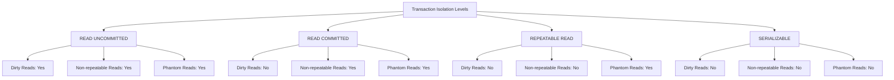
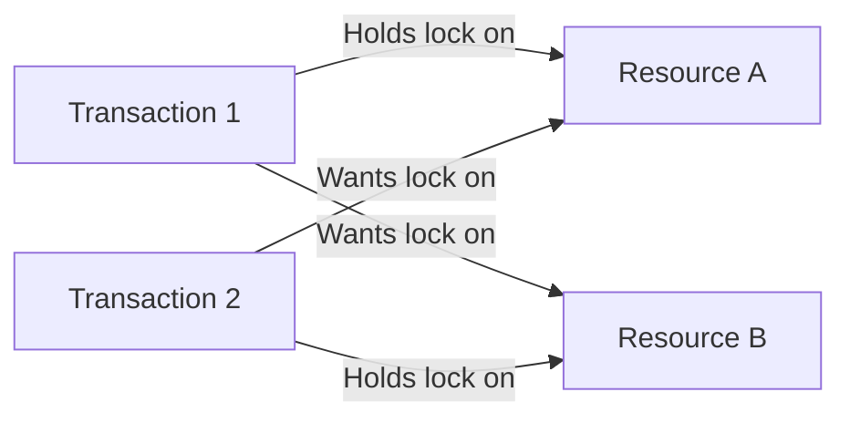

# SQL Concurrency Control

## Introduction

In a multi-user database environment, multiple transactions often need to access and modify the same data simultaneously. Without proper controls, this concurrent access can lead to data inconsistencies, corruption, and other integrity problems. **SQL Concurrency Control** refers to the mechanisms that database systems use to ensure that transactions execute in a controlled manner without interfering with one another, while maintaining data integrity and consistency.

Imagine an online banking system where thousands of transactions occur every minute. What happens when two customers try to withdraw money from the same account at the exact same time? Or when someone is generating a report while others are updating the data? These scenarios highlight why concurrency control is crucial in database systems.

## Why Concurrency Control Matters

Without proper concurrency control, several problems can occur when multiple transactions access the same data:

### Common Concurrency Problems

#### 1. Lost Updates

When two transactions read and update the same data, one transaction's changes might overwrite another's without incorporating the first change.

#### 2. Dirty Reads

A transaction reads data that has been modified by another transaction that hasn't yet committed, potentially reading data that might be rolled back.

#### 3. Non-repeatable Reads

A transaction reads the same data multiple times but gets different values because another transaction modified the data between reads.

#### 4. Phantom Reads

A transaction re-executes a query that returns a set of rows, but sees additional rows that weren't visible in the initial query because another transaction inserted new rows.

## Transaction Isolation Levels

SQL standards define four isolation levels that provide different trade-offs between concurrency and consistency:

1. **READ UNCOMMITTED** - Lowest isolation level; allows dirty reads
2. **READ COMMITTED** - Prevents dirty reads but allows non-repeatable and phantom reads
3. **REPEATABLE READ** - Prevents dirty and non-repeatable reads but allows phantom reads
4. **SERIALIZABLE** - Highest isolation level; prevents all concurrency problems

Let's visualize how these isolation levels compare:



### Setting Isolation Levels in SQL

You can set the isolation level for a transaction using the following SQL command:

```sql
-- Set isolation level for the current transaction
SET TRANSACTION ISOLATION LEVEL READ COMMITTED;

-- Begin transaction
BEGIN TRANSACTION;

-- SQL statements
-- ...

-- End transaction
COMMIT;
```

## Concurrency Control Techniques

Database systems employ various techniques to implement concurrency control:

### 1. Locking

Locking is the most common technique where transactions place locks on data resources they access to prevent other transactions from modifying them.

#### Types of Locks

- **Shared (S) Lock**: Used when reading data; multiple transactions can hold shared locks simultaneously
- **Exclusive (X) Lock**: Used when writing data; only one transaction can hold an exclusive lock, and it blocks other locks

#### Example of Lock-Based Concurrency Control

```sql
-- Transaction 1
BEGIN TRANSACTION;
-- This implicitly acquires locks based on isolation level
UPDATE accounts SET balance = balance - 100 WHERE account_id = 1234;
COMMIT;
```

```sql
-- Transaction 2 (executing concurrently)
BEGIN TRANSACTION;
-- This will wait until Transaction 1 releases its lock
UPDATE accounts SET balance = balance - 50 WHERE account_id = 1234;
COMMIT;
```

### 2. Optimistic Concurrency Control

With optimistic concurrency control, the database assumes conflicts are rare and allows transactions to proceed without locking. Before committing, it checks if the data has changed since the transaction began.

#### Example Using Timestamps

```sql
-- Read the current data and store timestamp
SELECT balance, last_updated FROM accounts WHERE account_id = 1234;
-- Balance: 1000, last_updated: 2023-06-15 14:30:00

-- Later, update only if data hasn't changed
UPDATE accounts 
SET balance = 900, last_updated = CURRENT_TIMESTAMP 
WHERE account_id = 1234 AND last_updated = '2023-06-15 14:30:00';

-- If 0 rows affected, then someone else updated the record
-- and we need to handle the conflict
```

### 3. Multiversion Concurrency Control (MVCC)

MVCC maintains multiple versions of data to allow readers to see a consistent snapshot without being blocked by writers. PostgreSQL, Oracle, and many modern databases use MVCC.

## Practical Examples

Let's explore some real-world scenarios to better understand how concurrency control works in practice.

### Example 1: Bank Transfer

Imagine we need to transfer money between two accounts. This operation must be atomic to prevent inconsistencies.

```sql
-- Set a higher isolation level to prevent concurrency issues
SET TRANSACTION ISOLATION LEVEL SERIALIZABLE;

BEGIN TRANSACTION;

-- Check if sufficient funds exist
SELECT balance INTO @current_balance FROM accounts WHERE account_id = 101;

IF @current_balance >= 500 THEN
    -- Deduct from source account
    UPDATE accounts SET balance = balance - 500 WHERE account_id = 101;
    
    -- Add to destination account
    UPDATE accounts SET balance = balance + 500 WHERE account_id = 202;
    
    COMMIT;
    -- Output: Transaction successful
ELSE
    ROLLBACK;
    -- Output: Insufficient funds
END IF;
```

### Example 2: Inventory Management

In an e-commerce system, we need to check inventory and update it atomically when processing orders.

```sql
BEGIN TRANSACTION;

-- Check if product is in stock
SELECT quantity INTO @available
FROM inventory
WHERE product_id = 5001;

IF @available >= 3 THEN
    -- Update inventory
    UPDATE inventory
    SET quantity = quantity - 3
    WHERE product_id = 5001;
    
    -- Create order item
    INSERT INTO order_items (order_id, product_id, quantity)
    VALUES (10001, 5001, 3);
    
    COMMIT;
    -- Output: Order placed successfully
ELSE
    ROLLBACK;
    -- Output: Insufficient inventory
END IF;
```

### Example 3: Implementing Optimistic Concurrency Control

Here's how to implement optimistic concurrency control using a version column:

```sql
-- Read the product data first
SELECT id, name, price, version 
FROM products 
WHERE id = 123;
-- Returns: id=123, name='Laptop', price=999.99, version=5

-- User makes changes and submits

-- Update with version check
UPDATE products 
SET name = 'Gaming Laptop', 
    price = 1299.99, 
    version = version + 1 
WHERE id = 123 AND version = 5;

-- Check if update was successful
IF @@ROWCOUNT = 0 THEN
    -- Handle concurrency conflict
    SELECT 'Another user has modified this product. Please refresh and try again.';
ELSE
    -- Success
    SELECT 'Product updated successfully.';
END IF;
```

## Deadlocks and Their Prevention

A deadlock occurs when two or more transactions are waiting for each other to release locks, resulting in a standstill. Database systems typically detect deadlocks and resolve them by automatically rolling back one of the transactions.

### Deadlock Example



### Preventing Deadlocks

1. **Lock resources in a consistent order** across all transactions
2. **Set deadlock detection timeouts** to automatically roll back transactions
3. **Use lower isolation levels** when appropriate

```sql
-- Setting deadlock timeout (SQL Server example)
SET DEADLOCK_PRIORITY LOW;  -- This transaction will be chosen as victim in a deadlock

BEGIN TRANSACTION;
-- Access resources in consistent order (e.g., always account_id in ascending order)
UPDATE accounts SET balance = balance - 100 WHERE account_id = 101;
UPDATE accounts SET balance = balance + 100 WHERE account_id = 202;
COMMIT;
```

## Summary

SQL concurrency control is essential for maintaining data integrity in multi-user database environments. We've explored:

- The problems that can occur without proper concurrency control
- The four standard isolation levels and their trade-offs
- Common concurrency control techniques including locking, optimistic concurrency control, and MVCC
- Practical examples demonstrating concurrency control in action
- Methods to prevent and handle deadlocks

By implementing appropriate concurrency control mechanisms, you can ensure that your database operations remain consistent and reliable even under heavy concurrent access.

## Additional Resources

- [PostgreSQL Documentation on Transaction Isolation](https://www.postgresql.org/docs/current/transaction-iso.html)
- [MySQL Documentation on InnoDB Locking](https://dev.mysql.com/doc/refman/8.0/en/innodb-locking.html)
- [SQL Server Transaction Locking and Row Versioning Guide](https://learn.microsoft.com/en-us/sql/relational-databases/sql-server-transaction-locking-and-row-versioning-guide)

## Exercises

1. Write a transaction that transfers funds between two accounts using the READ COMMITTED isolation level. What concurrency issues might still occur?

2. Implement an inventory reservation system that prevents overselling products when multiple customers check out simultaneously.

3. Compare the performance of pessimistic locking vs. optimistic concurrency control for a table with:
   - High read frequency, low write frequency
   - High write frequency, low read frequency

4. Design a database schema that includes version columns for optimistic concurrency control. Implement the necessary triggers or application logic to manage the versioning.