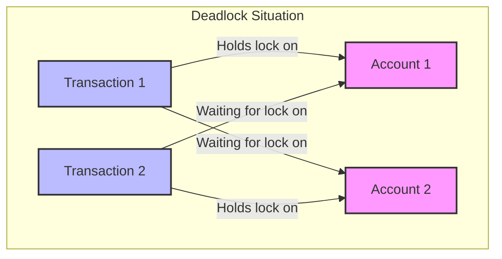

# SQL Deadlocks

## Introduction

Have you ever encountered a situation where your database operation suddenly failed with a cryptic "deadlock" error message? Deadlocks are one of the most challenging concurrency issues that developers face when working with databases. In this article, we'll demystify SQL deadlocks, understand why they occur, and learn practical strategies to handle and prevent them.

A **deadlock** occurs when two or more transactions are waiting for each other to release locks, resulting in a standstill where none of the transactions can proceed. Think of it like a traffic gridlock where cars from all four directions have entered an intersection simultaneously, and now no one can move forward.

## What Causes SQL Deadlocks?

Deadlocks typically occur in multi-user database environments where multiple transactions are competing for the same resources. Let's understand the fundamental conditions that lead to deadlocks:

1. **Mutual Exclusion**: Resources cannot be shared simultaneously
2. **Hold and Wait**: Transactions hold resources while waiting for others
3. **No Preemption**: Resources cannot be forcibly taken away from transactions
4. **Circular Wait**: A circular chain of transactions exists where each is waiting for a resource held by the next transaction

## A Simple Deadlock Example

Let's look at a classic deadlock scenario with two transactions:

```sql
-- Transaction 1
BEGIN TRANSACTION;
UPDATE Accounts SET Balance = Balance - 100 WHERE AccountID = 1; -- Acquires lock on Account 1
-- Some time passes
UPDATE Accounts SET Balance = Balance + 100 WHERE AccountID = 2; -- Waits for lock on Account 2
COMMIT;

-- Transaction 2 (running concurrently)
BEGIN TRANSACTION;
UPDATE Accounts SET Balance = Balance - 200 WHERE AccountID = 2; -- Acquires lock on Account 2
-- Some time passes
UPDATE Accounts SET Balance = Balance + 200 WHERE AccountID = 1; -- Waits for lock on Account 1
COMMIT;
```

Here's what happens:
1. Transaction 1 locks Account 1
2. Transaction 2 locks Account 2
3. Transaction 1 tries to lock Account 2 (already locked by Transaction 2) → waits
4. Transaction 2 tries to lock Account 1 (already locked by Transaction 1) → waits

Neither transaction can proceed, resulting in a deadlock!

Let's visualize this scenario:



## How Databases Handle Deadlocks

When a database detects a deadlock, it must resolve it to allow transactions to continue. Most database systems handle deadlocks through:

1. **Deadlock Detection**: The database continuously monitors for circular wait conditions
2. **Deadlock Resolution**: When detected, the database chooses a "victim" transaction to abort

For example, in SQL Server, you might see an error like:

```
Error: 1205, Severity: 13, State: 51
Transaction (Process ID 52) was deadlocked on lock resources with another process and has been chosen as the deadlock victim. Rerun the transaction.
```

## Detecting Deadlocks

Different database systems provide tools to detect and analyze deadlocks:

### SQL Server

```sql
-- Enable trace flag to generate deadlock graph
DBCC TRACEON (1222, -1);

-- View deadlock information in the error log
-- Or use SQL Server Profiler with the Deadlock Graph event
```

### MySQL

```sql
-- Check for deadlocks in InnoDB status
SHOW ENGINE INNODB STATUS;
```

### PostgreSQL

```sql
-- Enable deadlock logging
ALTER SYSTEM SET log_lock_waits = on;
ALTER SYSTEM SET deadlock_timeout = '1s';
SELECT pg_reload_conf();
```

## Preventing Deadlocks

While deadlocks can't be completely eliminated in busy systems, we can implement strategies to minimize their occurrence:

### 1. Consistent Access Order

Always access resources in the same order across all transactions:

```sql
-- Both transactions should update in the same order: Account 1, then Account 2
-- Transaction 1
BEGIN TRANSACTION;
UPDATE Accounts SET Balance = Balance - 100 WHERE AccountID = 1;
UPDATE Accounts SET Balance = Balance + 100 WHERE AccountID = 2;
COMMIT;

-- Transaction 2
BEGIN TRANSACTION;
UPDATE Accounts SET Balance = Balance - 200 WHERE AccountID = 1;
UPDATE Accounts SET Balance = Balance + 200 WHERE AccountID = 2;
COMMIT;
```

### 2. Keep Transactions Short

Shorter transactions reduce the window for deadlocks:

```sql
-- Instead of one large transaction
BEGIN TRANSACTION;
-- Many operations here
-- ...
COMMIT;

-- Break into smaller transactions
BEGIN TRANSACTION;
-- Fewer operations
COMMIT;

BEGIN TRANSACTION;
-- Fewer operations
COMMIT;
```

### 3. Use Lower Isolation Levels When Appropriate

Higher isolation levels require more locks:

```sql
-- Using a lower isolation level for read operations
SET TRANSACTION ISOLATION LEVEL READ COMMITTED;
BEGIN TRANSACTION;
SELECT * FROM Accounts WHERE AccountType = 'Savings';
COMMIT;
```

### 4. Use Proper Indexing

Well-designed indexes reduce lock contention:

```sql
-- Without proper indexing, may lock entire table
SELECT * FROM Customers WHERE LastName = 'Smith';

-- Create index to reduce lock scope
CREATE INDEX idx_customers_lastname ON Customers(LastName);
```

### 5. Use Deadlock Retry Logic

Implement application-level retry mechanisms:

```javascript
// Pseudocode for retry logic
function executeTransaction() {
  let retryCount = 0;
  const maxRetries = 3;
  
  while (retryCount < maxRetries) {
    try {
      // Execute database operation
      db.query("BEGIN TRANSACTION;");
      db.query("UPDATE Accounts SET Balance = Balance - 100 WHERE AccountID = 1;");
      db.query("UPDATE Accounts SET Balance = Balance + 100 WHERE AccountID = 2;");
      db.query("COMMIT;");
      return "Success";
    } catch (error) {
      if (isDeadlockError(error)) {
        retryCount++;
        console.log(`Deadlock encountered, retry attempt ${retryCount}`);
        // Wait a bit before retrying (with some randomization to avoid synchronized retries)
        sleep(100 * retryCount + Math.random() * 100);
      } else {
        throw error; // Re-throw if it's not a deadlock error
      }
    }
  }
  throw new Error("Transaction failed after maximum retry attempts");
}
```

## Real-World Example: Banking Transfer System

Let's examine a practical example of preventing deadlocks in a banking application that processes money transfers:

```sql
-- Potential deadlock-prone implementation
CREATE PROCEDURE TransferMoney
    @FromAccount INT,
    @ToAccount INT,
    @Amount DECIMAL(18,2)
AS
BEGIN
    BEGIN TRANSACTION;
    
    -- Deduct from source account
    UPDATE Accounts 
    SET Balance = Balance - @Amount 
    WHERE AccountID = @FromAccount;
    
    -- Some business logic or delay could happen here
    
    -- Add to destination account
    UPDATE Accounts 
    SET Balance = Balance + @Amount 
    WHERE AccountID = @ToAccount;
    
    COMMIT TRANSACTION;
END;
```

The above procedure could cause deadlocks if two concurrent transfers involve the same accounts in opposite directions. Here's an improved version:

```sql
-- Deadlock-resistant implementation
CREATE PROCEDURE TransferMoney
    @FromAccount INT,
    @ToAccount INT,
    @Amount DECIMAL(18,2)
AS
BEGIN
    -- Ensure consistent ordering using account IDs
    DECLARE @LowerAccountID INT, @HigherAccountID INT;
    DECLARE @IsFromLower BIT;
    
    IF @FromAccount < @ToAccount
    BEGIN
        SET @LowerAccountID = @FromAccount;
        SET @HigherAccountID = @ToAccount;
        SET @IsFromLower = 1;
    END
    ELSE
    BEGIN
        SET @LowerAccountID = @ToAccount;
        SET @HigherAccountID = @FromAccount;
        SET @IsFromLower = 0;
    END
    
    BEGIN TRANSACTION;
    
    -- Always update the account with lower ID first
    IF @IsFromLower = 1
    BEGIN
        UPDATE Accounts 
        SET Balance = Balance - @Amount 
        WHERE AccountID = @LowerAccountID;
        
        UPDATE Accounts 
        SET Balance = Balance + @Amount 
        WHERE AccountID = @HigherAccountID;
    END
    ELSE
    BEGIN
        UPDATE Accounts 
        SET Balance = Balance + @Amount 
        WHERE AccountID = @LowerAccountID;
        
        UPDATE Accounts 
        SET Balance = Balance - @Amount 
        WHERE AccountID = @HigherAccountID;
    END
    
    COMMIT TRANSACTION;
END;
```

By always accessing accounts in the same order (lower ID first), we eliminate the circular wait condition needed for deadlocks.

## Summary

Deadlocks are an inevitable challenge in concurrent database systems, but with proper understanding and mitigation strategies, we can minimize their impact:

1. **Understanding**: Deadlocks occur when transactions form a circular waiting pattern
2. **Detection**: Use database tools to identify and analyze deadlocks
3. **Prevention**: Apply techniques like consistent access ordering, shorter transactions, appropriate isolation levels, and proper indexing
4. **Handling**: Implement retry logic to recover gracefully when deadlocks do occur

Remember that completely eliminating deadlocks may not be possible in high-concurrency environments, but reducing their frequency and impact should be the goal.

## Additional Resources

To deepen your understanding of SQL deadlocks:

- [SQL Server Documentation on Deadlocks](https://docs.microsoft.com/en-us/sql/relational-databases/sql-server-deadlocks-guide)
- [MySQL InnoDB Deadlock Detection](https://dev.mysql.com/doc/refman/8.0/en/innodb-deadlock-detection.html)
- [PostgreSQL Lock Monitoring](https://www.postgresql.org/docs/current/explicit-locking.html)

## Exercises

1. Create a scenario with three transactions that could lead to a deadlock.
2. Implement a stored procedure that transfers inventory between warehouses with deadlock prevention.
3. Write application code that includes deadlock retry logic for a critical database operation.
4. Research how your specific database system handles deadlock detection and resolution.
5. Analyze a real application's database access patterns and identify potential deadlock risks.