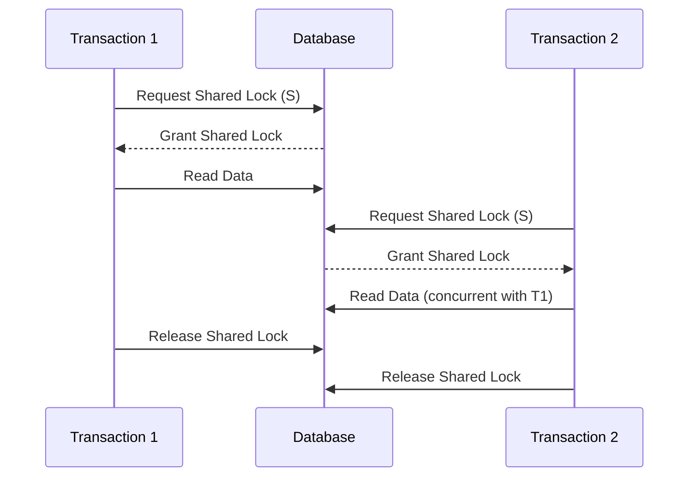
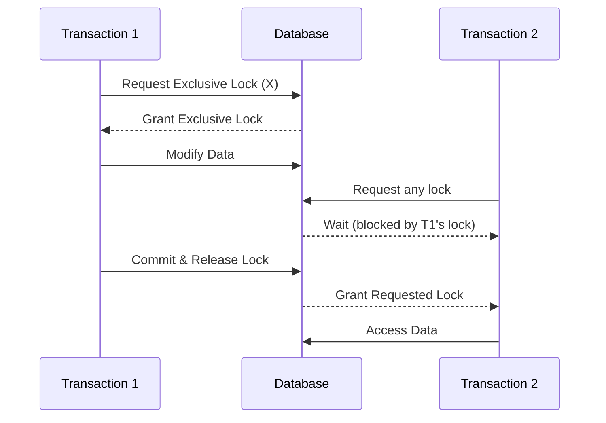
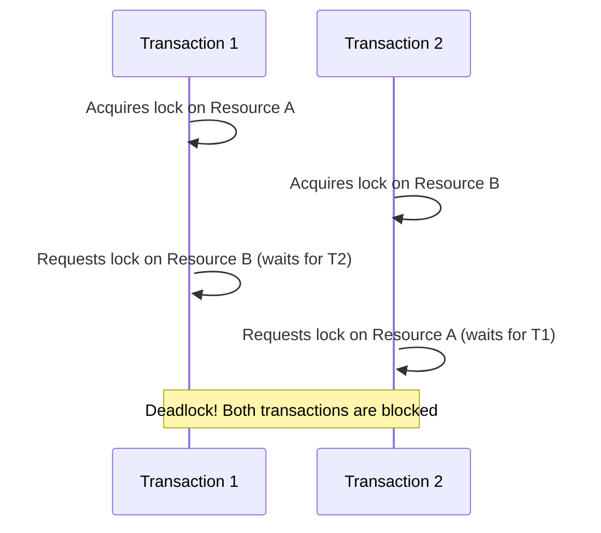

# SQL Locking Mechanisms

## Introduction

When multiple users or applications access a database simultaneously, conflicts can arise if they try to modify the same data at the same time. SQL locking mechanisms are essential database features that help maintain data integrity by controlling concurrent access to the same resources.

In this tutorial, we'll explore how database locks work, the different types of locks, and how they help prevent problems like lost updates, dirty reads, and other concurrency issues in SQL database systems.

## What are SQL Locks?

A lock is a mechanism that prevents other transactions from accessing or modifying data that is currently being used by another transaction. Think of locks as temporary ownership claims on specific database objects (like tables or rows) that help maintain the ACID properties of transactions, particularly isolation and consistency.

## Why Locking is Important

Consider this scenario without locking:

1. User A retrieves a product's inventory count (100 units)
2. User B retrieves the same product's inventory count (100 units)
3. User A updates the count to 90 (after selling 10 units)
4. User B updates the count to 95 (after selling 5 units)

The final count is 95, but in reality, 15 units were sold, so the correct count should be 85. This is called a "lost update" problem.

Locks prevent these scenarios by controlling the order in which transactions access and modify data.

## Types of Locks

### 1. Shared Locks (S)

Shared locks are used for read operations and allow multiple transactions to read the same data simultaneously.



### 2. Exclusive Locks (X)

Exclusive locks are used for write operations and prevent other transactions from reading or modifying the locked data.



### 3. Update Locks (U)

Update locks are a special type used to prevent a specific deadlock scenario. They're initially compatible with shared locks but can be converted to exclusive locks.

### 4. Intent Locks

Intent locks signal the intention to acquire locks at a lower level in the locking hierarchy (e.g., intent to lock specific rows in a table).

## Lock Granularity

Databases can lock at different levels of granularity:

1. **Row-level locks**: Lock individual rows
2. **Page-level locks**: Lock database pages (groups of rows)
3. **Table-level locks**: Lock entire tables
4. **Database-level locks**: Lock the entire database

Finer granularity (row-level) allows more concurrency but has higher overhead. Coarser granularity (table-level) has less overhead but reduces concurrency.

## Implementing Locks in SQL

Most database systems handle locking automatically, but you can control locking behavior with specific SQL commands.

### Example: Explicit Locking in SQL Server

```sql
-- Begin a transaction
BEGIN TRANSACTION;

-- Lock a specific table for exclusive access
SELECT * FROM Products WITH (TABLOCKX);

-- Update data
UPDATE Products SET Stock = Stock - 10 WHERE ProductID = 1;

-- Commit the transaction and release locks
COMMIT;
```

### Example: Optimistic vs. Pessimistic Locking

#### Pessimistic Locking

```sql
-- Begin transaction
BEGIN TRANSACTION;

-- Lock the row we want to update
SELECT * FROM Inventory 
WHERE ProductID = 123 
FOR UPDATE;

-- Do some calculations or processing
-- ...

-- Update the row
UPDATE Inventory 
SET Quantity = Quantity - 5 
WHERE ProductID = 123;

-- Commit transaction
COMMIT;
```

#### Optimistic Locking

```sql
-- Read the current version/timestamp
SELECT Quantity, LastUpdated 
FROM Inventory 
WHERE ProductID = 123;

-- Do calculations (no locks held)
-- ...

-- Update only if the row hasn't changed since we read it
UPDATE Inventory 
SET Quantity = Quantity - 5, 
    LastUpdated = CURRENT_TIMESTAMP 
WHERE ProductID = 123 
AND LastUpdated = '2023-06-15 14:30:00';

-- Check if update succeeded (affected rows = 1)
```

## Lock Escalation

When a transaction acquires too many locks of the same type on the same object, the database may automatically convert them to a coarser-grained lock to reduce system overhead. This is called lock escalation.

For example, if a transaction acquires many row locks on a table, the database might escalate these to a single table lock.

## Common Locking Issues

### 1. Deadlocks

A deadlock occurs when two or more transactions are waiting for each other to release locks, resulting in a standstill.



Database systems detect deadlocks and typically resolve them by automatically rolling back one of the transactions.

### 2. Blocking

Blocking occurs when one transaction holds a lock that another transaction needs, causing the second transaction to wait.

### 3. Lock Contention

When many transactions compete for the same locks, it can lead to performance degradation.

## Best Practices for Locking

1. **Keep transactions short**: The longer a transaction runs, the longer it holds locks.
2. **Access objects in the same order**: This helps prevent deadlocks.
3. **Use appropriate isolation levels**: Higher isolation levels use more locks.
4. **Consider lock granularity**: Choose the right balance between concurrency and overhead.
5. **Use appropriate indexes**: Good indexing can reduce the number of rows that need to be locked.

## Practical Example: Banking Transfer

Let's implement a simple bank transfer between two accounts with proper locking:

```sql
-- Start transaction
BEGIN TRANSACTION;

-- Lock both accounts (in consistent order to prevent deadlocks)
-- Always lock accounts in order of increasing account number
SELECT Balance FROM Accounts
WHERE AccountID IN (123, 456)
ORDER BY AccountID
FOR UPDATE;

-- Check if sufficient funds
DECLARE @SourceBalance DECIMAL;
SELECT @SourceBalance = Balance FROM Accounts WHERE AccountID = 123;

IF @SourceBalance >= 1000.00
BEGIN
    -- Withdraw from source account
    UPDATE Accounts
    SET Balance = Balance - 1000.00
    WHERE AccountID = 123;
    
    -- Deposit to destination account
    UPDATE Accounts
    SET Balance = Balance + 1000.00
    WHERE AccountID = 456;
    
    COMMIT TRANSACTION;
    SELECT 'Transfer successful' AS Result;
END
ELSE
BEGIN
    ROLLBACK TRANSACTION;
    SELECT 'Insufficient funds' AS Result;
END
```

## Isolation Levels and Locking

SQL's isolation levels directly affect locking behavior:

| Isolation Level | Description | Locking Behavior |
|-----------------|-------------|------------------|
| READ UNCOMMITTED | Allows dirty reads | Minimal locking |
| READ COMMITTED | Prevents dirty reads | Shared locks for reads, released immediately |
| REPEATABLE READ | Prevents non-repeatable reads | Shared locks held until transaction ends |
| SERIALIZABLE | Prevents phantom reads | Range locks for queries |

Example of setting isolation level:

```sql
-- Set transaction isolation level
SET TRANSACTION ISOLATION LEVEL REPEATABLE READ;

BEGIN TRANSACTION;
-- Operations here will use the specified isolation level
SELECT * FROM Products WHERE Category = 'Electronics';
COMMIT;
```

## Summary

SQL locking mechanisms are crucial for maintaining data integrity in multi-user database environments. They prevent concurrent transactions from interfering with each other while balancing the need for concurrency and performance.

Key points to remember:
- Shared locks allow concurrent reads
- Exclusive locks prevent other transactions from accessing data
- Lock granularity balances concurrency with overhead
- Proper locking prevents issues like lost updates and dirty reads
- Different isolation levels use different locking strategies

By understanding and properly implementing locking mechanisms, you can ensure your database applications maintain data consistency even with many concurrent users.

## Additional Resources

1. Your database's documentation (MySQL, PostgreSQL, SQL Server, etc.)
2. [Transaction Processing: Concepts and Techniques](https://www.amazon.com/Transaction-Processing-Concepts-Techniques-Management/dp/1558601902) by Jim Gray
3. [Database System Concepts](https://www.db-book.com/) by Silberschatz, Korth, and Sudarshan

## Exercises

1. Write SQL code to implement a product inventory update that prevents lost updates.
2. Research how your specific database system handles deadlock detection and resolution.
3. Compare the locking implementations between two different database systems (e.g., MySQL vs. PostgreSQL).
4. Implement optimistic locking for a web application's user profile update feature.
5. Design a database schema and transaction processes for a concert ticket booking system that prevents overselling.