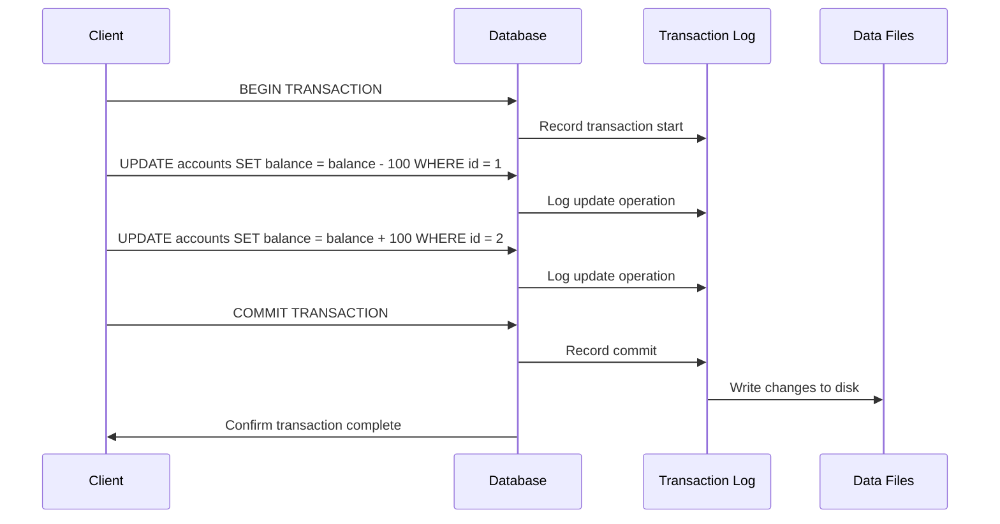
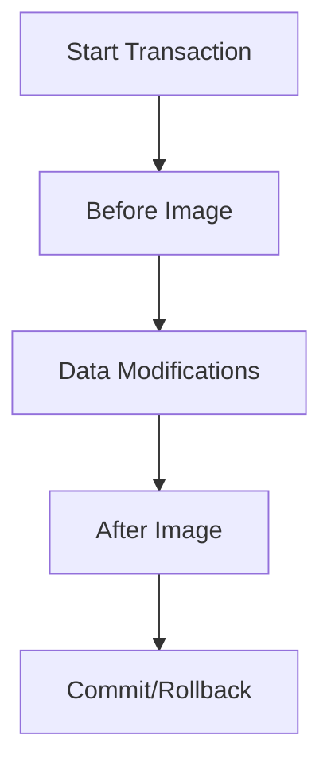

# SQL Transaction Log

## Introduction

The SQL transaction log is a critical component of database management systems that records all changes made to a database. It acts as a historical record of modifications, enabling features like transaction rollback, database recovery, and point-in-time restoration. Think of it as your database's "journal" that keeps track of every action affecting your data.

For beginners learning about SQL transactions, understanding the transaction log is essential because it's the mechanism that enables many of the ACID properties (Atomicity, Consistency, Isolation, Durability) that make databases reliable and robust.

## What is a Transaction Log?

A transaction log is a sequential record of all modifications made to a database. Each log entry contains information about:

- The specific change that occurred
- The database object affected
- The transaction that made the change
- Timing information
- Data needed to undo (roll back) or redo the change

Unlike the database itself, which stores the current state of data, the transaction log maintains a history of how the data got to its current state.

## How the Transaction Log Works

When you execute SQL statements that modify data (INSERT, UPDATE, DELETE), the database system:

1. First writes the changes to the transaction log
2. Then applies the changes to the actual database files

This process, called "write-ahead logging," ensures that if a system failure occurs, the database can recover by using the transaction log to either complete unfinished transactions or roll back incomplete ones.

### Log Sequence Numbers (LSNs)

Each entry in the transaction log is assigned a unique Log Sequence Number (LSN). These numbers increase sequentially and help the database system track:

- Which operations have been committed
- Which operations have been written to disk
- The order in which operations should be redone during recovery

## Transaction Log Visual Representation



## Transaction Log Operations

### Recording Transactions

For each transaction, the log records:



- **Before Image**: The state of data before the change
- **After Image**: The state of data after the change
- **Transaction Status**: Whether the transaction committed or rolled back

### Example of Transaction Log Entries

Here's a conceptual view of what transaction log entries might look like:

```
LSN: 1001, Transaction: T1, Operation: BEGIN
LSN: 1002, Transaction: T1, Operation: UPDATE, Table: Accounts, Row: ID=101, Before: Balance=500, After: Balance=400
LSN: 1003, Transaction: T1, Operation: UPDATE, Table: Accounts, Row: ID=102, Before: Balance=300, After: Balance=400
LSN: 1004, Transaction: T1, Operation: COMMIT
```

## Practical Example: Money Transfer Transaction

Let's examine how the transaction log works in a real-world example of transferring $100 from one account to another:

```sql
-- Start a new transaction
BEGIN TRANSACTION;

-- Deduct $100 from account #1001
UPDATE Accounts 
SET Balance = Balance - 100 
WHERE AccountID = 1001;

-- Add $100 to account #1002
UPDATE Accounts 
SET Balance = Balance + 100 
WHERE AccountID = 1002;

-- Commit the transaction
COMMIT TRANSACTION;
```

Behind the scenes, the transaction log would record:

1. The beginning of the transaction
2. The balance of account #1001 before and after the deduction
3. The balance of account #1002 before and after the addition
4. The successful commit of the transaction

If the system crashes between steps 2 and 3, the transaction log would be used during recovery to roll back the incomplete transaction, ensuring that account #1001 doesn't lose money without account #1002 receiving it.

## Transaction Log and Database Recovery

The transaction log is crucial for database recovery in case of a system crash or failure. The recovery process follows these steps:

1. **Analysis Phase**: The database system scans the transaction log to identify transactions that were active at the time of the crash.
2. **Redo Phase**: Committed transactions that weren't fully written to disk are redone.
3. **Undo Phase**: Uncommitted transactions are rolled back.

### Example Recovery Scenario

Imagine our database crashes after the following events:

```sql
-- Transaction 1: Completed successfully
BEGIN TRANSACTION; -- T1
UPDATE Products SET Stock = Stock - 5 WHERE ProductID = 101;
COMMIT; -- T1 committed

-- Transaction 2: In progress when crash occurred
BEGIN TRANSACTION; -- T2
UPDATE Customers SET CreditLimit = CreditLimit + 1000 WHERE CustomerID = 201;
-- System crashes before COMMIT
```

During recovery:
- Transaction T1 was committed, so its changes remain in the database
- Transaction T2 was incomplete, so its changes are rolled back using the "before image" stored in the transaction log

## Transaction Log Management

### Log Size and Performance

Transaction logs can grow very large, especially in busy systems. Database administrators need to manage them to maintain performance:

```sql
-- Example of backing up the transaction log (in SQL Server)
BACKUP LOG DatabaseName TO DISK = 'C:\Backups\LogBackup.bak';

-- Example of truncating the transaction log (in SQL Server)
DBCC SHRINKFILE (DatabaseName_log, 10);
```

### Log File Configuration

Different database systems allow various configurations:

- **SQL Server**: Separate transaction log files with .ldf extension
- **PostgreSQL**: Write-ahead logs in the pg_wal directory
- **MySQL (InnoDB)**: System tablespace or separate log files

### Recovery Models

SQL Server offers different recovery models that affect how the transaction log is managed:

- **Simple**: Log space is automatically reclaimed, limiting recovery options
- **Full**: Preserves all log records until backed up, allowing point-in-time recovery
- **Bulk-logged**: Similar to full, but logs minimal information for bulk operations

## Real-World Application: Auditing Data Changes

The transaction log can be used for auditing purposes, allowing you to track who changed what and when:

```sql
-- Creating an audit table
CREATE TABLE AuditTrail (
    AuditID INT PRIMARY KEY IDENTITY,
    TableName VARCHAR(50),
    ColumnName VARCHAR(50),
    OldValue VARCHAR(MAX),
    NewValue VARCHAR(MAX),
    ModifiedBy VARCHAR(50),
    ModifiedDate DATETIME
);

-- Trigger to record changes using transaction log information
CREATE TRIGGER tr_Accounts_Audit
ON Accounts
AFTER UPDATE
AS
BEGIN
    INSERT INTO AuditTrail (TableName, ColumnName, OldValue, NewValue, ModifiedBy, ModifiedDate)
    SELECT 
        'Accounts',
        'Balance',
        CONVERT(VARCHAR, d.Balance),
        CONVERT(VARCHAR, i.Balance),
        SUSER_SNAME(),
        GETDATE()
    FROM deleted d
    JOIN inserted i ON d.AccountID = i.AccountID
    WHERE d.Balance != i.Balance;
END;
```

## Common Transaction Log Issues and Solutions

### Log Full Situations

If the transaction log fills up, new transactions can't proceed. Solutions include:

- Backing up the log (in full recovery model)
- Increasing log file size
- Adding additional log files

```sql
-- Add a new transaction log file
ALTER DATABASE YourDatabase 
ADD LOG FILE (
    NAME = 'YourDatabase_log2',
    FILENAME = 'C:\Data\YourDatabase_log2.ldf',
    SIZE = 100MB,
    MAXSIZE = 1GB,
    FILEGROWTH = 10MB
);
```

### Long-Running Transactions

Transactions that remain open for a long time prevent log truncation. It's important to:

- Keep transactions as short as possible
- Avoid user input or external processes within a transaction
- Check for abandoned transactions regularly

## Summary

The SQL transaction log is a fundamental component of database systems that:

- Records all database modifications
- Enables transaction rollback and recovery
- Ensures database consistency and durability
- Allows for point-in-time restoration
- Facilitates high availability features

Understanding how the transaction log works helps developers create more reliable applications and prepares them for diagnosing and resolving database performance and recovery issues.

## Exercises

1. Create a small database with a table and perform a multi-statement transaction. Then use your database system's tools to examine the transaction log entries.

2. Simulate a transaction failure by deliberately causing an error in the middle of a transaction. Observe how the database uses the transaction log to roll back changes.

3. Research how your specific database system (SQL Server, MySQL, PostgreSQL, etc.) manages transaction logs and what configuration options are available.

## Additional Resources

- [SQL Server Transaction Log Architecture and Management Guide](https://docs.microsoft.com/en-us/sql/relational-databases/logs/the-transaction-log-sql-server)
- [PostgreSQL Write-Ahead Logging Documentation](https://www.postgresql.org/docs/current/wal-intro.html)
- [MySQL InnoDB Transaction and Logs](https://dev.mysql.com/doc/refman/8.0/en/innodb-transaction-model.html)
- Book: "Pro SQL Server Internals" by Dmitri Korotkevitch (for SQL Server users)